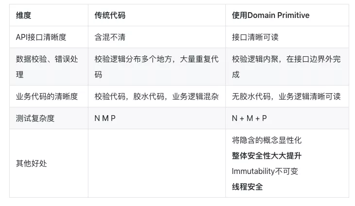

DDD是当今最火爆的微服务架构思想，正因为它是思想，所以没有这么多条条框框，导致每个人理解都是不同的，所以上手门槛较高。

因为部门要进行DDD重构，所以从头学习一波，但在之前已经了解过一下概念，什么头脑风暴，分析领域，分析上下文，领域边界，领域对象，值对象等等。

看了阿里的DDD文章后，对Domain Primitive有了一定的了解，记录一下（和三哥重构的DDD一毛一样，借鉴了阿里COLA框架）


## Domain Primitive简单介绍

我的理解，DP就是升级版值对象，把值对象包裹成一个整体，你在领域中可以直接拿过来用，创建值对象时，就已经进行了Validate校验，并具有其中的类似Util的方法（封装对象的行为）

好处很明显：

- 解耦
- 避免胶水代码
- 避免校验逻辑在各个Service都有，并且各不相同并不统一
- 使一些逻辑报错从一开始就结束了，创建出了对象就代表没问题，可用，不需要再校验
- 将隐式逻辑显示化

## 详细的好处

直接上一段常规代码：

> 每个城市都有一个企业，需求是新增用户到具体的企业下，根据用户的区号

```java
public class User {

    private String name;
    private Long id;
    private String phone;
    private Long orgId;
}

public class UserService {

    @Autowired
    private OrgRepository orgRepository;
    @Autowired
    private UserRepository userRepository;

    public void create(String name, String phone) throws ValidationException {
        if(StringUtils.isEmpty(name)){
            throw new ValidationException("name");
        }

        if(StringUtils.isEmpty(phone) || !isValidPhoneNumber(phone)){
            throw new ValidationException("cellPhone");
        }

        // 取电话号里的区号，然后通过区号找到区域内的SalesRep
        String areaCode = null;
        String[] areas = new String[]{"0571", "021", "010"};
        for (int i = 0; i < phone.length(); i++) {
            String prefix = phone.substring(0, i);
            if (Arrays.asList(areas).contains(prefix)) {
                areaCode = prefix;
                break;
            }
        }
        
        Org org = orgRepository.findByAreaCode(areaCode);
        
        User user = new User();
        user.setName(name);
        user.setPhone(phone);
        
        if (org != null){
            user.setOrgId(org.getId());
        }

        userRepository.save(user);
    }

    public boolean isValidPhoneNumber(String cellPhone){
        return true;
    }
}
```

看着代码没有啥问题，其实问题很多

- **接口入参清晰度**，这种String，String的入参很容易混乱，写反
- **参数校验和异常**，参数校验时，如果新增校验，会导致代码很长，且会出现大量ifelse情况
- **逻辑不清晰**，又获取区号又保存用户的，保存用户的代码还没有获取区号长，看着看着就晕了
- **测试难度大**，可以看到，一个参数就有N中情况，那M个参数呢，N*M中Case，这要怎么写测试用例？


那么怎么可以比较好的解决这些问题呢？

那就是Domain Primitive的用处了：

先看下改造后的代码：

```java
public class PhoneNumber {

    private String number;

    public String getNumber() {
        return number;
    }

    public PhoneNumber(String number) throws ValidationException {
        if(StringUtils.isEmpty(number)){
            throw new ValidationException("cellPhone is null");
        }
        if(!isValidPhoneNumber(number)){
            throw new ValidationException("cellPhone is error");
        }
        this.number = number;
    }

    public String getAreaCode() {
        for (int i = 0; i < number.length(); i++) {
            String prefix = number.substring(0, i);
            if (isAreaCode(prefix)) {
                return prefix;
            }
        }
        return null;
    }

    private static boolean isAreaCode(String prefix) {
        String[] areas = new String[]{"0571", "021", "010"};
        return Arrays.asList(areas).contains(prefix);
    }

    public boolean isValidPhoneNumber(String cellPhone){
        // validate逻辑
        return true;
    }
}
```

首先是值对象，我们把校验逻辑在创建对象时就完成了，并且把分解出区号的任务也放了进来。

然后我们看一下解耦后的代码：

```java
public class User {

    private Name name;
    private Long id;
    private PhoneNumber phone;
    private Long orgId;
}

public class UserService {

    @Autowired
    private OrgRepository orgRepository;
    @Autowired
    private UserRepository userRepository;

    public void create(Name name, PhoneNumber phone){
        Org org = orgRepository.findByAreaCode(phone.getAreaCode());

        User user = new User();
        user.setName(name);
        user.setPhone(phone);

        if (org != null){
            user.setOrgId(org.getId());
        }

        userRepository.save(user);
    }
}
```

可以看到，Service里的代码逻辑非常清晰，就是新增用户

并且校验逻辑也非常可扩展，其实DDD里的领域对象就是User这种，里面放着各种强相关的值对象

看一下调用方法：`userService.create(new Name("zhangsan"), new PhoneNumber("0571-12345678"));`

非常清晰的看出了接口入参，并且一定不会写反，在CR阶段就可以看出问题

测试难度也从N*M变成了N+M，我们只需要判断PhoneNumber的null情况即可


## 总结

  

**让我们重新来定义一下 Domain Primitive ：Domain Primitive 是一个在特定领域里，拥有精准定义的、可自我验证的、拥有行为的 Value Object** 。

- DP是一个传统意义上的Value Object，拥有Immutable的特性
- DP是一个完整的概念整体，拥有精准定义
- DP使用业务域中的原生语言
- DP可以是业务域的最小组成部分、也可以构建复杂组合


注：Domain Primitive的概念和命名来自于Dan Bergh Johnsson & Daniel Deogun的书 Secure by Design。

**使用 Domain Primitive 的三原则**

- 让隐性的概念显性化
- 让隐性的上下文显性化
- 封装多对象行为