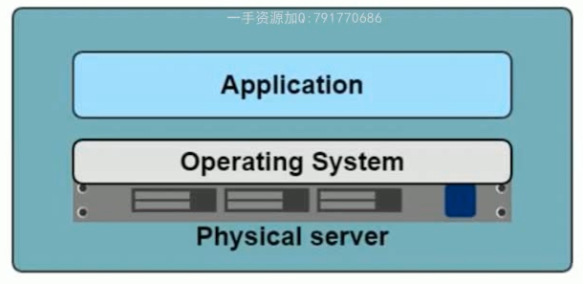
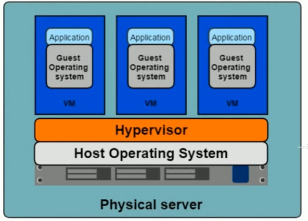
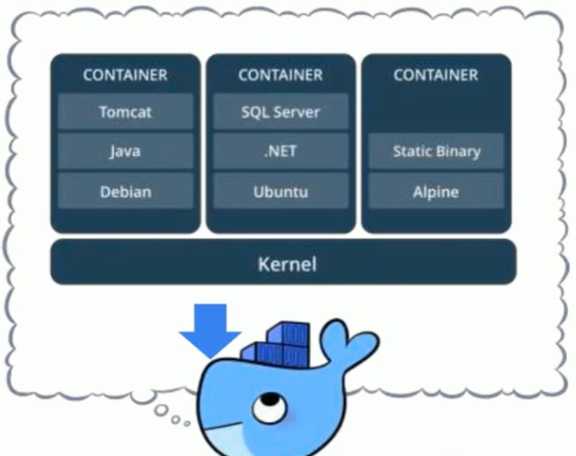
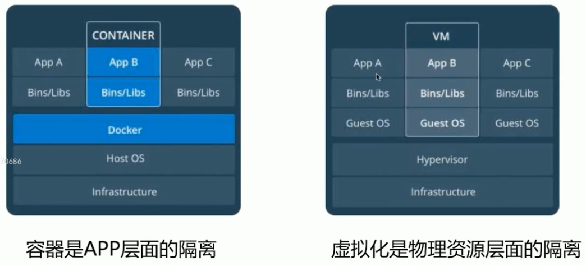

## 容器技术

### 最早的应用部署

我们需要购买一个物理服务器，就是电脑，然后再上面安装操作系统，之后再安装我们的应用



缺点：

- 部署非常慢：首先需要装服务器到机房，然后再服务器上装系统，然后再部署应用，应用又可能需要非常多的环境依赖
- 成本非常高：买物理服务器的成本很高
- 资源浪费：应用可能根本不需要那么多cpu或内存
- 难于迁移和扩展：如果要迁移，我们要额外找一台服务器并安装好操作系统环境依赖，扩展也是一样。

### 虚拟化技术部署

在物理服务器的基础上，添加了一个Hypervisor，来对我们物理资源进行一个虚拟化。

比如cpu，内存，硬盘资源进行虚拟化，然后我们在这个虚拟化之上再安装操作系统，就是一个虚拟机，这样的话如果物理服务器资源比较丰富，我们就可以按需进行资源虚拟，哪台虚拟机需要较好的性能就多分配一点，按需分配。

- 一个物理机可以部署多个app
- 每个app独立运行



优点：

- 资源池：一个物理机的资源分配到了不同的虚拟机中
- 容易扩展：加虚拟机
- 容易云化：比如阿里云，腾讯云的云虚拟机

缺点：

- 每个虚拟机都是一个完整的操作系统，必须分配其资源，当虚拟机增多，操作系统消耗就很大了
- 当应用增多，每个App环境不同，开发者需要准备大量环境开发，运维人员维护也困难

### 容器技术的诞生

**总体来说容器技术就是让我们更高效更简单的在Linux部署我们的项目**

#### 容器技术解决了什么问题？

- 开发和运维之间的矛盾
- 开发和运维之间搭建了桥梁，实现devops的最佳解决方案

#### 什么是容器？



- **对软件和其依赖进行打包，装在一个容器中，非常方便部署**，比如一个java项目必须要Jdk，他就会把你的java源代码和jdk放到一个Container容器中，我们启动这个容器就相当于部署完毕，不需要在服务器上安装jdk
- 应用之间相互隔离
- 共享同一个OS Kernel，就是共享所在操作系统
- 可以运行在很多操作系统上

#### 容器和虚拟机的区别



虚拟机：在物理机基础上进行虚拟化技术，虚拟出多个虚拟机

容器：直接运行在物理机上，创建多个容器进行运行

当然，虚拟机和容器可以结合，就是我们现在物理机创建虚拟机，再在虚拟机上使用容器化技术


**而对于Docker，其实就是容器技术的一种实现**


## Docker的安装

我们根据官网教程，一步步安装<https://docs.docker.com/install/linux/docker-ce/centos/>

1）卸载旧版本

```shell
$ sudo yum remove docker \
                  docker-client \
                  docker-client-latest \
                  docker-common \
                  docker-latest \
                  docker-latest-logrotate \
                  docker-logrotate \
                  docker-engine
```

2）安装必要软件包

> yum install -y yum-utils device-mapper-persistent-data lvm2 

3）设置下载的镜像仓库

> yum-config-manager --add-repo http://mirrors.aliyun.com/docker-ce/linux/centos/docker-ce.repo 

4）安装指定版本docker

> yum install docker-ce-18.06.1.ce -y

5）查看版本

> docker -v

6）启动docker

> systemctl start docker
>
> systemctl enable docker

测试是否启动成功

> docker ps


7）添加阿里云镜像下载

```json
sudo tee /etc/docker/daemon.json <<-'EOF'
{
  "registry-mirrors": ["https://v4zkfq23.mirror.aliyuncs.com"]
}
EOF
sudo systemctl daemon-reload
sudo systemctl restart docker
```

