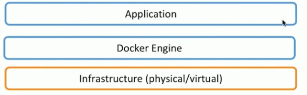
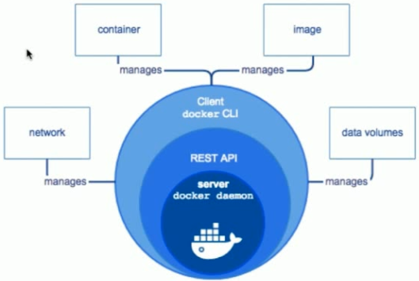
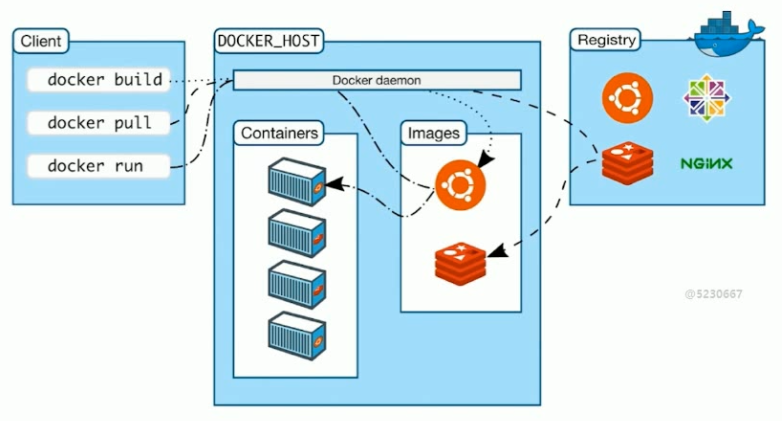

## Docker的架构与底层实现

Docke是一个提供了开发和打包的平台，他把app和底层物理机操作系统隔离开，最重要的就是Docker Engine

对于这些Docker架构方面的概念，我们这里先了解，全部看完再回来理解

### Docker Engine

可以看到，Docker类似CS分层

- docker daemon：Docker的后台进程，类似于服务器，用于维护Docker常见的一些操作，比如镜像网络，存储等，客户端Docker client 是通过rest api进行通信
- REST API Server ：用于通信
- docker cli client：用户用来与Docker daemon进行通信的客户端，发送一些请求操作，比如常见的`docker ps`，`docker images`等

### Docker总体架构

- Client：就是命令行中的各种命令，用于请求Docker进行一些操作

- Docker_Host：启动了Docker Daemon的机器，他可以和Client在一起，也可以在不同的机器上通过网络连接。DockerHost主要包含了容器Containers和镜像Images，对于他们的概念我们后面会说
- Register：存放镜像的地方，镜像仓库，可以上传镜像到仓库中，也可以从中下载

### 底层技术支持

- Namespaces：隔离，如pid，net，ipc，mnt，uts
- Control groups：资源限制，比如这个容器200m内存，另一个300m
- Union file system：Container和Image的分层

这里我们先简单了解一下，随着Docker进一步的学习熟悉，再慢慢理解

## Docker镜像