# Kibana

## Kibana介绍

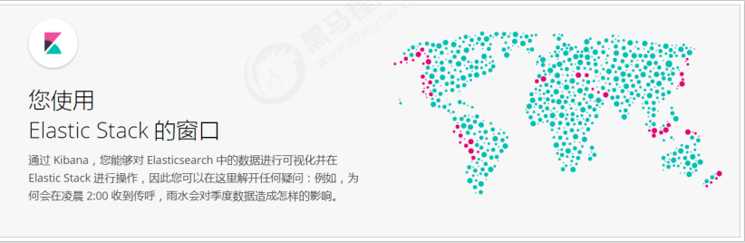

Kibana  是一款开源的数据分析和可视化平台，它是 Elastic Stack 成员之一，设计用于和 Elasticsearch 协作。您可以使用 Kibana 对 Elasticsearch 索引中的数据进行搜索、查看、交互操作。您可以很方便的利用图表、表格及地图对数据进行多元化的分析和呈现。

官网：https://www.elastic.co/cn/products/kibana

简单来说，就是更直观更美观的展示ES中的数据，ES数据可视化工具

## Kibana安装与配置

```
tar -xvf kibana-6.5.4-linux-x86_64.tar.gz
cd kibana-6.5.4-linux-x86_64
```

修改配置

> vi config/kibana.yml

```yml
server.host: "192.168.56.140"  #对外暴露服务的地址
elasticsearch.url: "http://192.168.56.140:9200"  #配置Elasticsearch
```

启动

> ./bin/kibana

浏览器访问http://192.168.56.140:5601

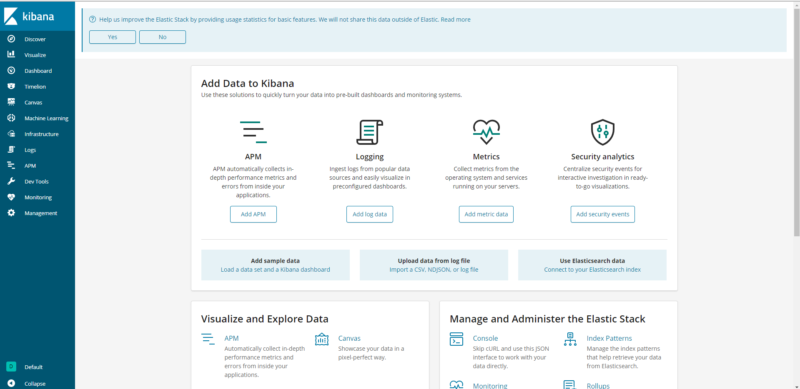

## Kibana数据探索

数据探索就是左侧导航栏的第一个Discover，用于可视化的展示数据，类似es-head那样

因为我们之前测试filebeat和Metricbeat，向es已经添加了一些数据，所以这里我们直接使用刚刚的数据进行数据探索。

### 创建Kibana索引规则

1）点击左侧Management

2）点击Kibana的Index Patterns

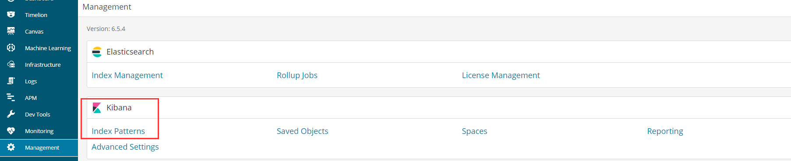

3）创建一个索引规则，先设置规则

这里我们使用Metricbeat-*，当然也可以使用filebeat-\*

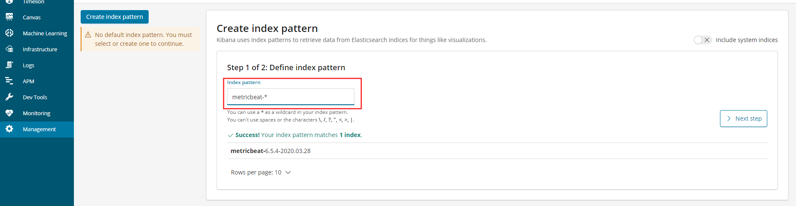

4）设置时间过滤字段的名称，这里一般都是使用@timestamp时间戳

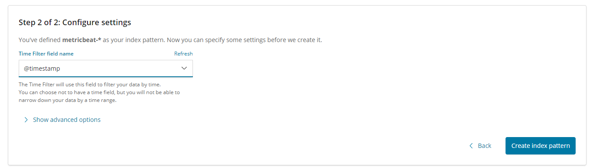

然后点击创建按钮

### 查看数据探索界面

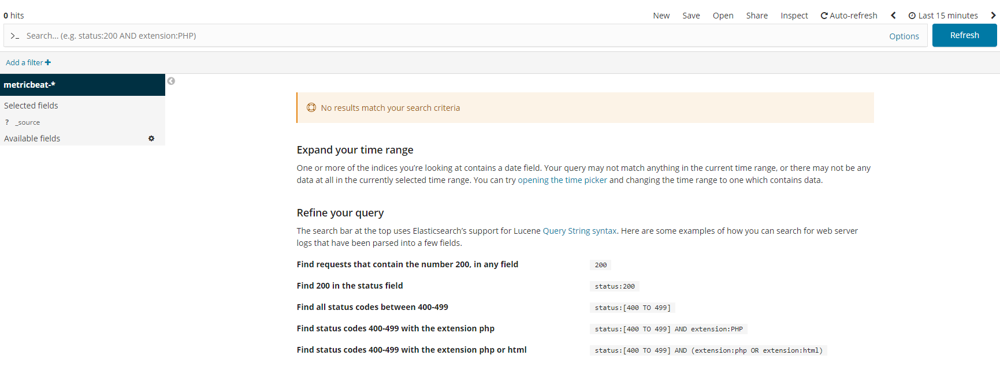

如果发现提示没有匹配的数据，这需要配置一下右上角的索引时间

比如现在，是15分钟前到现在的数据，我们可以设置成今天的数据


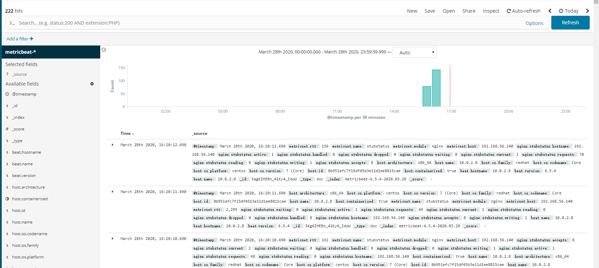


然后就可以看到数据了，点击左侧的field字段，可以选择展示哪些字段，比如下图

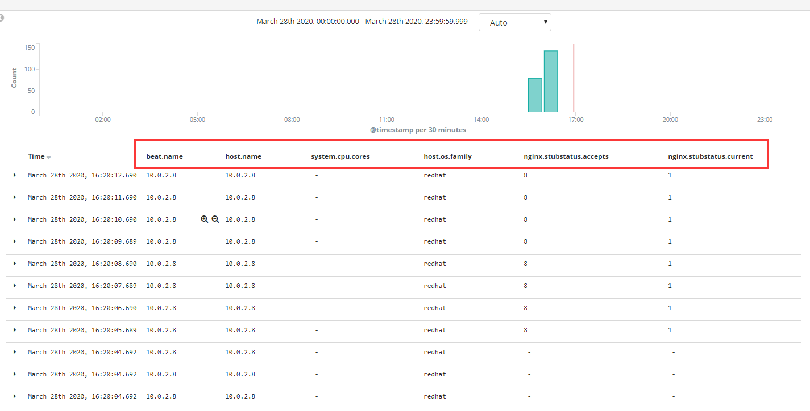

当然我们也可以再创建一个filebeat的，然后进行切换

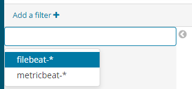

## Kibana配合Metricbeat实现指标仪表盘

### Metricbeat中配置Kibana

首先我们需要到Metricbeat中配置一下Kibana相关东西

> vi metricbeat.yml

```yml
# 修改metricbeat配置
setup.kibana:
  host: "192.168.40.133:5601"
```

然后安装仪表板到Kibana，注意此时Kibana需要在开启状态

> ./metricbeat setup --dashboards

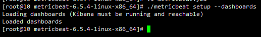

然后开启Metricbeat

> ./metricbeat -e

### Kibana查看指标仪表盘

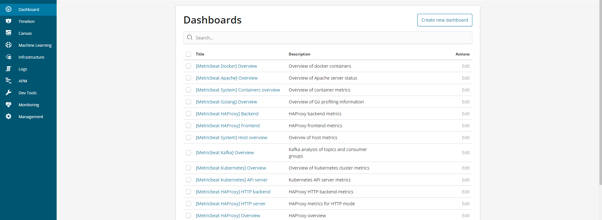

这里可以看到有很多Metricbeat提供的指标仪表盘，我们可以搜索下Nginx的仪表盘，或者System也可以

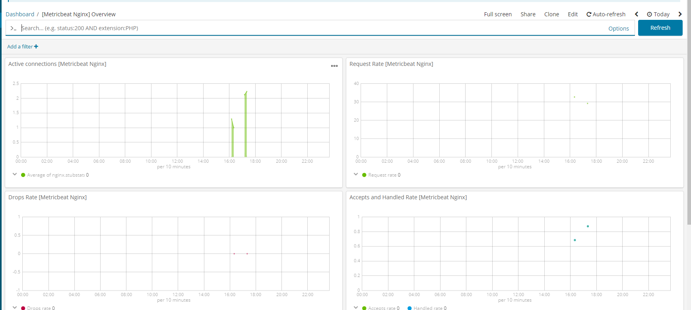

## Kibana配合Filebeat实现日志仪表盘

### Filebeat配置Kibana

> vi nginx.yml

```yml
filebeat.inputs:
output.elasticsearch:
  hosts: ["192.168.56.140:9200"]
filebeat.config.modules:
  path: ${path.config}/modules.d/*.yml
  reload.enabled: false
setup.kibana:
  host: "192.168.56.140:5601"
```

配置完毕后，也需要进行一个安装

> ./filebeat  -c nginx.yml setup

安装完后，开启filebeat，并刷新几次nginx

> ./filebeat -e -c nginx.yml

### Kibana查看日志仪表盘

先搜索Nginx的filebeat仪表板

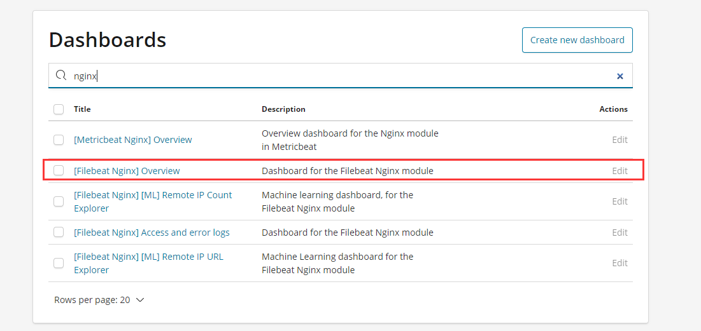

然后进入

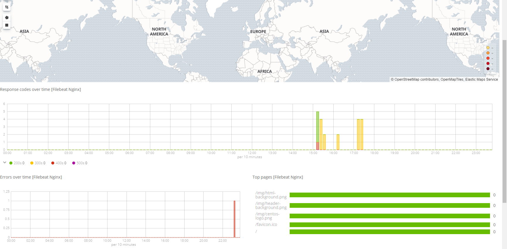

## 自定义图表

刚刚我们使用的都是Metricbeat或者Filebeat提供好的仪表盘，那么我们能不能自定义呢？

首先我们去自定义一个图表，点击Visualize，然后点击加号

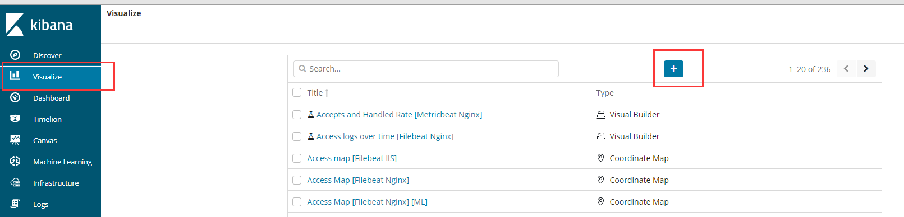

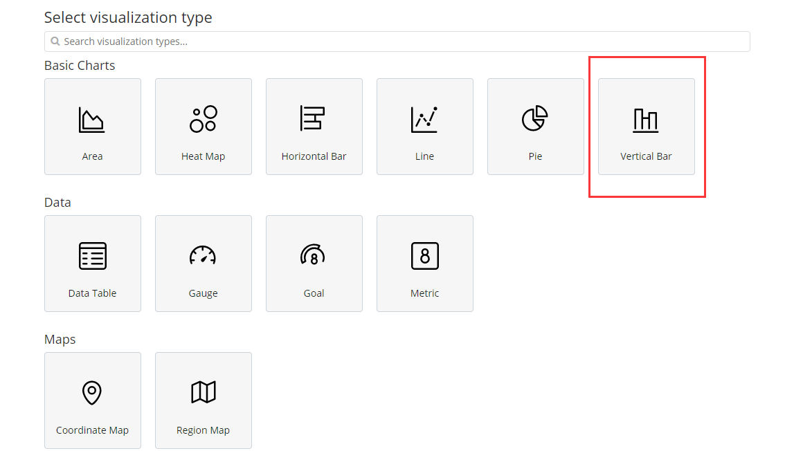

种类很多，这里我们选择柱状图

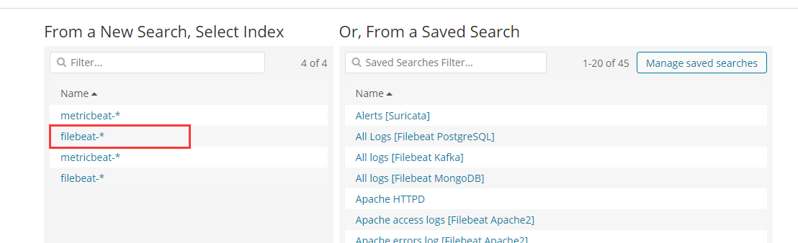

这里我们选择filebeat中的数据来做成图表

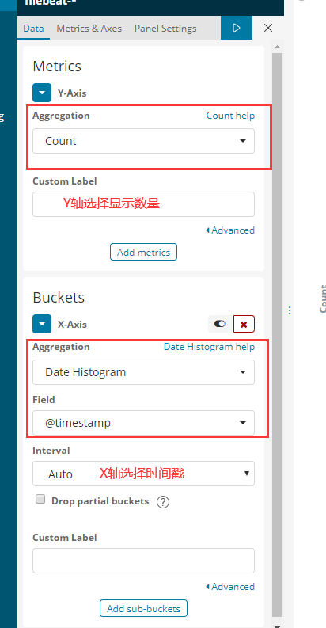

这里也可以选择成别的，看需求，点击播放按钮，进行查看

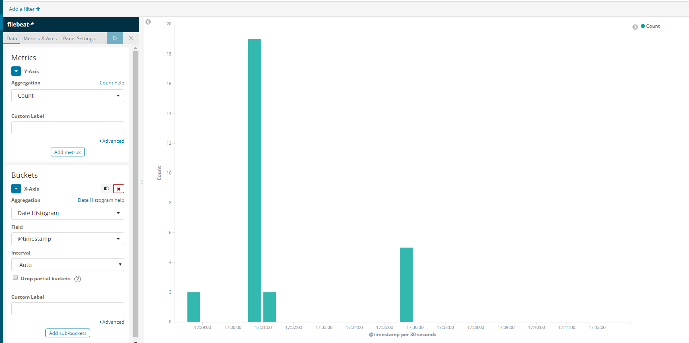

效果没问题后，可以点击上方的save按钮，进行保存，这样一个自定义的图表就完成了

### 自定义仪表盘

自定义图表后，我们可以进行仪表盘的自定义

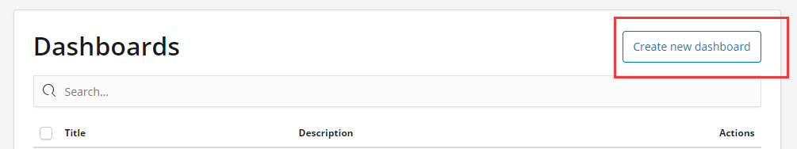

创建新的仪表盘

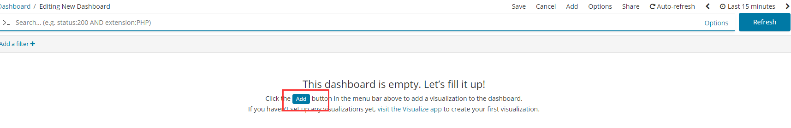

然后add添加一些组件，这里我们添加刚刚创建好的自定义图表，也可以添加一些其他的

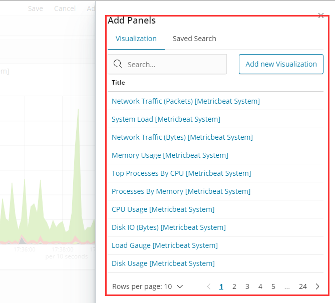

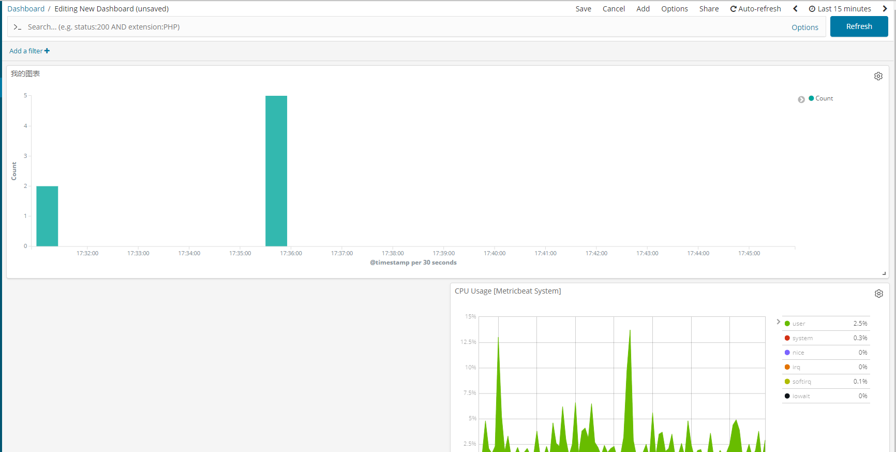

然后我们可以对这些组件进行拉伸，放到想要的位置，这么一个自定义的仪表盘就创建好了，然后就可以保存

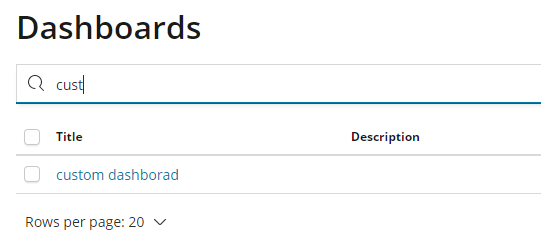

## 开发者工具

在开发者工具中，我们可以对ES进行一些请求

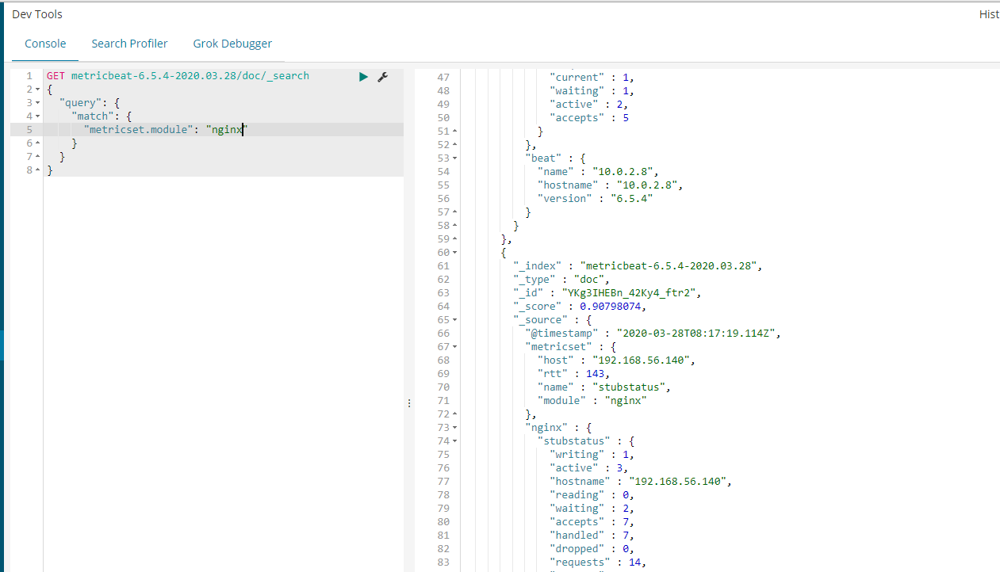