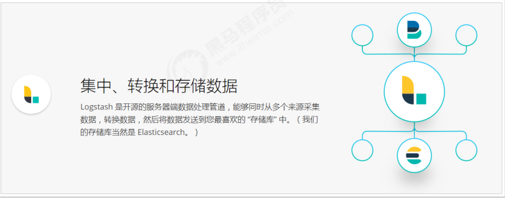
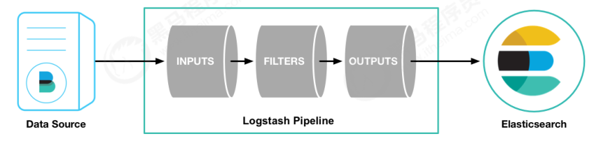
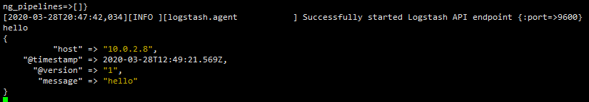
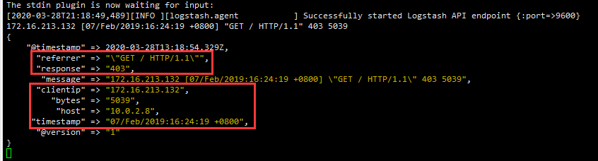
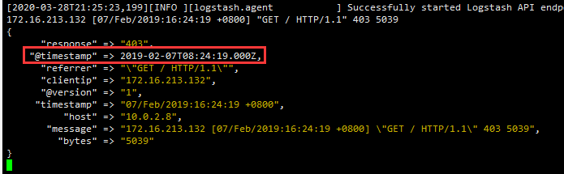
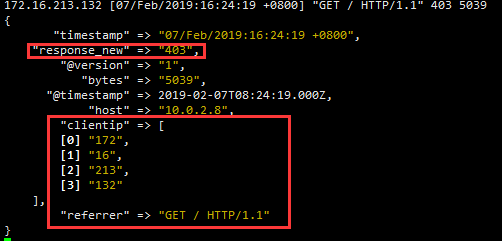
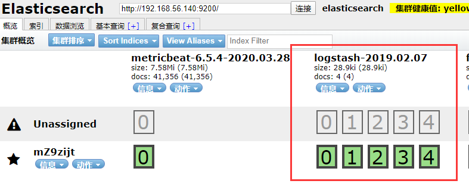
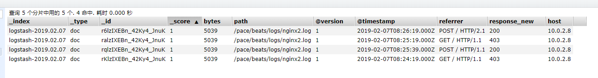

# Logstash

## Logstash简介



Logstash是数据抽取工具，它可以接收数据，然后进行一系列的加工，过滤，处理打造出输出对象所需要的样子，然后输出给最终存储位置。

在以前，Logstash是直接作为数据收集，然后转存给ElasticSearch的功能，就是刚刚了解的Filebeat和Metricbeat的工作，但是因为其效率低下性能弱，慢慢被Beats取代，现在主要任务就是数据加工过滤，对Beats收集的数据进行加工后转给ElasticSearch保存。



通过上面这张图，可以清楚的了解到Logstash可以接收数据源的数据，经过Filter，最终将数据交给ElasticSearch保存。

在Logstash Pipeline中，有重要的三步

- input
- filter
- output

其中input和output是必须存在的，filter可有可无

## Logstash的HelloWorld

安装非常简单，和之前一样，首先需要下载压缩包，然后上传到服务器

```
tar -zxvf logstash-6.5.4.tar.gz
cd logstash-6.5.4.tar.gz
```

然后就可以开始我们的helloworld了

```
bin/logstash -e 'input { stdin { } } output { stdout {} }'
```

Logstash底层是Java，所以运行会比较慢，提示Successfully后，在命令行输入hello



因为我们设置的输出实在命令行，所以直接将其输出了出来

这里Logstash内部对数据进行了一些处理，添加了host，时间戳等信息。

## Logstash之Input

接下来我们详细说一下Logstash最重要的三部曲

对于Input来说，Logstash可以从很多地方获取数据，比如：

### 标准输入stdin

命令行，就像刚刚那样

```yml
input{
    stdin{
        add_field => {"key" => "value"} #向事件添加一个字段
        codec => "plain" #默认是line, 可通过这个参数设置编码方式
        tags => ["std"] #添加标记
        type => "std" #添加类型
        id => 1 #添加一个唯一的ID, 如果没有指定ID, 那么将生成一个ID
        enable_metric => true #是否开启记录日志, 默认true
    }
}

# stdin官方参考: https://www.elastic.co/guide/en/logstash/current/plugins-inputs-stdin.html
```

### 文件输入file

```yml
input{
    file{
        path => ["/var/log/nginx/access.log", "/var/log/nginx/error.log"] #处理的文件的路径, 可以定义多个路径
        exclude => "*.zip" #匹配排除
        sincedb_path => "/data/" #sincedb数据文件的路径, 默认<path.data>/plugins/inputs/file
        codec => "plain" #默认是plain,可通过这个参数设置编码方式
        tags => ["nginx"] #添加标记
        type => "nginx" #添加类型
        discover_interval => 2 #每隔多久去查一次文件, 默认15s
        stat_interval => 1 #每隔多久去查一次文件是否被修改过, 默认1s
        start_position => "beginning" #从什么位置开始读取文件数据, beginning和end, 默认是结束位置end
    }
}

# file官方参考: https://www.elastic.co/guide/en/logstash/current/plugins-inputs-file.html
```

默认情况下，logstash会从文件的结束位置开始读取数据，也就是说logstash进程会以类似tail -f命令的形式逐行获取数据。

### TCP/UDP网络数据

```yml
input{
    tcp{
       port => 8888 #端口
       mode => "server" #操作模式, server:监听客户端连接, client:连接到服务器
       host => "0.0.0.0" #当mode为server, 指定监听地址, 当mode为client, 指定连接地址, 默认0.0.0.0
       ssl_enable => false #是否启用SSL, 默认false
       ssl_cert => "" #SSL证书路径
       ssl_extra_chain_certs => [] #将额外的X509证书添加到证书链中
       ssl_key => "" #SSL密钥路径
       ssl_key_passphrase => "nil" #SSL密钥密码, 默认nil
       ssl_verify => true #核实与CA的SSL连接的另一端的身份
       tcp_keep_alive => false #TCP是否保持alives
    }
}
input{
    udp{
       buffer_size => 65536 #从网络读取的最大数据包大小, 默认65536
       host => 0.0.0.0 #监听地址
       port => 8888 #端口
       queue_size => 2000 #在内存中保存未处理的UDP数据包的数量, 默认2000
       workers => 2 #处理信息包的数量, 默认2
    }
}

# tcp官方参考: https://www.elastic.co/guide/en/logstash/current/plugins-inputs-tcp.html
# udp官方参考: https://www.elastic.co/guide/en/logstash/current/plugins-inputs-udp.html
```

### 数据库jdbc

```yml
input{
    jdbc{
    #jdbc sql server 驱动,各个数据库都有对应的驱动，需自己下载
    jdbc_driver_library => "/etc/logstash/driver.d/sqljdbc_2.0/enu/sqljdbc4.jar"
    #jdbc class 不同数据库有不同的 class 配置
    jdbc_driver_class => "com.microsoft.sqlserver.jdbc.SQLServerDriver"
    #配置数据库连接 ip 和端口，以及数据库    
    jdbc_connection_string => "jdbc:sqlserver://200.200.0.18:1433;databaseName=test_db"
    #配置数据库用户名
    jdbc_user =>   
    #配置数据库密码
    jdbc_password =>
    
    #上面这些都不重要，要是这些都看不懂的话，你的老板估计要考虑换人了。重要的是接下来的内容。
    # 定时器 多久执行一次SQL，默认是一分钟
    # schedule => 分 时 天 月 年  
    # schedule => * 22  *  *  * 表示每天22点执行一次
    schedule => "* * * * *"
    #是否记录上次执行结果, 如果为真,默认记录数据库中timestamp字段的值,保存到 last_run_metadata_path 指定的文件中
    record_last_run => true
    #最后一次操作保存文件位置
    last_run_metadata_path => "/etc/logstash/run_metadata.d/my_info"
    # 可以修改默认的字段，比如这里就是把时间戳改成了create_time
    use_column_value => true
    tracking_column => create_time
    #是否清除 last_run_metadata_path 的记录,如果为真那么每次都相当于从头开始查询所有的数据库记录
    clean_run => false
    
    #是否将字段名称转小写。
    #这里有个小的提示，如果你这前就处理过一次数据，并且在Kibana中有对应的搜索需求的话，还是改为true，
    #因为默认是true，并且Kibana是大小写区分的。准确的说应该是ES大小写区分
    lowercase_column_names => false
    
    #你的SQL的位置，当然，你的SQL也可以直接写在这里。
    #statement => SELECT * FROM tabeName t WHERE  t.creat_time > :last_sql_value
    statement_filepath => "/etc/logstash/statement_file.d/my_info.sql"
    
    #如果你有多个SQL需要处理的话，只能在重新建立一个jdbc{}插件。
}
```

### Beats数据输入

```yml
 input {
  beats {
    #接受数据端口
    port => 5044
    #数据类型
    type => "logs"
  }
  #这个插件需要和filebeat或Metricbeat等Beats组件进行配合
}
```

## Logstash之Filter

https://www.elastic.co/guide/en/logstash/current/filter-plugins.html

过滤器插件有很多，主要使用的有以下几个

### 正则捕获Grok

grok是一个十分强大的logstash filter插件，他可以通过正则解析任意文本，将非结构化日志数据弄成结构化和方便查询的结构。他是目前logstash 中解析非结构化日志数据最好的方式。

#### 语法规则

Grok 的语法规则是：

```
%{语法:语义}
```

- 语法： 代表匹配值的类型,例如3.44可以用NUMBER类型所匹配,127.0.0.1可以使用IP类型匹配。 
- 语义：就相当于赋值，将匹配到的值赋值给xxx，比如IP是客户端的IP，就可以在使用：`%{IP:client}`

对于Grok的语法有很多，可以查看文档： https://github.com/logstash-plugins/logstash-patterns-core/blob/master/patterns/grok-patterns 

#### 举例说明

例如输入的内容为：

```
172.16.213.132 [07/Feb/2019:16:24:19 +0800] "GET / HTTP/1.1" 403 5039
```

`%{IP:clientip}`匹配模式将获得的结果为：`clientip: 172.16.213.132`
`%{HTTPDATE:timestamp}`匹配模式将获得的结果为：`timestamp: 07/Feb/2018:16:24:19 +0800`
而`%{QS:referrer}`匹配模式将获得的结果为：`referrer: "GET / HTTP/1.1"`

下面是一个组合匹配模式，它可以获取上面输入的所有内容：

```
%{IP:clientip}\ \[%{HTTPDATE:timestamp}\]\ %{QS:referrer}\ %{NUMBER:response}\ %{NUMBER:bytes}
```

通过上面这个组合匹配模式，我们将输入的内容分成了五个部分，即五个字段，将输入内容分割为不同的数据字段，这对于日后解析和查询日志数据非常有用，这正是使用grok的目的。

例子：

> vi config/testGrok.yml

```yml
input{
    stdin{}
}
filter{
    grok{
        match => ["message","%{IP:clientip}\ \[%{HTTPDATE:timestamp}\]\ %{QS:referrer}\ %{NUMBER:response}\ %{NUMBER:bytes}"]
    }
}
output{
    stdout{
    }
}
```

启动：`./bin/logstash -f config/testGrok.yml`

输入内容：

```
172.16.213.132 [07/Feb/2019:16:24:19 +0800] "GET / HTTP/1.1" 403 5039
```



全都被正确解析出来

### 时间处理Date

date插件是对于排序事件和回填旧数据尤其重要，它可以用来转换日志记录中的时间字段，变成LogStash::Timestamp对象，然后转存到@timestamp字段里，这在之前已经做过简单的介绍。

就好比Java中把字符串转成日期格式

下面是date插件的一个配置示例（这里仅仅列出filter部分）：

```yml
filter {
    grok {
        match => ["message", "%{HTTPDATE:timestamp}"]
    }
    date {
        match => ["timestamp", "dd/MMM/yyyy:HH:mm:ss Z"]
    }
}
```



### 数据修改Mutate

#### 正则表达式替换匹配字段

gsub可以通过正则表达式替换字段中匹配到的值，只对字符串字段有效，下面是一个关于mutate插件中gsub的示例（仅列出filter部分）：

```yml
filter {
    mutate {
        gsub => ["filed_name_1", "/" , "_"]
    }
}
```

这个示例表示将filed_name_1字段中所有"/"字符替换为"_"。

#### 分隔符分割字符串为数组

split可以通过指定的分隔符分割字段中的字符串为数组，下面是一个关于mutate插件中split的示例（仅列出filter部分）：

```yml
filter {
    mutate {
        split => ["filed_name_2", "|"]
    }
}
```

这个示例表示将filed_name_2字段以"|"为区间分隔为数组。

#### 重命名字段

rename可以实现重命名某个字段的功能，下面是一个关于mutate插件中rename的示例（仅列出filter部分）：

```yml
filter {
    mutate {
        rename => { "old_field" => "new_field" }
    }
}
```

这个示例表示将字段old_field重命名为new_field。

#### 删除字段

remove_field可以实现删除某个字段的功能，下面是一个关于mutate插件中remove_field的示例（仅列出filter部分）：

```yml
filter {
    mutate {
        remove_field  =>  ["timestamp"]
    }
}
```

这个示例表示将字段timestamp删除。

### 地址查询归类GeoIP

```yml
filter {
    geoip {
        source => "ip_field"
    }
}
```

### 综合例子

```yml
input {
    stdin {}
}
filter {
    grok {
        match => { "message" => "%{IP:clientip}\ \[%{HTTPDATE:timestamp}\]\ %{QS:referrer}\ %{NUMBER:response}\ %{NUMBER:bytes}" }
        remove_field => [ "message" ]
    }
	date {
        match => ["timestamp", "dd/MMM/yyyy:HH:mm:ss Z"]
    }
	mutate {
          convert => [ "response","float" ]
           rename => { "response" => "response_new" }   
           gsub => ["referrer","\"",""]          
           split => ["clientip", "."]
    }
}
output {
    stdout {
    }
}
```



## Logstash之Output

output是Logstash的最后阶段，一个事件可以经过多个输出，而一旦所有输出处理完成，整个事件就执行完成。 一些常用的输出包括：

- file：  表示将日志数据写入磁盘上的文件。
- elasticsearch：表示将日志数据发送给Elasticsearch。Elasticsearch可以高效方便和易于查询的保存数据。

1、输出到标准输出(stdout)

```yml
output {
    stdout {
    }
}
```

2、保存为文件（file）

```yml
output {
    file {
        path => "/data/log/%{+yyyy-MM-dd}/%{host}_%{+HH}.log"
    }
}
```

3、输出到elasticsearch

```yml
output {
    elasticsearch {
        host => ["192.168.56.140:9200"]
        index => "logstash-%{+YYYY.MM.dd}"
        # document名称和类型
        document_id => "%{id}"
        document_type => "doc"
        
        # 将结果使用es模板格式进行输出
        template =>"logstash-6.2.1/config/xc_course_template.json"
        template_name =>"xc_course"
        template_overwrite =>"true"
    }
}
```

- host：是一个数组类型的值，后面跟的值是elasticsearch节点的地址与端口，默认端口是9200。可添加多个地址。
- index：写入elasticsearch的索引的名称，这里可以使用变量。Logstash提供了%{+YYYY.MM.dd}这种写法。在语法解析的时候，看到以+ 号开头的，就会自动认为后面是时间格式，尝试用时间格式来解析后续字符串。这种以天为单位分割的写法，可以很容易的删除老的数据或者搜索指定时间范围内的数据。此外，注意索引名中不能有大写字母。

## Logstash综合案例

首先创建一个日志文件，然后放一些数据

> mkdir -p /pace/beats/logs
>
> vi /pace/beats/logs/nginx.log

```
172.16.213.132 [07/Feb/2019:16:24:19 +0800] "GET / HTTP/1.1" 403 5039
172.16.213.134 [07/Feb/2019:16:25:19 +0800] "GET / HTTP/1.1" 403 5039
172.16.213.134 [07/Feb/2019:16:25:39 +0800] "POST / HTTP/1.1" 200 5039
172.16.213.133 [07/Feb/2019:16:26:19 +0800] "POST / HTTP/2.1" 200 5039
```

然后再创建一个配置文件

> vi config/nginx.yml

```yml
input {
    file {
        path => ["/pace/beats/logs/nginx.log"]        
        start_position => "beginning"
    }
}
filter {
    grok {
        match => { "message" => "%{IP:clientip}\ \[%{HTTPDATE:timestamp}\]\ %{QS:referrer}\ %{NUMBER:response}\ %{NUMBER:bytes}" }
        remove_field => [ "message" ]
    }
    date {
        match => ["timestamp", "dd/MMM/yyyy:HH:mm:ss Z"]
    }
    mutate {
        rename => { "response" => "response_new" }
        convert => [ "response","float" ]
        gsub => ["referrer","\"",""]
        remove_field => ["timestamp"]
        split => ["clientip", "."]
    }
}
output {
    stdout {
        codec => "rubydebug"
    }
    elasticsearch {
        hosts => [ "192.168.56.140:9200"]
        index => "logstash-%{+YYYY.MM.dd}"
    }
}

```

启动

> ./bin/logstash -f config/nginx.yml

自动创建了索引，但是日期好像不对，这里先不管他



数据成功保存