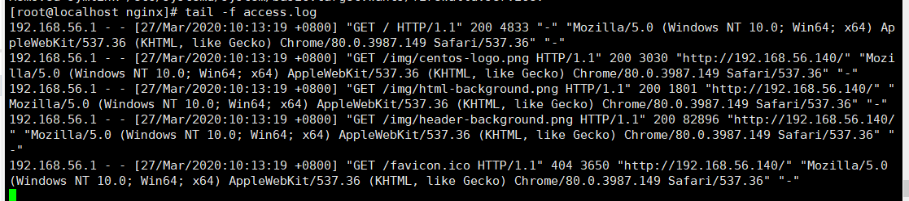
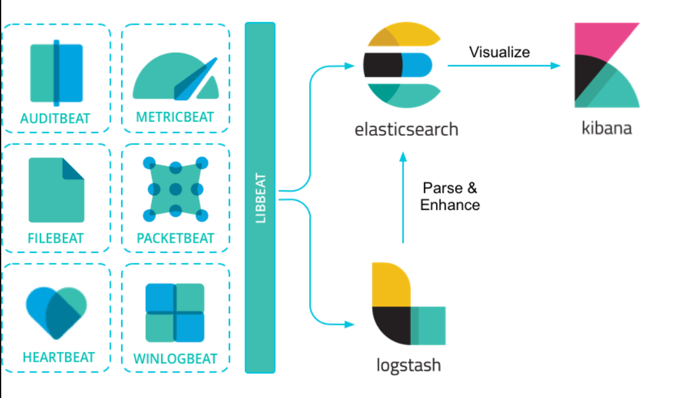
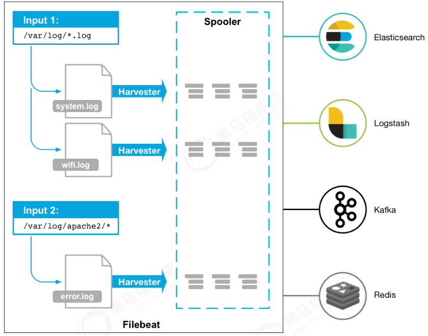

# Nginx日志分析系统

这一篇笔记主要目标是使用ELK实现Nginx日志分析系统。

## 项目需求

Nginx是一款优秀的web服务器，通常作为项目的主入口进行反向代理和负载均衡，所以Nginx的性能保障就相当重要，如果nginx运行出现了问题，会对系统有较大影响。

所以我们这里就要实现对nginx的运行情况进行监控，实时掌握nginx运行情况，包括nginx的指标数据和日志数据。


说明：

- 通过Beats中的Metricbeat来采集指标数据
- 通过Beats中的Filebeat来采集日志数据
- Beats采集的数据保存到ElasticSearch中
- Kibana关联ElasticSearch，更好的观察数据


## Nginx安装

首先关闭防火墙

```
systemctl stop firewalld.service
systemctl disable firewalld.service 
```

然后yum安装

```
yum install nginx -y
```

如果提示没有nginx软件包

```
yum install epel-release -y
yum update
```

安装完后，启动

```
systemctl start nginx
systemctl enable nginx
```

配置文件存放位置：`/etc/nginx`

日志文件存放位置：`/var/log/nginx`

查看日志：`tail -f /var/log/nginx/access.log` 



这里就是我们需要使用Filebeat收集的日志数据

## Beats介绍

Beats是一种轻量级数据采集工具，Elastic旗下的产品，配合ELK使用

官方说明：

> Beats 是数据采集的得力工具。将 Beats 和您的容器一起置于服务器上，或者将 Beats 作为功能加以部署，然后便可在 Elasticsearch 中集中处理数据。Beats 能够采集符合 [Elastic Common Schema (ECS)](https://www.elastic.co/guide/en/ecs/current/index.html) 要求的数据，如果您希望拥有更加强大的处理能力，Beats 能够将数据转发至 Logstash 进行转换和解析。



如图：

1. Beats通过各个组件采集不同属性的数据，比如日志的，指标的等等
2. 采集完后可以把数据发送给两个方向
   1. 直接发送给ElasticSearch进行存储
   2. 发送给Logstash进行数据清洗，数据加工，然后再由Logstash传输给ElasticSearch存储
3. Kibana进行数据的可视化

其中Beats中最常用的组件是：Filebeat和Metricbeat

## Filebeat入门

### Filebeat介绍

filebeat是一个轻量级日志采集器，我们原始查看日志的方式是ssh连接服务器，然后使用`tail -f`命令查看日志，但是如果有成百上千台服务器，这样的操作明显效率低下难以查看，使用filebeat可以通过配置，将日志进行汇总，并传输到其他存储组件，比如ElasticSearch，Logstash，Kafka，Redis上，让简单的事情不再繁杂

> Filebeat 是 Elastic Stack 的一部分，因此能够与 Logstash、Elasticsearch 和 Kibana 无缝协作。无论您要使用 Logstash 转换或充实日志和文件，还是在 Elasticsearch 中随意处理一些数据分析，亦或在 Kibana 中构建和分享仪表板，Filebeat 都能轻松地将您的数据发送至最关键的地方。

### Filebeat架构

Filebeat的工作方式如下：启动Filebeat时，它将启动一个或多个输入，这些输入将在为日志数据指定的位置中查找。对于Filebeat所找到的每个日志，Filebeat都会启动收集器。每个收集器都读取单个日志以获取新内容，并将新日志数据发送到日志数据到处理程序（spooler），处理程序会集合这些事件，最后filebeat会发送集合的数据到你指定的地点。



- Input：输入的日志文件，就是收集的日志文件
- Harvester：收集器，每个收集器都读取单个日志以获取新内容，并将新日志数据发送到Spooler
- Spooler：处理程序，用于集合日志数据，并将其传输到指定地点，有点类似工厂中的传输机器

### Filebeat安装

```bash

```


## Metricbeat入门