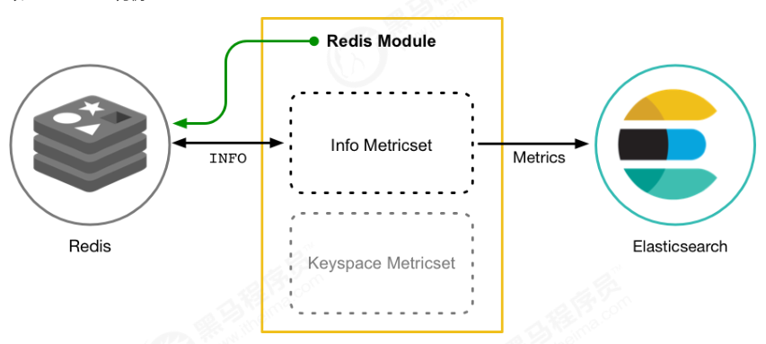
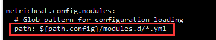
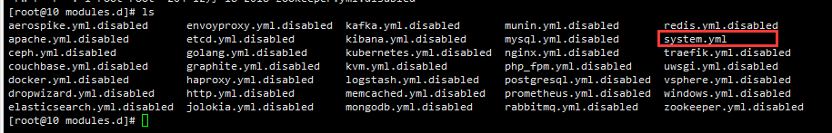
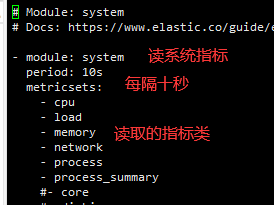
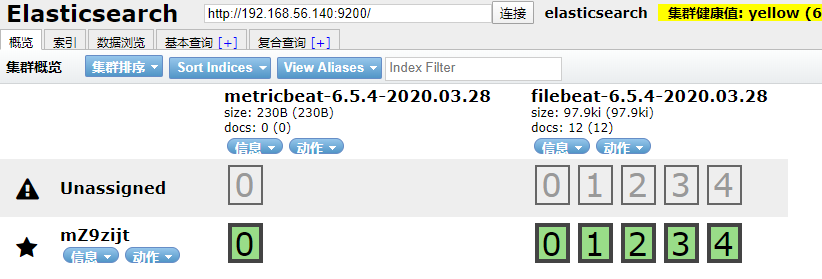
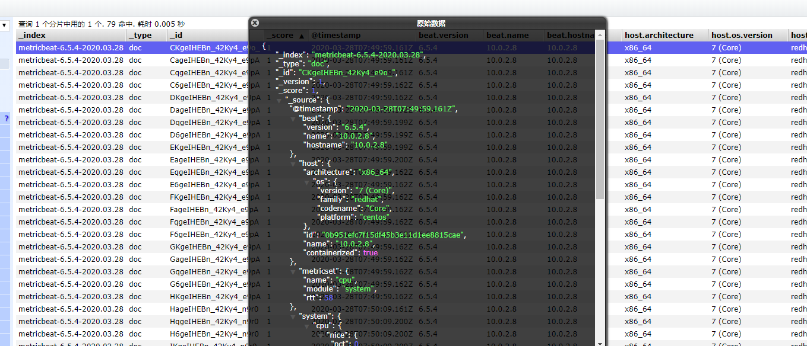
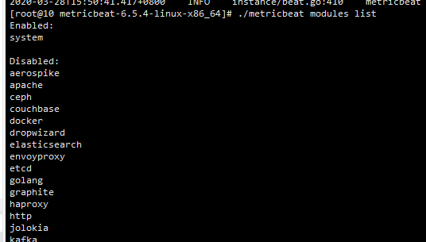
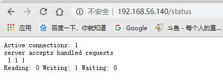
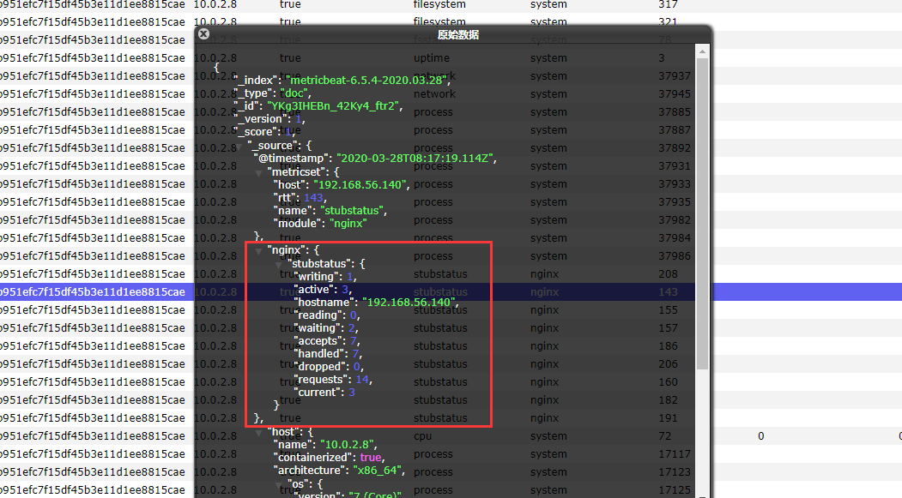

# Metricbeat

## Metricbeat介绍


Metricbeat也是Beats收集器里的一个组件，主要用来采集指标信息的，比如cpu，内存或者网络。

- 定期收集操作系统或应用的指标信息
- 存储到ElasticSearch中实时分析

Metricbeat由两部分组成：

- Module：收集的对象，比如Redis，Nginx，操作系统等
- Metricset：收集哪些指标，比如cpu，内存，网络信息等

以Redis为例：



这里使用Redis Module，使用Redis的info接口，获取到Redis指标信息，然后再根据设置的Metricset进行收集过滤，发送给ElasticSearch存储

## Metricbeat安装

首先我们需要下载Metricbeat软件包

```
tar -xvf metricbeat-6.5.4-linux-x86_64.tar.gz
cd metricbeat-6.5.4-linux-x86_64
```

非常简单

## Metricbeat配置与测试

这里先看一下默认的配置文件

配置文件其实和filebeat几乎一模一样（在使用Module的情况下）：

```yml
metricbeat.config.modules: # module默认设置
  path: ${path.config}/modules.d/*.yml
  reload.enabled: false
setup.template.settings: # 索引默认设置
  index.number_of_shards: 1
  index.codec: best_compression
  setup.kibana: # Kibana的配置
output.elasticsearch: # elasticsearch的设置
  hosts: ["192.168.40.133:9200","192.168.40.134:9200","192.168.40.135:9200"]
```


然后我们进行测试

1）首先修改ElasticSearch


2）然后看一下默认module



3）这里默认配置是使用modules.d下的所有开启的yml配置



只有system.yml是启用的，所以读取系统指标



4）启动测试 `./metricbeat -e`



和filebeat一样，创建了一个Metricbeat的索引



存放了很多系统指标信息

## Metricbeat的Module

Metricbeat和filebeat一样，也提供了很多Module



这里我们使用nginx，在接下来进行测试

## Metricbeat收集Nginx指标信息

### 启用nginx的status模块

首先我们想收集nginx的指标，需要配置一个和之前redis的info一样的接口，来获取nginx的一些指标信息，因为我们使用yum安装的nginx，所以配置起来很简单

> cd /etc/nginx
> vi nginx.conf

在server下添加：

```conf
location /status {
	stub_status on;
	access_log off;
}
```

然后重启nginx

> systemctl restart nginx

重启后访问http://192.168.56.140/status



出现如上信息，说明配置成功

结果说明：

- Active connections ：正在处理的活动连接数

- server accepts handled requests

  - 第一个 server 表示Nginx启动到现在共处理了1个连接

  - 第二个 accepts 表示Nginx启动到现在共成功创建 1 次握手

  - 第三个 handled requests 表示总共处理了 1 次请求
  
  - 请求丢失数 = 握手数 - 连接数 ，可以看出目前为止没有丢失请求

- Reading: 0 Writing: 1 Waiting: 1
  - Reading ：Nginx 读取到客户端的 Header 信息数
  - Writing ：Nginx 返回给客户端 Header 信息数
  - Waiting ：Nginx 已经处理完正在等候下一次请求指令的驻留链接（开启keep-alive的情况下，这个值等于Active - (Reading+Writing)）

### 配置nginx的Module

接下来，我们需要启用nginx的module，这里为了方便观察，会把system的关闭掉

> ./metricbeat modules enable nginx
>
> ./metricbeat modules disable system

> cd modules.d/
>
> vi nginx.yml

```conf
- module: nginx
  #metricsets:
  # 默认10秒刷新一次
  period: 10s

  # Nginx hosts，设置nginx的host
  hosts: ["http://192.168.56.140"]

  # 设置nginx状态查询的路径，我们刚刚设置的是status
  server_status_path: "status"
```

设置完毕后，启动测试 `./metricbeat -e`

