# 日志分析系统

这一篇笔记主要目标是使用ELK实现日志分析系统。

> 需提前安装Filebeat，ElasticSearch，Logstash，Kibana

## 项目需求

Nginx是一款优秀的web服务器，通常作为项目的主入口进行反向代理和负载均衡，所以Nginx的性能保障就相当重要，如果nginx运行出现了问题，会对系统有较大影响。

所以我们这里就要实现对nginx的运行情况进行监控，实时掌握nginx运行情况，包括nginx的指标数据和日志数据。

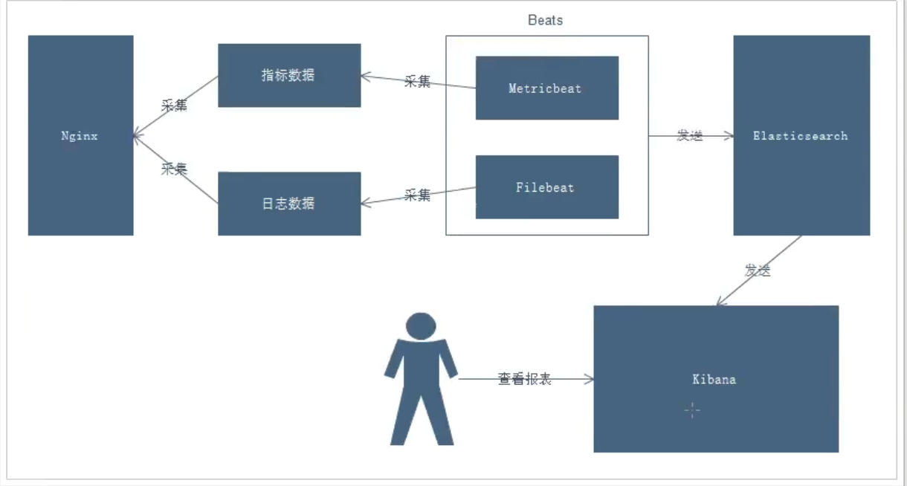

说明：

- 通过Beats中的Metricbeat来采集指标数据
- 通过Beats中的Filebeat来采集日志数据
- Beats采集的数据保存到ElasticSearch中
- Kibana关联ElasticSearch，更好的观察数据

## 流程说明

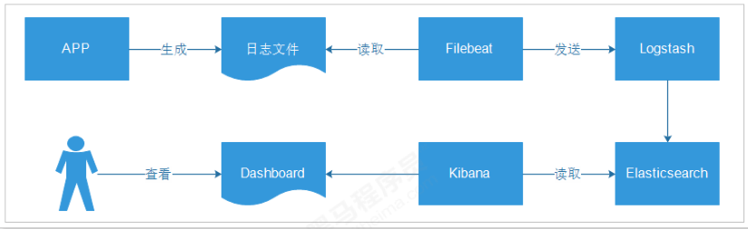

- 应用 APP生产日志，用来记录用户的操作

```
[INFO] 2019-03-15 22:55:20 [com.pacee1.dashboard.Main] - DAU|5206| 使用优惠券|2019-03-15
03:37:20
[INFO] 2019-03-15 22:55:21 [com.pacee1.dashboard.Main] - DAU|3880| 浏览页面|2019-03-15 07:25:09
```

- 通过 Filebeat读取日志文件中的内容，并且将内容发送给Logstash，原因是需要对内容做处理

- Logstash 接收到内容后，进行处理，如分割操作，然后将内容发送到Elasticsearch中

- Kibana 会读取Elasticsearch中的数据，并且在Kibana中进行设计Dashboard，最后进行展示

> 说明：日志格式、图表、Dashboard都是自定义的 

## APP说明

这里因为我们只是测试，不需要拿真实的项目来进行分析，所以只是做了个Demo输出

创建一个简单的SpringBoot工程，然后使用slf4j将日志输出到文件中，这里日志是自己生成的，如下：

```java
@SpringBootApplication
public class Main {

    private static final Logger LOGGER = LoggerFactory.getLogger(Main.class);

    public static final String[] VISIT = new String[]{"浏览页面", "评论商品", "加入收藏", "加入购物车", "提交订单", "使用优惠券", "领取优惠券", "搜索", "查看订单"};

    public static void main(String[] args) throws Exception {
        while(true){
            Long sleep = RandomUtils.nextLong(200, 1000 * 5);
            Thread.sleep(sleep);
            Long maxUserId = 9999L;
            Long userId = RandomUtils.nextLong(1, maxUserId);
            String visit = VISIT[RandomUtils.nextInt(0, VISIT.length)];
            DateTime now = new DateTime();
            int maxHour = now.getHourOfDay();
            int maxMillis = now.getMinuteOfHour();
            int maxSeconds = now.getSecondOfMinute();
            String date = now.plusHours(-(RandomUtils.nextInt(0, maxHour)))
                    .plusMinutes(-(RandomUtils.nextInt(0, maxMillis)))
                    .plusSeconds(-(RandomUtils.nextInt(0, maxSeconds)))
                    .toString("yyyy-MM-dd HH:mm:ss");

            String result = "DAU|" + userId + "|" + visit + "|" + date;
            LOGGER.info(result);
        }

    }
}
```

运行结果：

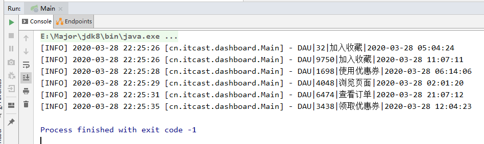

日志配置：

```properties
log4j.rootLogger=DEBUG,A1,A2
# 输出到控制台
log4j.appender.A1=org.apache.log4j.ConsoleAppender
log4j.appender.A1.layout=org.apache.log4j.PatternLayout
log4j.appender.A1.layout.ConversionPattern=[%p] %-d{yyyy-MM-dd HH:mm:ss} [%c] - %m%n
# 输出到文件中
log4j.appender.A2 = org.apache.log4j.DailyRollingFileAppender
log4j.appender.A2.File = /pace/beats/logs/app.log
log4j.appender.A2.Append = true
log4j.appender.A2.Threshold = INFO
log4j.appender.A2.layout = org.apache.log4j.PatternLayout
log4j.appender.A2.layout.ConversionPattern =[%p] %-d{yyyy-MM-dd HH:mm:ss} [%c] - %m%n
```

我们将springboot项目打包，然后将jar包放到linux上进行运行，他就会创建日志文件到`/pace/beats/logs/app.log`中

## Filebeat配置

```yml
filebeat.inputs:
  - type: log
enabled: true
  paths:
    - /pace/beats/logs/app.log
output.logstash:
  hosts: ["192.168.56.140:5044"]
```

## Logstash配置

```yml
input {
    beats {
        # filebeat的端口
        port => "5044"
    }
}
filter {
    mutate {
        split => {"message" => "|"}
    }
    mutate {
        add_field => {
            "userId" => "%{message[1]}"
            "visit" => "%{message[2]}"
            "date" => "%{message[3]}"
        }
    }
    mutate {
        convert => {
            "userId" => "integer"
            "visit" => "string"
            "date" => "string"
        }
    }
}
output {
    stdout {
        codec => "rubydebug"
    }
    elasticsearch {
        hosts => [ "192.168.56.140:9200"]
        index => "logstash-app-%{+YYYY.MM.dd}"
    }
}

```

## 启动测试

启动app：

> java -jar itcast-dashboard-generate-1.0-SNAPSHOT.jar

启动Logstash

> ./bin/logstash -f config/app.yml

启动Filebeat

./filebeat -e -c filebeat-app.yml

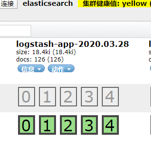

ES创建了索引

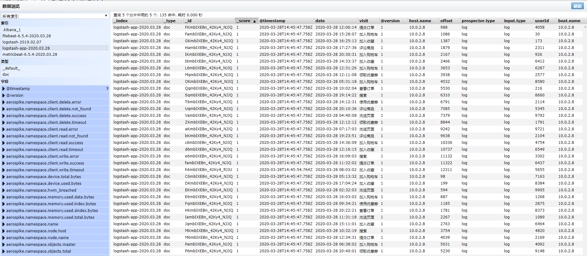

并具有数据

## Kibana进行可视化操作

启动Kibana`./bin/kibana`

### 创建数据探索

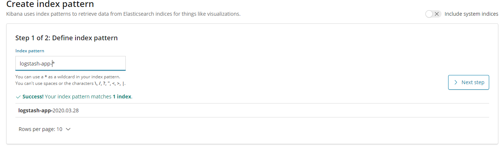

创建完后，可以去Discover中查看

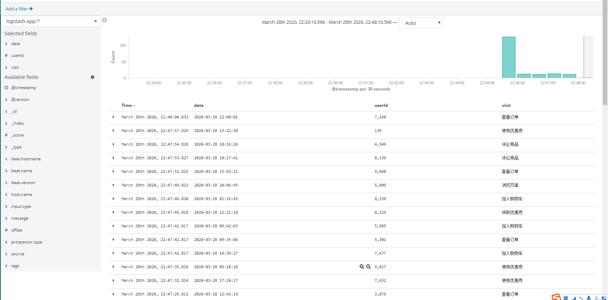

没问题，然后保存下来

### 创建柱形图

在Visualize下创建柱形图

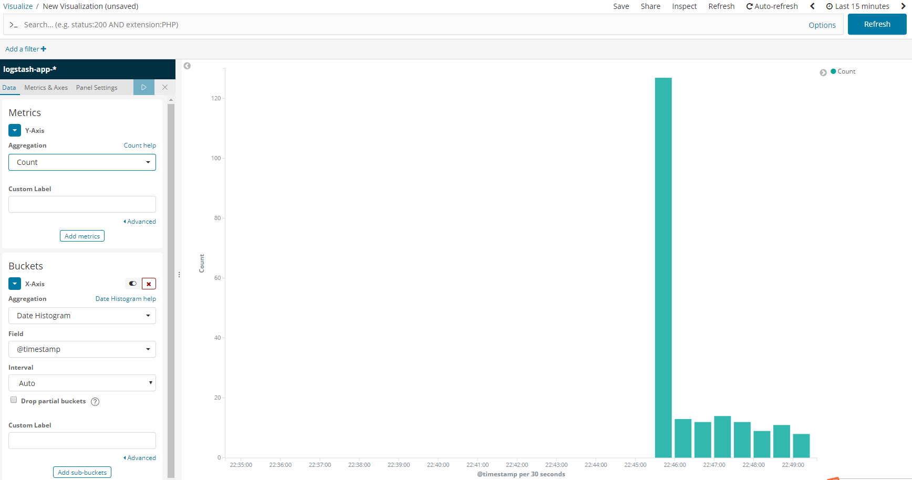

### 创建饼图

也是在Visualize下

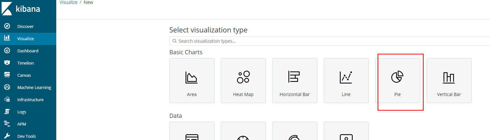

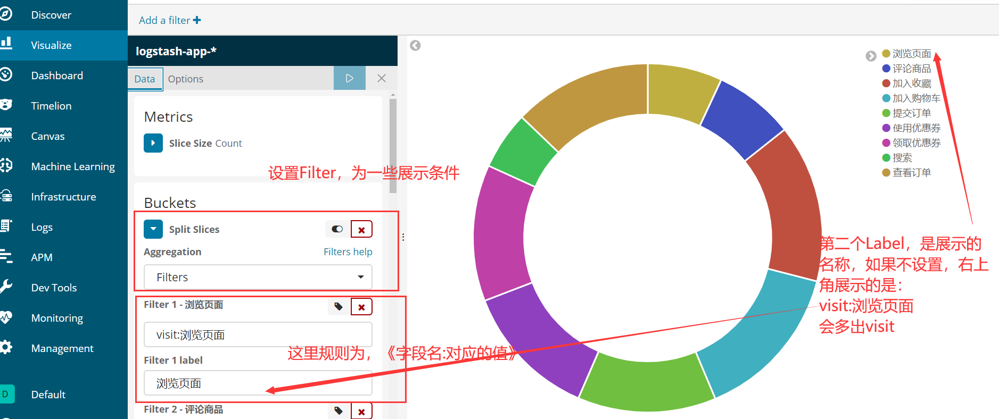

然后我们可以去设置一下饼图的形状

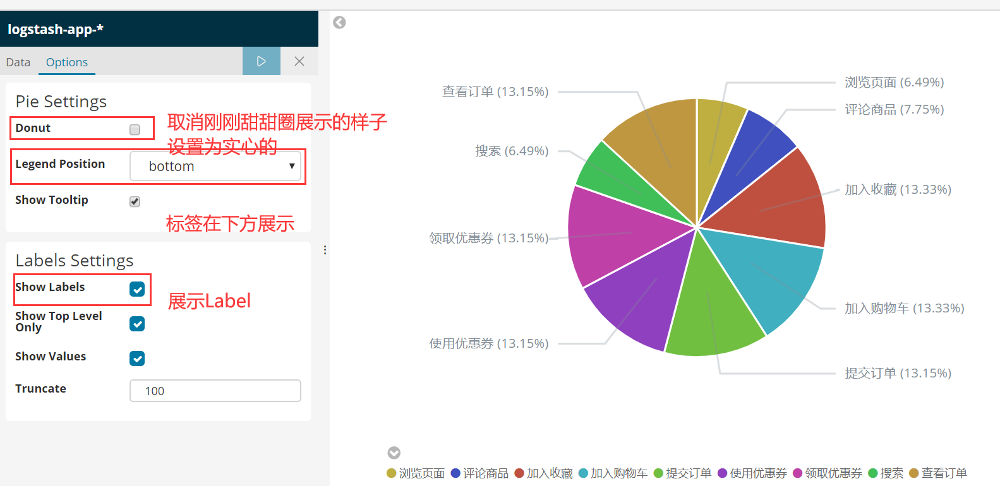

然后保存

### 制作仪表盘

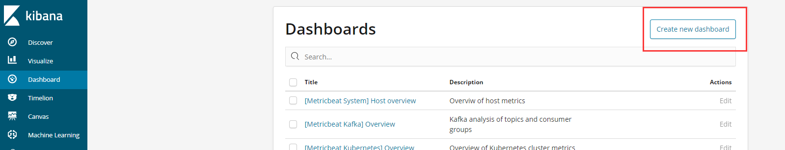

创建新的仪表盘，然后向里面添加我们刚刚设置的那些图

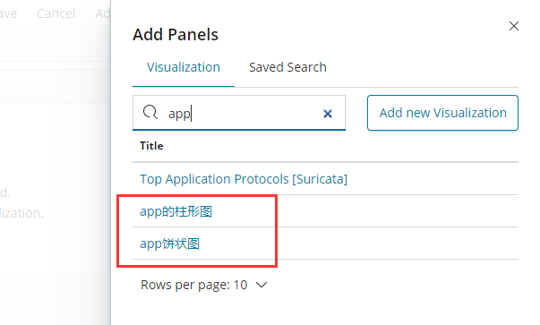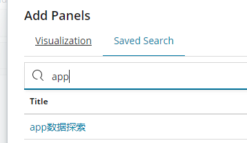

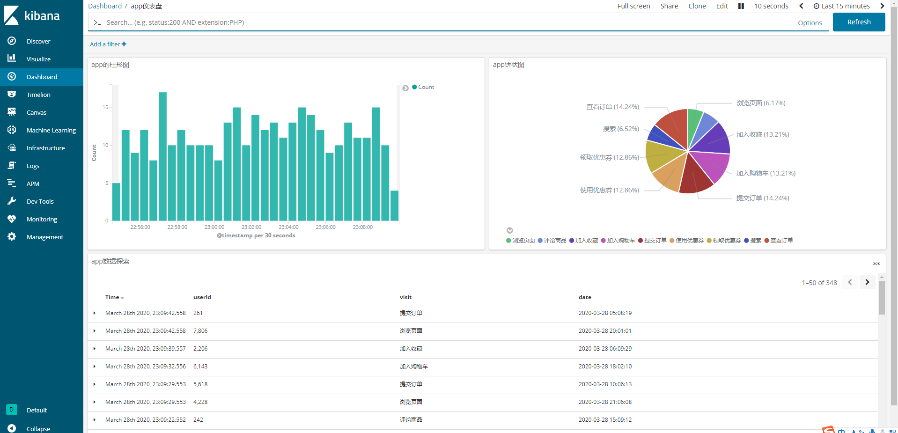

这样，一个完美的仪表盘就完成了


**到此一个简单的日志分析系统就完成了~**