# Beats

说Filebeat之前，需要先了解Beats，因为Filebeat属于Beats中的组件。


Beats是轻量级的数据采集器，将成百上千的数据收集起来，发送给ElasticSearch或者Logstash。

Beats对于收集数据非常有用。它们位于你的服务器上，将数据集中在Elasticsearch中，Beats也可以发送到Logstash来进行转换和解析。

为了捕捉（捕获）数据，Elastic提供了各种Beats：

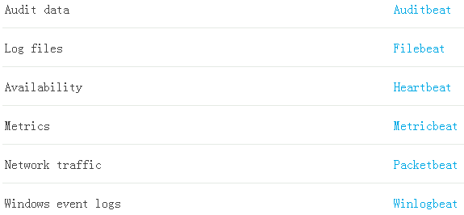

Beats可以直接（或者通过Logstash数据处理后）将数据发送到Elasticsearch，在那里你可以进一步处理和增强数据，然后在Kibana中将其可视化。


# Filebeat

## Filebeat介绍

当你要面对成百上千、甚至成千上万的服务器、虚拟机和容器生成的日志时，请告别 SSH 吧！Filebeat 将为你提供一种轻量型方法，用于转发和汇总日志与文件，让简单的事情不再繁杂。

关于Filebeat，记住两点：

- **轻量级日志采集器**
- **输送至 Elasticsearch 或 Logstash，在 Kibana 中实现可视化**

Filebeat的工作方式如下：启动Filebeat时，它将启动一个或多个输入，这些输入将在为日志数据指定的位置中查找。对于Filebeat所找到的每个日志，Filebeat都会启动收集器。每个收集器都读取单个日志以获取新内容，并将新日志数据发送到日志数据到处理程序（spooler），处理程序会集合这些事件，最后filebeat会发送集合的数据到你指定的地点。


- Input：输入的日志文件，就是收集的日志文件
- Harvester：收集器，每个收集器都读取单个日志以获取新内容，并将新日志数据发送到Spooler
- Spooler：处理程序，用于集合日志数据，并将其传输到指定地点，有点类似工厂中的传输机器

## Filebeat安装

```
mkdir /pace/beats
curl -L -O https://artifacts.elastic.co/downloads/beats/filebeat/filebeat-6.5.4-linux-x86_64.tar.gz
tar -xvf filebeat-6.5.4-linux-x86_64.tar.gz
cd filebeat-6.5.4-linux-x86_64
```

## Filebeat的HelloWorld

安装完毕后，我们就可以开启Helloworld大门了

1）首先创建一个配置文件`helloworld.yml`

```yml
filebeat.inputs:
- type: stdin
  enabled: true
output.console:
  pretty: true
  enable: true
```

这里简单介绍一下：

- inputs输入，这里选择了stdin即控制台输入，还有一种形式log，之后演示，enabled启用
- output输出，这是选择console标识输出到控制台，pretty是美化

2）启动

```
./filebeat -e -c helloworld.yml
```

3）输入hello

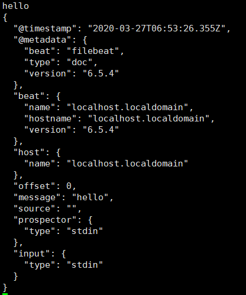

说明我们的输入被他接收，然后进行了一些处理，并把结果信息输出出来


## Filebeat收集日志文件

刚刚我们使用stdin方式收集，也就是收集控制台的命令，接着我们要收集文件中的数据

1）创建helloworld-log.yml

```yml
filebeat.inputs:
- type: log
  enabled: true
  paths:
    - /pace/beats/logs/*.log
output.console:
  pretty: true
  enable: true
```

这里我们设置读取的目录为`/pace/beats/logs`下的所有`.log`结尾的文件

2）在设置目录下创建文件并输入信息

```
mkdir /pace/beats/logs
cd /pace/beats/logs/
echo "helloworld" >> a.log
```

3）在Filebeat查看输出信息

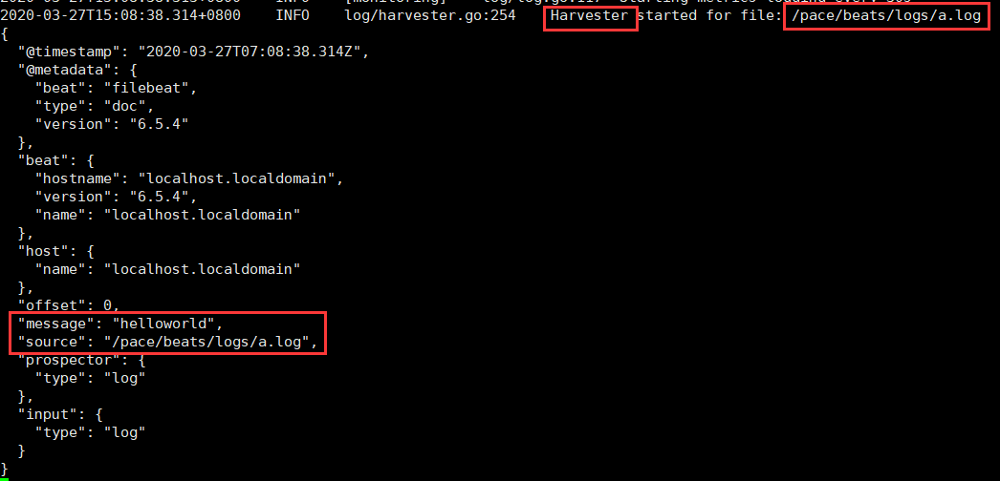

收集器获取了日志文件，并把其中的信息进行了输出

## Filebeat自定义字段

在结果输出中，都是Filebeat默认的一些字段，如果我们想自己添加一些字段应该怎么做呢？

### tags字段

使用标签能够在Filebeat输出的每个事件中加入这个tags字段,这样能够被Kibana或Logstash轻松过滤

```yml
filebeat.inputs:
- type: log
  enabled: true
  paths:
    - /pace/beats/logs/*.log
  tags: ["json"]
 . . .
```

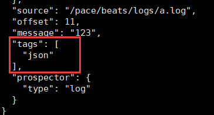

### fields字段

添加一些输出的字段，比如数据的来源，`from: Filebeat-140`

```yml
filebeat.inputs:
- type: log
  enabled: true
  paths:
    - /pace/beats/logs/*.log
  tags: ["json"]
  fields: 
  	from: Filebeat-140
  fields_under_root: false # 是否让fields中的字段变成根节点
 . . .
```

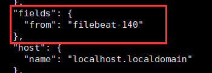

这里可以使用`fields_under_root: true`，来将fields根节点去掉，直接让from变成根节点，如下

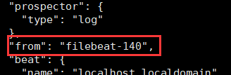

## Filebeat输出到ElasticSearch

非常简单

```yml
filebeat.inputs:
- type: log
  enabled: true
  paths:
    - /pace/beats/logs/*.log
output.elasticsearch:
  hosts: ["192.168.56.140:9200"]
```

修改output后的参数即可，这里还可以改成`output.logstash`，输出到Logstash中

然后我们启动后，修改日志文件，查看收集输出结果，首先查看es-head

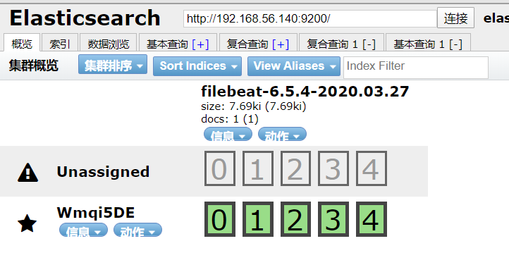

创建了一个Filebeat版本-日期的索引，然后查看其中的数据：

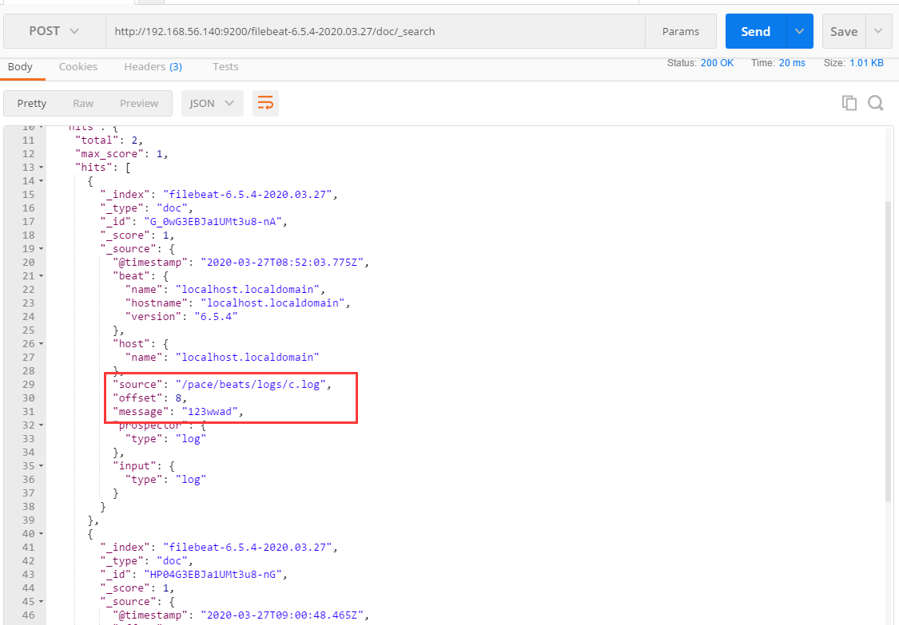

## Filebeat工作原理

Filebeat由两个主要组件组成：prospector 和 harvester。

- harvester ：收割机
  - 负责读取单个文件的内容。
  - 如果文件在读取时被删除或重命名， Filebeat将继续读取文件。

- prospector：勘探者
  - prospector  负责管理harvester并找到所有要读取的文件来源。
  - 如果输入类型为日志，则查找器将查找路径匹配的所有文件，并为每个文件启动一个 harvester。
  - Filebeat 目前支持两种prospector类型：log和stdin。

- Filebeat 如何保持文件的状态
  - Filebeat  保存每个文件的状态并经常将状态刷新到磁盘上的注册文件中。
  - 该状态用于记住 harvester正在读取的最后偏移量，并确保发送所有日志行。
  - 如果输出（例如 Elasticsearch或Logstash）无法访问，Filebeat会跟踪最后发送的行，并在输出再次可用时继续读取文件。
  - 在 Filebeat运行时，**每个prospector内存中也会保存的文件状态信息**，当重新启动Filebeat时，将使用注册
    文件的数据来重建文件状态，Filebeat将每个harvester在从保存的最后偏移量继续读取。
  - 文件状态记录在 data/registry文件中。

启动命令：

```
./filebeat  -e -c itcast.yml
./filebeat -e -c itcast.yml -d "publish"

#参数说明
-e: 输出到标准输出，默认输出到syslog和logs下
-c: 指定配置文件
-d: 输出debug信息
```

## FileBeat的Module

在我们刚刚，都是手动配置的日志input设置，其实在FIlebeat中，有一个Module的概念，可以简化我们的配置，有点像java中的import，接着我们来看看

> ./filebeat modules list 		查看所有的module

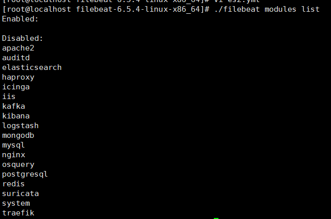

这里我们使用nginx进行测试

### 启用nginx

```
./filebeat modules enable nginx  #启动
./filebeat modules disable nginx #禁用
```

### 配置nginx module

然后我们需要去配置一下，主要是配置我们nginx所在位置，他并不知晓，需要手动设置

> cd modules.d
>
> vi nginx.yml

```yml
- module: nginx
  # Access logs
  access:
    enabled: true
    var.paths: ["/var/log/nginx/access.log*"]
    # Set custom paths for the log files. If left empty,
    # Filebeat will choose the paths depending on your OS.
    #var.paths:

  # Error logs
  error:
    enabled: true
    var.paths: ["/var/log/nginx/error.log*"]
    # Set custom paths for the log files. If left empty,
    # Filebeat will choose the paths depending on your OS.
    #var.paths:
```

保存，然后去修改Filebeat配置

### 配置Filebeat

> cd /pace/beats/filebeat
>
> vi nginx.yml

```yml
filebeat.inputs:
output.elasticsearch:
  hosts: ["192.168.56.140:9200"]
filebeat.config.modules:
  path: ${path.config}/modules.d/*.yml
  reload.enabled: false
```

主要是配置`filebeat.config.modules:`

### 启动测试Filebeat

> ./filebeat -e -c nginx.yml

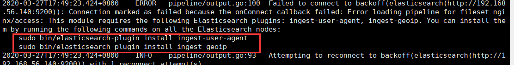

发现报错，提示我们需要安装两个插件

> sudo bin/elasticsearch-plugin install ingest-user-agent
>
> sudo bin/elasticsearch-plugin install ingest-geoip

安装后重新测试

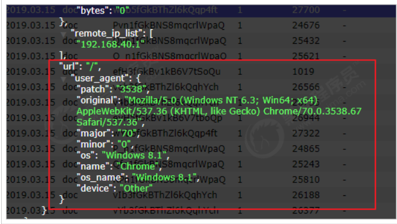

会发现数据写进去，并且数据更明确

当然了，其他的 Module的用法参加官方文档：https://www.elastic.co/guide/en/beats/filebeat/current/filebeat-modules.html