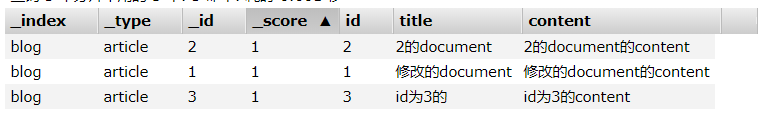
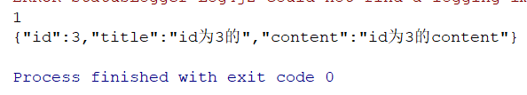
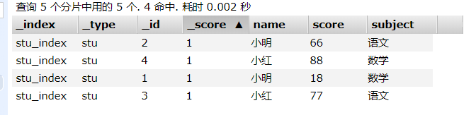
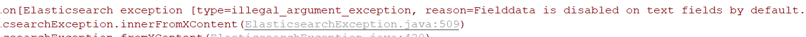
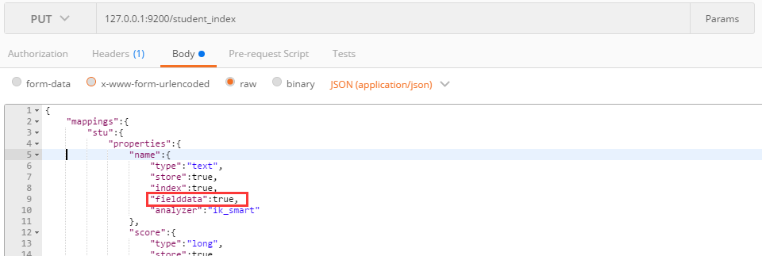
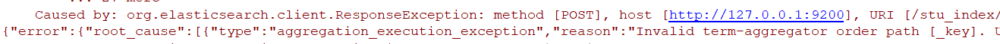
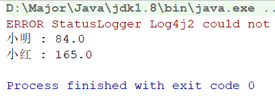

ES对于Java客户端提供了两种连接方式

- Transport连接：基于TCP的连接方式，即使用9300端口，即执行Java请求
- REST client：高级客户端，使用REST请求，基于9200端口，执行Http请求

对于ES来说 es8以上便没有transport客户端了，即弃用，所以更推荐使用High level rest client，简称高级客户端。

对于学习阶段，准备将两种方式都简单学习一下。

## 一、Transport客户端

Java对ES进行操作，首先需要一个客户端。

### 1.1.获取TransportClient

客户端的创建：1.设置settings，配置集群名称 2.获取client，配置节点端口与IP

```java
private TransportClient client;

@Before
public void init() throws  Exception{
    // 1.创建settings，需要配置集群名称
    Settings settings = Settings.builder().put("cluster.name","my-elasticsearch").build();
    // 2.创建TransportClient对象，因为是TCP连接，所以设置IP与端口
    client = new PreBuiltTransportClient(settings);
    // 这里设置三个节点时因为以防某个挂掉
    client.addTransportAddress(new InetSocketTransportAddress(InetAddress.getByName("127.0.0.1"),9300));
    client.addTransportAddress(new InetSocketTransportAddress(InetAddress.getByName("127.0.0.1"),9301));
    client.addTransportAddress(new InetSocketTransportAddress(InetAddress.getByName("127.0.0.1"),9302));
}
```

### 1.2.创建索引

```java
@Test
/**
 * 创建索引
 */
public void createIndex() throws Exception{
    // 3.创建索引
    client.admin().indices().prepareCreate("java_index2").get();
    // 4.关闭连接
    client.close();
}
```

因为上面已经在把client当做成员变量了，所以不再初始化。

### 1.3.设置mappings

```java
@Test
/**
 * 设置索引的mappings
 */
public void setIndexMappings() throws Exception{
    // 3.设置mappings信息，多种方式，json或Map或XContentBuilder
    XContentBuilder builder = XContentFactory.jsonBuilder()
            .startObject()
                .startObject("book")
                    .startObject("properties")
                        .startObject("id")
                            .field("type", "integer")
                            .field("store", "yes")
                        .endObject()
                        .startObject("title")
                            .field("type", "string")
                            .field("store", "yes")
                            .field("analyzer", "ik_smart")
                        .endObject()
                        .startObject("content")
                            .field("type", "string")
                            .field("store", "yes")
                            .field("analyzer", "ik_smart")
                        .endObject()
                    .endObject()
                .endObject()
            .endObject();
    // 创建映射
    client.admin().indices().preparePutMapping("java_index").setType("book").setSource(builder).get();
    // 关闭
    client.close();
}
```

在post中，我们以json形式填入请求体，再java执行请求也一样需要拼接请求体，可以使用json字符串或es官方的XContentBuilder对象，这里我们使用XContentBuilder，创建Document时使用Json字符串。

### 1.4.创建Document

```java
@Test
/**
 * 添加文档
 */
public void addDocument() throws Exception{
    // 配置文档，上面我们使用了XContentBuilder的方式，这里我们使用json字符串,在postman写好复制过来即可
    String json = "{\n" +
            "\t\"id\":1,\n" +
            "\t\"title\":\"新的document\",\n" +
            "\t\"content\":\"新的document的content\"\n" +
            "}";
    // client执行
    client.prepareIndex()
            .setIndex("java_index") // 设置索引
            .setType("book") // 设置类型
            .setId("1") // 设置主键ID，不设置即默认
            .setSource(json,XContentType.JSON).get();
    client.close();
}
```

这里Json串是直接拼接的，当然，也可以使用**Bean转Json插件**，先创建个Entity实体，再进行转换json字符串。

### 1.5.查询功能

查询有三种，根据id查询，根据Term查询与根据QueryString分词查询

这三种查询都依赖QueryBuilder对象，差别也仅仅在QueryBuilder对象的构建上。

```java
@Test 
public void search() throws Exception{
    // 设置查询对象QueryBuilder
    // 根据ID
    //QueryBuilder queryBuilder = QueryBuilders.idsQuery().addIds("1");
    // 根据Term
    //QueryBuilder queryBuilder = QueryBuilders.termQuery("content","content");
    // 根据QueryString，指定default域，会在指定的上查询，没有指定在所有域查询
    QueryBuilder queryBuilder = QueryBuilders.queryStringQuery("document 2").defaultField("title");
    // 执行查询
    SearchResponse searchResponse = client.prepareSearch("java_index")
                    .setTypes("book").setQuery(queryBuilder).get();
    // 获取查询出的数据
    SearchHits searchHits = searchResponse.getHits();
    // 获取总记录数
    System.out.println("总记录：" + searchHits.totalHits);
    // 获取列表
    Iterator<SearchHit> iterator = searchHits.iterator();
    while(iterator.hasNext()){
        SearchHit hit = iterator.next();
        System.out.println(hit.getSourceAsString());
    }
    client.close();
}
```

### 1.6.查询分页与高亮

对于分页与高亮都是在client查询时进行添加参数

分页：执行查询时设置From（从第几个数据开始），Size（一页多少个数据）

```java
client.prepareSearch("java_index").setTypes("book").setQuery(queryBuilder)
        .setFrom(0).setSize(5)
        .get();
```

高亮：需要先设置HighlightBuilder对象，field（在哪个域高亮），preTags（关键字前添加），postTags（关键字后添加）

```java
 @Test // 高亮显示查出结果
    public void searchByQueryStringhighLight() throws Exception{
        // 设置查询对象QueryBuilder,指定default域，会在指定的上查询，没有指定在所有域查询
        QueryBuilder queryBuilder = QueryBuilders.queryStringQuery("document 2").defaultField("title");
        HighlightBuilder highLight = new HighlightBuilder();
        highLight.field("title");
        highLight.preTags("<em>");
        highLight.postTags("</em>");
        // 执行查询
        SearchResponse searchResponse = client.prepareSearch("java_index")
                .setTypes("book").setQuery(queryBuilder)
                .setFrom(0).setSize(5) // 设置分页
                .highlighter(highLight)// 设置高亮显示
                .get();

        // 获取查询出的数据
        SearchHits searchHits = searchResponse.getHits();
        // 获取总记录数
        System.out.println("总记录：" + searchHits.totalHits);
        // 获取列表
        Iterator<SearchHit> iterator = searchHits.iterator();
        while(iterator.hasNext()){
            SearchHit hit = iterator.next();
            System.out.println(hit.getSourceAsString());

            // 获取高亮显示内容
            Map<String, HighlightField> highlightFields = hit.getHighlightFields();
            Text[] text = highlightFields.get("title").getFragments();
            for (Text str : text) {
                System.out.println("**高亮**："+str);
            }
        }
        client.close();
    }
```

对于高亮结果的获取如代码所示。

## 二、High Level Rest客户端

### 2.1.客户端初始化

高级客户端的创建内部需要创建低级客户端来提供builder，低级客户端会维护一些线程，所以关闭时需要close释放线程。

对比TransportClient，高级客户端的创建简单了很多，如下：

```java
@Test
public void testGetClient() throws  Exception{
    // 高级客户端创建方式,参数1是ip,参数2是HTTP端口，参数3是通信协议
    RestHighLevelClient client = new RestHighLevelClient(
            RestClient.builder(
                    new HttpHost("127.0.0.1",9200,"http"),
                    new HttpHost("127.0.0.1",9201,"http"),
                    new HttpHost("127.0.0.1",9202,"http")));
    // 测试是否正确连接
    GetRequest request = new GetRequest("java_index","book","1");
    boolean exists = client.exists(request, RequestOptions.DEFAULT);
    System.out.println(exists);
    client.close();
}
```

这里getRequest即根据ID查询索引信息

### 2.2.新增索引

```java
@Test
/**
 * 创建索引
 */
public void createIndex() throws Exception{
    CreateIndexRequest request = new CreateIndexRequest("high_level");
    CreateIndexResponse response = client.indices().create(request, RequestOptions.DEFAULT);
    System.out.println(response.isAcknowledged());
    client.close();
}
```

可以看到，高级客户端明显比Transport客户端操作清晰明了，对于不同操作具有不同的Request

### 2.3.设置mappings

```java
@Test
/**
 * 设置Mappings
 */
public void putMappings() throws Exception{
    PutMappingRequest request = new PutMappingRequest("high_level").type("person");
    // 这里有三种方法，1）Map，2）Json，3）XContentBuilder
    // 在Transport中使用了XContentBuilder，这里使用Json
    String json = "{\n" +
            "\t\"person\":{\n" +
            "\t\t\"properties\":{\n" +
            "\t\t\t\"name\":{\n" +
            "\t\t\t\t\"type\":\"text\",\n" +
            "\t\t\t\t\"store\":true,\n" +
            "\t\t\t\t\"index\":true,\n" +
            "\t\t\t\t\"analyzer\":\"ik_smart\"\n" +
            "\t\t\t},\n" +
            "\t\t\t\"age\":{\n" +
            "\t\t\t\t\"type\":\"text\",\n" +
            "\t\t\t\t\"store\":true,\n" +
            "\t\t\t\t\"index\":true,\n" +
            "\t\t\t\t\"analyzer\":\"ik_smart\"\n" +
            "\t\t\t}\n" +
            "\t\t}\n" +
            "\t}\n" +
            "}";
    request.source(json,XContentType.JSON);
    AcknowledgedResponse acknowledgedResponse = client.indices().putMapping(request, RequestOptions.DEFAULT);
    System.out.println(acknowledgedResponse.isAcknowledged());
    client.close();
}
```

### 2.4.增加修改Document

```java
@Test
/**
 * 创建修改Document
 */
public void addDocument() throws Exception{
    IndexRequest request = new IndexRequest("high_level").type("person").id("3");
    // 这里有三种方法，1）Map，2）Json，3）XContentBuilder
    // Json:
   /* String json = "{\n" +
            "\t\"name\":\"李A\",\n" +
            "\t\"age\":\"22 32 11\"\n" +
            "}";
    request.source(json,XContentType.JSON);*/
    // XContentBuilder:
   /* XContentBuilder xBuilder = XContentFactory.jsonBuilder()
            .startObject()
                .field("name","赵A")
                .field("age","22")
            .endObject();
    request.source(xBuilder);*/
    // Map:
    Map<String,Object> map = new HashMap<String, Object>();
    map.put("name","王A");
    map.put("age","22 32");
    request.source(map);
    IndexResponse index = client.index(request, RequestOptions.DEFAULT);
    // 这里通过getResult可以判断创建还是修改
    if(index.getResult().equals(DocWriteResponse.Result.CREATED)){
        System.out.println("创建成功");
    }else if(index.getResult().equals(DocWriteResponse.Result.UPDATED)){
        System.out.println("修改成功");
    }
    client.close();
}
```

### 2.5.删除索引

```java
@Test
/**
 * 删除索引
 */
public void deleteIndex() throws Exception{
    DeleteIndexRequest request = new DeleteIndexRequest("test");
    boolean acknowledged = client.indices().delete(request, RequestOptions.DEFAULT).isAcknowledged();
    System.out.println(acknowledged);
    client.close();
}
```

### 2.6.删除Document

```java
@Test
/**
 * 删除文档Document
 */
public void deleteDocument() throws Exception{
    DeleteRequest request = new DeleteRequest("high_level","person","3");
    DocWriteResponse.Result result = client.delete(request, RequestOptions.DEFAULT).getResult();
    System.out.println(result);
    client.close();
}
```

### 2.7.根据ID查询

这里分为单个ID查询和批量ID查询，如下：

```java
@Test
/**
 * 根据ID查询
 */
public void searchByID() throws Exception{
    GetRequest request = new GetRequest("high_level","person","1");
    GetResponse response = client.get(request, RequestOptions.DEFAULT);
    System.out.println(response.getSourceAsString());
    client.close();
}

@Test
/**
 * 根据ID批量查询
 */
public void multiSearchByID() throws Exception{
    MultiGetRequest request = new MultiGetRequest() // 设置多条id查询
            .add(new MultiGetRequest.Item("high_level","person","1"))
            .add(new MultiGetRequest.Item("high_level","person","2"));
    MultiGetResponse multiGetItemResponses = client.mget(request, RequestOptions.DEFAULT);
    // 循环显示数据
    for(MultiGetItemResponse response :multiGetItemResponses){
        System.out.println(response.getResponse().getSourceAsString());
    }
    client.close();
}
```

即一个为GetRequest，一个为MultiGetRequest

### 2.8.根据Term查询

根据Term查询会发现查询方式改变了，这也是es最常用的查询方式

即：

1.创建一个SearchRequest，设定请求信息，如：索引名，Type类型，SearchType类型。

2.创建SearchSourceBuilder，配置查询信息，如：分页情况，如何查询（Term查询，聚合查询等），高亮显示，超时时间

3.使用QueryBuilders配置查询方式，这里方式比较多，下面介绍

这里searchType类型下面介绍。

```java
@Test
    /**
     * 根据Term查询
     */
    public void searchByTerm() throws Exception{
        // 1.创建一个SearchRequest，设置索引名
        SearchRequest request = new SearchRequest("java_index");
        // 2.配置SourceBuilder，设置查询信息
        SearchSourceBuilder builder = new SearchSourceBuilder();
        // 设置查询信息，以及分页信息
        builder.query(QueryBuilders.termQuery("title","document"));
        builder.from(0);
        builder.size(5);
        builder.timeout(new TimeValue(10,TimeUnit.SECONDS));//设置10秒的超时时间
        request.source(builder); // 填入request
        SearchResponse response = client.search(request, RequestOptions.DEFAULT); // 查询
        SearchHits hits = response.getHits(); // 获取数据
        System.out.println(hits.totalHits);
        // 循环展示
        for(SearchHit hit : hits){
            System.out.println(hit.getSourceAsString());
        }
        client.close();
    }
```

#### 2.7.1.QueryBuilders类型

```java
// 设置QueryBuilders查询方式
QueryBuilder query = QueryBuilders.termQuery("name", "小明"); //Term查询
//QueryBuilder query = QueryBuilders.matchQuery("content", "新"); //类似Term查询
//QueryBuilder query = QueryBuilders.matchAllQuery(); // 检索所有文档数据
//QueryBuilder query = QueryBuilders.multiMatchQuery("新", "content","title"); //多字段匹配
```

可以看到常见的有这几种，还有一种比较重要的是**复合查询**：

```java
BoolQueryBuilder boolQuery = QueryBuilders.boolQuery();
// 必须的查询条件，是一个List集合
boolQuery.must(QueryBuilders.termQuery("content", "content"));
// 必须不含有的查询条件
boolQuery.mustNot(QueryBuilders.termQuery("title", "document"));
// 设置查询信息，以及分页信息
builder.query(boolQuery);
```

这段符合查询意思是，查询content中含有content且title中不含有document的数据





可以看到正确显示出id为3的数据。

### 2.9.聚合查询

聚合查询使用`AggregationBuilders`来创建聚合条件

一般来说使用方法：

```java
// 聚合查询，terms为聚合后字段名，field为字段名
TermsAggregationBuilder aggre = AggregationBuilders.terms("by_name").field("name");
// 添加聚合条件
aggre.subAggregation(AggregationBuilders.sum("sum_score").field("score"));
// 设置聚合信息
builder.aggregation(aggre);
```

我们想进行获取每个学生总成绩，便需要聚合查询：



代码：

```java
@Test
    /**
     * 聚合查询
     */
    public void searchByAggregation() throws Exception{
        // 1.创建一个SearchRequest，设置索引名
        SearchRequest request = new SearchRequest("student_index");
        // 设置type
        request.types("stu");
        request.searchType(SearchType.DEFAULT);
        // 2.配置SourceBuilder，设置查询信息
        SearchSourceBuilder builder = new SearchSourceBuilder();
        // 聚合查询，terms为聚合后字段名，field为字段名
        TermsAggregationBuilder aggre = AggregationBuilders.terms("by_name").field("name.keyword");
        aggre.subAggregation(AggregationBuilders.sum("sum_score").field("score"));
        // 设置查询信息，以及分页信息
        builder.query(QueryBuilders.matchAllQuery());
        builder.aggregation(aggre);
        request.source(builder); // 填入request
        SearchResponse response = client.search(request, RequestOptions.DEFAULT); // 查询
        Aggregations aggregations = response.getAggregations();// 获取聚合数据
        Terms term = aggregations.get("by_name");
        for(Terms.Bucket bucket : term.getBuckets()){
            Sum sum = bucket.getAggregations().get("sum_score");
            System.out.println(bucket.getKey()+" : "+ sum.getValue());
        }
        client.close();
    }
```

执行后会发现报错：



这是因为我们的name字段时text属性，而ES5之后对**text属性聚合需要花费大量时间**，默认是禁止的，这时我们需要重新设置name属性：



设置fielddata为true。

再次执行，发现又报错！



上网查没有查到结果，思考一下，我这java是6.6的api，而es引擎是5.6的，是不是**版本冲突问题**呢，我下载一个6.x的ES启动后再次执行，可以获得想要的结果。



