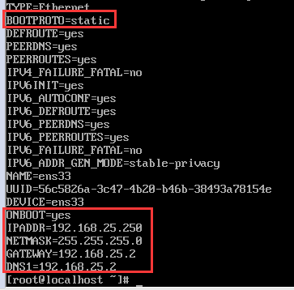
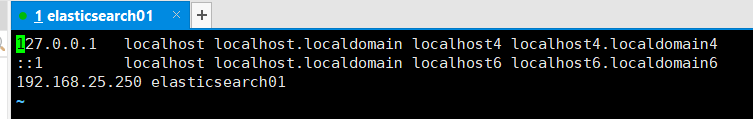
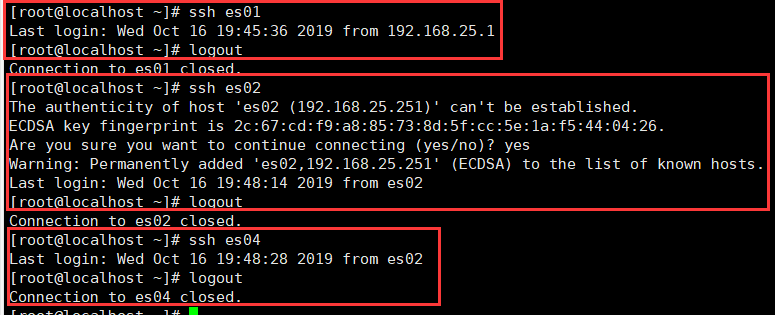

我们开始学习搭建集群，这里搭建4节点的虚拟机集群，每个虚拟机1核2G，因为我笔记本只有16G，需要留8G。

## 一、在虚拟机中安装centos7

软件：VMware10，centos7

### 1.1.安装centos7

这里正常安装即可，主要配置下内存为2G，名称为elasticsearch01即可

### 1.2.配置网络

安装完毕需要配置网络，因为是centos7与之前的6.x不同，6.x的百度一下

#### 1）设置IP与DNS

`vi /etc/sysconfig/network-scripts/ifcfg-ene33`，然后按照如下配置，其`IPADDR`和`GATEWAY`的前三位可以根据自己虚拟机默认配置的配，使用`ip addr`查看



重启网络服务：`service network restart`

测试是否能与主机联通：`ping 192.168.25.1`

#### 2）配置hosts映射

`vi /etc/hosts`



#### 3）关闭防火墙

```
systemctl stop firewalld.service
systemctl disable firewalld.service
```

后面要搭建集群，有的大数据技术的集群之间，在本地你给了防火墙的话，可能会没有办法互相连接，会导致搭建失败

#### 4）配置yum

```
yum clear all
yum makecache
yum install wget
```

### 1.3.安装JDK1.8

1）下载jdk1.8的linux安装包

2）放到/usr/local目录下，执行`rpm -ivh jdk-8u131-linux-x64.rpm `安装

3）配置环境变量，`vi ~/.bashrc`

```linux
export JAVA_HOME=/usr/java/latest
export PATH=$PATH:$JAVA_HOME/bin
```

`source ~/.bashrc`执行使之生效

4）`java -version`检查是否配置成功

## 二、创建4个节点

重复上面的操作，创建出4个虚拟机，配置ip地址以及hosts

```
192.168.25.250 es01
192.168.25.251 es02
192.168.25.252 es03
192.168.25.253 es04
```

## 三、配置4台机器ssh免密码通信

<font size="4" color="#deqw33">注意，这一步可以不用，只是学习阶段来回切换ssh方便而已</font>

### 3.1.先配置对本机的免密码登录

`ssh-keygen -t rsa`生成公钥，直接全部回车默认

```
cd /root/.ssh
cp id_rsa.pub authorized_keys
```

这样本机ssh连接便不需要密码了，可以`ssh elasticsearch01`测试

### 3.2.配置四台机器互相之间的ssh免密码登录

1）使用`ssh-copy-id -i es01`命令将es02,es03,es04三个机器的公钥拷贝到es01机器的authorized_keys文件中

2）在es01中使用`scp authorized_keys root@es02:/root/.ssh`，将本机的authorized_keys文件拷贝到es02，es03，es04中，这样便完成了四台机器之间相互免密码ssh

3）在四台机器上使用`ssh es0x`进行测试，`logout`退出



## 四、安装ES

安装es非常简单，网上下载压缩包，解压到/usr/local目录即可，一般最后再重命名一下

```
cd /usr/local
tar -zxvf elasticsearch-5.5.0.tar.gz
mv elasticsearch-5.5.0 elasticsearch
```


------

<p align="center" style="font-size:1.5rem; color:red;">这样到此为止虚拟机集群已经搭建完毕</p>

------


