# Jenkins构建Maven项目

## Jenkins项目构建类型

### Jenkins构建的项目类型介绍

Jenkins中自动构建项目的类型有很多，常用的有以下三种：

- 自用风格项目（Freestyle Project）：项目是由多种方式构建的，是默认自带的构建类型
- Maven项目（Maven Project）：项目由Maven构建
- 流水线项目（Pipeline Project）：灵活性很高，可调整，是由编码形式来编写构建过程

每种类型的构建都是对于一个项目来说，可以完成一模一样的构建结构，只是在操作，灵活性上各有不同，开发中可以根据需求和习惯选择。

一般来说流水线项目是最常使用的，因为灵活性非常高

### Freestyle项目构建

下面演示创建一个自由风格项目来完成项目集成过程：

> 拉取代码-》编译打包-》部署

1）拉取代码

首先创建一个`web-demo-freestyle`项目，并关联我们之前的Gitlab


然后让他构建一次，把代码拉取下来


2）编译打包

项目-》配置-》构建-》添加构建步骤-》Executor Shell


再次Build，使他编译打包


3）部署

将war包部署到远程Tomcat中

项目-》配置-》构建后操作-》添加构建后操作步骤-》Deploy war/ear to a container


4）测试

然后我们进入Tomcat Manager


可以看到我们刚刚构建的项目，然后点击项目名称


进入到index页面，说明一套流程完美实现自动化部署

### Maven项目构建

Maven项目构建不是Jenkins自带的，我们需要安装相应插件

1）安装Maven Integration插件


2）创建项目持续集成

2.1）新建一个任务


这里我们选择构建Maven项目

2.2）配置项目

这里和自由风格项目最大的不同是构建那里，在Maven项目中，构建改成了Build，会根据你pom文件进行打包部署，而不是使用之前的Shell脚本编写了


其他地方的配置都是一样的，Git，构建后操作

3）修改代码执行自动构建

我们修改项目中的代码，并提交，这样与之前的区分开来

修改提交后进行Build


成功实现自动化部署持续集成

### Pipeline项目构建

#### Pipeline介绍

1）概念

Pipeline简单来说，就是运行在Jenkins上的工作流创建，将原来独立运行与单个或多个节点的任务连接起来，实现单个任务难以完成的复杂流程编排和可视化工作。

大白话说，我们只有不管使用Freestyle还是Maven，都需要先在配置中添加源码管理，添加构建，添加构建后操作，并且这些模块都是相互独立配置的，而使用Pipeline就将这些操作统一起来，统一管理，使用编码的形式串联起来。

2）使用Pipeline好处（官方文档）

- 代码：Pipeline以代码形式实现，通常被检入源代码控制，是团队能编辑审查迭代
- 持久：无论是计划内的还是计划外的服务器重启，Pipeline都可以恢复
- 可停止：Pipeline可接收交互式输入，以确定是否继续执行Pipeline
- 多功能：Pipeline支持现实世界中复杂的持续交付要求，支持fork/join，循环执行，并行执行等
- 可扩展：Pipeline插件支持DSL自定义扩展，以及与其他插件集成

其实最主要的就是可以使用编码的形式控制整个流程，管理起来也很方便

3）如何创建Jenkins Pipeline呢

- Pipeline脚本由Groovy语言实现，但是没必要单独去学
- Pipeline支持两种语法：**Declaration**声明式和**Scripted Pipeline**脚本式，我们常用还是声明式
- Pipeline有两种创建方式：
  - 在Jenkins的Web界面输入脚本
  - 将脚本放到项目的源码库中（推荐）

#### Pipeline插件安装


安装完毕后，新建项目可以选择流水线类型


然后我们可以看到之前那些拉取代码，构建以及构建后操作都没有了


我们只需在流水线里写脚本便可统一管理

#### Pipeline语法快速入门

1）声明式语法

```groovy
pipeline {
   agent any

   stages {
      stage('pull code') {
         steps {
            echo 'pull code'
         }
      }
      stage('build project') {
         steps {
            echo 'build project'
         }
      }
      stage('publish project') {
         steps {
            echo 'publish project'
         }
      }
   }
}
```

分为`stages`部分和`stages`前面的部分

- `stages`前面：可以写一些代理，比如docker的代理，也可以写一些pipeline工具
- `stages`：里面就是存放之前自用风格所有阶段，写在这个里面，他分为多个`stage`（阶段）
  - `stage`：就是之前各个阶段，比如拉取代码，构建，发布

Build后可以在项目中看到阶段视图


2）脚本式语法

```groovy
node {
   def mvnHome
   stage('pull code') {
      echo 'pull code'
   }
   stage('build code') {
      echo 'build code'
   }
   stage('publish code') {
      echo 'publish code'
   }
}
```

脚本式语法简单了解下即可，也是分为阶段，但是没有一个大阶段包裹了

3）如何编写Pipeline语法

我们不需要特别去学习Groovy代码，因为Jenkins为我们提供了代码生成器，我们只需要配置一些东西，就像之前自由风格阶段一样，就可以生成代码


#### Pipeline拉取代码

1）使用片段生成器生成拉取代码


2）完善声明式流水线

```groovy
pipeline {
   agent any

   stages {
      stage('pull code') {
         steps {
            echo 'pull code'
            checkout([$class: 'GitSCM', branches: [[name: '*/master']], doGenerateSubmoduleConfigurations: false, extensions: [], submoduleCfg: [], userRemoteConfigs: [[credentialsId: 'e536df57-70be-4cab-ae06-448a0c1db793', url: 'git@192.168.56.130:pace-group/web-demo.git']]])
         }
      }
      stage('build project') {
         steps {
            echo 'build project'
         }
      }
      stage('publish project') {
         steps {
            echo 'publish project'
         }
      }
   }
}
```

然后保存后Build构建，查看控制台日志是否成功，查看服务器是否拉取下来代码


#### Pipeline编译打包

1）使用片段生成器生成代码


2）完善Pipeline代码

```groovy
pipeline {
   agent any

   stages {
      stage('pull code') {
         steps {
            echo 'pull code'
            checkout([$class: 'GitSCM', branches: [[name: '*/master']], doGenerateSubmoduleConfigurations: false, extensions: [], submoduleCfg: [], userRemoteConfigs: [[credentialsId: 'e536df57-70be-4cab-ae06-448a0c1db793', url: 'git@192.168.56.130:pace-group/web-demo.git']]])
         }
      }
      stage('build project') {
         steps {
            echo 'build project'
            sh label: '', script: 'mvn clean package'
         }
      }
      stage('publish project') {
         steps {
            echo 'publish project'
         }
      }
   }
}
```

Build后查看服务器


#### Pipeline部署

1）使用片段生成器生成代码


2）完善Pipeline代码

```groovy
pipeline {
   agent any

   stages {
      stage('pull code') {
         steps {
            echo 'pull code'
            checkout([$class: 'GitSCM', branches: [[name: '*/master']], doGenerateSubmoduleConfigurations: false, extensions: [], submoduleCfg: [], userRemoteConfigs: [[credentialsId: 'e536df57-70be-4cab-ae06-448a0c1db793', url: 'git@192.168.56.130:pace-group/web-demo.git']]])
         }
      }
      stage('build project') {
         steps {
            echo 'build project'
            sh label: '', script: 'mvn clean package'
         }
      }
      stage('publish project') {
         steps {
            echo 'publish project'
            deploy adapters: [tomcat8(credentialsId: '52d40548-72e5-48d5-8e22-aef835e4001c', path: '', url: 'http://192.168.56.132:8080/')], contextPath: null, war: 'target/*.war'
         }
      }
   }
}
```

3）修改代码提交后测试部署

和之前一样，我们先修改项目代码，以供更好的演示，并commit

然后Build自动化部署


成功部署

#### Pipeline保存到项目中

刚刚我们都是在Jenkins的UIWeb界面编写的Pipeline代码，这样不方便维护，而且如果Jenkins挂了，脚本也就找不到了，所以我们一般都是将Pipeline代码放在项目中，和项目一起维护

1）项目根目录创建Jenkinsfile文件，把内容复制进去


2）在Jenkins中配置从项目中读取脚本


## Jenkins项目构建细节

### Jenkins常见的构建触发器

在我们之前构建项目的时候，都是手动点击Build Now按钮进行构建，而构建触发器的作用就是在某些场景下自动构建，而不是手动点击Build Now按钮

Jenkins内置了4种常用的触发器：

- 触发远程构建
- 其他工程构建后触发（Build after other projects are build）
- 定时构建（build periodically）
- 轮询SCM（Poll SCM）

#### 触发远程构建

1）构建

进入配置 =》 构建触发器 =》 触发远程构建

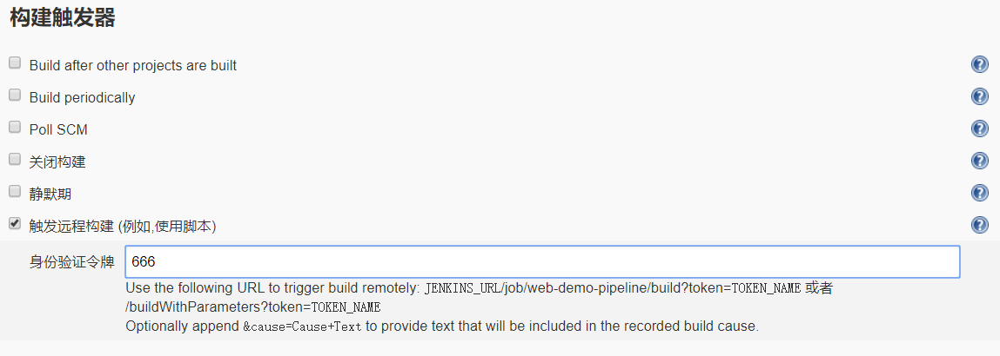

看下面的描述，意思就是设置一个身份令牌，然后根据这个令牌与你Jenkins的地址，在`url`输入即可远程构建，**一般这个身份令牌需要加密**

2）测试

设置完后进行测试：<http://192.168.56.131:8888//job/web-demo-pipeline/build?token=666>

输入后，回到项目页面

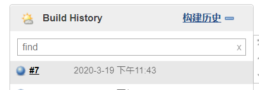

成功构建

#### 其他工程构建后触发

顾名思义，在其他工程构建后，本工程开始构建，这里我们直接拿之前创建的`ensee01`项目测试，这是之前测试用户权限时创建的空工程

1）构建

进入配置 =》 构建触发器 =》Build after other projects are build

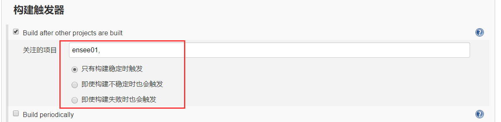

也可以选择一些约束

2）测试

我们构建`ensee01`项目，然后到`web-demo-pipeline`中查看

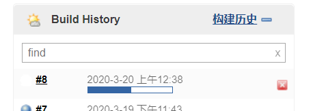

成功开始构建

#### 定时构建

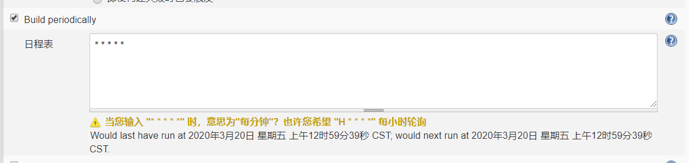

五个参数，从左至右是：分 时 日 月 周

一些例子：H表示形参

> 每30分钟构建：0/30 * * * *
>
> 每2小时构建：H H/2 * * *
>
> 每两小时一次，每周一到周五上午9点到下午5点构建一次
>
> H H(9-16)/2 * * 1-5 （因为是到5点，所以结尾是16点，构建时间可以是9:00-9:59）

#### 轮询SCM

它类似于定时构建，会指定时间进行扫描本地代码仓库，如果有变动便构建，没有则不进行

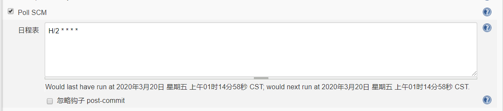

一般情况下，不建议使用，因为每次都会全局扫描整个项目代码，加大开销

### Git hook自动触发构建

刚刚我们看到了轮询SCM可以根据代码是否修改进行自动构建，还是比较方便的，但是其性能不佳，那么有没有更好的方案呢？就是Gitlab的webhook实现，代码push到仓库，便请求Jenkins进行自动构建。

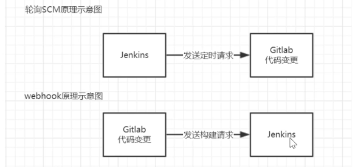

#### 安装Gitlab Hook插件

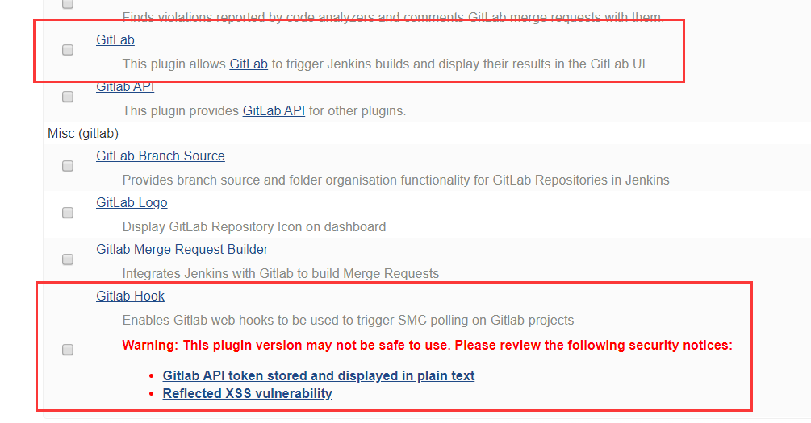

#### Jenkins设置自动构建

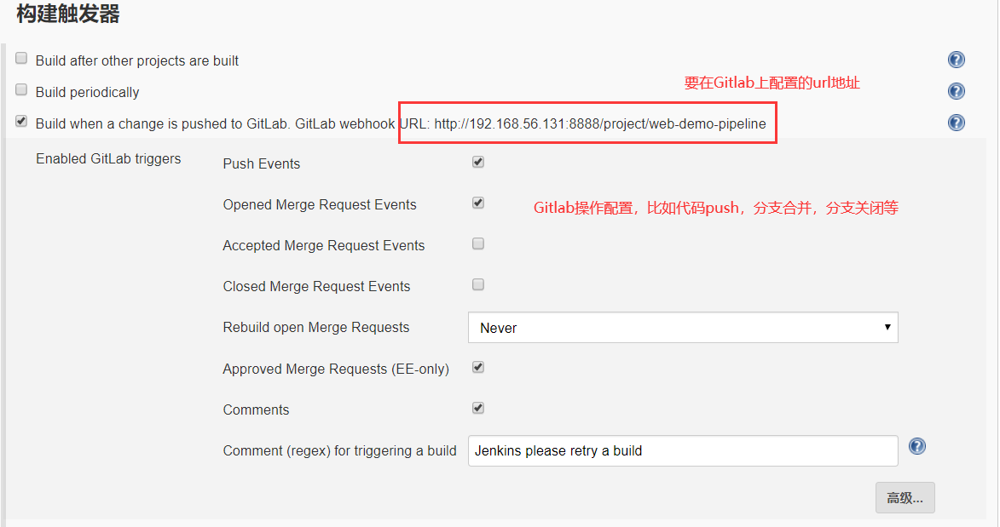

设置完成后，因为没有认证，所以我们需要进设置把对于/project请求的认证去掉

Jenkins =》 Manager Jenkins =》 configure System

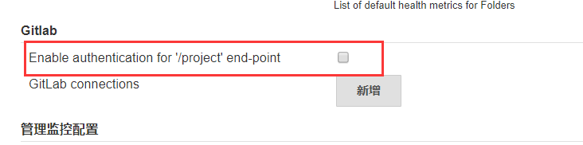

#### Gitlab配置webhook

3.1）开启webhook功能

Gitlab使用root账号登录，点击Admin Area =》 Settings =》 Network

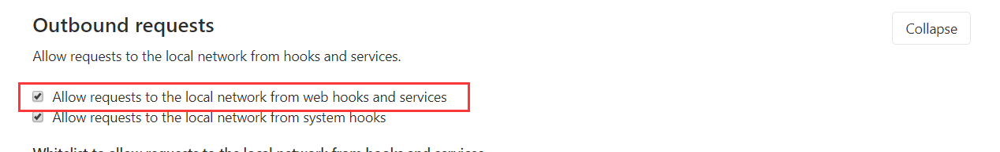

勾选保存

3.2）配置项目

进入项目 =》 左侧Settings =》 Integrations

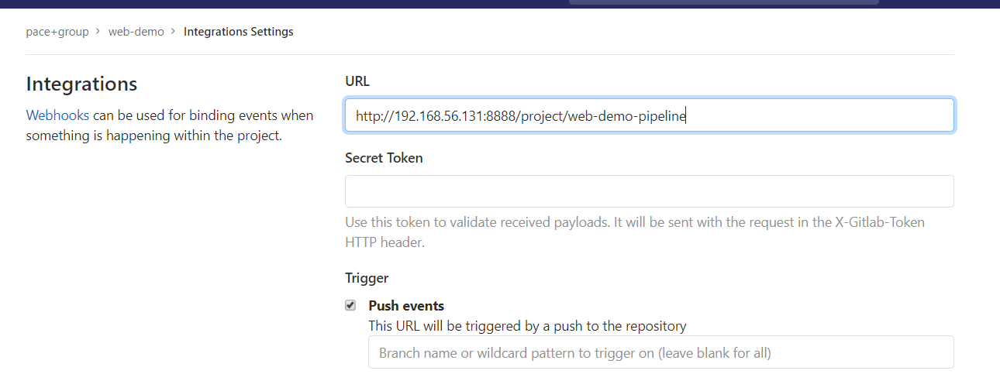

设置url，默认hook规则为代码提交时请求Jenkins

3.3）测试

在下方可以点击Test进行测试

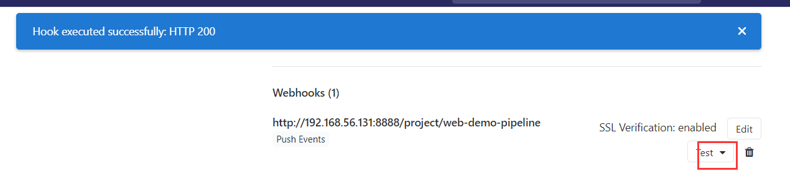

Jenkins成功构建，然后可以提交代码尝试

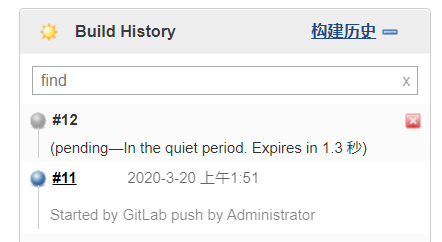

也开始了构建，说明配置成功

### Jenkins的参数化构建

在项目构建过程中，我们需要根据需要动态的输入一些参数，从而影响整个构建结果，这时我们可以使用Jenkins的参数化构建。

Jenkins支持相当多种类的参数：

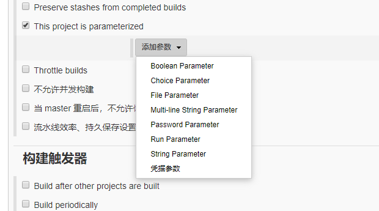

接着我们举个例子，比如有个需求是动态构建分支，当输入master时构建master分支，输入dev时构建dev分支。

#### 动态构建分支

1）首先我们需要先创建一个分支，并与master分支区分开来

创建分支并使用dev分支

> git checkout -b dev

修改`index.jsp`并提交

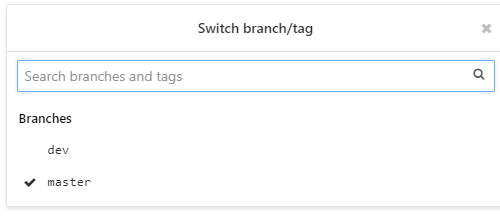

2）在Jenkins中配置参数

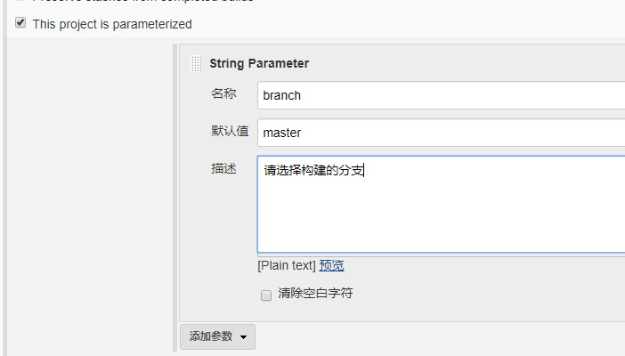

3）修改Jenkinsfile，Pipeline代码

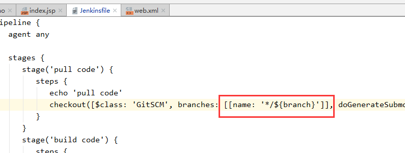

参数绑定方式和mybatis以及很多都相似，为`${}`

**注意！！修改后需要提交master和dev上，两个都要改成这样的**

4）使用参数构建

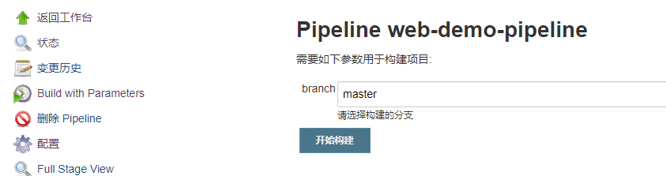

首先构建master

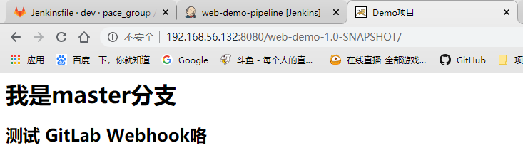

正确显示，然后构建dev

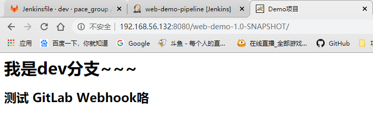

注意！！这里钩子方法自动持续集成时，是根据你修改的分支进行部署，比如你修改的dev分支，他就自动部署dev，修改master就自动部署master~！

### Jenkins配置邮箱服务器

Jenkins可以配置邮箱服务器，来发送构建结果

#### 安装Email Extension插件

Jenkins有默认的邮箱发送功能，但是使用这个插件可以更好的扩展，有更方便的功能

#### Jenkins设置邮箱相关参数

Jenkins =》 Manager Jenkins =》 Configuration System

1）系统管理员邮箱地址

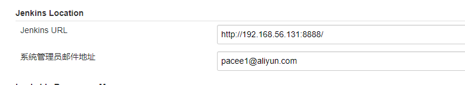

2）扩展插件邮箱设置

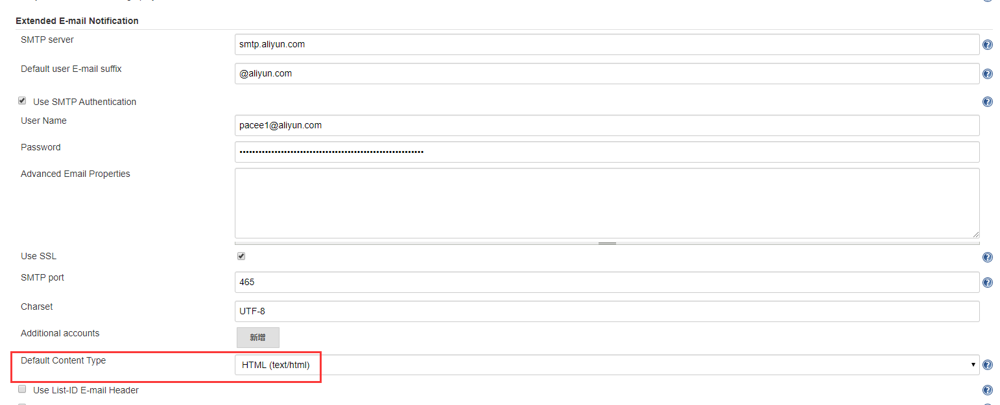

类型为HTML，注意

3）Jenkins自带邮箱设置

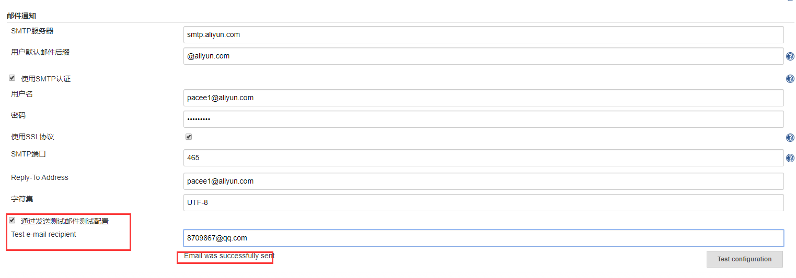

设置完后，可以测试发送邮件

#### Jenkins邮箱构建结果发送

##### 准备邮件内容

在项目根目录创建一个`email.html`邮件模板，模板直接百度一个即可

```html
<!DOCTYPE html>
<html>
<head>
<meta charset="UTF-8">
<title>${ENV, var="JOB_NAME"}-第${BUILD_NUMBER}次构建日志</title>
</head>
<body leftmargin="8" marginwidth="0" topmargin="8" marginheight="4" offset="0">
<table width="95%" cellpadding="0" cellspacing="0" style="font-size: 11pt; font-family: Tahoma, Arial, Helvetica, sans-serif">
<tr>
   <td>(本邮件是程序自动下发的，请勿回复！)</td>
</tr>
<tr>
   <td><h2><font color="#0000FF">构建结果 - ${BUILD_STATUS}</font></h2></td>
</tr>
<tr>
   <td><br /> <b><font color="#0B610B">构建信息</font></b> <hr size="2" width="100%" align="center" /></td> 
</tr> 
<tr>
<td> 
     <ul> 
          <li>项目名称&nbsp;：&nbsp;${PROJECT_NAME}</li>
          <li>构建编号&nbsp;：&nbsp;第${BUILD_NUMBER}次构建</li>
          <li>触发原因：&nbsp;${CAUSE}</li>
          <li>构建日志：&nbsp;<a href="${BUILD_URL}console">${BUILD_URL}console</a></li>
          <li>构建&nbsp;&nbsp;Url&nbsp;：&nbsp;<a href="${BUILD_URL}">${BUILD_URL}</a></li>
          <li>工作目录&nbsp;：&nbsp;<a href="${PROJECT_URL}ws">${PROJECT_URL}ws</a></li>
          <li>项目&nbsp;&nbsp;Url&nbsp;：&nbsp;<a href="${PROJECT_URL}">${PROJECT_URL}</a></li>
     </ul> 
</td> 
</tr>
<tr>
     <td>
          <b><font color="#0B610B">Changes Since Last Successful Build:</font></b>
          <hr size="2" width="100%" align="center" />
     </td> 
</tr> 
<tr> 
     <td>
         <ul> 
              <li>历史变更记录 : <a href="${PROJECT_URL}changes">${PROJECT_URL}changes</a></li>
         </ul></td> 
</tr>
<tr>
     <td>
          <b>Failed Test Results</b> <hr size="2" width="100%" align="center" />
     </td> 
</tr>
<tr>
     <td>
          <pre style="font-size: 11pt; font-family: Tahoma, Arial, Helvetica, sans-serif">$FAILED_TESTS</pre> <br />
     </td>
</tr>
<tr>
     <td><b><font color="#0B610B">构建日志 (最后 100行):</font></b> <hr size="2" width="100%" align="center" /></td>
</tr> <!-- <tr> <td>Test Logs (if test has ran): <a href="${PROJECT_URL}ws/TestResult/archive_logs/Log-Build-${BUILD_NUMBER}.zip">${PROJECT_URL}/ws/TestResult/archive_logs/Log-Build-${BUILD_NUMBER}.zip</a> <br /> <br /> </td> </tr> --> 
<tr>
<td>
     <textarea cols="80" rows="30" readonly="readonly" style="font-family: Courier New">${BUILD_LOG, maxLines=100}</textarea> 
</td> 
</tr>
</table>
</body>
</html>
```

##### 编写Jenkinsfile添加构建后发送邮件

```groovy
pipeline {
   agent any

   stages {
      stage('pull code') {
         steps {
            echo 'pull code'
            checkout([$class: 'GitSCM', branches: [[name: '*/${branch}']], doGenerateSubmoduleConfigurations: false, extensions: [], submoduleCfg: [], userRemoteConfigs: [[credentialsId: 'b54233ca-0569-427c-b82a-aad8dcbd0714', url: 'git@192.168.56.130:pace_group/web-demo.git']]])
         }
      }
      stage('build code') {
         steps {
            echo 'build code'
            sh label: '', script: 'mvn clean package'
         }
      }
      stage('publish code') {
         steps {
            echo 'publish code'
            deploy adapters: [tomcat8(credentialsId: '068f0e24-9c42-4c85-a83c-2f22210cffd9', path: '', url: 'http://192.168.56.132:8080/')], contextPath: null, war: 'target/*.war'
         }
      }
   }
   post {
       always {
            emailext(
                subject: '构建通知: ${PROJECT_NAME} - Build # ${BUILD_NUMBER} - ${BUILD_STATUS}!',
                body: '${FILE, path="email.html"}',
                to: '8709867@qq.com'
            )
    }
   }
}
```

在之前的基础上添加了post代码，意思就是在构建之后执行，可以在里面添加success，表示成功构建后执行，或者failure，失败构建后执行，这里我们选择always，即不管成功失败都执行，然后使用邮件扩展发送邮件

##### 测试

## SonarQube代码审查