# Jenkins安装和集成环境配置

## 持续集成流程说明

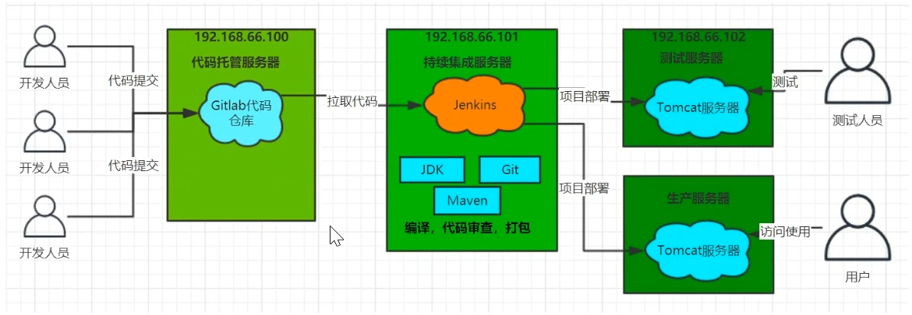

这次学习，我们会创建三台虚拟机，分别用作在上节说的必要组成服务器，为

- 代码托管服务器：Gitlab实现，存放代码
- 持续集成服务器：主要是Jenkins，次要JDK，Git，Maven，拉取代码整合打包
- 测试服务器：Tomcat服务，部署

持续集成流程为：

1. 程序员Commit代码到Gitlab上
2. Jenkins使用Git拉取新的代码，配合JDK Maven进行编译，代码测试，审查，打包工作
3. Jenkins全部完成将Jar或者War分发到测试服务器上，完成整个流程

### 服务器列表

三台Centos7的虚拟机：

| 名称           | IP             | 所需软件                                        |
| -------------- | -------------- | ----------------------------------------------- |
| 代码托管服务器 | 192.168.56.130 | Gitlab-12.4.2 （最好2G以上内存）                |
| 持续集成服务器 | 192.168.56.131 | Jenkins-2.190.3，JDK1.8，Maven3.6.3，Git，Sonar |
| 测试服务器     | 192.168.56.132 | JDK1.8,Tomcat8.5                                |

在环境安装搭建前，需要创建三个虚拟机，这里百度一下就可以

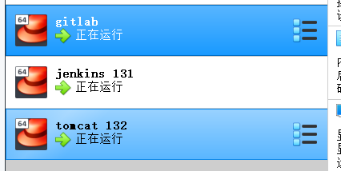

## GitLab服务器安装配置

GitLab的虚拟机最好分配多一点内存，比较吃内存

### GitLab介绍

gitlab和github差不多，都是代码托管的网站，两者区别是：

- github创建私有服务是收费的，免费使用只能将代码存放到他的服务器上
- gitlab可以免费创建私有服务器

### GitLab安装

1.安装相关依赖

> yum -y install policycoreutils openssh-server openssh-clients postfix
>
>  yum install policycoreutils-python -y 

2.启动ssh服务并设置开机启动

> systemctl enable sshd && sudo systemctl start sshd

3.设置postfix开启自启并启动，postfix支持gitlab发信功能

> systemctl enable postfix && systemctl start postfix

4.开放ssh以及http服务，重新加载防火墙

> firewall-cmd --add-service=ssh --permanent
>
> firewall-cmd --add-service=http--permanent
>
> firewall-cmd --reload

如果已经关闭防火墙就不需要操作，关闭防火墙命令：

>  systemctl stop firewalld.service 
>
>  systemctl disable firewalld.service  

5.下载gitlab安装

> yum -y install wget
>
> wget https://mirrors.tuna.tsinghua.edu.cn/gitlab-ce/yum/el6/gitlab-ce-12.4.2-ce.0.el6.x86_64.rpm
>
> 安装：rpm -i gitlab-ce-12.4.2-ce.0.el6.x86_64.rpm

6.修改gitlab配置

> vi /etc/gitlab/gitlab.rb

修改gitlab访问端口，由80改为82

```
external_url 'http://192.168.56.130:82'
nginx['listen_port'=82]
```

7.重载配置并开启gitlab

> gitlab-ctl reconfigure
>
> gitlab-ctl restart

8.把端口添加到防火墙

如果关闭防火墙就不需要了

> firewall-cmd --zone=public --add-port=82/tcp --permanent
>
> firewall-cmd --reload

这样GitLab服务器就安装完毕了，访问 http://192.168.56.130:82/ 测试

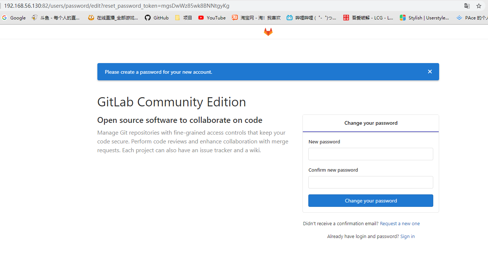

这里提示你第一次登陆需要更改密码，gitlab提供了**一个`root`根账号**，修改密码后登陆就可以进入主页面

### GitLab创建组、用户、项目

用户和项目就不用介绍了，这里说一下组的概念，一个私有GitLab服务器可以有多个组，每个组可以存放多个项目，不同的组可以表示公司不同的开发项目或者服务模块，比如腾讯公司，可能就有QQ组，微信组等等。

1）创建组

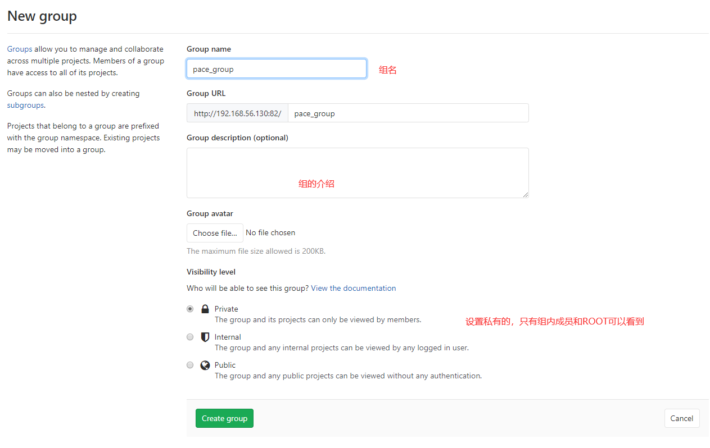

2）创建项目

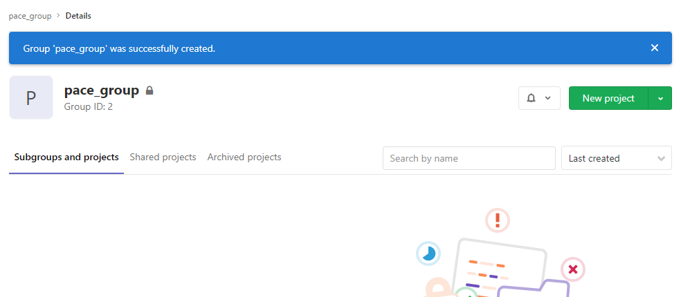

在组内点击new project按钮

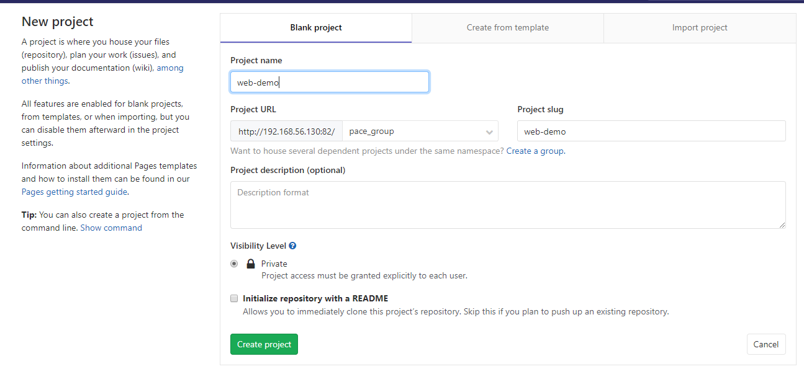

3）创建用户

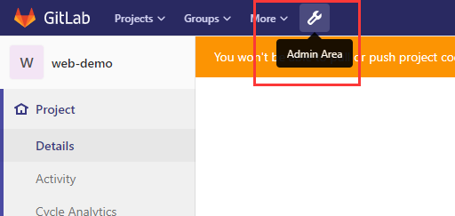

点击管理区域，在左侧Users列表添加用户

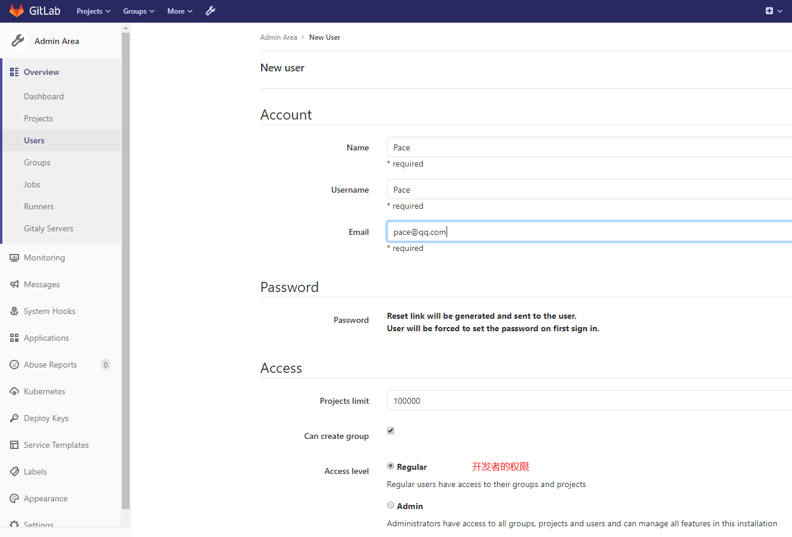

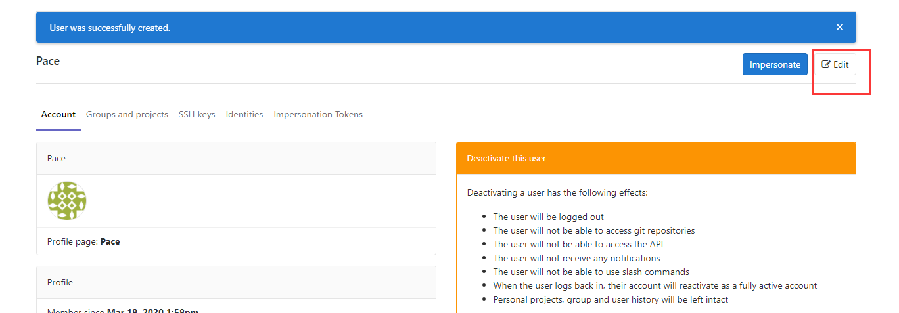

创建完后需要去edit设置一下密码

4）为项目添加成员

进入到项目页面，点击左侧的Members

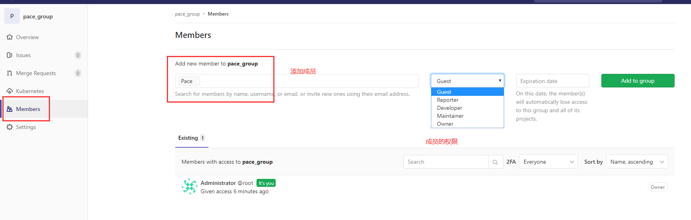

这里有5个权限：

- Guest：可以创建issue，发表评论，不能读写版本库，访客权限
- Reporter：可以克隆代码，不能提交，项目经理可以设置
- Developer：可以克隆也可以提交，push，普通的开发人员的权限
- Maintainer：Developer的基础上可以创建项目，添加tag，分支管理，编辑项目，添加项目成员，核心开发的权限
- Owner：可以设置项目访问权限，删除项目，迁移项目等等，开发组组长的权限

### GitLab使用

创建完项目后，我们就可以上传代码到上面了，这里就不详细说了，简单说下过程

创建一个项目，这里我创建了一个简单的web项目

```
git add .
git commit -m 'first'
git remote add xxx
git push -u origin master
```

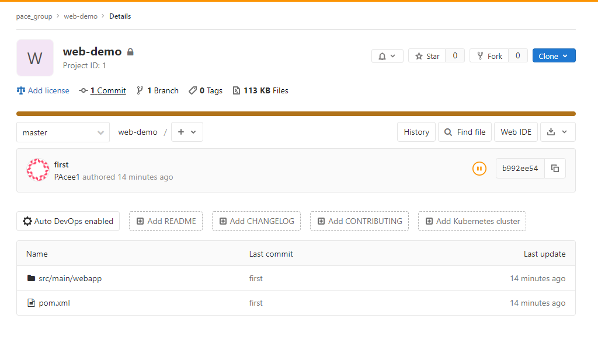

然后再GitLab上就可以看到文件代码已经上传上去了

到此我们的GitLab服务器已经搭建完成


## Jenkins服务器安装配置

### Jenkins安装

1）安装JDK

> yum install java-1.8.0-openjdk* -y

安装目录为：/usr/lib/jvm

2）安装Jenkins安装包

下载：https://jenkins.io/zh/download/，<https://pkg.jenkins.io/redhat-stable/>

下载jenkins-2.190.3-1.1.noarch.rpm

拷贝到服务器上进行安装

> rpm -i jenkins-2.190.3-1.1.noarch.rpm

3）修改Jenkins配置

> vi /etc/sysconfig/jenkins
>
> JENKINS_USER="root"
>
> JENKINS_PORT="8888"

4）启动Jenkins

> systemctl start jenkins

开机启动

> systemctl enable jenkins
>
> systemctl daemon-reload

5）关闭防火墙

> systemctl stop firewalld.service 
>
> systemctl disable firewalld.service  

6）浏览器访问

http://192.168.56.131:8888

7）获取并输入admin账户密码

需要从服务器中获取

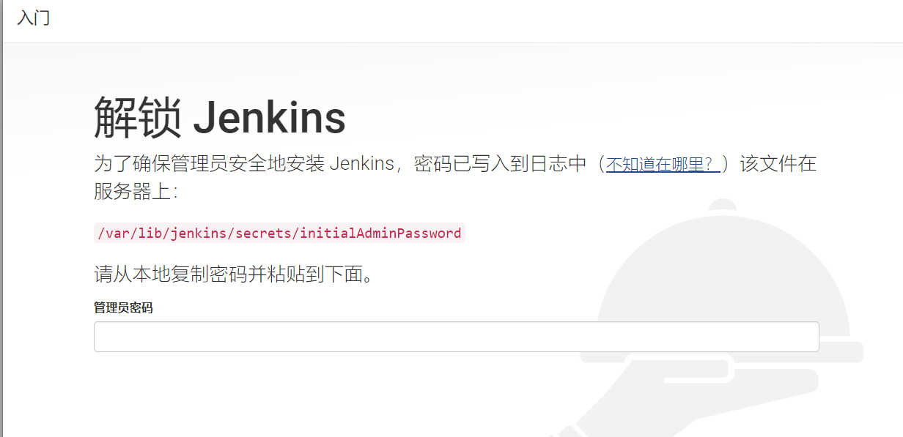

> cat /var/lib/jenkins/secrets/initialAdminPassword

8）跳过Jenkins插件安装

因为此时去Jenkins官网安装，速度非常慢，这里我们先跳过安装，然后进入后修改插件下载地址，切换镜像再进行安装。

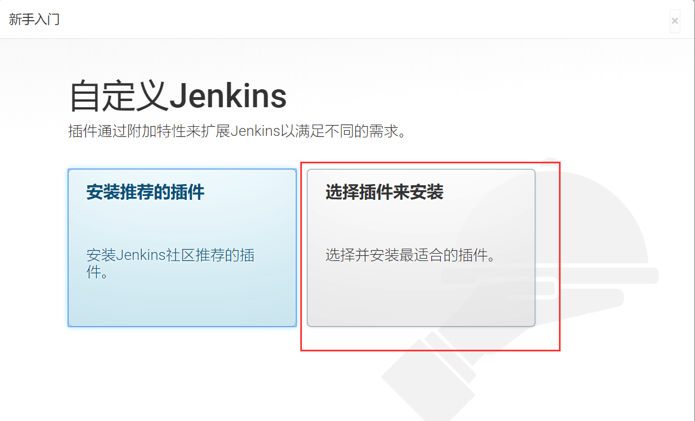

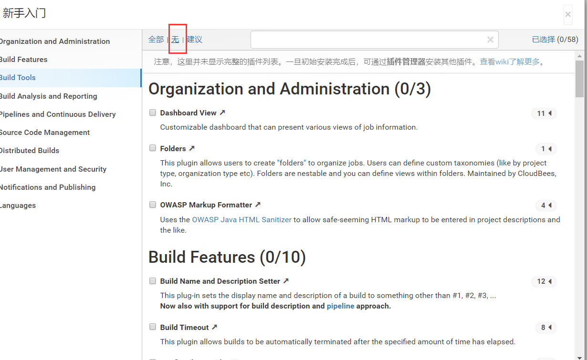

9）创建一个管理员用户

因为admin用户每次都需要去查看一下密码，所以这里会让我们创建一个管理员，创建完毕后可以进入Jenkins主页

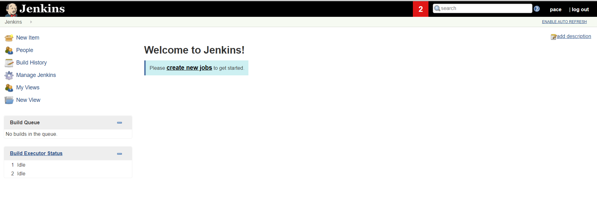

**Jenkins安装完成**

### Jenkins插件管理

Jenkins本身不提供很多功能，但是他有大量的插件可以基本满足全部需求，例如从Gitlab拉取代码，Maven构建等等。

#### 修改Jenkins插件下载地址

Jenkins国外官方插件下载速度非常慢，所以可以修改为国内镜像：

Jenkins =》 Manage Jenkins =》 Manage Plugins，点击Avaliable

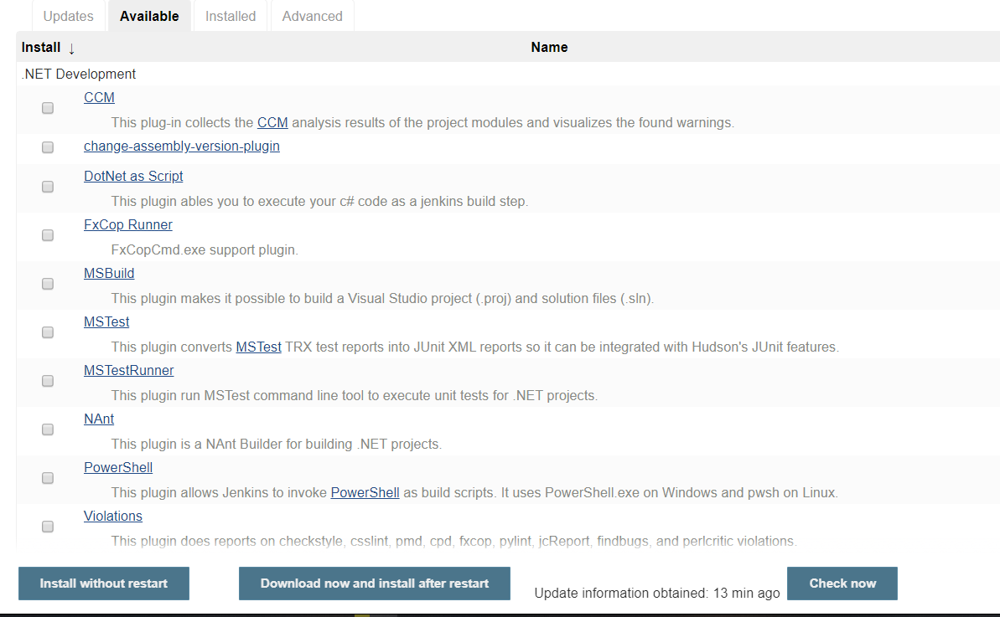

这样做的目的是，将插件列表下载到本地，然后修改此本地插件列表文件，修改其地址为国内地址：

> cd /var/lib/jenkins/updates
>
> sed -i 's/http:\/\/updates.jenkins-ci.org\/download/https:\/\/mirrors.tuna.tsinghua.edu.cn\/jenkins/g' default.json && sed -i 's/http:\/\/www.google.com/https:\/\/www.baidu.com/g' default.json

最后，点击页面上的Advanced，把Update state设置为清华大学镜像

> <https://mirrors.tuna.tsinghua.edu.cn/jenkins/updates/update-center.json>

重启Jenkins

> <http://192.168.56.131:8888/restart>

#### 安装中文汉化插件

Jenkins =》 Manage Jenkins =》 Manage Plugins，点击Avaliable，在搜索栏搜索"Chinese"

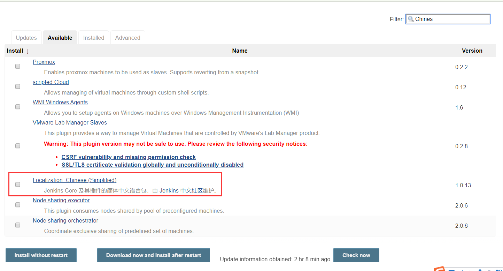

安装完后重启

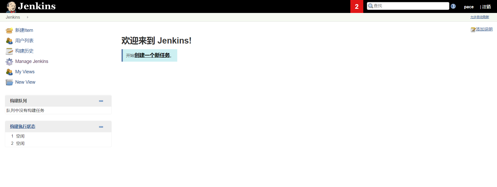

汉化成功

### Jenkins用户权限管理

Jenkins对于用户权限管理是非常粗粒度的，所以我们需要一个插件来帮助我们细粒度管理用户权限

Jenkins =》 Manage Jenkins =》 Manage Plugins，点击Avaliable，在搜索栏搜索"Role-based Authorization Strategy"，进行安装

安装完成后去启用此权限插件：Jenkins =》 Manage Jenkins =》Configure Global Security

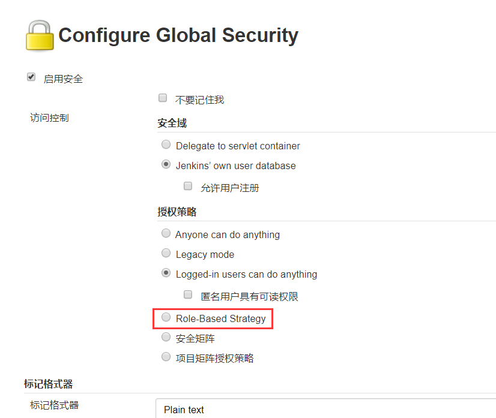

#### 添加角色

Jenkins =》 Manage Jenkins =》Manage and Assign Roles =》 Manage Roles

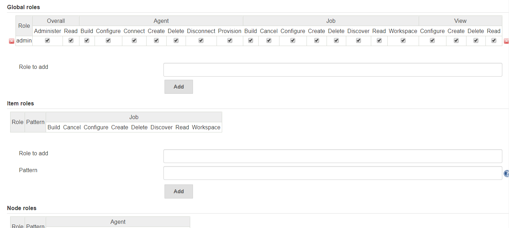

- Global roles：全局角色，对于整个Jenkins的管理
- Item roles：项目角色，对于项目的管理
- Node roles：节点角色，管理Jenkins集群的，主从

这里我们添加一个Global roles和两个Item roles

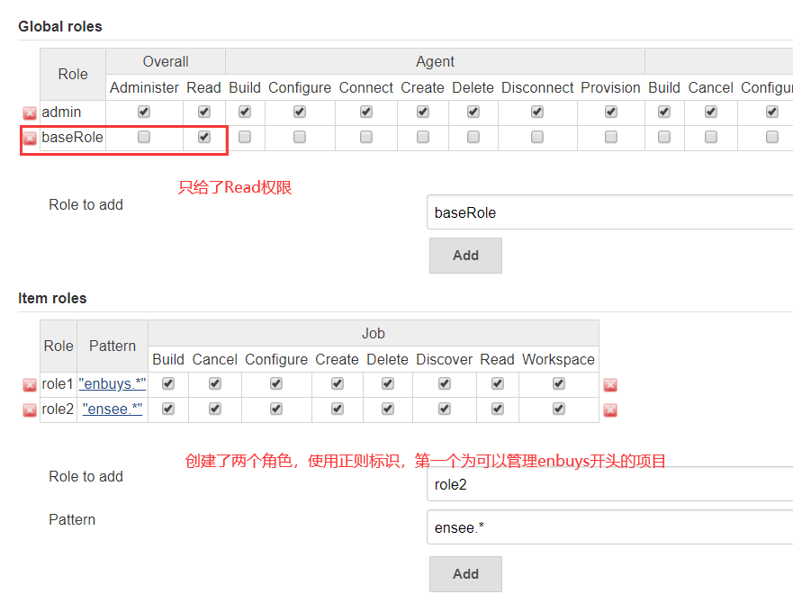

baseRole表示拥有Jenkins基本功能的权限，是未来分配给角色使用的，而不是直接给他们admin权限

#### 添加用户并分配角色

Jenkins =》 Manage Jenkins =》Manage Users =》 新建用户

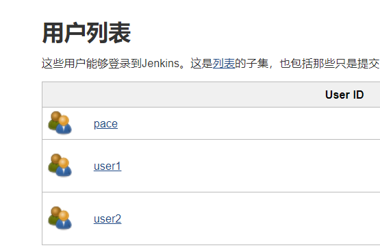

新建完两个用户，这时可以重新登录，会发现直接使用user1登录是不能看到任何信息的，因为没有任何权限，所以这里我们要为其分配角色

Jenkins =》 Manage Jenkins =》Manage and Assign Roles =》 Assign Roles

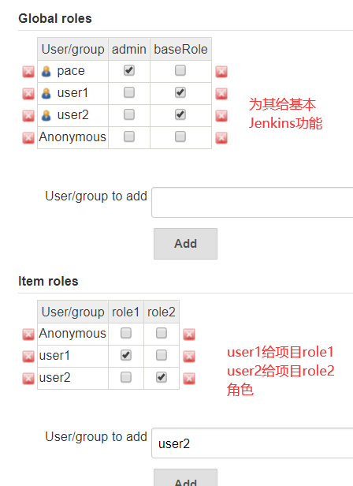

为了更好的演示，这里我们创建两个Item来测试权限

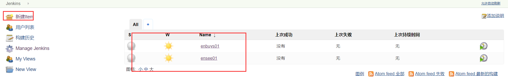

然后我们分别使用user1，user2登录，查看效果

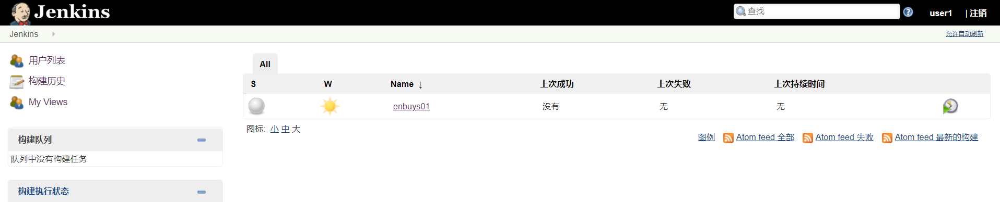

只能看到所拥有权限的项目

### Jenkins凭证管理

Jenkins凭证管理是什么？凭证就是Jenkins与第三方应用所需使用的秘钥，比如拉取Gitlab代码就需要Gitlab密码，以及Docker的密码等等，这些凭证都需要加密保护，所以我们需要凭证管理。

#### 凭证插件安装

1）安装Credentials Binding插件

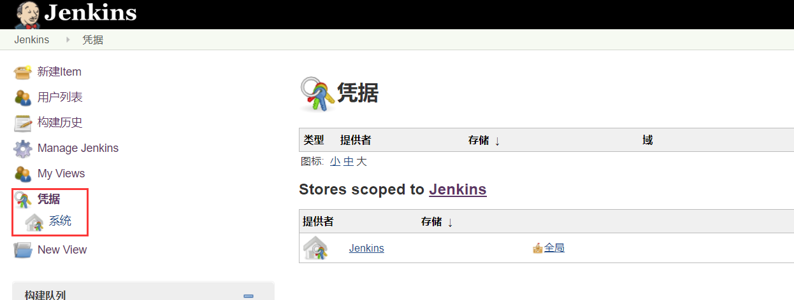

安装完成左侧出现一个凭证按钮

2）安装Git插件以及在服务器上安装Git

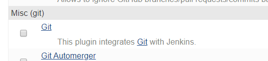

服务器安装Git

> yum install git -y
>
> git --version 查看版本

#### 普通用户密码凭证

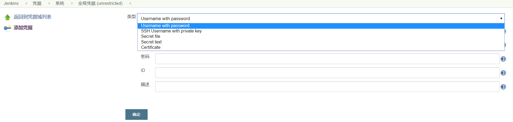

点击全局，添加凭证后可以看到有五种凭证类型：

- Username with password：普通用户名密码凭证
- SSH Username with private key：SSH方式连接的凭证
- Secret file：一些使用文件做密码的凭证
- Secret text：文本凭证
- Certificate：证书类型，不常用

添加之前创建的Gitlab用户密码凭证

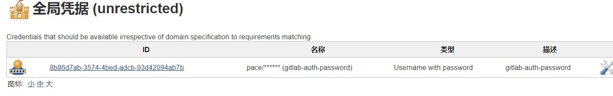

创建完私钥后，我们可以点击之前创建的`enbuys01项目`，然后点击左侧`管理`，修改源码管理为git方式：

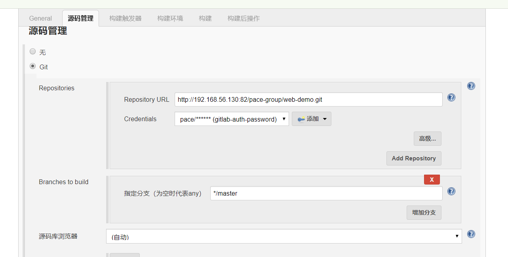

应用保存后，可以点击左侧`Build Now`按钮，进行代码拉取尝试

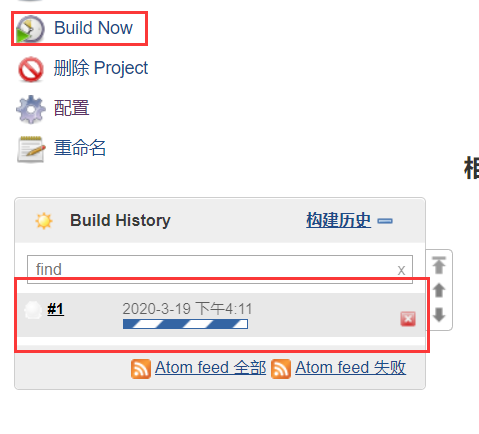

构建完毕可以点击`#1位置`，进入看控制台日志

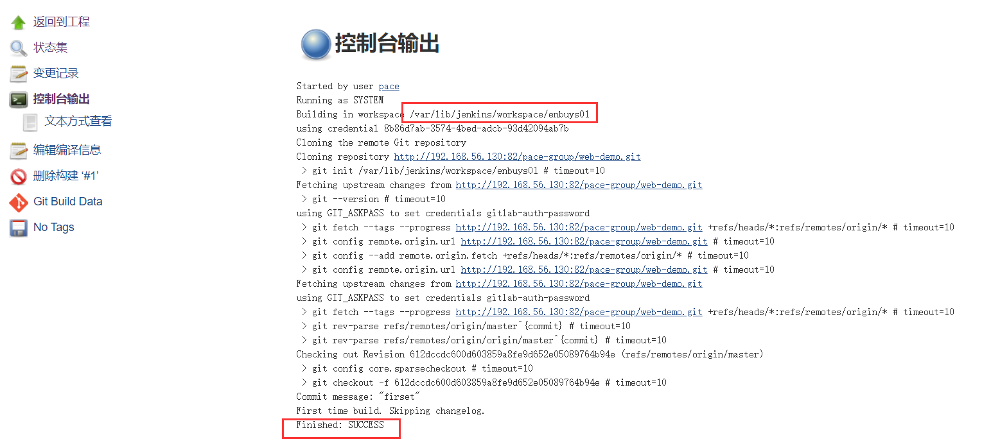

构建成功，并且把代码保存到`/var/lib/jenkins/workspace/enbuys01`中

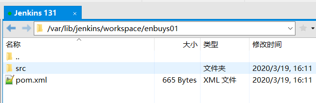

#### SSH私钥凭证

SSH免密登录，是使用非对称加密，用户保留私钥，Gitlab保留公钥，用户信息私钥加密后，Gitlab使用公钥校验，即可实现免密登录

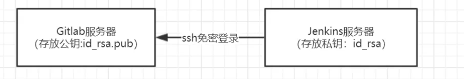

1）生成公私钥（这里使用root用户）

> ssh-keygen -t rsa
>
> cd /root/.ssh

默认存放在此路径下

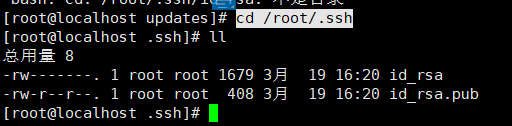

2）将公钥保存到Gitlab上

点击用户头像 =》 Settings =》SSH keys ，然后复制公钥到输入框，公钥为pub结尾的

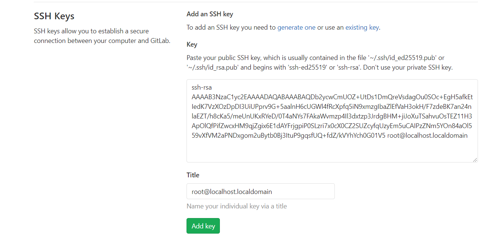

3）Jenkins生成SSH私钥凭证


4）测试

这里我们新创建一个test01项目，然后配置其源码管理为ssh方式

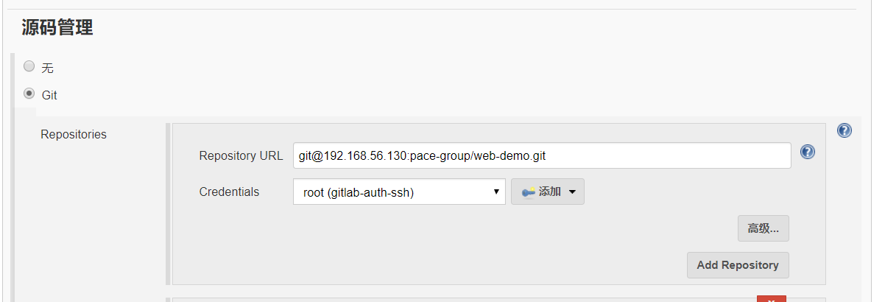

然后可以像密码凭证一样构建测试

### Maven安装和配置

在Jenkins集成服务器中，我们需要Maven进行打包编译项目

#### Maven安装

1）上传Maven包到服务器上安装

> tar -zxvf apache-maven-3.6.3-bin.tar.gz 解压
>
> mkdir -p /opt/maven 创建目录
>
> mv apache-maven-3.6.3/* /opt/maven 移动

2）配置环境变量

> vi /etc/profile

```
export JAVA_HOME=/usr/lib/jvm/java-1.8.0-openjdk
export MAVEN_HOME=/opt/maven
export PATH=$PATH:$JAVA_HOME/bin:$MAVEN_HOME/bin
```

> source /etc/profile
>
> mvn -v

3）修改Maven的`setting.xml`

使用阿里云私服，速度更快

> mkdir /root/repo
>
> vi /opt/maven/conf/settings.xml

本次仓库修改：`<localRepository>/root/repo</localRepository>`

添加阿里云私服：

```xml
<mirror>
    <id>AliMaven</id>
    <name>aliyun maven</name>
    <url>http://maven.aliyun.com/nexus/content/groups/public/</url>
    <mirrorOf>central</mirrorOf>        
</mirror>
```

#### Jenkins全局配置Maven和JDK

1）添加全局工具

Jenkins =》 Manage Jenkins =》 Global Tool Configuration

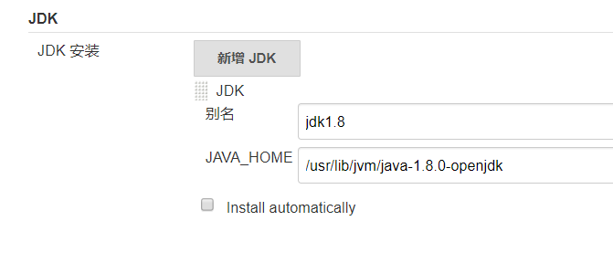

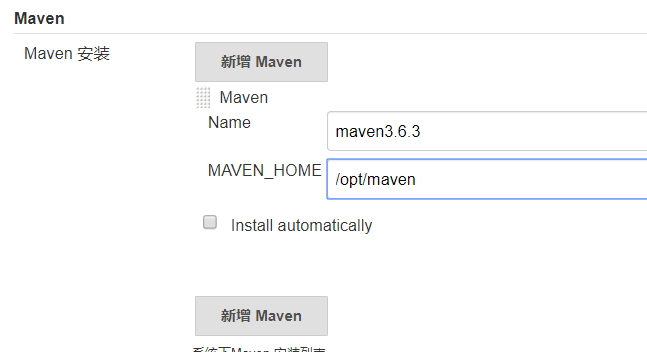

2）添加全局变量

意思和之前配置环境变量一样，可以在Jenkins任何地方使用Maven和java

Jenkins =》 Manage Jenkins =》 Configuration System


**注意，这里名字一定要写的一模一样，要不然可能出问题**

#### 测试Maven是否配置成功

在之前创建的test01项目上配置，Maven构建Shell脚本：

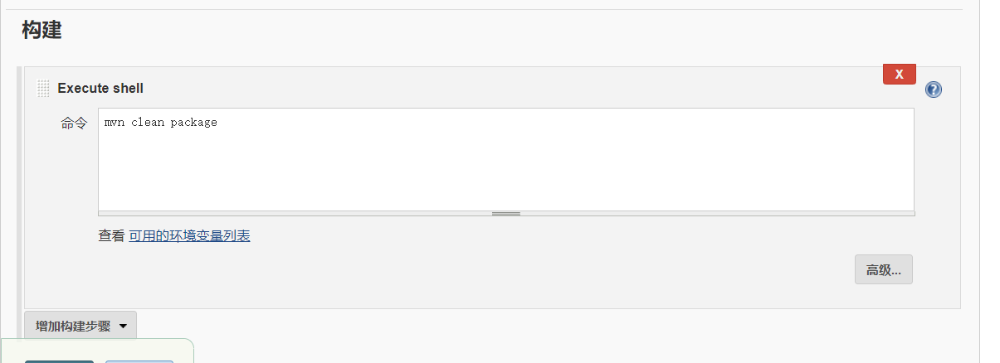

然后进行Build Now，第一次使用要下载很多依赖包，需要等的久一点

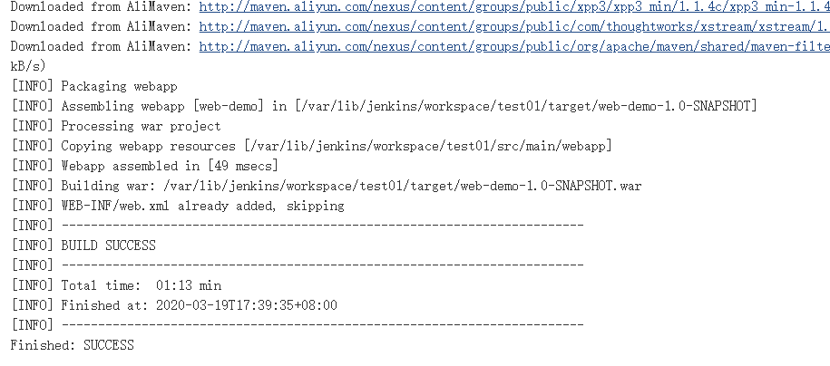

控制台输出Build完成，查看服务器项目位置

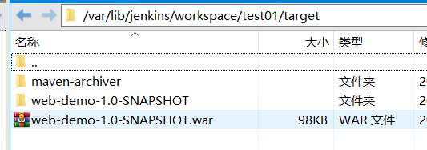

成功打出War包


## Tomcat服务器安装配置

### Tomcat安装

1）关闭防火墙

> systemctl stop firewalld.service 
>
> systemctl disable firewalld.service  

2）安装Tomcat

把Tomcat压缩包上传到服务器上

> yum install java-1.8.0-openjdk* -y
>
> tar -zvxf apache-tomcat-8.5.53.tar.gz
>
> mkdir -p /opt/tomcat
>
> mv apache-tomcat-8.5.53/* /opt/tomcat
>
> /opt/tomcat/bin/startup.sh

3）访问测试

http://192.168.56.132:8080

### Tomcat配置权限

默认情况下，Tomcat是没有配置用户角色与权限的

因为我们需要Jenkins集成服务器将打包好的jar或war包放到Tomcat服务器中，所以使用Tomcat服务器中的用户权限，让Jenkins有权限发送文件，所以我们需要配置：

> vi /opt/tomcat/conf/tomcat-users.xml

```xml
<tomcat-users>
    <role rolename="tomcat"/>
    <role rolename="role1"/>
    <role rolename="manager-script"/>
    <role rolename="manager-gui"/>
    <role rolename="manager-status"/>
    <role rolename="admin-gui"/>
    <role rolename="admin-script"/>
    <user username="tomcat" password="tomcat" roles="manager-gui,manager-script,tomcat,admin_gui,admin-script"/>
</tomcat-users>
```

用户名和密码都是 tomcat

注意：为了能够刚才配置的用户登录Tomcat，还需以下配置：

> vi /opt/tomcat/webapps/manager/META-INF/context.xml

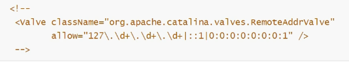

把这行注释掉

重启tomcat测试，访问<http://192.168.56.132:8080/manager/html>，输入用户名密码tomcat


成功访问

### Jenkins配置Tomcat

Tomcat安装配置完后，Jenkins想把war或者jar放到Tomcat中，还需要添加插件和凭证

1）添加Deploy to container插件

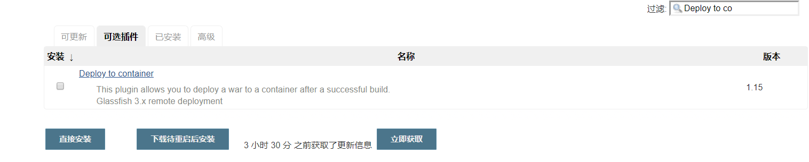

2）添加Tomcat凭证

用户名密码凭证，就是我们刚刚设置的 tomcat

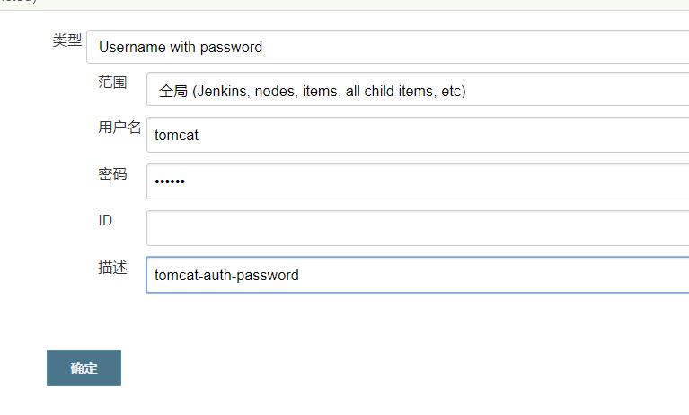

**到此，我们三台服务器就准备完毕**