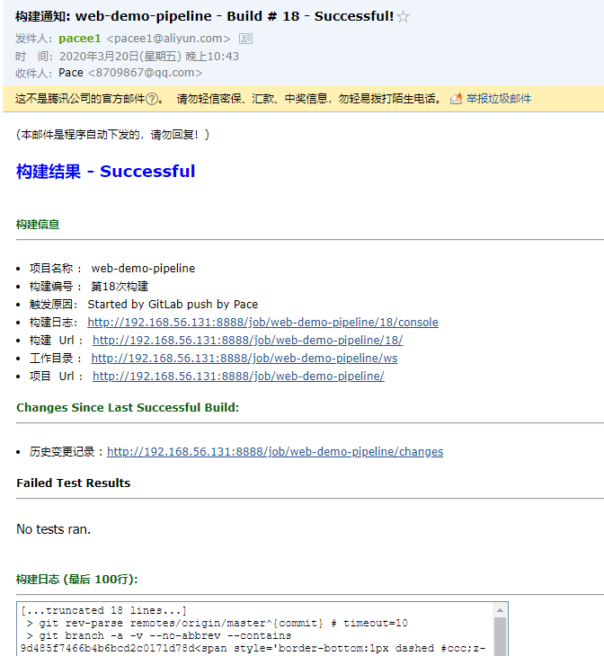

# Jenkins项目构建细节

## Jenkins常见的构建触发器

在我们之前构建项目的时候，都是手动点击Build Now按钮进行构建，而构建触发器的作用就是在某些场景下自动构建，而不是手动点击Build Now按钮

Jenkins内置了4种常用的触发器：

- 触发远程构建
- 其他工程构建后触发（Build after other projects are build）
- 定时构建（build periodically）
- 轮询SCM（Poll SCM）

### 触发远程构建

1）构建

进入配置 =》 构建触发器 =》 触发远程构建


看下面的描述，意思就是设置一个身份令牌，然后根据这个令牌与你Jenkins的地址，在`url`输入即可远程构建，**一般这个身份令牌需要加密**

2）测试

设置完后进行测试：<http://192.168.56.131:8888//job/web-demo-pipeline/build?token=666>

输入后，回到项目页面


成功构建

### 其他工程构建后触发

顾名思义，在其他工程构建后，本工程开始构建，这里我们直接拿之前创建的`ensee01`项目测试，这是之前测试用户权限时创建的空工程

1）构建

进入配置 =》 构建触发器 =》Build after other projects are build


也可以选择一些约束

2）测试

我们构建`ensee01`项目，然后到`web-demo-pipeline`中查看


成功开始构建

### 定时构建


五个参数，从左至右是：分 时 日 月 周

一些例子：H表示形参

> 每30分钟构建：0/30 * * * *
>
> 每2小时构建：H H/2 * * *
>
> 每两小时一次，每周一到周五上午9点到下午5点构建一次
>
> H H(9-16)/2 * * 1-5 （因为是到5点，所以结尾是16点，构建时间可以是9:00-9:59）

### 轮询SCM

它类似于定时构建，会指定时间进行扫描本地代码仓库，如果有变动便构建，没有则不进行


一般情况下，不建议使用，因为每次都会全局扫描整个项目代码，加大开销

## Git hook自动触发构建

刚刚我们看到了轮询SCM可以根据代码是否修改进行自动构建，还是比较方便的，但是其性能不佳，那么有没有更好的方案呢？就是Gitlab的webhook实现，代码push到仓库，便请求Jenkins进行自动构建。


### 安装Gitlab Hook插件


### Jenkins设置自动构建


设置完成后，因为没有认证，所以我们需要进设置把对于/project请求的认证去掉

Jenkins =》 Manager Jenkins =》 configure System


### Gitlab配置webhook

3.1）开启webhook功能

Gitlab使用root账号登录，点击Admin Area =》 Settings =》 Network


勾选保存

3.2）配置项目

进入项目 =》 左侧Settings =》 Integrations


设置url，默认hook规则为代码提交时请求Jenkins

3.3）测试

在下方可以点击Test进行测试


Jenkins成功构建，然后可以提交代码尝试


也开始了构建，说明配置成功

## Jenkins的参数化构建

在项目构建过程中，我们需要根据需要动态的输入一些参数，从而影响整个构建结果，这时我们可以使用Jenkins的参数化构建。

Jenkins支持相当多种类的参数：


接着我们举个例子，比如有个需求是动态构建分支，当输入master时构建master分支，输入dev时构建dev分支。

### 动态构建分支

1）首先我们需要先创建一个分支，并与master分支区分开来

创建分支并使用dev分支

> git checkout -b dev

修改`index.jsp`并提交


2）在Jenkins中配置参数


3）修改Jenkinsfile，Pipeline代码


参数绑定方式和mybatis以及很多都相似，为`${}`

**注意！！修改后需要提交master和dev上，两个都要改成这样的**

4）使用参数构建


首先构建master


正确显示，然后构建dev


注意！！这里钩子方法自动持续集成时，是根据你修改的分支进行部署，比如你修改的dev分支，他就自动部署dev，修改master就自动部署master~！

## Jenkins配置邮箱服务器

Jenkins可以配置邮箱服务器，来发送构建结果

### 安装Email Extension插件

Jenkins有默认的邮箱发送功能，但是使用这个插件可以更好的扩展，有更方便的功能

### Jenkins设置邮箱相关参数

Jenkins =》 Manager Jenkins =》 Configuration System

1）系统管理员邮箱地址


2）扩展插件邮箱设置


类型为HTML，注意

3）Jenkins自带邮箱设置


设置完后，可以测试发送邮件

### Jenkins邮箱构建结果发送

#### 准备邮件内容

在项目根目录创建一个`email.html`邮件模板，模板直接百度一个即可

```html
<!DOCTYPE html>
<html>
<head>
<meta charset="UTF-8">
<title>${ENV, var="JOB_NAME"}-第${BUILD_NUMBER}次构建日志</title>
</head>
<body leftmargin="8" marginwidth="0" topmargin="8" marginheight="4" offset="0">
<table width="95%" cellpadding="0" cellspacing="0" style="font-size: 11pt; font-family: Tahoma, Arial, Helvetica, sans-serif">
<tr>
   <td>(本邮件是程序自动下发的，请勿回复！)</td>
</tr>
<tr>
   <td><h2><font color="#0000FF">构建结果 - ${BUILD_STATUS}</font></h2></td>
</tr>
<tr>
   <td><br /> <b><font color="#0B610B">构建信息</font></b> <hr size="2" width="100%" align="center" /></td> 
</tr> 
<tr>
<td> 
     <ul> 
          <li>项目名称&nbsp;：&nbsp;${PROJECT_NAME}</li>
          <li>构建编号&nbsp;：&nbsp;第${BUILD_NUMBER}次构建</li>
          <li>触发原因：&nbsp;${CAUSE}</li>
          <li>构建日志：&nbsp;<a href="${BUILD_URL}console">${BUILD_URL}console</a></li>
          <li>构建&nbsp;&nbsp;Url&nbsp;：&nbsp;<a href="${BUILD_URL}">${BUILD_URL}</a></li>
          <li>工作目录&nbsp;：&nbsp;<a href="${PROJECT_URL}ws">${PROJECT_URL}ws</a></li>
          <li>项目&nbsp;&nbsp;Url&nbsp;：&nbsp;<a href="${PROJECT_URL}">${PROJECT_URL}</a></li>
     </ul> 
</td> 
</tr>
<tr>
     <td>
          <b><font color="#0B610B">Changes Since Last Successful Build:</font></b>
          <hr size="2" width="100%" align="center" />
     </td> 
</tr> 
<tr> 
     <td>
         <ul> 
              <li>历史变更记录 : <a href="${PROJECT_URL}changes">${PROJECT_URL}changes</a></li>
         </ul></td> 
</tr>
<tr>
     <td>
          <b>Failed Test Results</b> <hr size="2" width="100%" align="center" />
     </td> 
</tr>
<tr>
     <td>
          <pre style="font-size: 11pt; font-family: Tahoma, Arial, Helvetica, sans-serif">$FAILED_TESTS</pre> <br />
     </td>
</tr>
<tr>
     <td><b><font color="#0B610B">构建日志 (最后 100行):</font></b> <hr size="2" width="100%" align="center" /></td>
</tr> <!-- <tr> <td>Test Logs (if test has ran): <a href="${PROJECT_URL}ws/TestResult/archive_logs/Log-Build-${BUILD_NUMBER}.zip">${PROJECT_URL}/ws/TestResult/archive_logs/Log-Build-${BUILD_NUMBER}.zip</a> <br /> <br /> </td> </tr> --> 
<tr>
<td>
     <textarea cols="80" rows="30" readonly="readonly" style="font-family: Courier New">${BUILD_LOG, maxLines=100}</textarea> 
</td> 
</tr>
</table>
</body>
</html>
```

#### 编写Jenkinsfile添加构建后发送邮件

```groovy
pipeline {
   agent any

   stages {
      stage('pull code') {
         steps {
            echo 'pull code'
            checkout([$class: 'GitSCM', branches: [[name: '*/${branch}']], doGenerateSubmoduleConfigurations: false, extensions: [], submoduleCfg: [], userRemoteConfigs: [[credentialsId: 'b54233ca-0569-427c-b82a-aad8dcbd0714', url: 'git@192.168.56.130:pace_group/web-demo.git']]])
         }
      }
      stage('build code') {
         steps {
            echo 'build code'
            sh label: '', script: 'mvn clean package'
         }
      }
      stage('publish code') {
         steps {
            echo 'publish code'
            deploy adapters: [tomcat8(credentialsId: '068f0e24-9c42-4c85-a83c-2f22210cffd9', path: '', url: 'http://192.168.56.132:8080/')], contextPath: null, war: 'target/*.war'
         }
      }
   }
   post {
       always {
            emailext(
                subject: '构建通知: ${PROJECT_NAME} - Build # ${BUILD_NUMBER} - ${BUILD_STATUS}!',
                body: '${FILE, path="email.html"}',
                to: '8709867@qq.com'
            )
    }
   }
}
```

在之前的基础上添加了post代码，意思就是在构建之后执行，可以在里面添加success，表示成功构建后执行，或者failure，失败构建后执行，这里我们选择always，即不管成功失败都执行，然后使用邮件扩展发送邮件

#### 测试



成功发送