# SonarQube代码审查

## SonarQube安装

SonarQube是一个用于管理代码质量的开放平台，可以快速定位代码中潜在的或隐藏的明显错误，支持java，C，C++，PYthon等。

官网：https://www.sonarqube.org

需要JDK，Mysql，这里我使用6.7.7版本的SonarQube

1）安装Mysql

>  yum -y install wget 
>
>  wget https://dev.mysql.com/get/mysql57-community-release-el7-11.noarch.rpm 
>
>  yum -y localinstall mysql57-community-release-el7-11.noarch.rpm 
>
>  yum -y install mysql-community-server 
>
>  启动
>
>  systemctl start mysqld 
>
>  开机启动
>
>  systemctl enable mysqld  
>
>  systemctl daemon-reload 

修改密码

>  cat /var/log/mysqld.log 查看默认密码

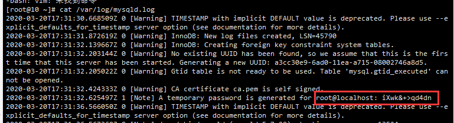

复制密码使用此密码登录

>  mysql -u root -p 

修改密码，mysql5.7默认密码策略要求密码必须是大小写字母数字特殊字母的组合，至少8位，因为我们不想这么复杂，所以修改密码规则

```bash
mysql> set global validate_password_policy=0;
mysql> set global validate_password_length=1;
mysql> ALTER USER 'root'@'localhost' IDENTIFIED BY 'root';
```

设置允许远程登录

```bash
mysql> GRANT ALL PRIVILEGES ON *.* TO 'root'@'%' IDENTIFIED BY 'root' WITH GRANT OPTION;
```

 防火墙开放3306端口 或关闭防火墙

>  firewall-cmd --zone=public --add-port=3306/tcp --permanent 
>
>  firewall-cmd --reload 

 配置mysql默认编码为utf-8 

> vi  /etc/my.cnf 
>
> character_set_server=utf8
>
> init_connect='SET NAMES utf8'

 重启MySQL 

>  systemctl restart mysqld 

2）安装SonarQube

在Mysql创建sonar数据库：

```bash
mysql> create database sonar;
```

下载sonar压缩包：https://www.sonarqube.org/downloads/

解压sonar，并设置权限

> yum install unzip -y
>
> unzip sonarqube-6.7.7.zip
>
> mkdir /opt/sonar
>
> mv sonarqube-6.7.7/* /opt/sonar
>
> useradd sonar (必须使用普通用户启动，不然会报错，和ElasticSearch一样)
>
> chown -R sonar. /opt/sonar/

修改sonar配置

> vi /opt/sonar/conf/sonar.properties
>
> 内容：
>
> sonar.jdbc.username=root
>
> sonar.jdbc.password=root123@
>
> sonar.jdbc.url=jdbc:mysql://localhost:3306/sonar?useUnicode=true&characterEncoding=utf8&rewriteBatchedStatements=true&useConfigs=maxPerformance&useSSL=false

注意: sonar默认监听9000端口，如果9000端口被占用，需要更改。

启动sonar，需要使用刚刚创建的sonar用户启动

> cd /opt/sonar
>
> su sonar /opt/sonar/bin/linux-x86-64/sonar.sh start 启动
>
> su sonar /opt/sonar/bin/linux-x86-64/sonar.sh status 查看状态
>
> su sonar /opt/sonar/bin/linux-x86-64/sonar.sh stop 关闭
>
> tail -f logs/sonar.log 查看日志

访问sonar：http://192.168.56.131:9000

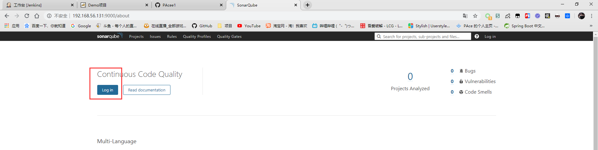

默认用户名密码是admin/admin

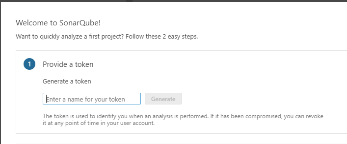

登录后会让你填写一个Token，会生成一个秘钥，这个很重要，和别的应用配合使用时需要用到，比如Jenkins，所以要保存下来：

>  pace: **3cf6390037054937483986713b7d62acb835bf9c** 

## Jenkins整合SonarQube

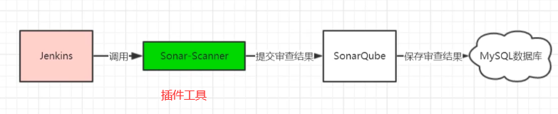

### 安装SonarQube Scanner插件

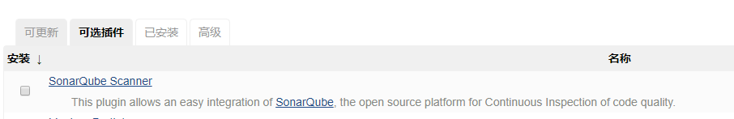

使用Jenkins在服务器安装SonarQube Scanner

Jenkins =》 Manager Jenkins =》 Global Tool Configuration

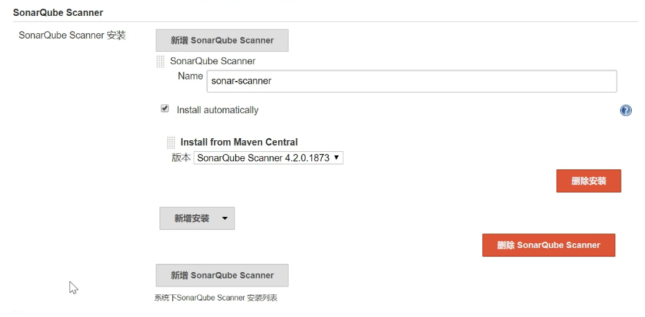


### 添加SonarQube凭证

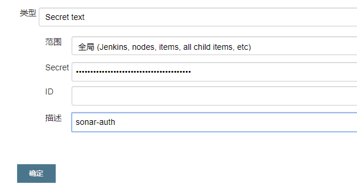

### Jenkins进行SonarQube配置

Jenkins =》 Manager Jenkins =》 Configure System

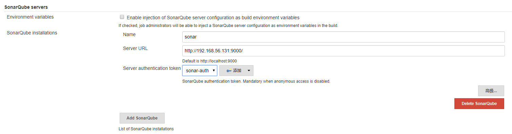

## 项目实现SonarQube代码审查

### 非Pipeline项目实现代码审查

使用我们之前配置的test-gitlab-ssh项目，这个项目是由自由风格构建的

在配置=》构建中，添加构建步骤=》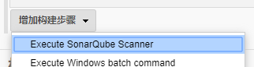，这里添加在之前写的Shell脚本后面。


```properties
# 配置项目key唯一
sonar.projectKey=test-gitlab-ssh
# 配置项目名称和版本
sonar.projectName=test-gitlab-ssh
sonar.projectVersion=1.0

#配置扫描的代码，全部扫描
sonar.sources=.
# 配置不扫描的代码
sonar.exclusions=**/test/**,**/target/**

# jdk版本
sonar.java.source=1.8
sonar.java.target=1.0

# 编码
sonar.sourceEncoding=UTF-8
```

这里我们先写在输入框中，将sonar配置，然后保存构建

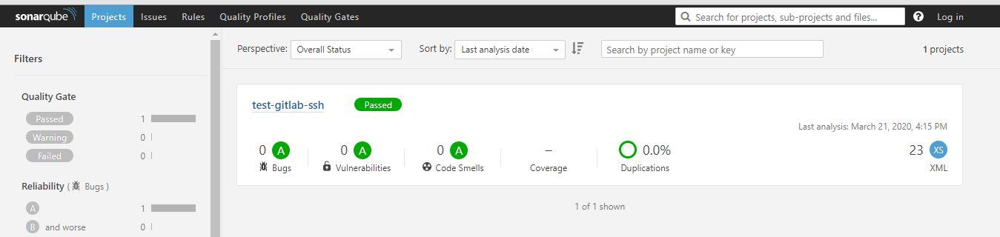

可以查看Sonar中，因为我们项目非常简单，所以没有任何问题

接着我们向项目中添加一些错误和冗余代码

```java
public class HelloWorld {

    public static void main(String[] args) {
        // 错误代码
        int i = 100/0;
        
        // 冗余代码
        int a = 1;
        a = 2;
    }
}
```

提交到git上重新构建，然后查看Sonar

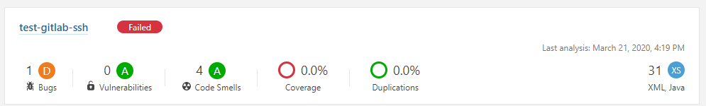

提示检查不合格，有1个bug和4个代码规范问题

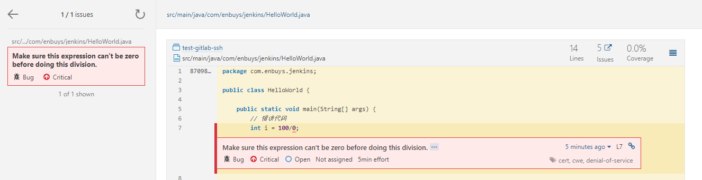

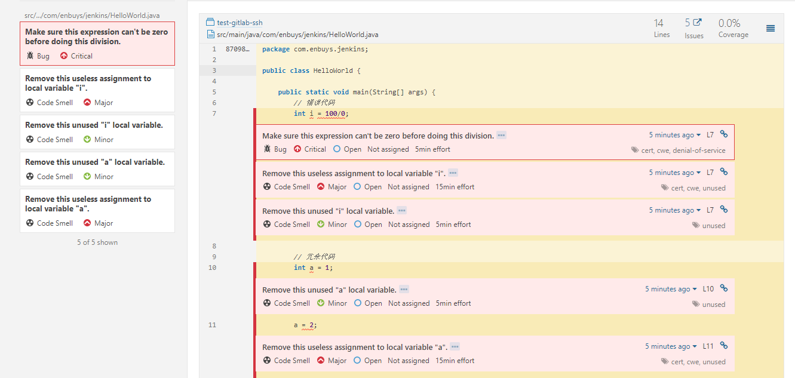

### Pipeline项目实现代码审查

1）项目添加sonar配置

首先我们之前是在输入框输入的sonar配置，现在我们要把它加到项目中

项目根目录新建`sonar-project.properties`，这个名字是固定的

```properties
# 配置项目key唯一
sonar.projectKey=web-demo-github
# 配置项目名称和版本
sonar.projectName=web-demo-github
sonar.projectVersion=1.0

#配置扫描的代码，全部扫描
sonar.sources=.
# 配置不扫描的代码
sonar.exclusions=**/test/**,**/target/**

# jdk版本
sonar.java.source=1.8
sonar.java.target=1.0

# 编码
sonar.sourceEncoding=UTF-8
```

2）修改pipeline脚本，添加Sonar

```groovy
stage('check code') {
    steps {
        echo 'check code'
        script {
            // 引入SonarQube Scanner工具，这里是我们在Jenkins全局工具中配置的名称
            scannerHome = tool 'sonar-scanner'
        }
        // 引入Sonar服务器环境，这里是我们Jenkins系统配置中Sonar的名称
        withSonarQubeEnv('sonar'){
            sh "${scannerHome}/bin/sonar-scanner"
        }
    }
}
```

这里可以添加在拉取代码后，也可以在打包后，看需要

修改完毕提交代码到git上

3）Build Now测试

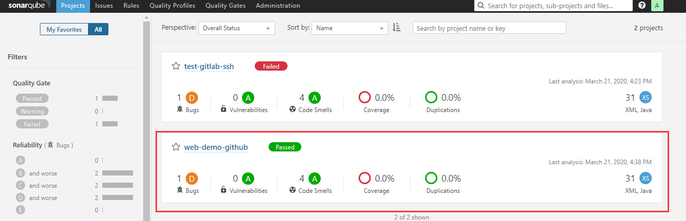

成功审查