# Jenkins基于Docker构建SpringCloud微服务

在上一节，我们已经把基本环境搭建完毕，包括

- 微服务项目本地测试
- 服务器安装Docker和Harbor
- 测试制作镜像，上传和下载镜像

接着我们按照流程图，进行构建

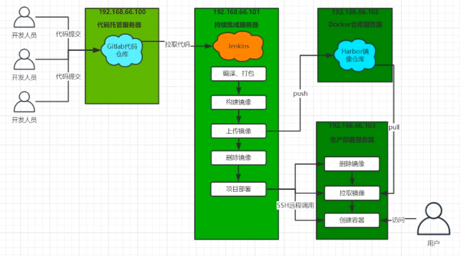

## 项目上传到Github上

这里我们已经上传了，项目地址为[GitHub](<https://github.com/PAcee1/jenkins-xcEdu-demo>)，[Gitee](<https://gitee.com/pacee/xc-edu-service>)

> git init
>
> git add .
>
> git commit -m 'init'
>
> git remote add origin master xxxUrl
>
> git push -u origin master

## 从Github拉取项目源码

1）首先我们创建一个流水线项目，名称为`xc-edu-service`

2）然后配置其Pipeline脚本为从项目中获取

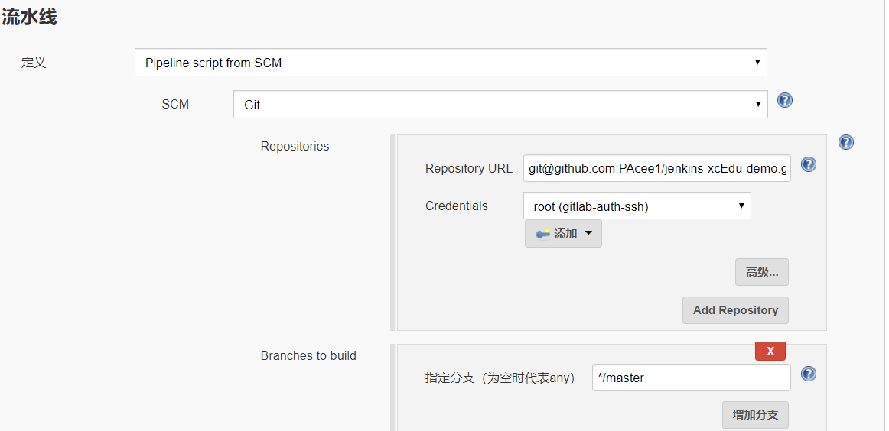

3）配置输入的参数，用于选择分支

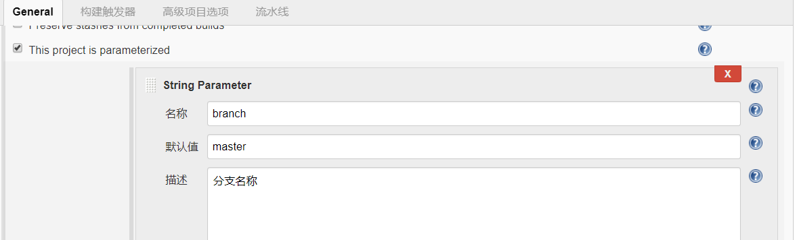

4）项目中添加Jenkinsfile

```groovy
// git凭证id
def git_auth = "e536df57-70be-4cab-ae06-448a0c1db793"
// git拉取地址
def git_url = "git@github.com:PAcee1/jenkins-xcEdu-demo.git"

node {

   stage('拉取代码') {
      checkout([$class: 'GitSCM', branches: [[name: '*/${branch}']],
       doGenerateSubmoduleConfigurations: false, extensions: [], submoduleCfg: [],
        userRemoteConfigs: [[credentialsId: "${git_auth}", url: "${git_url}"]]])
   }
}

```

5）构建测试

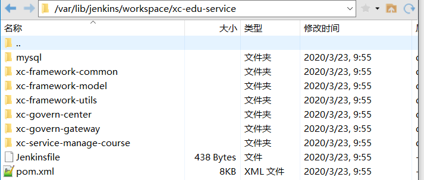

成功拉取

## 提交到SonarQube代码审查

1）配置输入参数，项目名称

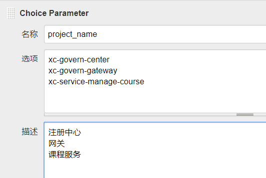

2）为每个微服务添加sonar-project.properties

```properties
# 配置项目key唯一
sonar.projectKey=xc-govern-center
# 配置项目名称和版本
sonar.projectName=xc-govern-center
sonar.projectVersion=1.0

#配置扫描的代码，全部扫描
sonar.sources=.
# 配置不扫描的代码
sonar.exclusions=**/test/**,**/target/**

# jdk版本
sonar.java.source=1.8
sonar.java.target=1.0
sonar.java.binaries=.

# 编码
sonar.sourceEncoding=UTF-8
```

注意修改projectKey和Name

3）修改Jenkinsfile构建脚本

```groovy
// git凭证id
def git_auth = "e536df57-70be-4cab-ae06-448a0c1db793"
// git拉取地址
def git_url = "git@github.com:PAcee1/jenkins-xcEdu-demo.git"

node {
   stage('拉取代码') {
       checkout([$class: 'GitSCM', branches: [[name: '*/${branch}']],
                 doGenerateSubmoduleConfigurations: false, extensions: [], submoduleCfg: [],
                 userRemoteConfigs: [[credentialsId: "${git_auth}", url: "${git_url}"]]])
   }
   stage('代码审查') {
       // 引入SonarQube Scanner工具，这里是我们在Jenkins全局工具中配置的名称
       def scannerHome = tool 'sonar-scanner'
       // 引入Sonar服务器环境，这里是我们Jenkins系统配置中Sonar的名称
       withSonarQubeEnv('sonar'){
           sh """
                cd ${project_name}
                ${scannerHome}/bin/sonar-scanner
             """
       }
  }
}
```

4）依次构建三个服务测试

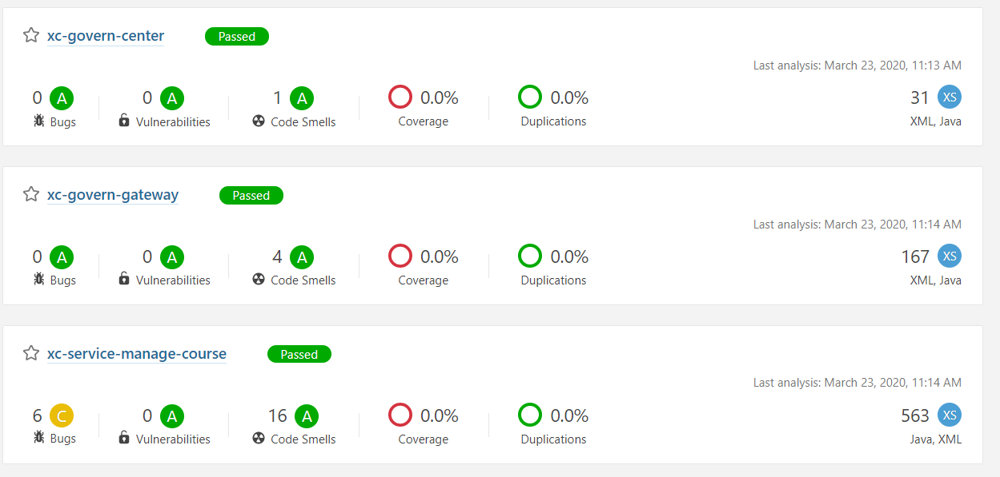

全部完成

## 编译打包微服务工程

首先，我们的工程是一个父工程，里面有多个子工程，并且子工程有的还相互依赖，所以这里我们在编译打包某个微服务工程之前，需要对整个父工程进行打包：

```groovy
// git凭证id
def git_auth = "e536df57-70be-4cab-ae06-448a0c1db793"
// git拉取地址
def git_url = "git@gitee.com:pacee/xc-edu-service.git"

node {
    stage('拉取代码') {
        checkout([$class: 'GitSCM', branches: [[name: '*/${branch}']],
                  doGenerateSubmoduleConfigurations: false, extensions: [], submoduleCfg: [],
                  userRemoteConfigs: [[credentialsId: "${git_auth}", url: "${git_url}"]]])
    }
    stage('代码审查') {
        // 引入SonarQube Scanner工具，这里是我们在Jenkins全局工具中配置的名称
        def scannerHome = tool 'sonar-scanner'
        // 引入Sonar服务器环境，这里是我们Jenkins系统配置中Sonar的名称
        withSonarQubeEnv('sonar'){
            sh """
                cd ${project_name}
                ${scannerHome}/bin/sonar-scanner
             """
        }
    }
    stage('编译打包父工程'){
        sh """
        mvn clean install
        """
    }
    stage('编译打包微服务') {
        sh "mvn -f ${project_name} clean package"
    }
}
```

## 使用Dockerfile编译，生成镜像

1）向微服务的pom中添加dockerfile插件

使用此插件，会在打包后进行镜像制作的操作

```xml
<plugin>
    <groupId>com.spotify</groupId>
    <artifactId>dockerfile-maven-plugin</artifactId>
    <version>1.3.6</version>
    <configuration>
        <repository>${project.artifactId}</repository>
        <buildArgs>
            <JAR_FILE>target/${project.build.finalName}.jar</JAR_FILE>
        </buildArgs>
    </configuration>
</plugin>
```

2）微服务根目录添加Dockerfile

```
FROM openjdk:8-jdk-alpine
ARG JAR_FILE
COPY ${JAR_FILE} eureka.jar
EXPOSE 11111
ENTRYPOINT ["java","-jar","/eureka.jar"]
```

注意，每个微服务需要做对应的修改

3）修改Jenkinsfile构建脚本，添加dockerfile构建操作

```groovy
// git凭证id
def git_auth = "e536df57-70be-4cab-ae06-448a0c1db793"
// git拉取地址
def git_url = "git@gitee.com:pacee/xc-edu-service.git"

node {
    stage('拉取代码') {
        checkout([$class: 'GitSCM', branches: [[name: '*/${branch}']],
                  doGenerateSubmoduleConfigurations: false, extensions: [], submoduleCfg: [],
                  userRemoteConfigs: [[credentialsId: "${git_auth}", url: "${git_url}"]]])
    }
    stage('代码审查') {
        // 引入SonarQube Scanner工具，这里是我们在Jenkins全局工具中配置的名称
        def scannerHome = tool 'sonar-scanner'
        // 引入Sonar服务器环境，这里是我们Jenkins系统配置中Sonar的名称
        withSonarQubeEnv('sonar'){
            sh """
                cd ${project_name}
                ${scannerHome}/bin/sonar-scanner
             """
        }
    }
    stage('编译打包父工程'){
        sh """
        mvn clean install
        """
    }
    stage('编译打包微服务，并使用docker插件制作镜像') {
        sh "mvn -f ${project_name} clean package dockerfile:build"
    }
}
```

注意最后的 `dockerfile:build`

4）构建三个微服务测试

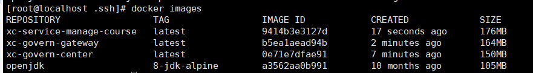

## 上传到Harbor镜像仓库

0）这里我们就需要使用到保存在132机器上的Harbor了，需要提前安装好Docker，Harbor，并且全部启动起来配置完毕。

1）添加Harbor凭证到Jenkins中，因为我们是私有项目，所以需要

2）根据凭证构建流水线用户名密码参数

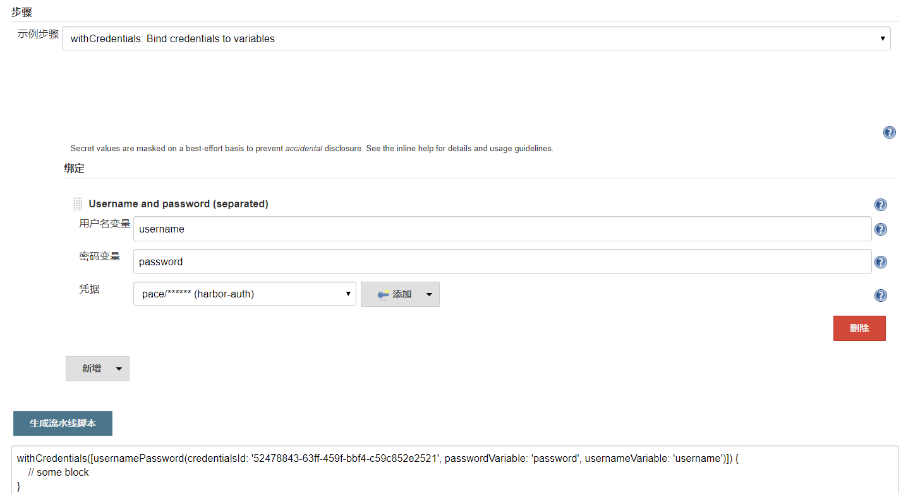

这样做是为了安全性

3）编写Jenkins构建脚本

```groovy
// git凭证id
def git_auth = "e536df57-70be-4cab-ae06-448a0c1db793"
// git拉取地址
def git_url = "git@gitee.com:pacee/xc-edu-service.git"
// 镜像版本
def tag = "latest"
// Harbor ip地址
def harbor_url = "192.168.56.132:85"
// Harbor 项目名称
def harbor_project = "xc-edu"
// Harbor 凭证
def harbor_auth = "52478843-63ff-459f-bbf4-c59c852e2521"

node {
    stage('拉取代码') {
        checkout([$class: 'GitSCM', branches: [[name: '*/${branch}']],
                  doGenerateSubmoduleConfigurations: false, extensions: [], submoduleCfg: [],
                  userRemoteConfigs: [[credentialsId: "${git_auth}", url: "${git_url}"]]])
    }
    stage('代码审查') {
        // 引入SonarQube Scanner工具，这里是我们在Jenkins全局工具中配置的名称
        def scannerHome = tool 'sonar-scanner'
        // 引入Sonar服务器环境，这里是我们Jenkins系统配置中Sonar的名称
        withSonarQubeEnv('sonar'){
            sh """
                cd ${project_name}
                ${scannerHome}/bin/sonar-scanner
             """
        }
    }
    stage('编译打包父工程'){
        sh """
        mvn clean install
        """
    }
    stage('编译打包微服务，并使用docker插件制作镜像') {
        sh "mvn -f ${project_name} clean package dockerfile:build"
    }
    stage('推送镜像到Harbor上') {
        // 定义镜像名称
        def imageName = "${project_name}:${tag}"

        // 为镜像打标签
        sh "docker tag ${imageName} ${harbor_url}/${harbor_project}/${imageName}"

        // 推送到Harbor上
        withCredentials([usernamePassword(credentialsId: "${harbor_auth}", passwordVariable: 'password', usernameVariable: 'username')]) {
            // 推送前先登录
            sh "docker login -u ${username} -p ${password} ${harbor_url}"

            // 上传镜像
            sh "docker push ${harbor_url}/${harbor_project}/${imageName}"
        }
    }
}
```

4）构建三个微服务，查看Harbor仓库

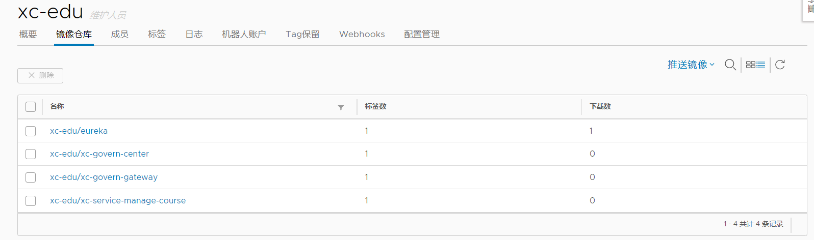

## 拉取镜像和发布应用

这里我们需要操作133服务器进行镜像拉取并发布，所以133要提前安装好Docker

0）准备工作

因为我们需要在Jenkins中进行远程调用133服务器，就需要向133中添加ssh

> 在131机器上：
>
> ssh-copy-id 192.168.56.133
>
> yes后输入密码
>
> 回到133机器：
>
> ll /root/.ssh

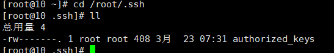

这样就成功了

1）Jenkins安装Publish Over SSH插件并进行配置

通过此插件，可以实现远程发送Shell命令，安装完后需要去系统配置

Jenkins => Manage Jenkins => Configuration System =>Publish over SSH

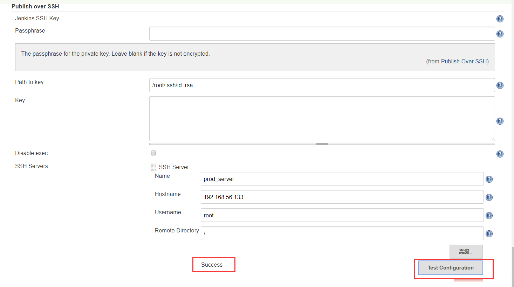

配置完成后，点击测试连通，显示Success说明连通成功

2）修改Jenkinsfile构建脚本

```groovy
stage('远程调用生产服务器拉取镜像') {
    sshPublisher(publishers: [
        sshPublisherDesc(
            configName: 'prod_server',
            transfers:[
                sshTransfer(
                    cleanRemote:false,
                    execCommand:"/opt/jenkins_shell/deploy.sh $harbor_url $harbor_project $project_name $tag $port"
                )
            ]
        )
    ]
                )
}
```

这里我们就是远程调用133机器上的一个shell脚本，并传入一些参数，其中port参数是没有的，我们之后要去Jenkins中配置输入参数

3）编写生成服务器上的shell脚本

```shell
#接收外部参数
harbor_url=$1
harbor_project_name=$2
project_name=$3
tag=$4
port=$5

imageName=$harbor_url/$harbor_project_name/$project_name:$tag

echo "$imageName"

# 查询容器是否存在，存在则删除
containerId=`docker ps -a | grep -w ${project_name}:${tag} | awk '{print $1}'`
if [ "$containerId" != "" ] ; then
	# 停掉容器
	docker stop $containerId
	# 删除容器
	docker rm $containerId
	echo "删除容器成功"
fi

# 查询镜像是否存在 存在则删除
imageId=`docker images | grep -w $project_name | awk '{print $3}'`
if [ "$imageId" != "" ] ; then
	# 删除镜像
	docker rmi -f $imageId
	echo "删除镜像成功"
fi

# 登录Harbor
docker login -u pace -p Pace1234 $harbor_url

# 下载镜像
docker pull $imageName

# 启动容器
docker run -di -p $port:$port $imageName

echo "容器启动成功"
```

然后存放到133机器上的`/opt/jenkins_shell`目录下

> mkdir /opt/jenkins_shell
>
> vi deploy.sh
>
> chmod +x  /opt/jenkins_shell/deploy.sh

4）在Jenkins中配置输入参数port

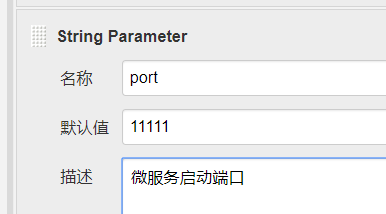

5）构建测试

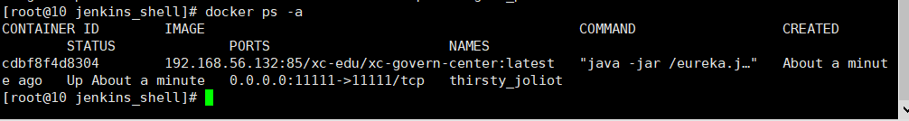

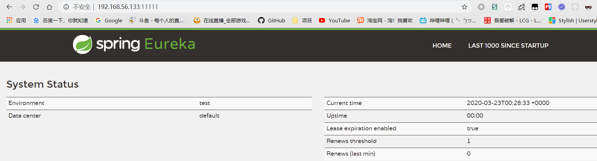

成功

## 部署和测试所有微服务

首先我们需要修改微服务的一些配置：

- xc-govern-center和xc-govern-gateway修改注册中心地址为192.168.56.133

  因为我们只是测试，所以不再进行一些配置抽取的操作了

- 修改xc-service-manage-course，注册中心地址，mysql地址，这里mysql地址使用宿主机的ip，因为已经搭建好mysql环境了，192.168.56.1

修改完毕后提交修改

然后构建三个微服务

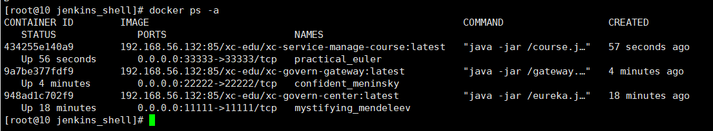

使用PostMan请求测试

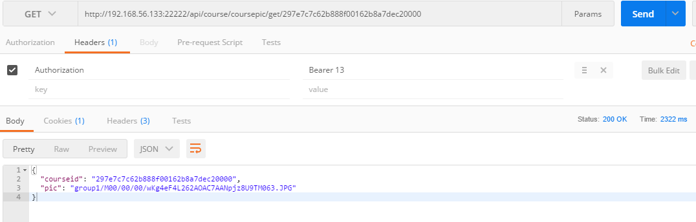

成功