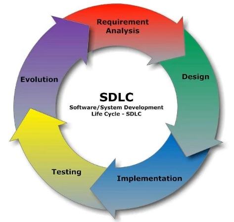
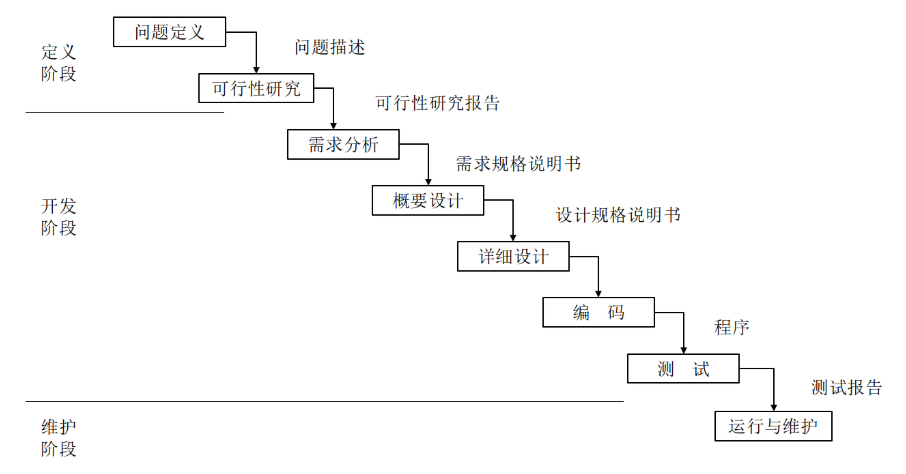
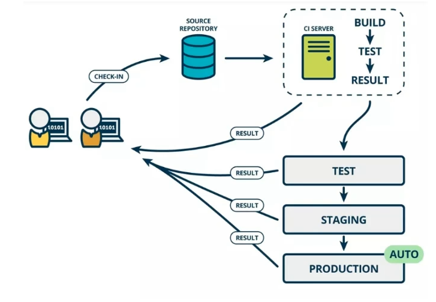
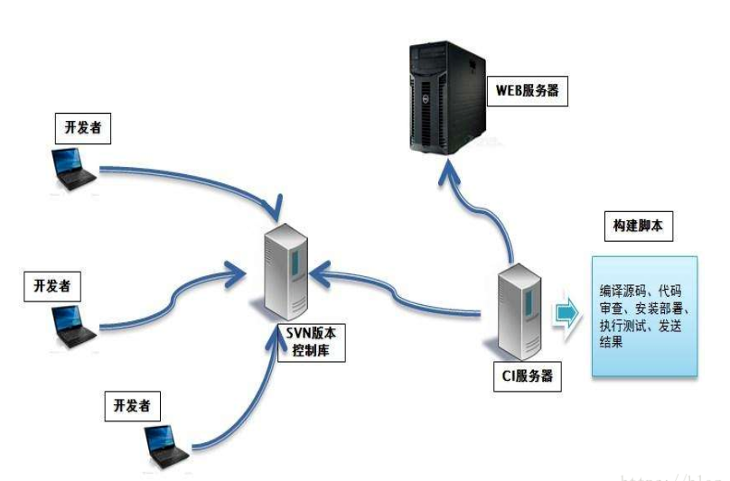

# 持续集成与Jenkins介绍

## 软件开发

### 软件开发生命周期

软件开发生命周期分为几个部分：

- 需求分析：根据项目需求，指定一个可靠的计划。
- 设计：设计系统架构以及界面功能模型等，并创建项目计划
- 开发：程序员根据计划，进行代码实现
- 测试：测试人员进行测试，功能测试 代码测试 压力测试等
- 进化：根据用户需求，对bug修改，功能添加或者架构升级

### 瀑布模型

瀑布模型是一种经典软件开发架构模式，特点是按阶段顺序展开，从一个阶段流动到另一个阶段

优点：

- 简单易用
- 某个阶段完成后，只需关注后续阶段即可
- 项目提供了按阶段性划分的检查点

缺点：

- 各阶段划分固定，阶段间有大量的文档，添加工作量
- 开发过程线性，只有全部完成才能看到成果
- 不适应用户随时变化的需求

瀑布模型是很经典的架构模式，但不是最好的

### 敏捷开发

敏捷开发是一种开发模式，核心为迭代开发和增量开发

#### 迭代开发

对于一个大型项目，开发周期可能是一年，如果使用迭代开发，那么这一个大周期可以拆成一个小周期，比如每个月交付一个小工程，将这个小工程慢慢演变成最终的大型项目。

就好比SpaceX公司要造大火箭，他的作法是先造小火箭，结果第一次测试就爆了，第四次才成功，这样慢慢迭代，最终造出了大火箭，如果他一开始就以最终火箭为目标，可能现在还在研发阶段。

#### 增量开发

每次迭代，都会添加一个用户可感知的完整功能，按照新功能来迭代。

**敏捷开发的迭代方式是每次迭代都按软件整个开发周期重复进行**

#### 敏捷开发的好处

- 早期交付：就比如一个大项目需要10个功能，给你10个月完成，你使用敏捷开发，可能1个月或者2个月交付1个两个功能，这样可以让客户按比例回款，降低压力
- 降低风险：全部做好后发现产品没人买，如果敏捷开发，可以在早期就看到市场效应

## 持续集成

### 持续集成介绍

持续集成英文名是Continuous Integration，简称CI，它的作用就是**频繁的将提交的代码自动集成到主干发布**，而不是自己打包测试，部署。

持续集成的目的就是**可以让开发快速迭代**，省去人工运维的工作，并且它是高质量的，因为每次集成前，会进行自动化测试，通过了才会进行集成

持续集成分为几个阶段：

1. 提交：开发人员提交代码，commit
2. 第一轮测试：代码一些第一轮测试，Commit后的钩子方法自动进行
3. 构建：通过第一轮测试，就可以整合主干的代码了，进行build
4. 第二轮测试：代码整合完毕后功能的测试
5. 部署：将整个项目代码打包，放到服务器上部署
6. 回滚：如果版本出现问题，回滚到上一个版本

### 持续集成应用场景

配合敏捷开发使用，需要频繁进行代码更新维护。

举个例子：小明写了一个月代码，都没有提交，提交时发现很多冲突，又花了3天时间去解决这些冲突，又花了一周去解决冲突后的bug，浪费大量时间。

如果使用CI，小明每一小时或者一天就提交代码集成一次，可以很早的发现问题，并且冲突也很简单解决，其他配合开发的程序员也可以快速根据代码进行修改。当然这种频繁提交集成部署是由软件自动完成的，而不是人工进行，如果是人工那样耗时耗力。

### 持续集成组成要素

- 自动化构建过程，从检出，构建，测试，部署都是自动完成的
- 代码存储库，SVN或GIT
- 持续集成服务器，Jenkins

### 持续集成的好处

- 降低风险快速找到问题，因为需要频繁的提交整合代码测试
- 减少重复性人工部署工作
- 持续交付可用的版本

## Jenkins

### Jenkins介绍

jenkins是一个开源的持续集成工具，包含了上面所说的：自动构建，自动编译，自动发布。还能监控集成中存在的错误，提供详细的日志和提醒功能

Jenkins好处多多：

-  是所有持续集成产品中安装和配置最简单的
- 基于浏览器web访问界面，用户界面简洁友好
- 拥有非常多和强大的插件
- 使用Java编写，更适合Java开发
- 支付分布式构建
- 支持使用Email进行消息通知以及测试报告

简单点来说：jenkins是一个web应用程序，这个web应用程序能做持续集成的一切功能