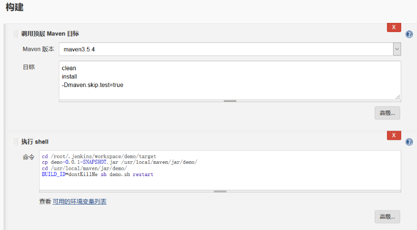

TODO

思路：

构建一个自由风格项目或者pipeline或者maven都可以，

然后再maven clean install打包后，



（ 注意:必须添加上`BUILD_ID=dontKillMe` 否则,部署完成之后,   jenkins 会立即将我们的jar的进程kill掉,无法访问,   虽然现实build success 但是并没什么卵用 ）

执行shell命令 

1. 进入到打包后项目目录
2. 把项目拷贝到一个保存的地方
3. 移动到那个地方
4. 执行shell脚本，kill掉之前的进程，启动新进程，比如下面脚本模板

```shell
#!/bin/bash
#这里可替换为你自己的执行程序，其他代码无需更改
APP_NAME=demo-0.0.1-SNAPSHOT.jar

#使用说明，用来提示输入参数
usage() {
    echo "Usage: sh demo.sh [start|stop|restart|status]"
    exit 1
}

#检查程序是否在运行
is_exist() { 
    pid=`ps -ef | grep $APP_NAME | grep -v grep | awk '{print $2}' `
    #如果不存在返回1，存在返回0
    if [ -z "${pid}" ]; then
    	return 1
    else
    	return 0
    fi
}

#启动方法
start() {
    is_exist
    if [ $? -eq "0" ]; then
   		echo "${APP_NAME} is already running. pid=${pid} ."
    else
    	echo "starting..."
    	#nohup java -jar $APP_NAME > /dev/null 2>&1 &
    	java -jar $APP_NAME &
    fi
}

#停止方法
stop() {
    is_exist
    	if [ $? -eq "0" ]; then
    	kill -9 $pid
    else
    	echo "${APP_NAME} is not running"
    fi
}

#输出运行状态
status() {
    is_exist
    	if [ $? -eq "0" ]; then
    	echo "${APP_NAME} is running. Pid is ${pid}"
    else
    	echo "${APP_NAME} is not running."
    fi
}

#重启
restart() {
    stop
    start
}

#根据输入参数，选择执行对应方法，不输入则执行使用说明
case "$1" in
    "start")
    start
    ;;
    "stop")
    stop
    ;;
    "status")
    status
    ;;
    "restart")
    restart
    ;;
    *)
    usage
    ;;
esac
```


