# Jenkins构建SpringCloud微服务

## Jenkins+Docker+Cloud持续集成流程说明


图片很清晰，大概流程为：

1. 开发人员提交代码到gitlab上
2. gitlab的webhook钩子方法远程请求Jenkins进行编译打包
3. Jenkins编译打包后，构建镜像，并上传镜像到Docker仓库中
4. 这里使用Harbor做镜像仓库
5. Jenkins上传完毕删除镜像，并远程请求生产服务器进行部署
6. 生产服务器首先删除原来的镜像，然后从Docker拉取新镜像
7. 创建容器后，用户即可访问

**服务列表**（黑色为已经安装，红色未安装）

| 名称             | IP             | 所需软件                                                     |
| ---------------- | -------------- | ------------------------------------------------------------ |
| 代码托管服务器   | 192.168.56.130 | Gitlab-12.4.2 （最好2G以上内存）                             |
| 持续集成服务器   | 192.168.56.131 | Jenkins-2.190.3，JDK1.8，Maven3.6.2，Git，Sonar，<font color=ff0000>Docker18.06.1-ce</font> |
| Docker仓库服务器 | 192.168.56.132 | <font color=ff0000>Docker18.06.1-ce</font>，<font color=ff0000>Harbor1.9.2</font> |
| 生产部署服务器   | 192.168.56.133 | <font color=ff0000>Docker18.06.1-ce</font>                   |

当然，这里也可以把Docker仓库服务器就当做生产部署服务器，就不需要创建一个新服务器与Harbor了，因为Harbor就是用来分发镜像的，镜像在本地就不需要分发了~

## 本地部署SpringCloud微服务

这里我使用之前学成在线的项目，但是是简化版，项目地址为： https://github.com/PAcee1/jenkins-xcEdu-demo 

### SpringCloud微服务简介

前后端分离项目，后端使用：SpringBoot，SpringCloud，SpringDataJPA，Mybatis

微服务项目结构：

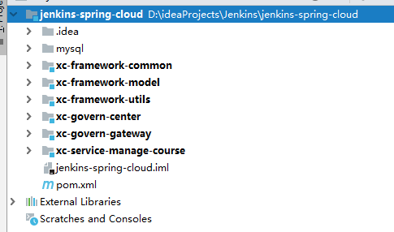

- xc-framework-common：公共类
- xc-framework-model：实体类
- xc-framework-utils：工具类
- xc-govern-center：注册中心服务
- xc-govern-gateway：zuul服务网关
- xc-service-manage-course：课程服务

这里我们主要部署的为注册中心，zuul和课程服务

### SpringCloud微服务部署

#### 本地运行微服务

本地运行前，**我们需要向数据库执行sql脚本**，保存在mysql文件夹下

依次执行xc-govern-center => xc-govern-gateway => xc-service-manage-course

使用postman测试请求：查询课程基本

```
POST 127.0.0.1:50201/api/course/coursepic/get/297e7c7c62b888f00162b8a7dec20000
```

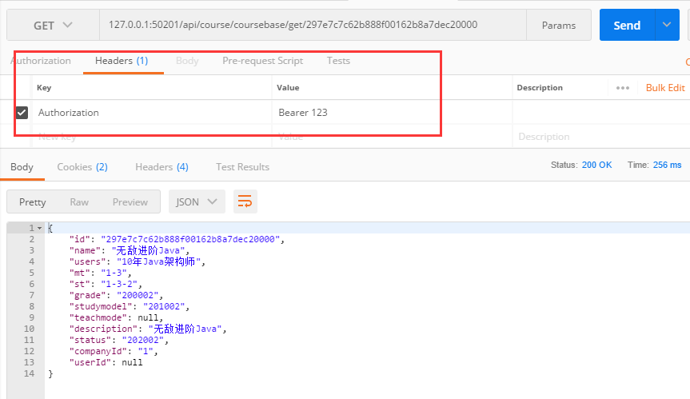

**注意！我们配置的Zuul网关规则是必须带有请求头，并且键为Authorization，值以`Bearer `开头，有个空格哦**

#### 本地部署微服务

1）打包

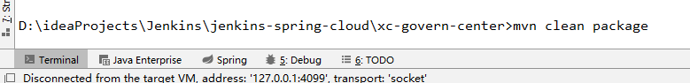

在命令行窗口中输入`mvn clean package`

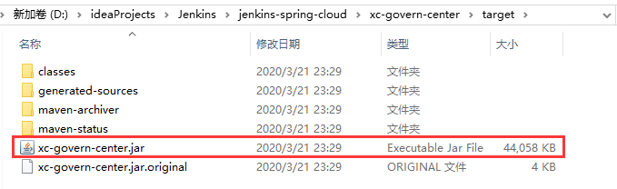

打包完毕会看到target目录下有个jar包

2）部署

cmd中输入`java -jar xc-govern-center.jar`

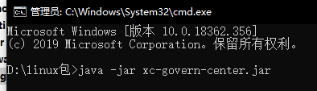

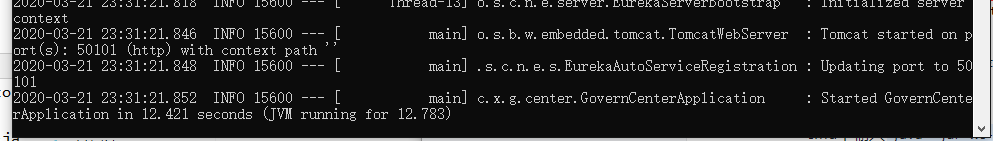

运行成功，并且可以访问


说明部署成功

## Docker快速入门

### Docker简介

**总体来说Docker技术就是让我们更高效更简单的在Linux部署我们的项目**

Docker是一个开源的容器引擎，基于Go语言

Docker将应用程序与该程序的依赖，打包在一个文件里面。运行这个文件，就会生成一个虚拟容器。程序在这个虚拟容器里运行，就好像在真实的物理机上运行一样。有了Docker，就不用担心环境问题。

传统虚拟机技术 vs Docker

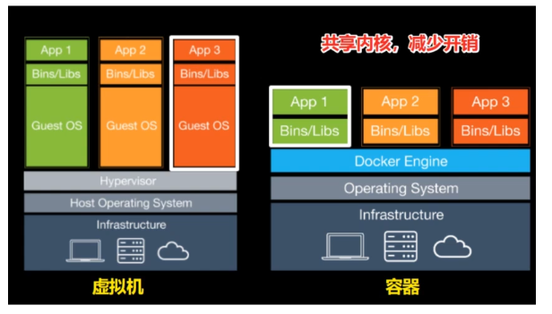

|              | 虚拟机         | Docker               |
| ------------ | -------------- | -------------------- |
| 占用磁盘空间 | GB             | Mb甚至kb             |
| 启动速度     | 分钟级         | 秒级                 |
| 运行状态     | 运行Hypervisor | 直接运行在宿主机内核 |
| 并发性       | 几十个         | 上百上千             |
| 性能         | 低于宿主机     | 接近宿主机           |
| 资源利用率   | 低             | 高                   |


### Docker安装

1）卸载旧版本

>yum list installed|grep docker 列出所有docker包
>
>yum -y remove docker.xxx 卸载docker包
>
>rm -rf /var/lib/docker 删除docker所有镜像与容器

2）安装必要软件包

>  yum install -y yum-utils device-mapper-persistent-data lvm2 

3）设置下载的镜像仓库

>  yum-config-manager --add-repo http://mirrors.aliyun.com/docker-ce/linux/centos/docker-ce.repo 

4）安装指定版本docker

> yum install docker-ce-18.06.1.ce -y

5）查看版本

> docker -v

6）启动docker

> systemctl start docker
>
> systemctl enable docker

测试是否启动成功

> docker ps

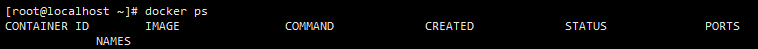

7）添加阿里云镜像下载

```json
sudo tee /etc/docker/daemon.json <<-'EOF'
{
  "registry-mirrors": ["https://v4zkfq23.mirror.aliyuncs.com"],
  "insecure-registries": ["192.168.56.132:85"]
}
EOF
sudo systemctl daemon-reload
sudo systemctl restart docker
```

我们需要在Jenkins服务器131，Docker镜像仓库服务器132，生产部署服务器133上都安装一遍

### Docker基本命令快速入门

#### 镜像命令

镜像：相当于应用的安装包，在Docker部署任何东西，都需要先构成镜像，镜像可以是自己生产的，也可以从镜像库中下载。

> docker images	查看本地所有镜像
>
> docker search xxx	镜像库中搜索镜像
>
> docker pull 镜像名称:版本	从镜像库下载镜像（如果不写版本，默认最新版即latest）
>
> docker rmi -f 镜像名称	删除镜像，根据名称
>
> docker rmi 镜像id	根据id删除

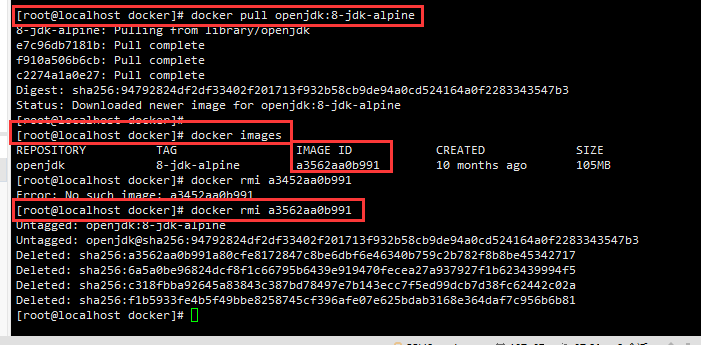


镜像创建命令：

> docker build 参数 Dockerfile位置
>
> 参数：
>
> --build-arg=[] :设置镜像创建时的变量
>
> -t	 镜像的名字及标签，通常 name:tag 或者 name 格式

例子：使用当前目录的Dockerfile文件，创建一个eureka，版本为v1的镜像，并且带有JAR_FILE参数

```shell
docker build --build-arg JAR_FILE=xc-govern-center.jar -t eureka:v1 .
```

#### 容器命令

容器：容器是由镜像创建而来，容器是Docker镜像的载体，每个应用分别运行在不同的容器中。

> docker run -i 镜像名称:标签	运行容器，默认前台运行

```
常用运行时参数
-i	运行容器
-di	后台运行容器
--name	添加名称
-p	公开容器端口给主机（-p 90:80，将本地80端口的应用以90端口公开给外部访问）
-v	挂载目录
```

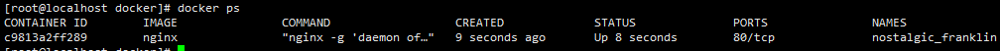

普通启动后，外部访问80端口，会无法访问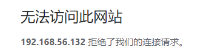

因为没有将容器端口公开，使用`-p`公开访问：

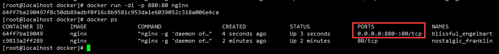

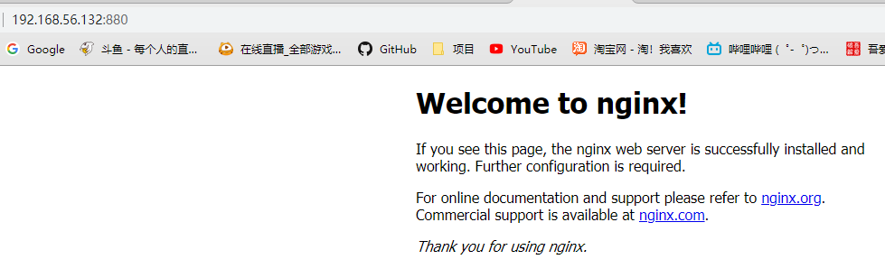

可以访问

> docker ps	查看运行的容器
>
> docker ps -a	查看所有容器，包括运行和未运行
>
> docker exec -it 容器id/容器名称 /bin/bash	进入容器内部
>
> docker start/stop/restart 容器名称/id	启停重启
>
> docker rm 容器名称/id	删除容器（需要先停止，加上-f 可以强制删除）
>
> docker logs -f 容器名称/id	查看容器的日志

## Dockerfile快速入门

### Dockerfile简介

前面我们学习Docker时，使用的是镜像库中的镜像，我们还说过可以自己创建镜像，Dockerfile就是用来创建镜像的。

镜像库的镜像不是全部都适合我们，比如我们自己的项目想要运行，必须自行根据所需运行环境创建镜像，创建镜像就是将一些命令组合起来，按Docker的规范。

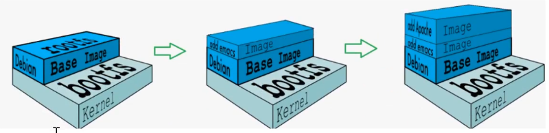

从图中可以看出，镜像是由一个基础镜像开始，一层层向上添加所需的镜像，每安装一个就往上加一层，最终得到我们完整的镜像。

### Dockerfile常用命令

| **命令**                           | **作用**                                         |
| ---------------------------------- | ------------------------------------------------ |
| FROM image:tag                     | 基础镜像，一般来说都需要选择一个基础镜像进行叠加 |
| MAINTAINER user_name               | 声明镜像作者                                     |
| ENV key value                      | 设置环境变量                                     |
| RUN command                        | 编译镜像时运行的脚步，比如创建目录，安装软件等   |
| CMD                                | 容器的启动命令                                   |
| ENTRYPOINT                         | 设置容器的入口程序，与CMD不同是他可以接收参数    |
| ADD source_dir/file dest_dir/file  | 将宿主机文件复制到容器中，如果是压缩包自动解压   |
| COPY source_dir/file dest_dir/file | 将宿主机文件复制到容器中，如果是压缩包不会解压   |
| WORKDIR path_dir                   | 工作目录                                         |
| ARG                                | 编译镜像时加入的参数                             |
| VOLUMN                             | 容器的挂载卷                                     |
| EXPOSE                             | 设置对外发布的端口                               |

RUN，CMD，ENTRYPOINT的区别？

- RUN：用于指定docker build过程中要运行的命令，即创建Docker镜像的步骤
- CMD：容器启动命令，Dockerfile中只能有一条CMD，并且不支持接收docker run参数
- ENTPYPOINT：可以接收docker run参数，docker run最后的命令将作为参数传给入口程序

### Dockerfile制作镜像

我们利用Dockerfile制作一个Eureka注册中心的镜像

1）上传Eureka的jar包到linux上

2）编写Dockerfile

> vi Dockerfile

```dockerfile
FROM openjdk:8-jdk-alpine
ARG JAR_FILE
COPY ${JAR_FILE} eureka.jar
EXPOSE 50101
ENTRYPOINT ["java","-jar","/eureka.jar"]
```

3）构建镜像

> docker build --build-arg JAR_FILE=xc-govern-center.jar -t eureka:v1 .


4）查看镜像是否创建成功

> docker images

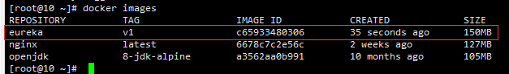

5）创建容器并启动

> docker run -di --name=eureka -p 50101:50101 eureka:v1

6）访问容器

http://192.168.56.131:50101

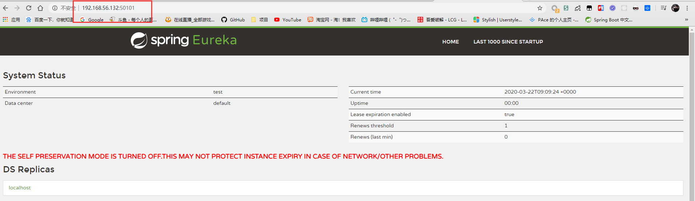

## Harbor镜像仓库安装及使用

### Harbor简介


Harbor是一个用于存储和分发Docker镜像的企业级Registry注册服务器。

初Harbor外，Docker官方也提供了Registry，但是功能比较简单，Harbor的功能更加强大：

- 分层传输机制，优化网络传输
- 提供WEB可视化界面
- 支持水平扩展
- 有良好的安全机制，权限分配

### Harbor安装

Harbor需要安装在我们的镜像仓库服务器上

1）先安装Docker（完成）

2）安装docker-compose

到github中下载  https://github.com/docker/compose/releases/tag/1.26.0-rc3

下载后放到`/usr/local/bin/`目录下，改名为`docker-compose`

3）docker-compose授权

> chmod +x /usr/local/bin/docker-compose

4）检测是否安装成功

> docker-compose --version

5）下载Harbor安装包（v1.9.2）

 https://github.com/goharbor/harbor/releases/tag/v1.9.2 

6）上传压缩包，并解压

> tar -zxvf harbor-offline-installer-v1.9.2.tgz
>
> mkdir /opt/harbor
>
> mv harbor/* /opt/harbor
>
> cd /opt/harbor

7）修改Harbor配置

> vi harbor.yml

修改hostname和port

> hostname: 192.168.56.132
>
> port: 85

8）安装

> ./prepare
>
> ./install.sh

9）启动关闭

> cd /opt/harbor/
>
> docker-compose up -d	启动
>
> docker-compose stop

10）访问Harbor

http://192.168.56.132:85 admin/Harbor12345

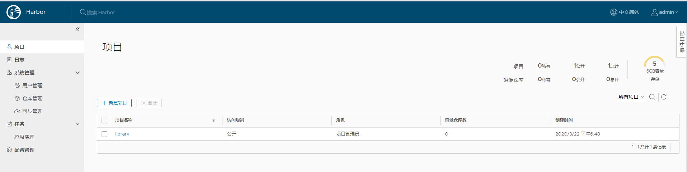

### Harbor创建用户和项目

首先我们为将要部署的学成在线微服务创建一个项目，项目是保存镜像操作镜像的地方

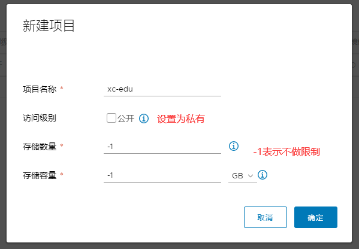

然后我们创建一个用户，毕竟不能直接使用admin进行操作

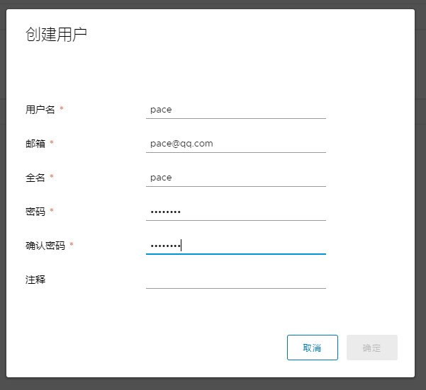

因为刚刚我们创建的项目是私有的，所以我们要向项目添加用户权限

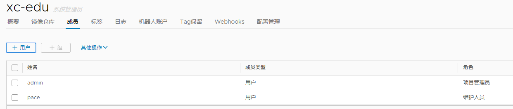

这里有几种角色，我们添加了维护人员角色：

- 项目管理员：管理项目
- 维护人员：上传下载镜像，进行一些基本配置
- 开发人员：上传下载镜像
- 访客：下载镜像

然后使用刚刚创建的用户重新登陆

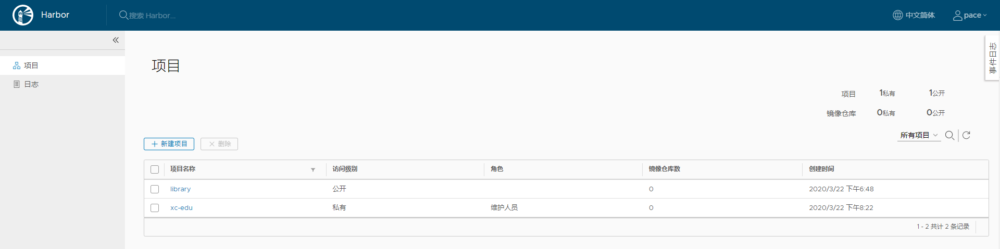

会发现明显少了很多东西，说明被权限控制了

### Harbor上传镜像

1）给镜像打上标签

> docker tag eureka:v1 192.168.56.132:85/xc-edu/eureka:v1

使用的镜像与版本，然后写上上传的地址目录

2）把Harbor的地址加入到Docker信任列表

Docker上传镜像时，需要配置应用的信任列表

```bash
sudo tee /etc/docker/daemon.json <<-'EOF'
{
  "registry-mirrors": ["https://v4zkfq23.mirror.aliyuncs.com"],
  "insecure-registries": ["192.168.56.132:85"]
}
EOF
sudo systemctl daemon-reload
sudo systemctl restart docker
```

3）Docker中登录Harbor，因为是私有项目

> docker login -u 用户名 -p 密码 192.168.56.132:85

4）Docker push镜像到Harbor

> docker push 192.168.56.132:85/xc-edu/eureka

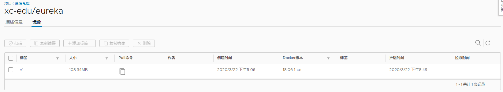

成功推送

注意！如果出现下面这个错误，并且IP可以Ping通，请重启Harbor试试

> cd /opt/harbor/
>
> docker-compose down -v
>
> docker-compose up -d

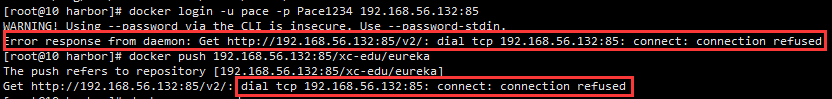

### Harbor下载镜像

需求：从生产部署服务器（192.168.56.133）完成镜像下载

1）安装Docker并启动

2）修改Docker配置

```bash
sudo tee /etc/docker/daemon.json <<-'EOF'
{
  "registry-mirrors": ["https://v4zkfq23.mirror.aliyuncs.com"],
  "insecure-registries": ["192.168.56.132:85"]
}
EOF
sudo systemctl daemon-reload
sudo systemctl restart docker
```

3）Docker登录Harbor，因为是私有项目

> docker login -u 用户名 -p 密码 192.168.56.132:85

4）Docker下载Harbor中的镜像

> docker pull 192.168.56.132:85/xc-edu/eureka:v1

