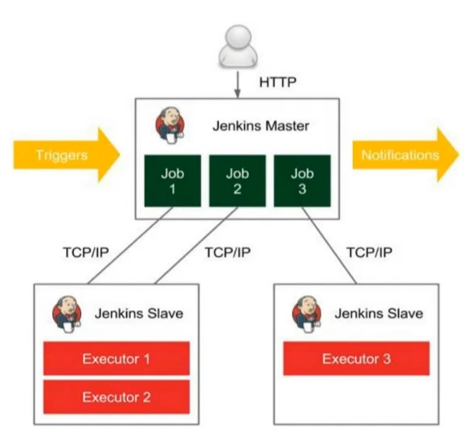
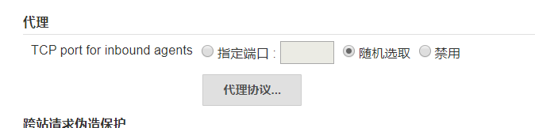
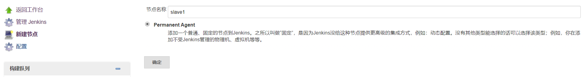
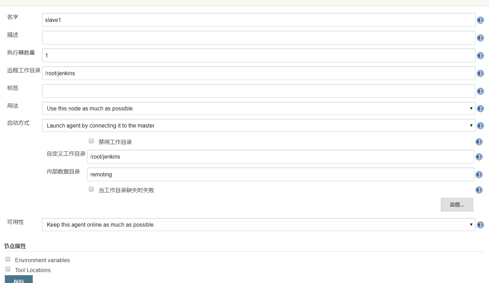
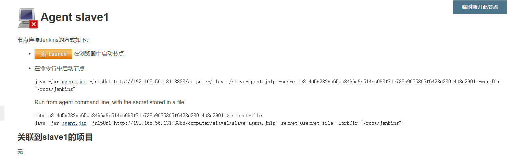
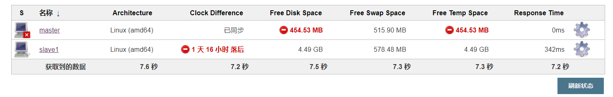
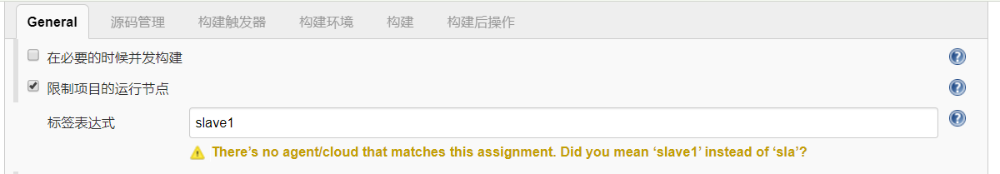
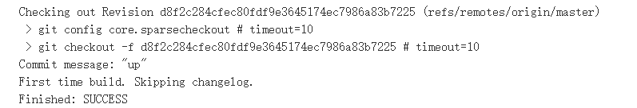
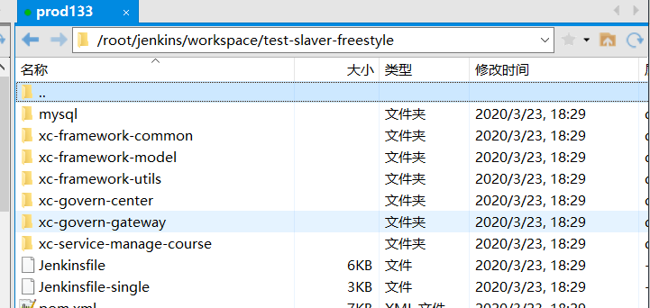
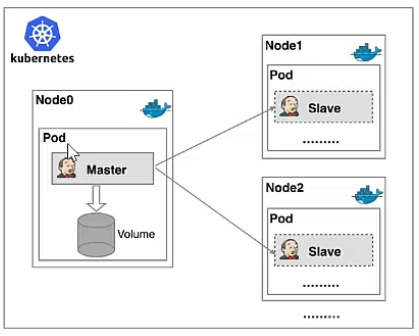

## Jenkins实现Master-slave分布式构建

### Jenkins的主从架构介绍



Jenkins的主从架构，就是将主节点的构建过程转移给从节点进行构建，这样可以增加构建数量，不需要等待主节点同步进行，可以同时多节点构建多个项目，有点像负载均衡，将构建工作交给不同的节点进行。

### Jenkins实现主从架构

这里我们选用133节点来当从节点，因为132节点磁盘空间不够用了，这里选择什么服务器都可以，只要不和主节点在同一台机器上。

1）开启Jenkins代理程序的TCP端口

Manager Jenkins =》 Configure Global Security



2）新增节点

Manager Jenkins =》 ManageNodes



进入后，设置远程从节点的工作目录，这里我创建在`/root/jenkins`下



保存后可以看到从节点是关闭状态的



这里我们需要按照他给的方式让从节点连接到主节点，这里我们使用第二种

- 点击`agent.jar `下载jar包，然后放在133机器root目录下

- 在root目录下运行

  ```bash
  java -jar agent.jar -jnlpUrl http://192.168.56.131:8888/computer/slave1/slave-agent.jnlp -secret c8f4d5b232ba650a8496a9c514cb093f71e738b9035305f6423d280f4d8d2901 -workDir "/root/jenkins"
  ```

> 当然，需要提前安装好jdk `yum install -y java-1.8.0-openjdk-devel.x86_64`



然后就可以看到从节点启动成功（这里主节点是因为磁盘空间不够了，不影响）

### Jenkins测试主从架构

1）Freestyle项目

首先我们最重要的就是添加限制项目的运行节点这个配置



然后我们设置源码管理，让他拉取源码进行测试

这里因为我们的133节点没有安装git，所以要安装一下git

> `yum -y install git`

然后构建测试：





构建成功并且代码也拉取下来了

2）Pipeline项目

这里配置方法也很简单

```groovy
node('slave1') {
   stage('拉取代码') { // for display purposes
      checkout([$class: 'GitSCM', branches: [[name: '*/master']], doGenerateSubmoduleConfigurations: false, extensions: [], submoduleCfg: [], userRemoteConfigs: [[credentialsId: 'e536df57-70be-4cab-ae06-448a0c1db793', url: 'git@gitee.com:pacee/xc-edu-service.git']]])
   }
}
```

只需在node后面添加节点名称，如果没写默认使用master主节点


## Kubernetes实现Master-Slave分布式构建

### 传统Jenkins的Master-Slave方案缺陷

我们刚刚实现类简单的Jenkins的主从架构，主要问题有以下几点：

- Master节点故障时，整个流程都不能使用，因为从节点依赖主节点
- 每个Slaver节点配置环境不同，完成不同语言编译打包操作，会使得管理困难，维护困难
- 资源分配不平均，有的从节点Job要排队，有的又很空闲
- 资源浪费，每台Slave节点当空闲时，不会释放资源，比如虚拟机，分配的内存还是会占用宿主机

### Kubernetes介绍

Kubernetes简称k8s，是Google的开源容器集群管理系统，在Docker的基础上，为容器化应用提供部署运行，资源调度，服务发现，动态伸缩灯一系列完整内容，提高大规模容器集群管理的便携性，主要功能有：

- 使用Docker对应用程序包装，实例化，运行
- 以集群方式运行，管理跨机器的容器
- 解决Docker跨机器容器之间通讯问题
- Kubernetes的自我修复机制使得容器集群总是高可用的

### Kubernetes架构


- **API Sever**：Kubernetes对外暴露的API，外部可以使用一些kube-apisever实现资源请求调用管理等
- Etcd：Kubernetes的存储系统，保存所有的集群数据，会制定一些备份计划进行备份
- **Controller Manager**：集群内部的管理控制中心，管理集群内部的Node，Pod，服务断点，命名空间等等大大小小的事，如果某个节点意外宕机，他就会启动自我修复功能，保证集群高可用
- Scheduler：监视器，用来监视那些新创建还没有分配Node的Pod，为其选择一个合适的Node加入进去
- Kubelet：负责维护容器的生命周期，同时负责Volume和网络管理
- **Kubernetes Proxy**：核心组件，部署在每个Node上，用于Node与Server通信并进行负载均衡

### Kubernetes+Docker+Jenkins持续集成架构图



主要的优点有：

- **服务高可用**：当主节点挂掉时，会创建一个新的Master容器，或从Slave中选择一个，然后将主数据Volume分配给他，保证数据不丢失，服务高可用
- **动态伸缩**：每次运行Job时，会自动创建一个Slave或选择空闲的Slave进行执行，Job完成后，Slave在一段时间后会自动注销并删除容器，节省资源。
- **扩展性好**：当Kubernetes集群资源不足，导致Job开始阻塞时，会自动创建Node加入到集群，进行扩展

## Kubernetes安装

TODO，电脑磁盘空间不够了，再加上再往后太偏向运维了，后面学习Docker时再进行研究