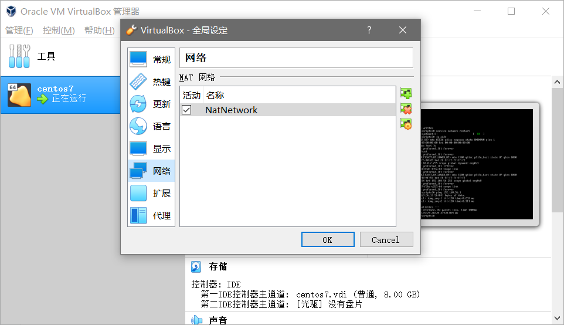
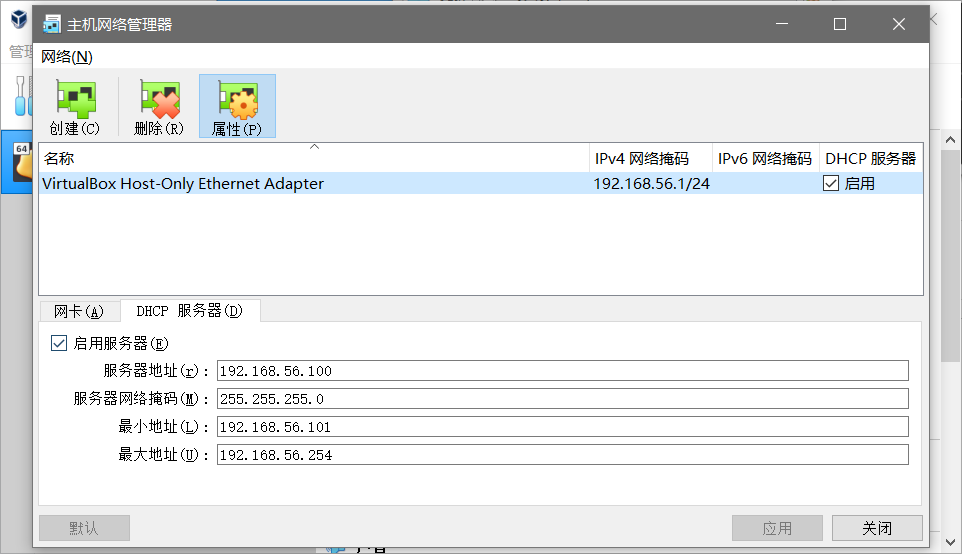
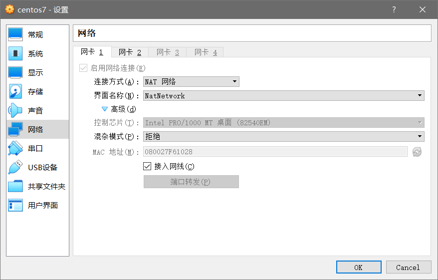
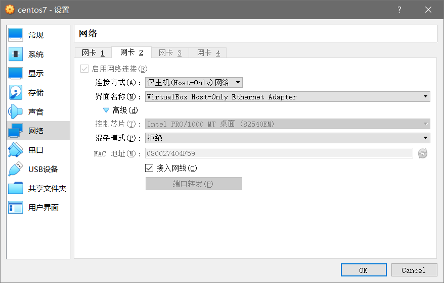
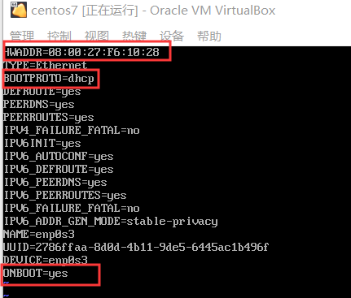
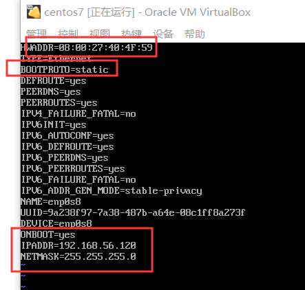

### 使用VirtualBox配合Centos7

#### 一、VirtualBox的设置

1.全局设置新增一个网络



2.主机管理器启用DHCP服务器



#### 二、虚拟机设置

采用双网卡





需要记住MAC地址，在下面linux配置文件中需要配置

#### 三、Linux中的设置

进入网络设置文件夹`cd etc/sysconfig/network-scripts`

1.设置`ifcfg-enp0s3`



主要设置HWADDR，mac地址为NAT网卡的mac地址

2.设置`ifcfg-enp0s8`



需要设置红框中的信息：

- HWADDR:HOST-ONLY的mac地址
- bootproto：为static
- onboot：yes
- IPADDR：为第一步中主机管理器DHCP服务器中服务器地址范围内随便写一个
- NETMASK：255.255.255.0

这样我们就都配置完毕，重启网络服务即可开始玩耍

`service network restart`

`ping 192.168.56.1`

`ping www.baidu.com`

#### 四、修改HostName

hostnamectl set-hostname xxx

reboot


## 防火墙

查看防火墙状态

```
firewall-cmd --state
```

停止firewall

```
systemctl stop firewalld.service
```

禁止firewall开机启动

```
systemctl disable firewalld.service 
```