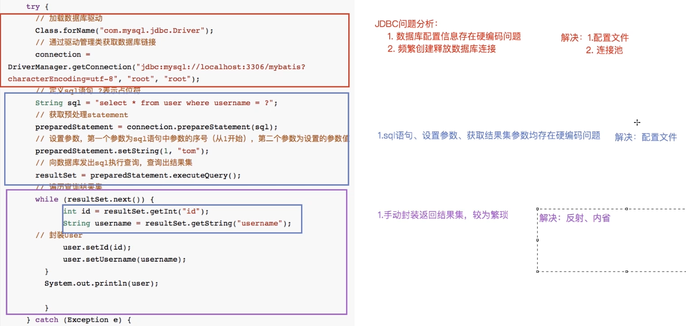
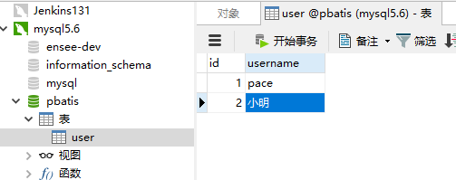
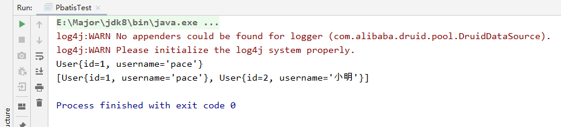
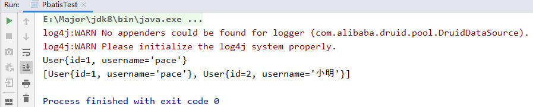

## JDBC中的问题

刚开始学Java的时候，我们连接数据库进行操作，全是通过JDBC实现的，那么为什么后面使用Mybatis或者Hibernate 等ORM框架呢？那么肯定是JDBC中有令人困扰的问题，然后被主流ORM框架优化。

### JDBC实现流程

首先我们回顾一下JDBC的实现流程

1. 加载数据库驱动
2. 建立连接
3. 编写sql语句，生成预处理对象
4. 执行sql，获取结果集
5. 解析结果集

```java
public static void main(String[] args) {
    Connection connection = null;
    PreparedStatement preparedStatement = null;
    ResultSet resultSet = null;
    try {
        // 加载数据库驱动
        Class.forName("com.mysql.jdbc.Driver");
        // 建立连接
        connection = DriverManager.getConnection("jdbc:mysql://localhost:3306/mybatis?characterEncoding=utf-8", "root", "root");
        // 编写sql语句
        String sql = "select * from user where username = ?";
        // 获取预处理statement
        preparedStatement = connection.prepareStatement(sql);
        // 设置查询条件
        preparedStatement.setString(1, "tom");
        // 执行sql，获取结果集
        resultSet = preparedStatement.executeQuery();
        // 处理结果集
        while (resultSet.next()) {
            int id = resultSet.getInt("id");
            String username = resultSet.getString("username");
            // 封装到user中
            user.setId(id);
            user.setUsername(username);
        }
        System.out.println(user);
    } catch (Exception e) {
        e.printStackTrace();
    } finally {
        // 释放资源
        ···
    }
}
```

### JDBC存在的问题



我们通过颜色划分，不难看出有以下几个缺点：

| 代码                                | 问题                                                         | 解决方案                                                     |
| ----------------------------------- | ------------------------------------------------------------ | ------------------------------------------------------------ |
| 加载驱动，获取数据库连接            | 1.数据库配置文件硬编码 2.每次使用都需要创建释放数据库连接    | 1.使用配置文件保存数据库配置 2.使用数据库连接池              |
| 定义sql，设置参数，获取结果集中数据 | sql，参数，获取结果都存在硬编码                              | 使用配置文件（单独的配置文件，和数据库配置文件分开，因为这些是常变配置，而数据库配置不常变） |
| 遍历解析结果集                      | 需要手动封装结果集，如果实体对象字段过多，手动封装任务繁琐且都是重复操作 | 使用反射，将结果映射到实体中，比如`BeanUtils.mapToBean()`    |

## 自定义持久层框架设计思路

我们针对上面JDBC展现出的问题，思考下如何优化，制作出一个简单的ORM框架，以便后期更简单的理解Mybatis实现原理。

思考：

```
首先我们的框架应该是一个独立的工程，打成jar包供客户端调用
客户端使用我们jar时，应该需要传入一些配置，比如数据库连接配置，sql，参数，返回值等，所以这些应该放在配置文件中
我们的框架实现时，需要读取解析这些配置文件
为了代码的优雅，我们应保存到对象中（面向对象原则）
通过配置文件建立数据库连接，执行sql，返回结果
```

通过上面的思考后，我们有了以下具体设计思路

### 使用端

引入自定义持久层框架jar包，调用方法进行获取数据

- 需提供的配置：数据库配置信息，sql配置信息，入参，返回值类型
- 需创建两种配置文件
  - `sqlMapConfig.xml`：存放数据库配置信息（也可以添加`mapper.xml`的路径，这样只需要传递一个配置文件，就可以获取两种配置文件的配置）
  - `mapper.xml`：存放sql，入参，返回值的配置

### 框架端

本质是对JDBC代码实现进行优雅的封装

1. 加载配置文件：将配置文件中的信息转成字节流，保存到内存中以待使用
   
   - 创建`Resource`类，方法：`InputStream getResourceAsStream(String xmlPath)`
   
2. 创建JavaBean：面向对象编程，将配置信息保存到Bean中
   - `Configuration`：核心配置类，保存`sqlMapConfig.xml`中的配置
   - `MappedStatement`：映射配置类，保存`mapper.xml`中的配置
   
3. 解析流中的配置到JavaBean：使用`dom4j`技术
   
   - 专人干专事，创建具体解析实现类：使用`dom4j`将流中配置，解析存放到对象容器中
   
   - 创建工厂生产类`SqlSessionFactoryBuilder`，方法：`build(InputStream is)`
     - 第一，调用解析实现类，解析出`Configuration`
     - 第二，创建`SqlSessionFactory`，用来创建`SqlSession`（会话），<font color="red">使用到工厂模式</font>
   
4. 创建`SqlSessionFactory`接口：工厂模式，生成`SqlSession`
   - 第一，创建`openSession()`方法：用于生成`SqlSession`
   - 第二，创建默认实现类，`DefaultSqlSessionFactory`，遵循开闭原则

5. 创建`SqlSession`接口：封装CRUD方法
   - 第一，创建默认对数据库操作的方法，入：`selectAll()`，`insert()`，`delete()`，`update()`
   - 第二，创建默认实现类`DefaultSqlSession`

6. 创建`Executor`接口：实际操作数据库的代码
   - 第一，创建实际操作数据库方法：`query(Configuration conf,Object... params)`
   - 第二，创建默认实现类`DefaultExecutor`

设计思路中我们参考Mybatis的使用方式，使用大量设计模式进行解耦，大大增加代码可扩展性以及可维护性。

这样我们简单的自定义ORM框架的设计思路就大致完成，对此有什么不理解的，可以在接下来代码实现中进行具体理解

## 自定义持久层框架实现

### 使用端实现

我们根据上面的思路，一步步实现使用端

创建一个maven工程。

首先我们知道需要两种配置文件：

- 一种存放数据库信息

- 一种存放具体sql，参数，返回值信息

所以我们先实现数据库信息的配置

> <font color="red">注意！下面配置文件使用到的标签都是我们自定义的</font>

#### sqlMapConfig.xml

经过分析，我们这个配置文件中，存放的是数据库配置信息，所以可以这么写：

```xml
<configuration>

    <datasource>
        <property name="driverClass" value="com.mysql.jdbc.Driver"></property>
        <property name="jdbcUrl" value="jdbc:mysql://127.0.0.1:8080/pbatis"></property>
        <property name="user" value="root"></property>
        <property name="password" value="root"></property>
    </datasource>

</configuration>
```

这样，核心配置文件就基本完成了，到时候使用框架时，传入此配置路径，即可解析配置连接数据库

然后我们去编写具体映射配置文件

#### mapper.xml

（1）创建配置文件

首先我们要清楚，如果只写一个mapper配置，就会导致多个实体不同sql耦合在一个配置里，难以维护，所以我们应该根据实体的类型，创建不同的mapper文件。

创建 `userMapper.xml` 表示是user实体使用的mapper

（2）创建查询sql

对于sql来说，有四种类型，增删改查，所以我们可以根据操作类型，将不同类型的sql写在对应的标签中。

这里我们将查询的sql，写在`select`标签中

```xml
<mapper>

    <select>
        select * from user
    </select>

    <select>
        select * from user where id = ? and username = ?
    </select>

</mapper>
```

（3）改善sql，加入id

上述配置我们会发现问题，对于两个查询语句，并不能区分到底使用哪个？所以我们可以加入id属性，来给sql加上标识。

改善后：

```xml
<mapper>

    <select id="selectList">
        select * from user
    </select>

    <select id="selectOne">
        select * from user where id = ? and username = ?
    </select>

</mapper>
```

（4）改善配置，加入命名空间

虽然上面的配置可以区分sql了，但是如果有多个mapper配置，比如有一个`productMapper`，里面也有一个sql的id叫做`selectList`，当我们把两个mapper都传给框架进行初始化时，无法区分当调用`selectList`方法时，使用哪个sql。

所以我们应对不同的mapper也加上唯一标识，即在mapper标签上加入`namespace`命名空间属性

```xml
<mapper namespace="user"> <!-- 命名空间，mapper的唯一标识 -->

    <select id="selectList">
        select * from user
    </select>

    <select id="selectOne">
        select * from user where id = ? and username = ?
    </select>

</mapper>
```

**这样我们的sql的唯一标识就为：`namespace.id` 组成**

（5）改善sql，加入返回值

jdbc的结果集返回时，我们需要手动获取结果，后面设计阶段我们发现可以使用反射将结果进行自动映射到实体中。

所以我们在sql语句上，应该加上具体返回实体，这样才可以让框架知道反射到哪个实体上。

```xml
<mapper namespace="user"> <!-- 命名空间，mapper的唯一标识 -->

    <!--  sql唯一标识：namespace.id ,user.selectList -->
    <select id="selectList" resultType="com.enbuys.pojo.User">
        select * from user
    </select>

    <select id="selectOne" resultType="com.enbuys.pojo.User">
        select * from user where id = ? and username = ?
    </select>

</mapper>
```

（6）改善sql，加入参数

通过`selectOne`这条sql我们可以看到，对于参数使用的是问号占位符，这样当用户传入实体作为查询条件时，我们无法选择实体中哪个具体字段作为第一个条件或第二个条件，所以需要改进。

- 占位符中编写具体字段名称，以方便反射的实现
- `select`属性中 加入具体参数实体类

```xml
<mapper namespace="user"> <!-- 命名空间，mapper的唯一标识 -->

    <!--  sql唯一标识：namespace.id ,user.selectList -->
    <select id="selectList" resultType="com.enbuys.pojo.User">
        select * from user
    </select>

    <select id="selectOne" resultType="com.enbuys.pojo.User" paramterType="com.enbuys.pojo.User">
        select * from user where id = #{id} and username = #{username}
    </select>

</mapper>
```

这样，我们关于映射配置就完成了。

#### 改善sqlMapConfig.xml

在我们设计框架端时，加载配置文件方法`getResourceAsStream(String xmlPath)`只传入一个路径，那么我们想要加载核心配置和映射配置就需要调用多次该方法，非常不友好。

所以我们应在核心配置中加入映射配置的路径，这样只需要传入核心配置路径，就可以拿到映射配置进行加载。

```xml
<configuration>

    <datasource>
        <property name="driverClass" value="com.mysql.jdbc.Driver"></property>
        <property name="jdbcUrl" value="jdbc:mysql://127.0.0.1:8080/pbatis"></property>
        <property name="user" value="root"></property>
        <property name="password" value="root"></property>
    </datasource>

    <mapper resource="sqlMapConfig.xml"></mapper>

</configuration>
```

到此，我们使用端的配置就全部实现完毕了。

------

接下来，我们进行最最关键的自定义框架实现~

### 自定义框架实现

我们在自定义框架的设计思路中，设计了六步，所以我们跟随思路进行代码的实现。

> 注意，这里应该新创建一个工程，不应和使用端使用一个工程

#### 加入依赖

因为需要解析配置文件等操作，所以必须向pom中先添加依赖

```xml
<properties>
        <project.build.sourceEncoding>UTF-8</project.build.sourceEncoding>
        <maven.compiler.encoding>UTF-8</maven.compiler.encoding>
        <java.version>1.8</java.version>
        <maven.compiler.source>1.8</maven.compiler.source>
        <maven.compiler.target>1.8</maven.compiler.target>
    </properties>
    <dependencies>
        <dependency>
            <groupId>mysql</groupId>
            <artifactId>mysql-connector-java</artifactId>
            <version>5.1.17</version>
        </dependency>
        <dependency>
            <groupId>com.alibaba</groupId>
            <artifactId>druid</artifactId>
            <version>1.1.20</version>
        </dependency>
        <dependency>
            <groupId>log4j</groupId>
            <artifactId>log4j</artifactId>
            <version>1.2.12</version>
        </dependency>
        <dependency>
            <groupId>junit</groupId>
            <artifactId>junit</artifactId>
            <version>4.10</version>
        </dependency>
        <dependency>
            <groupId>dom4j</groupId>
            <artifactId>dom4j</artifactId>
            <version>1.6.1</version>
        </dependency>
        <dependency>
            <groupId>jaxen</groupId>
            <artifactId>jaxen</artifactId>
            <version>1.1.6</version>
        </dependency>
    </dependencies>
```

#### 加载配置文件Resources

`Resources`的实现相对简单，只需调用`ClassLoader`的`getResourceAsStream`方法，即可获取输入流。

相当于对`ClassLoader`进行了一层封装。

```java
public class Resources {

    // 根据配置文件路径，获取字节输入流，存储到内存
    public InputStream getResourceAsStream(String path){
        // 直接调用ClassLoader的方法
        InputStream inputStream = this.getClass().getClassLoader().getResourceAsStream(path);
        return inputStream;
    }
}
```

#### 创建两个JavaBean

根据面向对象思想，创建两个Bean，来存储配置文件信息

- `MappedStatement`：存放映射配置对象

```java
public class MappedStatement {

    // id
    private String id;
    // 入参
    private String paramterType;
    // 返回值
    private String resultType;
    // sql
    private String sql;
    
    ··· // get/set
}
```

- `Configuration`：存放数据库配置以及映射配置集合

```java
public class Configuration {

    // 数据库信息
    private DataSource dataSource;

    // Mapper信息封装到Configuration中 String = statementId = namespace.id
    private Map<String,MappedStatement> mappedStatementMap = new HashMap<>();
    
    ··· // get/set
}
```

这里在核心配置类中保存映射配置集合的原因，也是使用时只需要传递`Configuration`一个类，就可以获取其他所有的映射配置类了。和之前配置文件中加入mapper配置一样。

#### 解析配置文件

专人干专事，这里我们创建两个解析类，一个解析核心配置类，一个解析具体映射类

- `XMLConfigBuilder`

```java
public class XMLConfigBuilder {

    // 因为要在多处使用Configuration，所以配置到成员变量上
    private Configuration configuration;

    public XMLConfigBuilder(){
        configuration = new Configuration();
    }

    /**
     * 解析输入流中的xml配置，封装到Configuration中
     * @param is
     * @return
     */
    public Configuration parseConfig(InputStream is) throws DocumentException {
        /* 一、解析核心配置类 */
        // 使用dom4j解析配置
        Document document = new SAXReader().read(is);
        // 获取根节点，即<configuration>
        Element rootElement = document.getRootElement();
        // 获取property节点，存放数据库配置信息
        List<Element> nodes = rootElement.selectNodes("//property");// 使用xpath表达式
        // 使用Properties保存数据库配置
        Properties properties = new Properties();
        for (Element element : nodes) {
            String name = element.attributeValue("name");
            String value = element.attributeValue("value");
            properties.setProperty(name,value);
        }

        // 使用配置生成Druid连接池
        DruidDataSource dataSource = new DruidDataSource();
        dataSource.setDriverClassName(properties.getProperty("driver"));
        dataSource.setUrl(properties.getProperty("jdbcUrl"));
        dataSource.setUsername(properties.getProperty("user"));
        dataSource.setPassword(properties.getProperty("password"));
        // 将连接池配置到Configuration中
        configuration.setDataSource(dataSource);

        /* 二、解析映射配置类 */
        // <mapper>标签
        List<Element> mapperNodes = document.selectNodes("//mapper");
        // 循环解析所有mapper.xml
        for (Element mapperNode : mapperNodes) {
            // 获取mapper.xml的路径，resource属性
            String resource = mapperNode.attributeValue("resource");

            // 再次加载mapper配置文件到输入流，进行解析
            InputStream inputStream = new Resources().getResourceAsStream(resource);
            XMLMapperBuilder xmlMapperBuilder = new XMLMapperBuilder(configuration);
            xmlMapperBuilder.parseMapper(inputStream);
        }

        return configuration;
    }
}
```

- `XMLMapperBuilder`

```java
public class XMLMapperBuilder {

    private Configuration configuration;

    public XMLMapperBuilder(Configuration configuration){
        this.configuration = configuration;
    }

    /**
     * 解析mapper.xml文件
     * @param is
     * @return
     * @throws DocumentException
     */
    public Configuration parseMapper(InputStream is) throws DocumentException {
        Document document = new SAXReader().read(is);
        // 获得<mapper>标签
        Element rootElement = document.getRootElement();
        // 获取namespace属性
        String namespace = rootElement.attributeValue("namespace");

        // 获取select标签们
        List<Element> list = rootElement.selectNodes("//select");
        for (Element element : list) {
            // 获取sql，id，入参，返回值
            String id = element.attributeValue("id");
            String paramterType = element.attributeValue("paramterType");
            String resultType = element.attributeValue("resultType");
            String sqlText = element.getTextTrim();
            // 封装到MappedStatement对象
            MappedStatement mappedStatement = new MappedStatement();
            mappedStatement.setId(id);
            mappedStatement.setParamterType(paramterType);
            mappedStatement.setResultType(resultType);
            mappedStatement.setSql(sqlText);

            // 保存到Configuration的容器中
            // key为namespace.id
            String key = namespace + "." + id;
            configuration.getMappedStatementMap().put(key,mappedStatement);
        }
        return configuration;
    }
}
```

通过代码的观察，我们可以发现对于`Mapper`的解析工作，我们放在`Config`解析类中进行，这样我们只需调用`Config`解析类，就可以进行全部配置文件解析了

#### 创建SqlSessionFactory

> `SqlSessionFactory`是`SqlSession`的工厂，使用了工厂模式，解耦并具有良好的扩展性

（1）首先创建`SqlSessionFactory`及其默认实现类`DefaultSqlSessionFactory`

```java
public interface SqlSessionFactory {
}

public class DefaultSqlSessionFactory implements SqlSessionFactory {

    // Configuration需要向下传递，所以需要创建成员变量
    private Configuration configuration;

    public DefaultSqlSessionFactory(Configuration configuration){
        this.configuration = configuration;
    }
}
```

（2）本着代码封装与模仿Mybatis的原则，创建一个`SqlSessionFactoryBuilder`，用来**解析配置文件**并**创建`SqlSessionFactory`**

```java
public class SqlSessionFactoryBuilder {

    /**
     * 解析配置，创建SqlSessionFactory
     * @param is
     * @return
     */
    public SqlSessionFactory build(InputStream is) throws DocumentException {
        // 一、使用dom4j解析配置文件
        // 将解析方法再次封装，封装到具体解析类中
        XMLConfigBuilder xmlConfigBuilder = new XMLConfigBuilder();
        Configuration configuration = xmlConfigBuilder.parseConfig(is);

        // 二、创建SqlSessionFactory
        SqlSessionFactory sqlSessionFactory = new DefaultSqlSessionFactory(configuration);
        return sqlSessionFactory;
    }
}
```

#### 创建SqlSession

>  一个`SqlSession`代表一次与数据库连接的会话，主要封装对数据库的增删改查操作

（1）创建`SqlSession`接口与其默认实现类

```java
public interface SqlSession {
}

public class DefaultSqlSession implements SqlSession {
    private Configuration configuration;

    public DefaultSqlSession(Configuration configuration){
        this.configuration = configuration;
    }
}
```

（2）完善`SqlSessionFactory`，使用工厂模式创建`SqlSession`

```java
public interface SqlSessionFactory {
    SqlSession openSession();
}

public class DefaultSqlSessionFactory implements SqlSessionFactory {

    // Configuration需要向下传递，所以需要创建成员变量
    private Configuration configuration;

    public DefaultSqlSessionFactory(Configuration configuration){
        this.configuration = configuration;
    }

    @Override
    public SqlSession openSession() {
        // 传入configuration，向下传递
        return new DefaultSqlSession(configuration);
    }
}
```

（3）在`SqlSession`中定义增删改查操作

- `SqlSession`接口

```java
public interface SqlSession {
    // 这里我们只编写两种情况，其他情况其实代码都是类似的

    /**
     * 查询List，需要传入id和参数们
     * @param statementId
     * @param <T>
     * @return
     */
    <T> List<T> selectList(String statementId,Object... objects);

    /**
     * 查询单条记录，需要传入id和参数们
     * @param statementId
     * @param objects
     * @param <E>
     * @return
     */
    <E> E selectOne(String statementId,Object... objects);
}
```

这里我们使用到泛型，并且只写了两种情况，对于其他情况来说其实大相径庭

- `DefaultSqlSession`实现类

```java
public class DefaultSqlSession implements SqlSession {

    private Configuration configuration;

    public DefaultSqlSession(Configuration configuration){
        this.configuration = configuration;
    }

    @Override
    public <T> List<T> selectList(String statementId,Object... objects) {
        // 首先拿到具体的映射对象
        MappedStatement mappedStatement = configuration.getMappedStatementMap().get(statementId);

        // 这里我们再次进行解耦，具体的JDBC代码封装到Executor类中
        Executor executor = new SimpleExecutor();
        List<Object> list = executor.query(configuration, mappedStatement, objects);
        return (List<T>) list;
    }

    @Override
    public <E> E selectOne(String statementId, Object... objects) {
        // 直接使用selectList方法即可
        List<Object> list = selectList(statementId, objects);
        // 判断list数量是否等于1
        if(list.size() == 1){
            return (E) list.get(0);
        }else {
            throw new RuntimeException("查询结果不存在或数量大于1");
        }
    }
}
```

在`selectList()`方法中，我们针对具体JDBC连接，获取结果集等操作**再次进行封装解耦，大大提高扩展性可维护性**，将其封装到`Executor`接口中。

针对`Executor`中具体的JDBC代码实现，在下一小节实现。

#### 创建Executor

`Executor`为实际进行JDBC操作的执行器

（1）创建Executor接口

```java
public interface Executor {
    <T> List<T> query(Configuration configuration, MappedStatement mappedStatement,Object... objects) throws Exception;
}
```

因为是实际进行JDBC操作的类，所以参数必不可少

- 核心配置，比如获取数据库连接
- 映射配置，获取参数类型，返回结果等
- 实际参数

（2）创建`SimpleExecutor`默认实现类

实际JDBC实现相对前面的代码来说更加复杂，主要有三点：

- 解析sql：将`#{}`占位符改为JDBC使用的`?`占位符，并取出`#{}`中的字段名称（这里我使用Mybatis的工具类）
- 设置参数：需要使用反射，从实际参数中取出占位字段的值，并进行设置
- 封装结果：需要使用反射与内省，
  - 通过反射创建结果对象
  - 通过内省设置对应字段的值
  - 将对象保存到结果集合中

首先创建`BoundSql`，用于保存解析出来的sql与字段名称

##### BoundSql

保存解析后的sql与解析出来的字段集合

```java
public class BoundSql {

    // 解析后的sql，占位符为？
    private String sql;
    // 解析出来原本占位符位置的字段集合，比如#{id}，存的就是id
    private List<ParameterMapping> parameterMappingList;

    public String getSql() {
        return sql;
    }

    public void setSql(String sql) {
        this.sql = sql;
    }

    public List<ParameterMapping> getParameterMappingList() {
        return parameterMappingList;
    }

    public void setParameterMappingList(List<ParameterMapping> parameterMappingList) {
        this.parameterMappingList = parameterMappingList;
    }
}
```

##### SimpleExecutor

```java
public class SimpleExecutor implements Executor {
    @Override
    public <T> List<T> query(Configuration configuration, MappedStatement mappedStatement, Object... objects) throws Exception {
        /* 1.获取连接 */
        Connection connection = configuration.getDataSource().getConnection();

        /* 2.准备sql */
        // select * from user where id = #{id} and username = #{username}
        // 需要将sql转换成 select * from user where id = ? and username = ?
        String sql = mappedStatement.getSql();
        BoundSql boundSql = getBoundSql(sql); // 解析后的对象

        /* 3.获取预处理对象 */
        PreparedStatement preparedStatement = connection.prepareStatement(boundSql.getSql());

        /* 4.添加参数   需要使用反射 */
        // 获取参数类型
        String paramterType = mappedStatement.getParamterType(); // 参数对象全路径
        // 通过路径，获取到这个对象
        Class<?> clazz = getClassByName(paramterType);
        // 获取参数名称集合
        List<ParameterMapping> parameterMappingList = boundSql.getParameterMappingList();
        // 循环，通过反射获取该名称的值，并设置到预处理对象中
        for (int i = 0; i < parameterMappingList.size() ; i++) {
            ParameterMapping parameterMapping = parameterMappingList.get(i);
            String content = parameterMapping.getContent();
            // 反射
            Field declaredField = clazz.getDeclaredField(content);
            // 暴力破解
            declaredField.setAccessible(true);
            // 获取值
            Object o = declaredField.get(objects[0]);
            // 设置到预处理对象中
            preparedStatement.setObject(i+1,o);
        }

        /* 5.执行 */
        ResultSet resultSet = preparedStatement.executeQuery();

        /* 6.封装结果   需要使用反射 */
        // 获取结果类型
        String resultType = mappedStatement.getResultType(); // 结果对象的全路径
        // 通过路径获取结果对象Class
        Class<?> resultClazz = getClassByName(resultType);

        // 保存结果
        List<Object> resultList = new ArrayList<>();

        // 循环封装结果
        while (resultSet.next()){
            // 获取结果类对象
            Object o = resultClazz.newInstance();

            // 获取元数据，主要目的是获取字段名
            ResultSetMetaData metaData = resultSet.getMetaData();
            for(int i = 1 ; i <= metaData.getColumnCount() ; i++){ // 元数据下标从1开始
                // 获取字段
                String columnName = metaData.getColumnName(i);
                // 获取值
                Object value = resultSet.getObject(columnName);

                // 通过反射内省，设置对象属性与值
                // 通过字段名和类Class，获取属性描述器，用来写入属性的值
                PropertyDescriptor propertyDescriptor = new PropertyDescriptor(columnName,resultClazz);
                // 设置写入属性值的方法，类似于set方法
                Method writeMethod = propertyDescriptor.getWriteMethod();
                // 设置对象，以及对应的值，进行属性值写入
                writeMethod.invoke(o,value);
            }

            // 保存对象到集合
            resultList.add(o);
        }

        return (List<T>) resultList;
    }

    private Class<?> getClassByName(String paramterType) throws ClassNotFoundException {
        if(paramterType != null){
            return Class.forName(paramterType);
        }
        return null;
    }

    /**
     * 转换sql，将#{}占位符替换成？，并取出占位符中的值进行存储
     * @param sql
     * @return
     */
    private BoundSql getBoundSql(String sql) {
        // 这里直接拿Mybatis的工具类进行转换
        ParameterMappingTokenHandler handler = new ParameterMappingTokenHandler();
        GenericTokenParser parser = new GenericTokenParser("#{","}",handler);

        // 解析后的sql
        String parseSql = parser.parse(sql);
        // 解析后sql中的站位字段集合
        List<ParameterMapping> parameterMappings = handler.getParameterMappings();

        // 封装到BoudSql中
        BoundSql boundSql = new BoundSql();
        boundSql.setSql(parseSql);
        boundSql.setParameterMappingList(parameterMappings);
        return boundSql;
    }
}
```

转换sql时，我使用到了Mybatis的工具类，因为是代码较多，就不放在笔记里了，可以去github上看一下源码，地址为： https://github.com/PAcee1/custom-mybatis/tree/master/pbatis/src/main/java/com/enbuys/utils 

### 自定义框架测试

首先我们需要在使用端创建实体类User

```java
public class User {
    private Integer id;
    private String username;
}
```

然后去数据库中创建对于数据库以及表，因为比较简单，就直接放截图



还有向使用端添加自定义框架的依赖

```xml
<dependencies>
        <dependency>
            <groupId>com.enbuys</groupId>
            <artifactId>pbatis</artifactId>
            <version>1.0-SNAPSHOT</version>
        </dependency>
    </dependencies>
```

最后编写测试代码，具体使用方式，和Mybatis类似

```java
public class PbatisTest {
    public static void main(String[] args) {
        // 根据路径文件获取输入流
        String configPath = "sqlMapConfig.xml";
        Resources resources = new Resources();
        InputStream inputStream = resources.getResourceAsStream(configPath);
        try {
            // 通过SqlSessionFactoryBuilder创建SqlSessionFactory
            SqlSessionFactory build = new SqlSessionFactoryBuilder().build(inputStream);
            // 创建SqlSession
            SqlSession sqlSession = build.openSession();

            // 查询单条数据
            User user = new User();
            user.setId(1);
            user.setUsername("pace");
            Object o = sqlSession.selectOne("user.selectOne", user);
            System.out.println(o);

            // 查询全部数据
            List<User> list = sqlSession.selectList("user.selectList");
            System.out.println(list);
        } catch (Exception e) {
            e.printStackTrace();
        }
    }
}
```



这样，我们自定义的ORM框架就完成了，简易版Mybatis~

具体实现代码可以查看Github： https://github.com/PAcee1/custom-mybatis 


## 自定义持久层框架优化

### 存在的问题

在我们实际开发中，应该创建Dao接口与实现类，把实际Mybatis操作代码封装起来，我们看看用之前的形式如何实现：

```java
public interface IUserDao {

    List<User> selectList();

    User selectOne(User user);

}

public class UserDao implements IUserDao {
    public List<User> selectList() {
        String configPath = "sqlMapConfig.xml";
        Resources resources = new Resources();
        InputStream inputStream = resources.getResourceAsStream(configPath);
        try {
            SqlSessionFactory build = new SqlSessionFactoryBuilder().build(inputStream);
            SqlSession sqlSession = build.openSession();

            // 查询全部数据
            List<User> list = sqlSession.selectList("user.selectList");
            return list;
        } catch (Exception e) {
            e.printStackTrace();
        }
        return null;
    }

    public User selectOne(User user) {
        String configPath = "sqlMapConfig.xml";
        Resources resources = new Resources();
        InputStream inputStream = resources.getResourceAsStream(configPath);
        try {
            SqlSessionFactory build = new SqlSessionFactoryBuilder().build(inputStream);
            SqlSession sqlSession = build.openSession();
            Object o = sqlSession.selectOne("user.selectOne", user);
            return (User) o;
        } catch (Exception e) {
            e.printStackTrace();
        }
        return  null;
    }
}
```

明显发现有两个问题：

- 对于构造SqlSession的代码存在大量重复
- 对于statementId存在硬编码问题

### 优化方案

我们可以不用自己实现Dao接口的实现类，而是**使用代理模式**，让SqlSession进行生成。

#### 实现思路

比如，我们在`SqlSession`中添加`getMapper()`方法，通过代理，生成目标接口的代理实现类


通过上面的思路图，我们进行具体代理模式实现：

#### 代码实现

（1）修改`mapper`配置文件

想要通过`类名+方法名`进行实现，我们必须把配置文件中的`namespace`设置成全限定类名，才能进行反射映射。

并且方法名要和`mapper`中`id`一致，这里我们设置的是一致的，所以不需要修改了。

```xml
<mapper namespace="com.enbuys.dao.IUserDao"> <!-- 命名空间，mapper的唯一标识 -->

    <!--  sql唯一标识：namespace.id ,user.selectList -->
    <select id="selectList" resultType="com.enbuys.pojo.User">
        select * from user
    </select>

    <select id="selectOne" resultType="com.enbuys.pojo.User" paramterType="com.enbuys.pojo.User">
        select * from user where id = #{id} and username = #{username}
    </select>

</mapper>
```

（2）修改`SqlSession`

添加`getMapper()`方法：

```java
	@Override
    public <T> T getMapper(Class<?> clazz) {
        // 使用JDK动态代理
        Object proxyInstance = Proxy.newProxyInstance(this.getClass().getClassLoader(),
            new Class[]{clazz}, new InvocationHandler() {
                @Override
                public Object invoke(Object proxy, Method method, Object[] args) throws Throwable {
                    // 实际调用的还是SqlSession中的select方法，所以需要两个参数
                    // 一、首先需要获取statementId = 全限定类名.方法名
                    // 全限定类名
                    String className = method.getDeclaringClass().getName();
                    String methodName = method.getName();
                    String statementId = className + "." + methodName;

                    // 二、需要入参objects，就是args

                    // 三、调用Select方法，这里我们需要判断使用哪个方法
                    // 因为我们只是简单实现，所以这里我使用如果有参数执行selectOne，如果没有参数执行selectList
                    // 在Mybatis中，对于这里的判断肯定更加严谨完善
                    // 我们只是需要掌握它的思路，具体代码实现有兴趣可以进一步研究
                    if(args != null){
                        Object o = selectOne(statementId, args);
                        return o;
                    }else {
                        List<Object> objects = selectList(statementId, args);
                        return objects;
                    }
                }
            });
        return (T) proxyInstance;
    }
```

（3）修改测试代码

```java
public class PbatisTest {
    public static void main(String[] args) {
        String configPath = "sqlMapConfig.xml";
        Resources resources = new Resources();
        InputStream inputStream = resources.getResourceAsStream(configPath);
        try {
            SqlSessionFactory build = new SqlSessionFactoryBuilder().build(inputStream);
            SqlSession sqlSession = build.openSession();

            // 使用代理类
            IUserDao userDao = sqlSession.getMapper(IUserDao.class);
            User one = userDao.selectOne(user);
            System.out.println(one);

            List<User> users = userDao.selectList();
            System.out.println(users);
        } catch (Exception e) {
            e.printStackTrace();
        }
    }
}
```



这样的话，我们的自定义框架基本优化完成了。