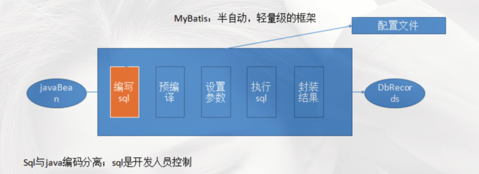
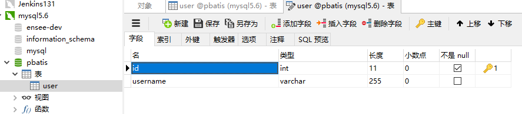
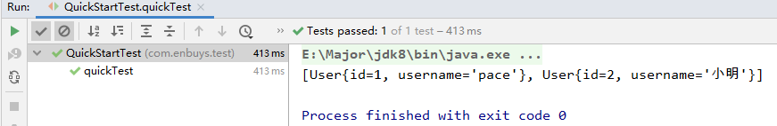
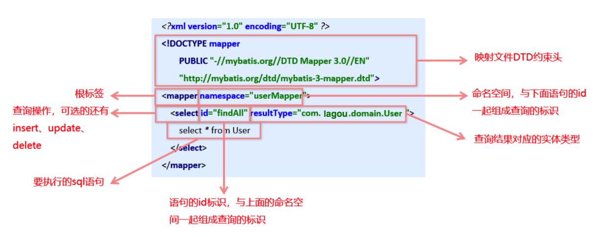
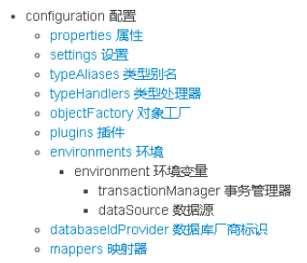
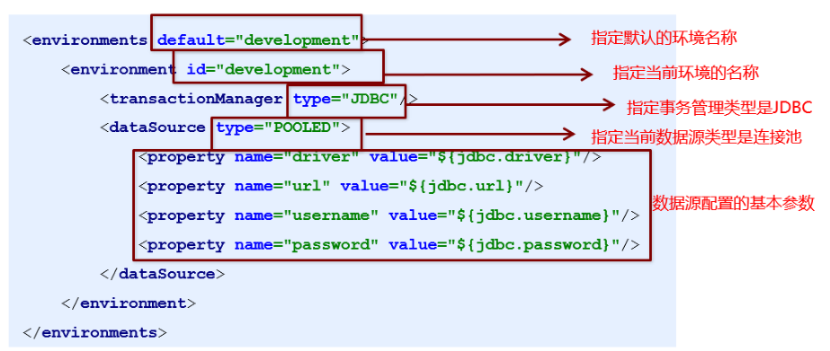
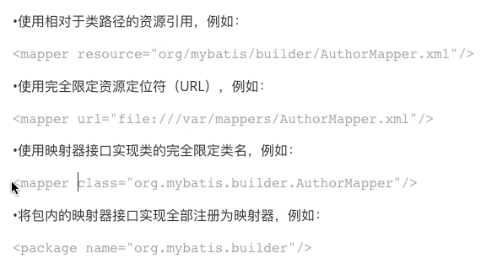
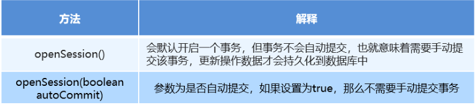
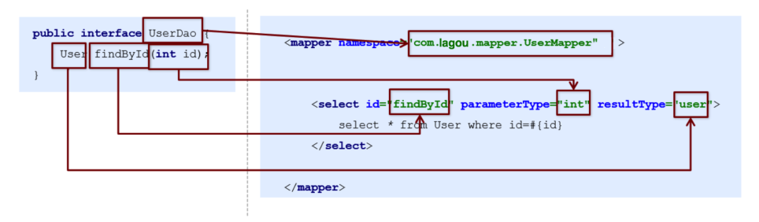

## Mybatis相关概念

### ORM

ORM是对象关系数据库映射，表示对象-关系的映射。

简单来说，就是Java中ObjectBean，与数据中表字段进行映射。

ORM框架是面向对象设计语言与关系数据库发展不同步时的中间解决方案。

采用ORM框架后，应用程序不再直接访问底层数据库，而是以面向对象的放松来操作持久化对象，而ORM框架则将这些面向对象的操作转换成底层SQL操作。

ORM框架实现的效果：把对持久化对象的保存、修改、删除等操作，转换为对数据库的操作。

### Mybatis简介

Mybatis是一款优秀的基于ORM的半自动轻量级持久层框架。

- 半自动：需要程序员手工编写sql语句，高级映射等。这样会更加可定制化，并优化sql
- 轻量级：性能消耗小
- 持久层：对数据库操作

MyBatis避免了几乎所有的JDBC代码和手动设置参数以及获取结果集。

MyBatis可以使用简单的XML或注解来配置和映射原生类型、接口和Java的POJO (Plain Old Java Objects,普通老式Java对象)为数据库中的记录。

### Mybatis历史

1. 原是Apache的一个开源项目iBatis, 2010年6月这个项目由Apache Software Foundation迁移到了Google Code,随着开发团队转投Google Code旗下，iBatis3.x正 式更名为MyBatis，代码于2013年11月迁移到Github (下 载地址见后)。

2. iBatis- 词来源于"internet"和"abatis"的组合，是一个基于Java的持久层框架。

### Mybatis优势

因为Mybatis是半自动，对于SQL需要程序员手工编写。

这样就可以定制复杂的SQL，复杂的映射关系。

并且可以将数据与业务分离，SQL与Java代码分离，功能边界更加清晰。



## Mybatis快速回顾

回顾下Mybatis最基础的开发步骤

1. 添加Mybatis依赖
2. 创建表user
3. 创建表对应的对象User
4. 创建映射配置文件UserMapper.xml
5. 创建核心配置文件SqlMapConfig.xml
6. 编写测试类

（1）添加依赖

```xml
<properties>
    <project.build.sourceEncoding>UTF-8</project.build.sourceEncoding>
    <maven.compiler.encoding>UTF-8</maven.compiler.encoding>
    <java.version>1.8</java.version>
    <maven.compiler.source>1.8</maven.compiler.source>
    <maven.compiler.target>1.8</maven.compiler.target>
</properties>

<dependencies>
    <!--mybatis-->
    <dependency>
        <groupId>org.mybatis</groupId>
        <artifactId>mybatis</artifactId>
        <version>3.4.5</version>
    </dependency>
    <!--mysql-->
    <dependency>
        <groupId>mysql</groupId>
        <artifactId>mysql-connector-java</artifactId>
        <version>5.1.6</version>
        <scope>runtime</scope>
    </dependency>
    <dependency>
        <groupId>junit</groupId>
        <artifactId>junit</artifactId>
        <version>4.12</version>
    </dependency>
</dependencies>
```

（2）创建表



（3）创建User对象

```java
public class User {
    private Integer id;
    private String username;
    ···
}
```

（4）创建映射文件

```xml
<?xml version="1.0" encoding="UTF-8" ?>
<!DOCTYPE mapper
        PUBLIC "-//mybatis.org//DTD Mapper 3.0//EN"
        "http://mybatis.org/dtd/mybatis-3-mapper.dtd">
<mapper namespace="user">
    <select id="selectList" resultType="com.enbuys.pojo.User">
        SELECT * FROM USER
    </select>
</mapper>
```

（5）创建核心配置文件

```xml
<?xml version="1.0" encoding="UTF-8" ?>
<!DOCTYPE configuration PUBLIC "-//mybatis.org//DTD Config 3.0//EN"
        "http://mybatis.org/dtd/mybatis-3-config.dtd">
<configuration>
    <!--环境配置-->
    <environments default="dev">
        <environment id="dev">
            <!-- 事务配置 这里使用JDBC事务-->
            <transactionManager type="JDBC"></transactionManager>
            <!-- 数据源，这里使用Mybatis自带的连接池-->
            <dataSource type="POOLED">
                <property name="driver" value="com.mysql.jdbc.Driver"/>
                <property name="url" value="jdbc:mysql://127.0.0.1:3306/pbatis"/>
                <property name="username" value="root"/>
                <property name="password" value="root"/>
            </dataSource>
        </environment>
    </environments>

    <!-- 配置映射文件 -->
    <mappers>
        <mapper resource="UserMapper.xml"></mapper>
    </mappers>
</configuration>
```

（6）测试

```java
public class QuickStartTest {
    @Test
    public void quickTest() throws Exception {
        // 获取配置文件流
        InputStream inputStream = Resources.getResourceAsStream("SqlMapConfig.xml");
        // 构建者模式，创建SqlSessionFactory
        SqlSessionFactory sqlSessionFactory = new SqlSessionFactoryBuilder().build(inputStream);
        // 工厂模式，创建SqlSession
        SqlSession sqlSession = sqlSessionFactory.openSession();
        // 调用方法
        List<User> objects = sqlSession.selectList("user.selectList");
        System.out.println(objects);
    }
}
```



## Mybatis的CRUD回顾

### UserMapper配置

```xml
<?xml version="1.0" encoding="UTF-8" ?>
<!DOCTYPE mapper
        PUBLIC "-//mybatis.org//DTD Mapper 3.0//EN"
        "http://mybatis.org/dtd/mybatis-3-mapper.dtd">
<mapper namespace="user">
    <select id="selectList" resultType="com.enbuys.pojo.User">
        SELECT * FROM USER
    </select>

    <!--  增  -->
    <insert id="insert" parameterType="com.enbuys.pojo.User">
        insert into user values (#{id},#{username})
    </insert>

    <!--  删  -->
    <delete id="delete" parameterType="java.lang.Integer">
        delete from user where id = #{id}
    </delete>

    <!--  改  -->
    <update id="update" parameterType="com.enbuys.pojo.User">
        update user set username = #{username} where id = #{id}
    </update>
</mapper>
```

### 测试类代码

```java
@Test
public void curdTest() throws Exception {
    // 获取配置文件流
    InputStream inputStream = Resources.getResourceAsStream("SqlMapConfig.xml");
    // 构建者模式，创建SqlSessionFactory
    SqlSessionFactory sqlSessionFactory = new SqlSessionFactoryBuilder().build(inputStream);
    // 工厂模式，创建SqlSession
    SqlSession sqlSession = sqlSessionFactory.openSession();

    User user = new User();
    user.setId(3);
    user.setUsername("curd");

    // 查
    List<User> objects = sqlSession.selectList("user.selectList");
    System.out.println(objects);

    // 增
    sqlSession.insert("user.insert",user);
    sqlSession.commit();

    // 改
    user.setUsername("new-curd");
    sqlSession.update("user.update",user);
    sqlSession.commit();

    // 删
    sqlSession.delete("user.delete",2);
    sqlSession.commit();
}
```

## Mybatis入门配置回顾

### 入门映射配置文件



这里常用的入门配置还少了一个`paramterType`：设置参数类型

### 入门核心配置文件

核心配置文件的层级关系如下图，也是官方提供的：



常用的入门配置有下面两个

#### environment环境配置

Mybatis支持多种环境配置，其实就是数据库配置，可以通过id标识来选择使用哪个环境，比如开发环境或生产环境。



#### mappers映射配置

主要作用是加载映射配置文件的，应配置映射配置文件的路径，主要配置方式有：



## Mybatis基础API回顾

其实在我们快速回顾，和上一篇的自定义ORM框架中，就大量使用到了Mybatis的基础API。

### SqlSessionFactoryBuilder

SqlSessionFactory工厂的构造器，使用了构建者模式

常用API：`SqlSessionFactory build(InputStream is)`

通过加载Mybatis核心配置文件的输入流，构建出一个SqlSessionFactory对象。

具体代码实现：

```java
// 获取配置文件流
InputStream inputStream = Resources.getResourceAsStream("SqlMapConfig.xml");
// 构建者模式，创建SqlSessionFactory
SqlSessionFactory sqlSessionFactory = new SqlSessionFactoryBuilder().build(inputStream);
```

其中Resources工具类是Mybatis自带的，通过输入配置文件的路径，将内容加载到流内存中

### SqlSessionFactory

工厂模式的使用，用于创建会话SqlSession



### SqlSession

会话对象，封装了具体CRUD的方法，并有提交，回滚事务以及获取映射器实力的方法。

执行方法主要有：

```java
<T> T selectOne(String statement, Object parameter)
<E> List<E> selectList(String statement, Object parameter)
int insert(String statement, Object parameter)
int update(String statement, Object parameter)
int delete(String statement, Object parameter)
```

操作事务方法：

```java
void commit()
void rollback()
```

## Mybatis的Dao层开发回顾

实际开发中，我们会将实际对数据库操作及持久层操作的代码统一放到Dao层。

对于Mybatis的Dao层实现主要有两种方式

### 传统开发方式

（1）编写UserDao接口

```java
public interface UserDao {
    List<User> findAll() throws IOException;
}
```

（2）编写UserDaoImpl实现类

```java
public class UserDaoImpl implements UserDao {
    @Override
    public List<User> findAll() throws IOException {
        // 获取配置文件流
        InputStream inputStream = Resources.getResourceAsStream("SqlMapConfig.xml");
        // 构建者模式，创建SqlSessionFactory
        SqlSessionFactory sqlSessionFactory = new SqlSessionFactoryBuilder().build(inputStream);
        // 工厂模式，创建SqlSession
        SqlSession sqlSession = sqlSessionFactory.openSession();
        // 调用方法
        List<User> userList = sqlSession.selectList("user.selectList");
        return userList;
    }
}
```

（3）编写测试类

```java
public class UserDaoTest {
    @Test
    public void test() throws IOException {
        UserDao userDao = new UserDaoImpl();
        List<User> userList = userDao.findAll();
        System.out.println(userList);
    }
}
```

### 代理开发方式

Mapper接口开发方法只需要程序员编写Mapper接口(相当于Dao接口)，由Mybatis 框架根据接口的定义创建接口的**动态代理对象**，代理对象的方法体同Dao接口实现类方法。

**Mapper接口开发需要遵循以下规范**

1. `Mapper.xml`文件中的`namespace`与`mapper`接口的全限定名相同
2. Mapper接口方法名和`Mapper.xml`中定义的每个`statement`的ID相同
3. Mapper接口方法的输入参数类型和`mapper.xml`中定义的每个sql的`parameterType`的类型相同
4. Mapper接口方法的输出参数类型和`mapper.xml`中定义的每个sql的`resultType`的类型相同编写`UserMapper`接口



（1）编写UserDao接口

```java
public interface UserDao {
    List<User> findAll() throws IOException;
}
```

（2）修改mapper.xml

```xml
<?xml version="1.0" encoding="UTF-8" ?>
<!DOCTYPE mapper
        PUBLIC "-//mybatis.org//DTD Mapper 3.0//EN"
        "http://mybatis.org/dtd/mybatis-3-mapper.dtd">
<mapper namespace="com.enbuys.dao.UserDao">
    <select id="findAll" resultType="com.enbuys.pojo.User">
        SELECT * FROM USER
    </select>
</mapper>
```

（3）编写测试类

```java
@Test
public void test2() throws IOException {
    // 获取配置文件流
    InputStream inputStream = Resources.getResourceAsStream("SqlMapConfig.xml");
    // 构建者模式，创建SqlSessionFactory
    SqlSessionFactory sqlSessionFactory = new SqlSessionFactoryBuilder().build(inputStream);
    // 工厂模式，创建SqlSession
    SqlSession sqlSession = sqlSessionFactory.openSession();

    // 使用Mybatis，生成代理对象
    UserDao userDao = sqlSession.getMapper(UserDao.class);
    // 执行代理对象的具体方法
    List<User> userList = userDao.findAll();
    System.out.println(userList);
}
```

> 总结：
>
> ​	在实际开发中，肯定还是代理开发方式居多，传统开发方式基本上见不到，了解即可
>
> ​	如果和Spring配合使用，可以更方便的开发

