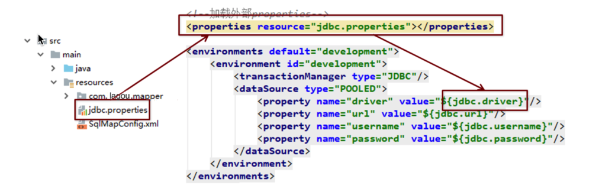
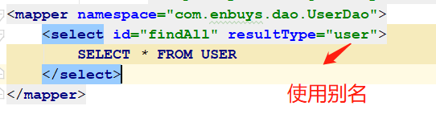
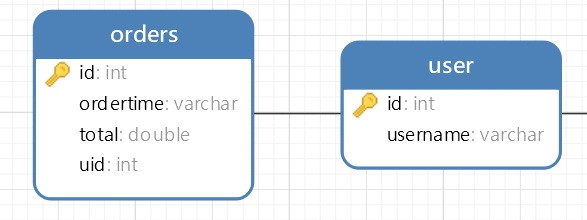
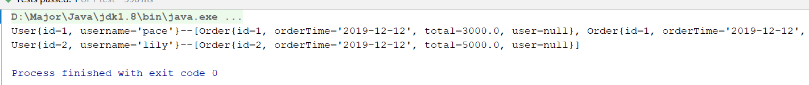
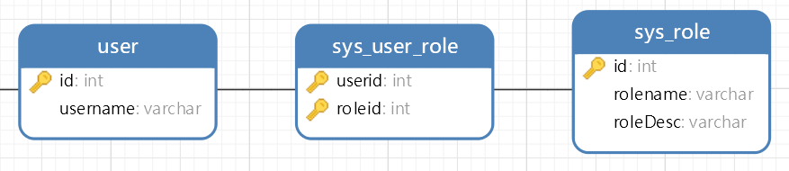
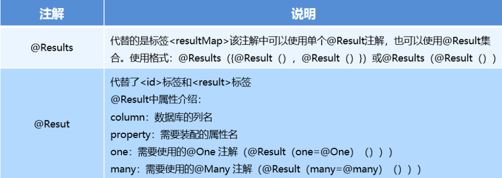
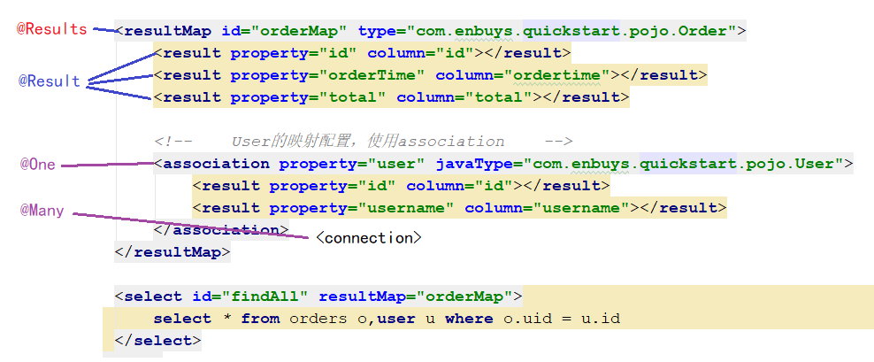

## Mybatis深入配置文件

我们在上一节回顾了基础的配置文件，接下来我们我们看看更多常用的配置

### SqlMapConfig.xml


<font color='red'>**注意！！写标签时，需要安装上面的这个顺序进行编写，如果将typeAliases放在environments下面，就会报错！**</font>

#### environment环境配置

Mybatis支持多种环境配置，其实就是数据库配置，可以通过id标识来选择使用哪个环境，比如开发环境或生产环境。


#### mappers映射配置

主要作用是加载映射配置文件的，应配置映射配置文件的路径，主要配置方式有：


这里还可以直接设置包下的所有接口

`<package name="com.enbuys.dao"/>`

#### properties配置

之前我们将jdbc的配置写死在`dataSource`标签的`property`标签中，这样非常不友好。

Mybatis提供了引用外部配置的方式，来将一些固定配置解耦



`jdbc.properties`：

```properties
driver=com.mysql.jdbc.Driver
url=jdbc:mysql://127.0.0.1:3306/pbatis
username=root
password=root
```

> `properties`配置需要放在使用它的标签前，比如上面就需要在`environments`标签前，不然会报错

#### typeAliases别名配置


在我们编写Mapper的时候，`resultType`写的是全限定类名，当有多个sql的话，需要重复配置多个全限定类名，这样略显麻烦。

使用Mybatis别名机制，可以将全限定类型设置成一个短小的别名，利于开发。

```xml
<!-- 别名 -->
<typeAliases>
	<typeAlias type="com.enbuys.pojo.User" alias="user"></typeAlias>
</typeAliases>
```



针对需要配置多个别名，如果像上面一样一个个手动配置也比较麻烦，这里可以直接配置`package`，在包下所有类都会为其设置别名，并且不区分大小写。

```xml
<!-- 别名 -->
    <typeAliases>
        <!--设置单个别名-->
<!--        <typeAlias type="com.enbuys.pojo.User" alias="user"></typeAlias>-->
        
        <!-- 扫描包下所有类设置别名，不区分大小写-->
        <package name="com.enbuys.pojo"/>
    </typeAliases>
```

上面都是自定义别名，Mybatis还为我们创建一些常用类型的别名，比如String = string,Interger = int等

### Mapper.xml

对于Mapper映射配置文件，我们之前简单介绍了一下，如下图


这里常用的入门配置还少了一个`paramterType`：设置参数类型

我们接下来要回顾一些高级使用方式。


#### 动态SQL之if

通过if标签，我们可以对入参进行判断，根据具体情况拼接一些特殊的sql。

使用方式：`<if test=""></if>`

比如：我们查询用户时，如果id存在，我们就拼接id查询，username存在，也拼接上username查询条件。

```xml
<select id="findByCondition" parameterType="user" resultType="user">
        SELECT * FROM USER
        WHERE 1 = 1
        <if test="id != null || id != ''">
            AND id = #{id}
        </if>
        <if test="username != null || username != ''">
            AND username = #{username}
        </if>
    </select>
```

#### 动态SQL之where

我们在上面使用if时，会发现where后拼接了1=1，才能保证sql的稳定性

为了解决每次都需要写1=1这个问题，Mybatis提供了`where`标签可以过滤掉条件语句中的第一个`and`或`or`关键字

使用方式：

```xml
<select id="findByCondition2" parameterType="user" resultType="user">
    SELECT * FROM USER
    <where>
        <if test="id != null || id != ''">
            AND id = #{id}
        </if>
        <if test="username != null || username != ''">
            AND username = #{username}
        </if>
    </where>
</select>
```

这样，如果id不存在，拼出的sql是：	

```
select * from user where username = ?
```

#### 动态SQL之foreach

当我们的查询条件时数组或者集合时，想要使用`id in (1,2)`这种形式的查询条件，就需要使用`foreach`标签。

比如下面例子，查询id为1和2的数据

```java
List<User> findByIds(List<Integer> ids);
```

```xml
<select id="findByIds" parameterType="list" resultType="user">
    SELECT * FROM USER
    <where>
        <if test="list != null">
            <foreach collection="list" open="id in (" close=")" item="id" separator=",">
                #{id}
            </foreach>
        </if>
    </where>
</select>
```

`foreach`中的主要元素有：

- `collection`：入参类型，一般都是List或数组的形式
  - List使用`list`
  - 数组使用`array`
- `open`：开始时的符号，一般为`(`
- `close`：关闭的符合，一般为`)`
- `item`：元素迭代时的别名
- `separator`：元素间的分隔符
- `index`：使用List，代表元素的下标，使用Map，代表元素的key

#### 动态SQL之sql

当一段sql片段需要被多个标签使用时，可以将此sql片段抽离出来，增加代码的复用性。

使用方式：`<sql id="mysql"></sql>`配合`<include refid="mysql">`

比如：

```xml
<select id="findAll" resultType="user">
    SELECT id,username FROM USER
</select>

<select id="findByCondition2" parameterType="user" resultType="user">
    SELECT id,username FROM USER
    <where>
        <if test="id != null || id != ''">
            AND id = #{id}
        </if>
        <if test="username != null || username != ''">
            AND username = #{username}
        </if>
    </where>
</select>
```

对于需要查询的字段，`id,username`是重复的，我们就可以抽离出来，别看这里只有两个字段抽离很麻烦，如果字段很多，抽离出来就大大减少代码并增加复用性

```xml
<sql id="field">
    id,
    username
</sql>

<select id="findAll" resultType="user">
    SELECT
    <include refid="field"/>
    FROM USER
</select>

<select id="findByCondition2" parameterType="user" resultType="user">
    SELECT
    <include refid="field"/>
    FROM USER
    <where>
        <if test="id != null || id != ''">
            AND id = #{id}
        </if>
        <if test="username != null || username != ''">
            AND username = #{username}
        </if>
    </where>
</select>
```


## Mybatis复杂映射开发

### 一对一查询

用户与订单表，用户对订单是一对多关系，订单对用户是一对一关系。

这里我们的需求就是查询订单，同时查询出他的用户信息。



查询语句：

```sql
select * from order,user where o.uid = u.id
```

因为我们需要在订单中查出用户信息，所以订单实体类是这样的：

```java
public class Order {
    private Integer id;
    private String orderTime;
    private double total;

    // 用户信息
    private User user;
    ···//get set
}
```

> 这里其实应该重新写一个`OrderVo`继承`Order`类，为了方便，就直接把`User`写在`Order`里了

最关键的就是映射配置的编写，因为我们在Order实体加了User对象，所以不能再使用简单的`resultType`了：

```xml
<?xml version="1.0" encoding="UTF-8" ?>
<!DOCTYPE mapper
        PUBLIC "-//mybatis.org//DTD Mapper 3.0//EN"
        "http://mybatis.org/dtd/mybatis-3-mapper.dtd">
<mapper namespace="com.enbuys.dao.OrderMapper">
    
    <resultMap id="orderMap" type="com.enbuys.pojo.Order">
        <result property="id" column="id"></result>
        <result property="orderTime" column="ordertime"></result>
        <result property="total" column="total"></result>

        <!--    User的映射配置，使用association    -->
        <association property="user" javaType="com.enbuys.pojo.User">
            <result property="id" column="id"></result>
            <result property="username" column="username"></result>
        </association>
    </resultMap>

    <select id="findAll" resultMap="orderMap">
        select * from orders o,user u where o.uid = u.id
    </select>
</mapper>
```

我们使用到了`resultMap`，对于结果字段和实体成员变量一一对应，并且对象型变量使用`association`设置映射关系

### 一对多查询

例子和一对一一样，不过这次我们反过来，查询用户信息并查询用户的所有订单信息，即一对多查询。

查询sql：

```sql
select * from user u LEFT JOIN orders o on o.uid = u.id
```

这里我们在原有User基础上，创建UserVO实体对象，添加`List<Order> orderList`成员变量

```java
public class UserVO extends User {

    private List<Order> orderList;

    public List<Order> getOrderList() {
        return orderList;
    }

    public void setOrderList(List<Order> orderList) {
        this.orderList = orderList;
    }

}
```

对应的Dao查询方法为：

```java
List<UserVO> findAll();
```

对应的映射文件配置：

```xml
<resultMap id="userMap" type="com.enbuys.pojo.UserVO">
    <result property="id" column="id"></result>
    <result property="username" column="username"></result>

    <!--    Order集合，使用collection    -->
    <collection property="orderList" ofType="com.enbuys.pojo.Order">
        <result property="id" column="id"></result>
        <result property="orderTime" column="ordertime"></result>
        <result property="total" column="total"></result>
    </collection>
</resultMap>

<select id="findAll" resultMap="userMap">
    select * from user u LEFT JOIN orders o on o.uid = u.id
</select>
```

这里在`resultMap`中使用了`collection`标签，表示有多个对象结果需要保存到集合中，`ofType`属性标记着封装到哪个对象中，即泛型类。



### 多对多查询

> 多对多的实现方式其实和一对多基本相同，其实改变的就是sql语句，需要多连接一张表进行查询

用户有多个角色，角色又可以有多个用户，就组成了多对多关系



需求：查询用户的同时，查询所有角色信息。

查询SQL：

```sql
select * from user u 
LEFT JOIN sys_user_role s on s.userid = u.id
LEFT JOIN sys_role r on s.roleid = r.id
```

创建UserRoleVO和Role对象

```java
public class Role {
    private Integer id;
    private String roleName;
    private String roleDesc;
}

public class UserRoleVO extends User {
    private List<Role> roleList;

    public List<Role> getRoleList() {
        return roleList;
    }

    public void setRoleList(List<Role> roleList) {
        this.roleList = roleList;
    }
}
```

创建对应的映射文件：

```xml
 <resultMap id="userRoleMap" type="com.enbuys.pojo.UserRoleVO">
     <result property="id" column="id"></result>
     <result property="username" column="username"></result>

     <!--    Order集合，使用collection    -->
     <collection property="roleList" ofType="com.enbuys.pojo.Role">
         <result property="id" column="id"></result>
         <result property="roleName" column="rolename"></result>
         <result property="roleDesc" column="roleDesc"></result>
     </collection>
</resultMap>

<select id="findAllUserRole" resultMap="userRoleMap">
    select * from user u
    LEFT JOIN sys_user_role s on s.userid = u.id
    LEFT JOIN sys_role r on s.roleid = r.id
</select>
```

看到映射文件，可以发现和一对多查询几乎一样，所以多对多就是改了SQL的一对多

## Mybatis注解开发回顾

### Mybatis常用注解

通过注解开发，我们可以不再减少对配置文件的使用。

- @Insert：实现新增
- @Update
- @Delete
- @Select
- @Result：封装结果集
- @Results：与@Result一起使用，封装多个结果集
- @One：实现一对一结果集封装
- @Many：实现一对多结果集封装

### 注解开发CRUD

这里我们还是使用之前的User类进行测试

（1）创建Mapper对象

```java
public interface UserMapper {
    List<UserVO> findAll();
    List<UserRoleVO> findAllUserRole();

    @Insert("insert into user values(#{id},#{username})")
    void insert(User user);

    @Delete("delete from user where id = #{id}")
    void delete(Integer id);

    @Update("update user set username = #{username} where id = #{id}")
    void update(User user);

    @Select("select * from user")
    List<User> selectAll();
}
```

（2）将类设置到核心配置中

两种实现方式，扫描包和加载类对象

```xml
<mappers>
    <!-- 使用扫描包形式 -->
    <!--<package name="com.enbuys.quickstart.dao"/>-->
    <!-- 加载类对象形式 -->
    <mapper class="com.enbuys.quickstart.dao.UserMapper"></mapper>
</mappers>
```

### 注解实现复杂映射





上面两个图，大致说明了如何使用注解替换复杂映射，接着我们用上面例子，修改成功注解形式的映射：

#### 一对一

注解实现方式和配置文件略有不同，我们直接看代码

（1）首先需要在`UserMapper`中新建一个根据`id`查询用户的方法

```java
public interface UserMapper {

    ····

    @Select("select * from user where id = #{id}")
    User selectById(Integer id);
}
```

（2）然后编写注解映射

```java
public interface OrderMapper {

    @Results({
        @Result(property = "id",column = "id"),
        @Result(property = "orderTime",column = "ordertime"),
        @Result(property = "total",column = "total"),
        @Result(property = "user",
                column = "uid",
                javaType = User.class,
                one = @One(select = "com.enbuys.quickstart.dao.UserMapper.selectById"))
    })
    @Select("select * from orders")
    List<Order> findAll();
}
```

这里我们可以发现，对于`User`对象，我们使用了`@One`，存放了根据id查询用户的`statementId`。

其原理是：首先会查询订单信息，然后Mybatis会根据返回的`uid`，去调用`UserMapper`中的`selectById`方法，查询用户对象，然后返回封装起来，`javaType`固定了返回时封装的对象，就是`User`

#### 一对多

在查询User的同时需要查询Order，模仿一对一的实现，我们需要在`OrderMapper`中先创建调用方法

（1）在`OrderMapper`中创建根据`uid`查询`Order`集合的方法

```java
public interface OrderMapper {

    ···

    @Select("select * from orders where uid = #{uid}")
    List<Order> findByUid(Integer uid);
}
```

（2）配置注解映射

```java
public interface UserMapper {

    @Results({
        @Result(property = "id",column = "id"),
        @Result(property = "username",column = "username"),
        @Result(property = "orderList",
                column = "id",
                javaType = List.class,
                many = @Many(select = "com.enbuys.quickstart.dao.OrderMapper.findByUid")),
    })
    @Select("select * from user")
    List<UserVO> findAll();
    
    ···
}
```

因为是一对多关系，所以使用到了`List`集合来接收，这里会拿着用户`id`，去调用订单的`findByUid`方法，查询订单集合再返回回来

#### 多对多

多对多和一对多差不多，这里直接放代码：

```java
public interface UserMapper {

    @Results({
            @Result(property = "id",column = "id"),
            @Result(property = "username",column = "username"),
            @Result(property = "roleList",
                    column = "id",
                    javaType = List.class,
                    many = @Many(select = "com.enbuys.quickstart.dao.RoleMapper.findByUid")),
    })
    @Select("select * from user")
    List<UserRoleVO> findAllUserRole();
}

public interface RoleMapper {

    @Select("select * from sys_role r left join sys_user_role s on s.roleid = r.id where s.userid = #{uid}")
    List<Role> findByUid(Integer uid);
}
```

注意需要将`RoleMapper`也加载到核心配置中