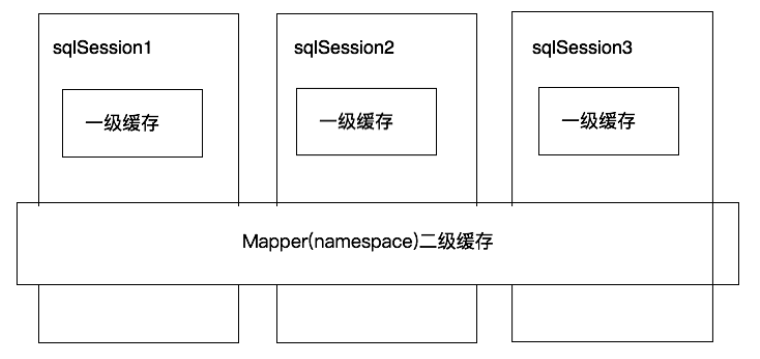
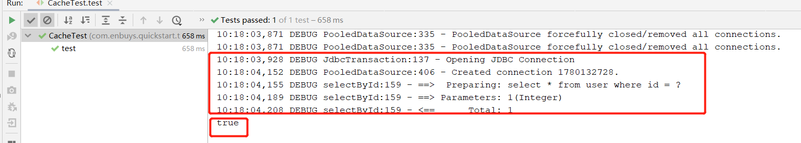
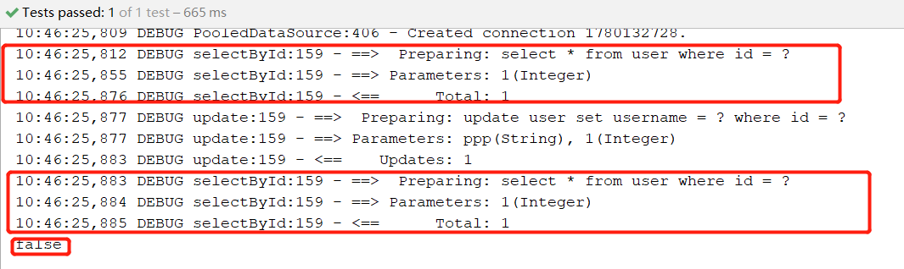
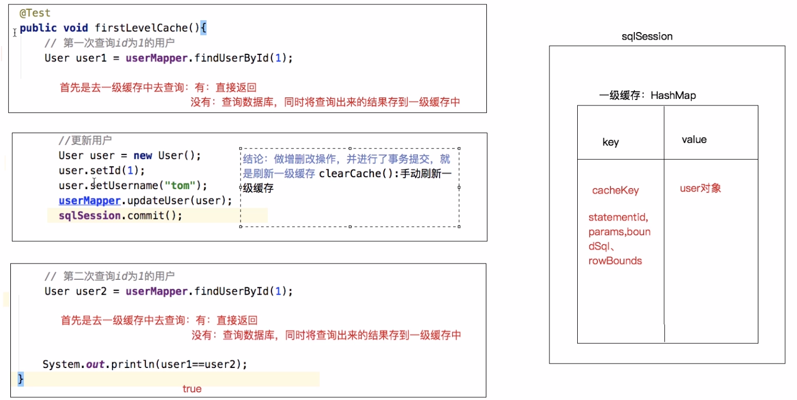
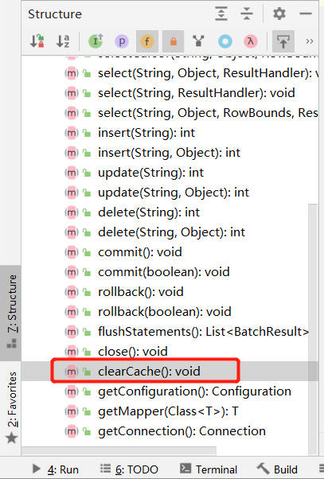
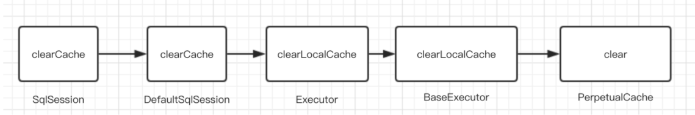
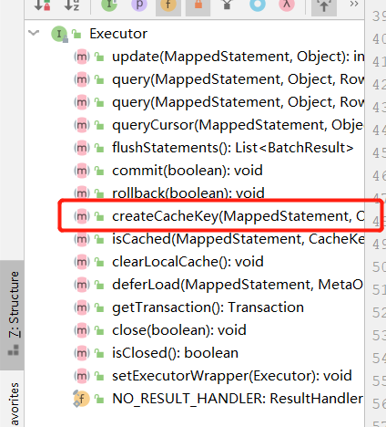
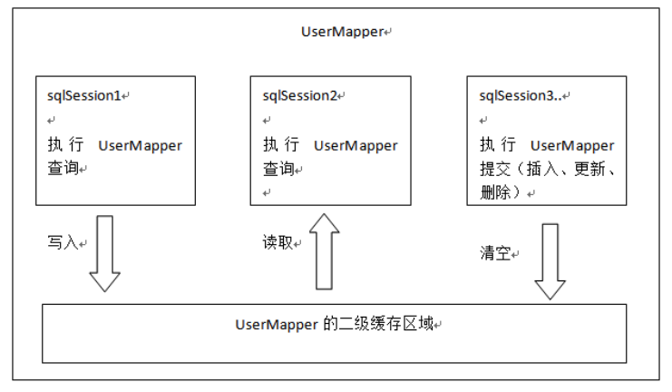
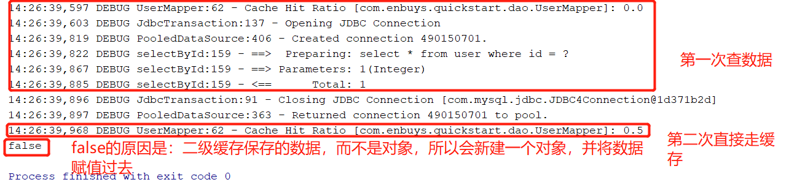
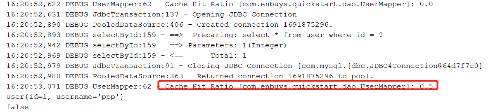

# Mybatis缓存回顾

## Mybatis缓存简介

缓存就是内存中的数据，当有请求进来时，直接从内存中拿数据，而不是请求数据库，等数据库返回数据响应。

缓存的好处：

- 避免频繁与数据库交互
- 内存读取数据速度看效率高
- 总的来说就是提高性能，提高响应速度

Mybatis提供了两种缓存，一级缓存和二级缓存



- 一级缓存：是SqlSession级别的，每个会话都有一个缓存机制，其实现是HashMap，各会话缓存独立
- 二级缓存：横跨SqlSession，Mapper级别的，在一个namespace中使用，Mapper中所有SqlSession都可以访问共享二级缓存

因为要测试缓存，肯定需要用到日志，首先向项目添加日志配置

```xml
<dependency>
    <groupId>log4j</groupId>
    <artifactId>log4j</artifactId>
    <version>1.2.17</version>
</dependency>
<dependency>
    <groupId>org.slf4j</groupId>
    <artifactId>slf4j-log4j12</artifactId>
    <version>1.7.7</version>
</dependency>
```

```properties
### direct log messages to stdout ###
log4j.appender.stdout=org.apache.log4j.ConsoleAppender
log4j.appender.stdout.Target=System.out
log4j.appender.stdout.layout=org.apache.log4j.PatternLayout
log4j.appender.stdout.layout.ConversionPattern=%d{ABSOLUTE} %5p %c{1}:%L - %m%n

### set log levels - for more verbose logging change 'info' to 'debug' ###
log4j.rootLogger=debug, stdout
```

这里直接输出控制台，不保存到文件中了

## 一级缓存

上面我们了解到一级缓存时会话级别的缓存，所以我们用个例子进行测试，查询两次User对象，看看执行了几次sql，并判断两个User对象是否一样。

```java
public class CacheTest {

    private UserMapper userMapper;

    @Before
    public void initMapper() throws IOException {
        InputStream inputStream = Resources.getResourceAsStream("quickstart/SqlMapConfig.xml");
        SqlSessionFactory sessionFactory = new SqlSessionFactoryBuilder().build(inputStream);
        SqlSession sqlSession = sessionFactory.openSession(true);
        userMapper = sqlSession.getMapper(UserMapper.class);
    }

    @Test
    public void test(){
        // 第一次
        User user = userMapper.selectById(1);
        // 第二次
        User user1 = userMapper.selectById(1);
        // 判断
        System.out.println(user == user1);
    }
}
```



执行后发现，只有一次SQL查询日志，并且返回值相同。

**接着我们尝试使用修改操作，修改user对象再次查询，看看是否还是用原来的缓存对象**

```java
@Test
public void test(){
    // 第一次
    User user = userMapper.selectById(1);

    // 修改
    user.setUsername("ppp");
    userMapper.update(user);

    // 第二次
    User user1 = userMapper.selectById(1);
    // 判断
    System.out.println(user == user1);
}
```



调用两次查询，并且结果不同

### 总结



- 当有查询请求进来后，SqlSession首先会查看缓存是否存在，存在直接返回，不存在查询数据库将结果保存到缓存中再返回
- SqlSession中有一个HashMap用来存放缓存对象
  - `key`为`statementId`，`params`，`boundSql`，`rowBounds`组成的`cacheKey`
  - `value`为对应查询出来的对象
- 当SqlSession进行了增删改，或者`clearCache()`手动刷新缓存的操作，会清空SqlSession中的缓存，避免脏数据的产生

## 一级缓存原理及源码分析

首先我们要带着问题去查看源码

- 一级缓存是什么？是不是HashMap
- 一级缓存什么时候被创建的
- 一级缓存的工作流程？

### 一级缓存是什么

我们知道，一级缓存是SqlSession级别的，所以我们直接从SqlSession开始入手，查看接口中哪些方法，比较像是和缓存有关的：



看了一堆，发现就一个`clearCache()`方法目测和缓存有关。

因为SqlSession是接口，所以我们需要到子实现类去查看具体方法实现



我们一层层递进后，发现最终是在`PerpetualCache`调用的`clear()`方法

```java
public class PerpetualCache implements Cache {

    private Map<Object, Object> cache = new HashMap<Object, Object>();

    @Override
    public void clear() {
        cache.clear();
    }
    
    ···
}
```

从源码可以一目了然，**使用的是HashMap存储的一级缓存**

找到了一级缓存是什么，我们去看看一级缓存是怎么被创建的

### 一级缓存的创建

经过我们第一篇自定义ORM笔记的研究，关于具体JDBC的操作都是封装到`Executor`中的，所以创建一级缓存是不是也在`Executor`中呢？我们去看一下他的类结构



这个`createCacheKey()`方法，看名字就知道是创建缓存的方法，进去看看

```java
@Override
public CacheKey createCacheKey(MappedStatement ms, Object parameterObject, RowBounds rowBounds, BoundSql boundSql) {
    if (closed) {
        throw new ExecutorException("Executor was closed.");
    }
    // 创建一个缓存Key对象
    CacheKey cacheKey = new CacheKey();
    // 保存statementId
    cacheKey.update(ms.getId());
    // 保存关于分页的信息
    cacheKey.update(rowBounds.getOffset());
    // 也是分页的信息
    cacheKey.update(rowBounds.getLimit());
    // 保存sql
    cacheKey.update(boundSql.getSql());
    List<ParameterMapping> parameterMappings = boundSql.getParameterMappings();
    TypeHandlerRegistry typeHandlerRegistry = ms.getConfiguration().getTypeHandlerRegistry();
    // mimic DefaultParameterHandler logic
    for (ParameterMapping parameterMapping : parameterMappings) {
        //···
        // 保存入参
        cacheKey.update(value); 
    }
    if (configuration.getEnvironment() != null) {
        // 保存environment的id
        cacheKey.update(configuration.getEnvironment().getId());
    }
    return cacheKey;
}
```

通过源码查看，我们会发现key中保存了很多东西

- `statementId`
- 分页信息
- 解析后的`sql`
- 查询条件，入参
- 核心配置中的`environment`的ID

### 一级缓存的工作流程

接着跟着创建的脚本，去看看具体工作流程是咋样的。

直接搜索`createCacheKey()`的调用地点，会发现是在`query()`方法中，直接查看源码：

```java
@Override
public <E> List<E> query(MappedStatement ms, Object parameter, RowBounds rowBounds, ResultHandler resultHandler) throws SQLException {
    BoundSql boundSql = ms.getBoundSql(parameter);
	// 创建缓存key
    CacheKey key = createCacheKey(ms, parameter, rowBounds, boundSql);
    // 向下调用
    return query(ms, parameter, rowBounds, resultHandler, key, boundSql);
}

@Override
public <E> List<E> query(MappedStatement ms, Object parameter, RowBounds rowBounds, ResultHandler resultHandler, CacheKey key, BoundSql boundSql) throws SQLException {
    // ··· 一些判断
    List<E> list;
    try {
        queryStack++;
        // 关键代码：取缓存 从缓存中取出key的对象，这里就是取缓存的操作
        list = resultHandler == null ? (List<E>) localCache.getObject(key) : null;
        if (list != null) {
            // 缓存中存在，处理一下存储过程，不关键
            handleLocallyCachedOutputParameters(ms, key, parameter, boundSql);
        } else {
            // 如果不存在，执行向数据库查询的操作
            list = queryFromDatabase(ms, parameter, rowBounds, resultHandler, key, boundSql);
        }
    } finally {
        queryStack--;
    }
    //···
    // 将结果返回 
    return list;
}

// 向数据库查询数据
private <E> List<E> queryFromDatabase(MappedStatement ms, Object parameter, RowBounds rowBounds, ResultHandler resultHandler, CacheKey key, BoundSql boundSql) throws SQLException {
    List<E> list;
    // 首先添加一个标签，标识正在执行数据库查询
    localCache.putObject(key, EXECUTION_PLACEHOLDER);
    try {
        // 向数据库查询，将结果放到list中
        list = doQuery(ms, parameter, rowBounds, resultHandler, boundSql);
    } finally {
        // 删除之前的标识
        localCache.removeObject(key);
    }
    // 将结果放在缓存中
    localCache.putObject(key, list);
    if (ms.getStatementType() == StatementType.CALLABLE) {
        localOutputParameterCache.putObject(key, parameter);
    }
    return list;
}
```

通过源码查看，我们清晰的了解了Mybatis对于一级缓存的操作是如何实现的。

## 二级缓存

二级缓存类似一级缓存，第一次查询会去缓存中查，有返回，没有查数据再放到缓存中。只不过二级缓存是跨SqlSession的，也就是多个SqlSession共享同一个namespace下的缓存，是基于namespace的，也就是说如果两个mapper配置使用同一个namespace，那么其中的查询数据也将共享。



### 二级缓存的开启

开启分为配置方式和注解方式

#### 配置方式

在全局配置文件中添加下面代码

```xml
<settings>
    <setting name="cacheEnabled" value="true"/>
</settings>
```

然后再对应需要开启的mapper映射配置中配置：

```xml
<cache></cache>
```

只需要这么一个空标签即可，如果标签中不写任何，默认使用Mybatis的二级缓存，这里也可以配置其他的缓存，比如Redis，或者自定义缓存，需要实现`Cache`接口

#### 注解方式

只需在Mapper类上添加注解：`@CacheNamespace`

### 二级缓存的使用

首先，对应的实体类需要添加Serializable序列化接口，因为Mybatis不确定你是否使用它的二级缓存，如果使用自定义的或者其他组件的缓存，可能会有磁盘化存储操作，就会需要序列化，所以Mybatis会提前判断你的保存的数据是否存在序列化接口。

（1）为User添加序列化接口

```java
public class User implements Serializable {
    private Integer id;
    private String username;
}
```

（2）测试二级缓存

```java
public class CacheTest {

    private UserMapper userMapper;
    private SqlSessionFactory sessionFactory;

    @Before
    public void initMapper() throws IOException {
        InputStream inputStream = Resources.getResourceAsStream("quickstart/SqlMapConfig.xml");
        sessionFactory = new SqlSessionFactoryBuilder().build(inputStream);
        SqlSession sqlSession = sessionFactory.openSession(true);
        userMapper = sqlSession.getMapper(UserMapper.class);
    }

    @Test
    public void testTwo(){
        SqlSession sqlSession1 = sessionFactory.openSession(true);
        SqlSession sqlSession2 = sessionFactory.openSession(true);
        SqlSession sqlSession3 = sessionFactory.openSession(true);
        UserMapper userMapper1 = sqlSession1.getMapper(UserMapper.class);
        UserMapper userMapper2 = sqlSession2.getMapper(UserMapper.class);
        UserMapper userMapper3 = sqlSession3.getMapper(UserMapper.class);

        // 第一次
        User user1 = userMapper1.selectById(1);
        // 第一次查询完，关闭SqlSession，清空一级缓存
        sqlSession1.close();

        // 第二次
        User user2 = userMapper2.selectById(1);
        // 判断
        System.out.println(user1 == user2);
    }
}
```



**二级缓存不会直接缓存对象，而是缓存对象中的数据，所以会新创建一个对象，即取出的对象不同**

（3）调用增删改方法测试二级缓存

```java
@Test
public void testTwo(){
    SqlSession sqlSession1 = sessionFactory.openSession(true);
    SqlSession sqlSession2 = sessionFactory.openSession(true);
    SqlSession sqlSession3 = sessionFactory.openSession(true);
    UserMapper userMapper1 = sqlSession1.getMapper(UserMapper.class);
    UserMapper userMapper2 = sqlSession2.getMapper(UserMapper.class);
    UserMapper userMapper3 = sqlSession3.getMapper(UserMapper.class);

    // 第一次
    User user1 = userMapper1.selectById(1);
    // 第一次查询完，关闭SqlSession，清空一级缓存
    sqlSession1.close();

    // 修改测试
    user1.setUsername("pce");
    userMapper3.update(user1);
    sqlSession3.commit();

    // 第二次
    User user2 = userMapper2.selectById(1);
    System.out.println(user2);
    // 判断
    System.out.println(user1 == user2);
}
```


可以发现，第二次也执行了查询语句，和一级缓存一样，对于增删改操作会清空二级缓存，防止脏数据的产生

### 二级缓存的其他配置

Mybatis二级缓存还可以配置`userCache`和`flushCache`配置项，两个都是针对单条Statement而言的

- `userCache`：针对一个Statement，设置是否开启二级缓存，比如全局开启了二级缓存，但是有一条数据不能使用缓存，必须每次都要查询，就可以使用这个配置，默认true
- `flushCache`：针对一个Statement，设置是否开启缓存刷新，即增删改操作不会删除此条语句查出的数据。默认true

配置方式使用：

```xml
<select id="findAll" resultMap="userMap" useCache="false" flushCache="false">
    select * from user u LEFT JOIN orders o on o.uid = u.id
</select>
```

注解方式使用：

```java
@Options(useCache = true,flushCache = Options.FlushCachePolicy.DEFAULT)
@Select("select * from user where id = #{id}")
User selectById(Integer id);
```

`Options.FlushCachePolicy.DEFAULT`为`true`，也可以设置`Options.FlushCachePolicy.FALSE`，`Options.FlushCachePolicy.TRUE`

## 使用Redis当二级缓存

在二级缓存我们介绍了，使用配置文件开启时，需要配置`<cache>`标签，其实它默认使用是：

`<cache type="org.apache.ibatis.cache.impl.PerpetualCache"/>`

即Mybatis自带的缓存配置，如果有看一级缓存源码分析的话，会发现这里的Cache实现类其实和一级使用的是一个，即保存到HashMap中的。

这样会有什么问题呢？

如果是分布式项目，HashMap是基于单个应用的内存中的，所以不同应用间获取缓存数据就会出现问题，这也是分布式缓存的问题。这时我们就需要第三方应用进行存储，这里Redis非关系型数据库就很不错，并且Mybatis有相对应的支持。

> 当然，这里也可以自定义实现，需要实现`org.apache.ibatis.cache.Cache`接口

### 二级缓存Redis代码实现

（1）添加Mybatis-Redis依赖

```xml
<dependency>
    <groupId>org.mybatis.caches</groupId>
    <artifactId>mybatis-redis</artifactId>
    <version>1.0.0-beta2</version>
</dependency>
```

（2）添加redis配置文件：`redis.properties`

```properties
redis.host=localhost
redis.port=6379
redis.connectionTimeout=5000
redis.password=
redis.database=0
```

（3）使用RedisCache当做二级缓存

这里分为配置实现和注解实现

- 配置实现：在映射配置文件中设置缓存的`type`属性

```xml
<cache type="org.mybatis.caches.redis.RedisCache"></cache>
```

- 注解实现：在映射类上配置

```java
@CacheNamespace(implementation = RedisCache.class)
public interface UserMapper {
}
```

（4）测试

```java
public class CacheTest {

    private UserMapper userMapper;
    private SqlSessionFactory sessionFactory;

    @Before
    public void initMapper() throws IOException {
        InputStream inputStream = Resources.getResourceAsStream("quickstart/SqlMapConfig.xml");
        sessionFactory = new SqlSessionFactoryBuilder().build(inputStream);
        SqlSession sqlSession = sessionFactory.openSession(true);
        userMapper = sqlSession.getMapper(UserMapper.class);
    }

    @Test
    public void testTwo(){
        SqlSession sqlSession1 = sessionFactory.openSession(true);
        SqlSession sqlSession2 = sessionFactory.openSession(true);
        SqlSession sqlSession3 = sessionFactory.openSession(true);
        UserMapper userMapper1 = sqlSession1.getMapper(UserMapper.class);
        UserMapper userMapper2 = sqlSession2.getMapper(UserMapper.class);
        UserMapper userMapper3 = sqlSession3.getMapper(UserMapper.class);

        // 第一次
        User user1 = userMapper1.selectById(1);
        // 第一次查询完，关闭SqlSession，清空一级缓存
        sqlSession1.close();

        // 修改测试
        /*user1.setUsername("pce");
        userMapper3.update(user1);
        sqlSession3.commit();*/

        // 第二次
        User user2 = userMapper2.selectById(1);
        System.out.println(user2);
        // 判断
        System.out.println(user1 == user2);
    }
}
```



正确使用

### RedisCache源码分析

我们简单看下`RedisCache`的实现原理，直接进入`RedisCache`内部

#### 构造方法

```java
public final class RedisCache implements Cache {
    private static JedisPool pool;

    public RedisCache(String id) {
        if (id == null) {
            throw new IllegalArgumentException("Cache instances require an ID");
        } else {
            this.id = id;
            // 加载配置文件，返回RedisConfig对象
            RedisConfig redisConfig = RedisConfigurationBuilder.getInstance().parseConfiguration();
            /* 从配置文件取配置，这里redisPropertiesFilename就是redis.properties
            public RedisConfig parseConfiguration(ClassLoader classLoader) {
        		Properties config = new Properties();
        		InputStream input = classLoader.getResourceAsStream(this.redisPropertiesFilename);
        		...
        		return jedisConfig
            }
            */
            
            // 通过配置，创建Jedis连接池
            pool = new JedisPool(redisConfig, redisConfig.getHost(), redisConfig.getPort(), redisConfig.getConnectionTimeout(), redisConfig.getSoTimeout(), redisConfig.getPassword(), redisConfig.getDatabase(), redisConfig.getClientName());
        }
    }
}
```

首先看它的构造方法，可以发现它会记载配置文件，然后读取配置存到`RedisConfig`对象中，使用这些配置创建Jedis连接池

> `RedisConfig`内部有默认参数，所以不编写配置文件使用默认配置也是可以的

#### 存取方法

```java
// 一个模板方法，取Jedis连接，然后执行回调方法
private Object execute(RedisCallback callback) {
    Jedis jedis = pool.getResource();
    Object var3;
    try {
        var3 = callback.doWithRedis(jedis);
    } finally {
        jedis.close();
    }
    return var3;
}

// 存数据
public void putObject(final Object key, final Object value) {
    this.execute(new RedisCallback() {
        public Object doWithRedis(Jedis jedis) {
            // 以哈希的形式存储
            jedis.hset(RedisCache.this.id.toString().getBytes(), key.toString().getBytes(), SerializeUtil.serialize(value));
            return null;
        }
    });
}

public Object getObject(final Object key) {
    return this.execute(new RedisCallback() {
        public Object doWithRedis(Jedis jedis) {
            // 通过key取出数据后，直接使用序列化进行反序列化成对象
            return SerializeUtil.unserialize(jedis.hget(RedisCache.this.id.toString().getBytes(), key.toString().getBytes()));
        }
    });
}
```

代码也很简单，关键就是缓存数据是使用`hash`结构存储的，`cache`的`id`也就是`namespace`作为`key`