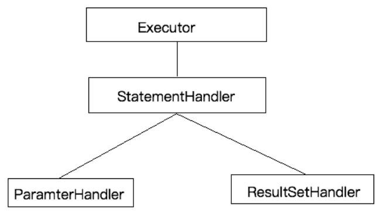
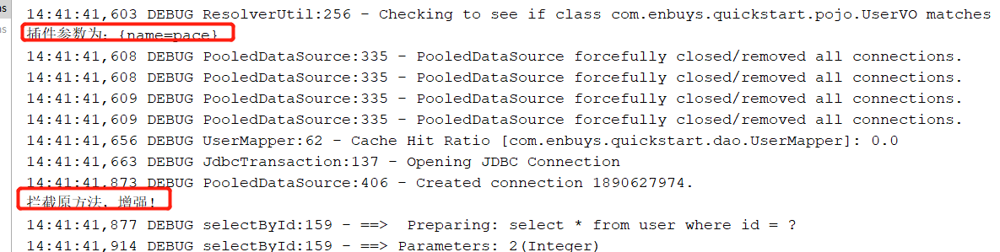
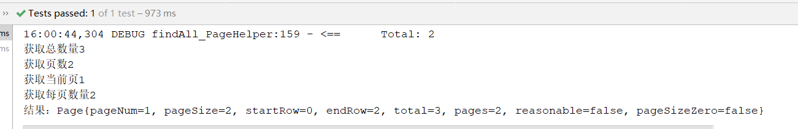
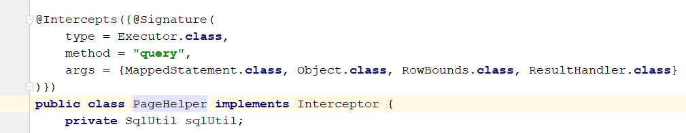
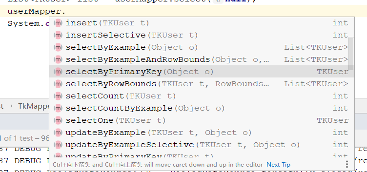

## Mybatis插件介绍

### 插件简介

一般情况下，开源框架都会提供插件或其他扩展形式的拓展点，供开发者在原始功能基础上进行一些增强。好处显而易见：

1. 增加了框架的灵活性
2. 满足用户定制化需求

对于Mybatis来说，支持的插件可以实现分页，分表，监控等扩展功能，并且插件与业务无关，用户使用过程中无感知的就被增强了。

### Mybatis四大组件简介

Mybatis对于四大组件提供了插件机制，这里先简单介绍一下四大组件，后面源码解析时会详细介绍：



- Executor：封装了对数据库进行CRUD的具体操作代码，SQL执行器
- StatementHandler：SQL解析器，将Mybatis配置的sql代码，解析成数据库能够执行的代码
- ParameterHandler：参数处理器，处理参数
- ResultSetHandler：结果处理器

### Mybatis插件简介

Mybatis的插件，就是支持对上述四大插件进行拦截，所以插件就是拦截器；而增强原始方法就是使用动态代理实现的，换句话来说，Mybatis的插件就是拦截+动态代理，并且四大组件实际都是执行的代理类。

Mybatis允许拦截的方法如下：

- Executor：update，query，commit，callback
- StatementHandler：prepare，parameterize，batch，update，query
- ParameterHandler：getParameterObject，setParameters
- ResultSetHandler：handleResultSets，handleOutputParameters

## Mybatis插件原理

以`ParameterHandler`来说，直接看下源码：

```java
public ParameterHandler newParameterHandler(MappedStatement mappedStatement,
                                            Object object, BoundSql sql, InterceptorChain interceptorChain){
    ParameterHandler parameterHandler =
        mappedStatement.getLang().createParameterHandler(mappedStatement,object,sql);
    parameterHandler = (ParameterHandler)
        interceptorChain.pluginAll(parameterHandler);
    return parameterHandler;
}

public Object pluginAll(Object target) {
    for (Interceptor interceptor : interceptors) {
        target = interceptor.plugin(target);
    }
    return target;
}
```

这里以`ParameterHandler`举例

1. 在Mybatis的`sessionFactory.openSession()`创建会话时，会将所有实现`Interceptor`的对象加载到`interceptorChain`中，即存放大量拦截器；
2. 然后当`ParameterHandler`需要使用时，比如调用了`SqlSession`的`query`方法，需要设置参数时，就会调用`newParameterHandler`方法来创建组件；
3. 创建组件时，会调用`interceptorChain.pluginAll()`方法，即加载拦截器链中的拦截器，生成代理对象返回。`
4. 当实际使用该组件的方法，比如`setParameters()`时，就会走代理对象的`invoke`方法，实现方法增强

## 自定义Mybatis插件

自定义一个Mybatis插件需要以下几个关键步骤

1. 创建一个类，实现Interceptor接口，并重以下几个方法
   - `intercept`，具体的拦截方法，原方法增强
   - `plugin`，用于将此拦截器加入到拦截器链中
   - `setProperties`，参数操作
2. 此类需添加`@Intercepts`接口，并配置`@Signature`具体拦截哪个组件
3. 将此插件添加到核心配置类中

接着我们用具体代码实现，更直观：

（1）MyPlugin自定义插件类

```java
@Intercepts({
    @Signature(
        type = StatementHandler.class,
            method = "prepare",
            args = {Connection.class,Integer.class}
    )
})
public class MyPlugin implements Interceptor {

    /**
     * 实际拦截的方法，用于进行方法增强
     * @param invocation
     * @return
     * @throws Throwable
     */
    @Override
    public Object intercept(Invocation invocation) throws Throwable {
        System.out.println("拦截原方法，增强！");
        Object proceed = invocation.proceed(); // 执行原方法
        return proceed;
    }

    /**
     * 将此拦截器，添加到拦截器链中
     * @param target
     * @return
     */
    @Override
    public Object plugin(Object target) {
        Object wrap = Plugin.wrap(target, this);
        return wrap;
    }

    /**
     * 对于参数的设置，这里取的是plugin标签下的property
     * @param properties
     */
    @Override
    public void setProperties(Properties properties) {
        System.out.println("插件参数为："+properties);
    }
}
```

（2）将MyPlugin配置到核心配置类

```xml
<plugins>
    <plugin interceptor="com.enbuys.quickstart.plugin.MyPlugin">
        <property name="name" value="pace"/>
    </plugin>
</plugins>
```

（3）测试

```java
@Test
public void simple() throws IOException {
    InputStream inputStream = Resources.getResourceAsStream("quickstart/SqlMapConfig.xml");
    sessionFactory = new SqlSessionFactoryBuilder().build(inputStream);
    SqlSession sqlSession = sessionFactory.openSession(true);
    UserMapper userMapper1 = sqlSession.getMapper(UserMapper.class);
    User user = userMapper1.selectById(2);
}
```



成功实现

## Mybatis插件源码分析

我们在之前简单了解的Mybatis的插件原理，知道在执行四大组件某个方法时，会调用代理里的`invoke`方法，那我们就去看看具体`invoke`方法，Mybatis源码是如何实现的。

记得我们在自定义Mybatis插件时，加入拦截器链，使用到了`Plugin`这个类，所以直接进入这个类

```java
public class Plugin implements InvocationHandler {
	// ···
	// 将拦截器生成代理对象，并加入到拦截器链中，
    public static Object wrap(Object target, Interceptor interceptor) {
        Map<Class<?>, Set<Method>> signatureMap = getSignatureMap(interceptor);
        Class<?> type = target.getClass();
        Class<?>[] interfaces = getAllInterfaces(type, signatureMap);
        if (interfaces.length > 0) {
            return Proxy.newProxyInstance(
                type.getClassLoader(),
                interfaces,
                new Plugin(target, interceptor, signatureMap));
        }
        return target;
    }

    // 代理方法
    @Override
    public Object invoke(Object proxy, Method method, Object[] args) throws Throwable {
        try {
            // 获取注解@Signature中的method列表
            Set<Method> methods = signatureMap.get(method.getDeclaringClass());
            // 如果当前执行的方法，在列表中
            if (methods != null && methods.contains(method)) {
                // 执行代理类的intercept方法，也就是我们刚刚实现的方法
                return interceptor.intercept(new Invocation(target, method, args));
            }
            return method.invoke(target, args);
        } catch (Exception e) {
            throw ExceptionUtil.unwrapThrowable(e);
        }
    }
}
```

通过源码，清晰了解到为何要在类上添加`@Intercepts@Signature`注解，并且`intercept`方法是怎样增强的

## PageHelper分页插件

PageHelper分页插件也是经常使用的了，使用起来也非常简单：

1. 添加PageHelper依赖
2. 核心配置类中配置依赖
3. 编写代码测试分页

（1）添加依赖

```xml
<!-- 分页插件 -->
<dependency>
    <groupId>com.github.pagehelper</groupId>
    <artifactId>pagehelper</artifactId>
    <version>3.7.5</version>
</dependency>
<dependency>
    <groupId>com.github.jsqlparser</groupId>
    <artifactId>jsqlparser</artifactId>
    <version>0.9.1</version>
</dependency>
```

（2）核心配置类配置

```xml
<plugin interceptor="com.github.pagehelper.PageHelper">
    <!--设置数据库，不同数据库分页语句不同-->
    <property name="dialect" value="mysql"/>
</plugin>
```

（3）编写分页代码

```java
@Test
public void PageHelperTest() throws IOException {
    InputStream inputStream = Resources.getResourceAsStream("quickstart/SqlMapConfig.xml");
    SqlSessionFactory sessionFactory = new SqlSessionFactoryBuilder().build(inputStream);
    SqlSession sqlSession = sessionFactory.openSession(true);
    UserMapper userMapper = sqlSession.getMapper(UserMapper.class);

    // 查询前设置分页
    PageHelper.startPage(1,2);// 第一页，2个
    List<UserVO> all = userMapper.findAll();
    // 使用PageInfo接收
    PageInfo<UserVO> pageInfo = new PageInfo<>(all);
    System.out.println("获取总数量" + pageInfo.getTotal());
    System.out.println("获取页数" + pageInfo.getPages());
    System.out.println("获取当前页" + pageInfo.getPageNum());
    System.out.println("获取每页数量" + pageInfo.getSize());
    System.out.println("结果："+all);
}
```



测试完，我们可以去看一下`PageHelper`是怎么实现的：



可以发现，也是同样的实现方法，然后再`Executor`执行`query`方法时，进行拦截

## 通用Mapper插件

通用Mapper插件也比较常用，自带一些简单的增删改查操作，可以让用户直接使用，而不用再去编写那些简单的单表操作了。

主要就是需要实现实体，并配置注解对应的表，最后使用接口继承`Mapper<T>`，就可以使用它自带的一些方法

（1）引入依赖，配置核心配置

```xml
<dependency>
    <groupId>tk.mybatis</groupId>
    <artifactId>mapper</artifactId>
    <version>3.1.2</version>
</dependency>

<plugin interceptor="tk.mybatis.mapper.mapperhelper.MapperInterceptor">
    <!--通用Mapper接口，如果有多个用逗号分隔-->
    <property name="mappers"
              value="tk.mybatis.mapper.common.Mapper"/>
</plugin>
```

（2）创建实体

```java
@Table(name="user")
public class TKUser implements Serializable {
    @Id
    private Integer id;
    private String username;
}
```

（3）创建Mapper

```java
public interface TKUserMapper extends Mapper<TKUser> {
}
```

（4）测试

```java
@Test
public void TkMapperTest() throws Exception{
    InputStream inputStream = Resources.getResourceAsStream("quickstart/SqlMapConfig.xml");
    SqlSessionFactory sessionFactory = new SqlSessionFactoryBuilder().build(inputStream);
    SqlSession sqlSession = sessionFactory.openSession(true);
    TKUserMapper userMapper = sqlSession.getMapper(TKUserMapper.class);

    List<TKUser> list = userMapper.select(null);
    System.out.println(list);
}
```

他提供了很多方法，可以具体看文档或类结构：

