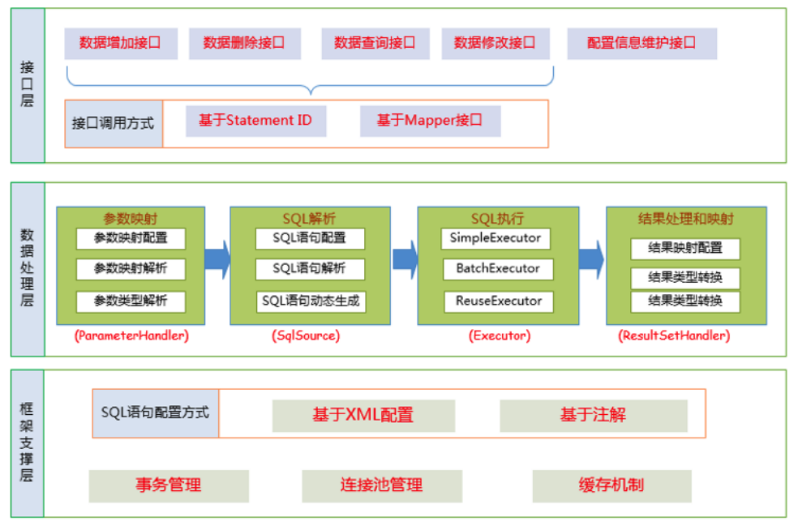
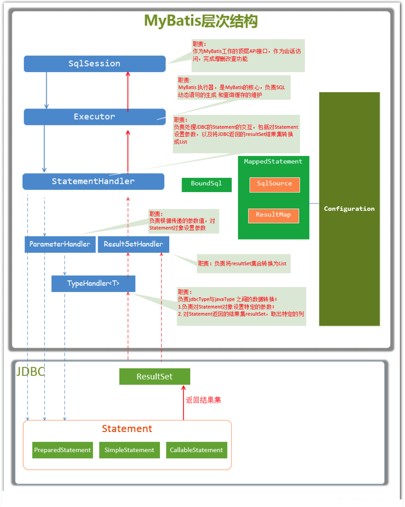
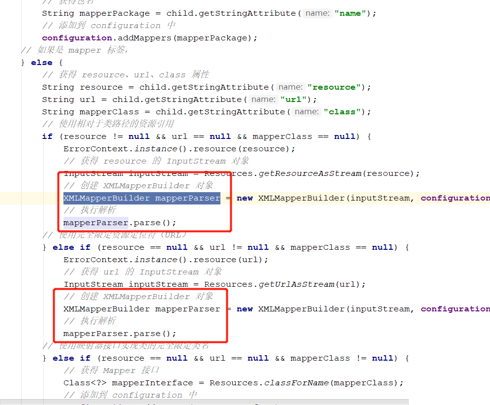
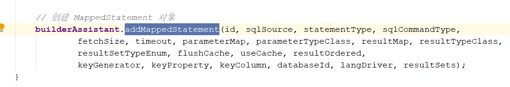
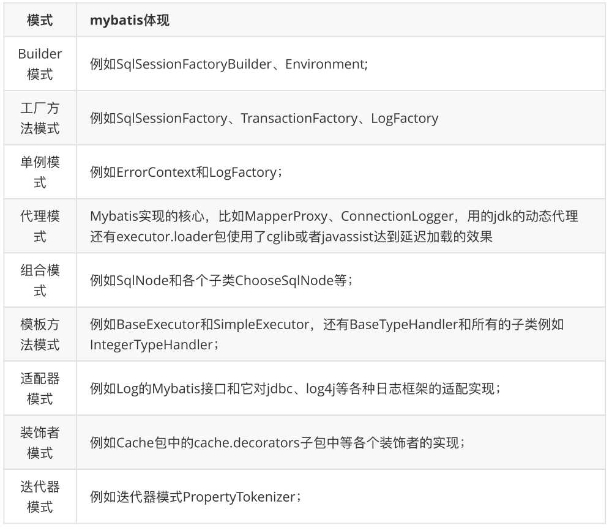

## Mybatis架构原理

### 架构设计



Mybatis分为三层：

- 接口层：提供给外部使用的接口API，程序员调用接口层代码，来对数据库进行增删改查操作。接口层接收请求后，会将请求交给数据处理层

  接口层交互方式有两种

  - 传统方式，使用StatementId请求
  - Mapper代理方式，直接调用Dao的方法

- 数据处理层：具体与JDBC交互的地方，包括对参数的映射，SQL解析成JDBC认可的样子，执行SQL语句，将结果封装处理返回。即根据调用的请求进行一次JDBC操作

- 框架支撑层：存放一些公共核心的方法，比如事物管理，连接池管理，缓存机制

### 主要构件与相互关系

Mybatis里主要的组件有以下几个：

| 组件             | 描述                                                         |
| ---------------- | ------------------------------------------------------------ |
| SqlSession       | Mybatis顶层API，表示与数据库交互的会话，封装了增删改查操作   |
| Executor         | Mybatis的执行器，是调度核心，包括SQL语句生成，查询缓存等维护 |
| StatementHandler | 封装了JDBC Statement操作，包括设置参数，执行SQL，封装结果集  |
| ParmterHandler   | 将用户传入参数，转换成JDBC可识别的参数，具体参数设置实现类   |
| ResultSetHandler | 负责将JDBC返回的结果封装成结果集，具体结果设置实现类         |
| TypeHandler      | 负责将Java实体与JDBC数据类型相互转换                         |
| MappedStatement  | 内部维护一个CRUD节点，配置文件中的<select\|update\|insert\|delete>节点 |
| SqlSource        | 负责将参数，动态的生成SQL的参数，即填充到？占位符            |
| BoundSql         | 动态的生成SQL，将Mybatis的SQL解析成JDBC可理解的SQL           |



### 总体流程

#### 1.加载配置并初始化

- 触发条件：配置初始化时
- 配置来源两个地方，一个是配置文件（核心配置，映射配置），一个是Java代码中的注解。根据面向对象规则，它会将核心配置解析到Configuration类，将映射配置解析到一个个的MappedStatement对象中。

#### 2.接收调用请求

- 触发条件：对外的API被调用
- 传入参数：SQL的ID以及参数
- 处理过程：传入下层数据处理层处理

#### 3.处理请求

- 触发条件：API层调用方法
- 传入参数：SQL的ID以及参数
- 处理过程：
  - 首先根据ID找到对应的MappedStatement对象
  - 然后根据参数，解析MappedStatement对象，生成JDBC认可的SQL语句以及对应参数
  - 获取数据库连接，执行SQL，获取结果
  - 根据MappedStatement中配置的映射关系，解析封装结果集，将结果集返回
  - 释放资源

#### 4.返回最终结果


## Mybatis源码解析

### 准备工作

- 下载Mybatis源码，这里我使用到了芋道源码提供的注释版Mybatis3的源码

- 回顾第一篇决胜Mybatis笔记，自定义ORM框架的简单实现，我们自定义时，就是按照Mybatis的架构思路实现的。

接下来我们一步步从Mybatis初始化到获得结果返回，来查看源码具体实现逻辑。

### 传统方式源码解析

#### Mybatis初始化过程

不管是传统配置型还是注解方式使用Mybatis，初始化操作都是一样的，如下代码：

```java
// 1. 读取配置文件，读成字节输入流，注意：现在还没解析
InputStream resourceAsStream = Resources.getResourceAsStream("sqlMapConfig.xml");
// 2. 解析配置文件，封装Configuration对象   创建DefaultSqlSessionFactory对象
SqlSessionFactory sqlSessionFactory = new SqlSessionFactoryBuilder().build(resourceAsStream);
```

1. 读取配置文件，读到输入流中，这里只是对配置文件的操作，和Mybatis初始化没任何关系
2. 使用配置文件的输入流，通过构造者模式创建SqlSessionFactory，这就开始了Mybatis的初始化！

**所以，我们直接进入`build()`方法查看源码：**

```java
// 1.我们最初调用的build
public SqlSessionFactory build(InputStream inputStream) {
    //调用了重载方法
    return build(inputStream, null, null);
}

// 2.调用的重载方法
public SqlSessionFactory build(InputStream inputStream, String environment, Properties properties) {
    try {
        // 创建 XMLConfigBuilder, XMLConfigBuilder是专门解析mybatis的配置文件的类
        XMLConfigBuilder parser = new XMLConfigBuilder(inputStream, environment, properties);
        // 执行 XML 解析
        // 创建 DefaultSqlSessionFactory 对象
        return build(parser.parse());
    } catch (Exception e) {
        //···
    }
}
```

进入源码，我们会发现只是一个入口方法，调用了重载方法，在重载方法里创建了`XMLConfigBuilder`，用来解析XML配置文件的，这里会发现它调用了`parser.parse()`方法

**所以我们直接进入`XMLConfigBuilder`中查看**

```java
public class XMLConfigBuilder extends BaseBuilder {
    private XMLConfigBuilder(XPathParser parser, String environment, Properties props) {
        // 创建 Configuration 对象
        super(new Configuration());
        ErrorContext.instance().resource("SQL Mapper Configuration");
        // 设置 Configuration 的 variables 属性
        this.configuration.setVariables(props);
        this.parsed = false;
        this.environment = environment;
        this.parser = parser;
    }
}
```

构造方法中，可以看到创建了`Configuration`的实例，有了解自定义框架实现的，会知道这里存放的就是核心配置类中的所有配置，包括映射文件`mapper`的配置：


存储的key就是`namespace+id`

思绪回到`XMLConfigBuilder`类，我们继续看解析xml的方法：

```java
/**
 * 解析 XML 成 Configuration 对象。
 *
 * @return Configuration 对象
 */
public Configuration parse() {
    // 若已解析，抛出 BuilderException 异常
    if (parsed) {
        throw new BuilderException("Each XMLConfigBuilder can only be used once.");
    }
    // 标记已解析
    parsed = true;
    ///parser是XPathParser解析器对象，读取节点内数据，<configuration>是MyBatis配置文件中的顶层标签
    // 解析 XML configuration 节点
    parseConfiguration(parser.evalNode("/configuration"));
    return configuration;
}
```

解析方法的最终目的就是将配置文件 构建成 `Configuration`对象，使用了`dom4j`进行xml解析，从根节点开始解析，方法为：`parseConfiguration(parser.evalNode("/configuration")); `进入此方法

```java
/**
 * 解析 XML
 *
 * 具体 MyBatis 有哪些 XML 标签，参见 《XML 映射配置文件》http://www.mybatis.org/mybatis-3/zh/configuration.html
 *
 * @param root 根节点
 */
private void parseConfiguration(XNode root) {
    try {
        //issue #117 read properties first
        // 解析 <properties /> 标签
        propertiesElement(root.evalNode("properties"));
        // 解析 <settings /> 标签
        Properties settings = settingsAsProperties(root.evalNode("settings"));
        // 加载自定义的 VFS 实现类
        loadCustomVfs(settings);
        // 解析 <typeAliases /> 标签
        typeAliasesElement(root.evalNode("typeAliases"));
        // 解析 <plugins /> 标签
        pluginElement(root.evalNode("plugins"));
        // 解析 <objectFactory /> 标签
        objectFactoryElement(root.evalNode("objectFactory"));
        // 解析 <objectWrapperFactory /> 标签
        objectWrapperFactoryElement(root.evalNode("objectWrapperFactory"));
        // 解析 <reflectorFactory /> 标签
        reflectorFactoryElement(root.evalNode("reflectorFactory"));
        // 赋值 <settings /> 到 Configuration 属性
        settingsElement(settings);
        // read it after objectFactory and objectWrapperFactory issue #631
        // 解析 <environments /> 标签
        environmentsElement(root.evalNode("environments"));
        // 解析 <databaseIdProvider /> 标签
        databaseIdProviderElement(root.evalNode("databaseIdProvider"));
        // 解析 <typeHandlers /> 标签
        typeHandlerElement(root.evalNode("typeHandlers"));
        // 解析 <mappers /> 标签
        mapperElement(root.evalNode("mappers"));
    } catch (Exception e) {
        throw new BuilderException("Error parsing SQL Mapper Configuration. Cause: " + e, e);
    }
}
```

可以看到，几乎所有核心配置中支持的标签，都被解析存放到Configuration中了，这里就不一一查看了，有兴趣的可以自行翻阅源码。

我们这里主要看一下`mappers`标签的解析`mapperElement()`



和我们自定义框架一样，也是创建了一个专门解析映射配置的`XMLMapperBuilder`对象，来对映射文件进行解析



最后会将一个个`<select|insert|delete|update>`标签中的内容解析成`MappedStatement`对象，保存到`Configuration`的`Map<String, MappedStatement> mappedStatements`中

到此关于配置文件加载解析成Java对象的代码就结束了！

**回到之前的`build()`方法：**

```java
return build(parser.parse());
```

会发现又是一个重载方法的调用：

```java
/**
 * 创建 DefaultSqlSessionFactory 对象
 *
 * @param config Configuration 对象
 * @return DefaultSqlSessionFactory 对象
 */
public SqlSessionFactory build(Configuration config) {
    return new DefaultSqlSessionFactory(config); //构建者设计模式
}
```

最终使用`Configuration`创建了SqlSessionFactory，并将其返回

**到此Mybatis的初始化工作就完毕了，主要做了两件大事**

1. 解析核心配置文件到`Configuration`对象，解析映射配置文件到`MappedStatement`对象，并保存在`Configuration`的对应Map中
2. 创建了`DefaultSqlSessionFactory`返回

#### Mybatis执行SQL流程

在看源码之前，我们需要了解一些基本知识

**SqlSession**

```
SqlSession是一个接口，它有两个实现类：
	- DefaultSqlSession：默认实现类
	- SqlSessionManager：已经弃用的实现类，所以我们不需要关注他
SqlSession是与数据库交互的顶层类，通常与ThreadLocal绑定，一个会话使用一个SqlSession，SqlSession是线程不安全的，使用完毕需要close()

public class DefaultSqlSession implements SqlSession {
	private final Configuration configuration;
	private final Executor executor;
}
SqlSession中最重要的两个变量：
	- Configuration：核心配置类，也是初始化时传过来的
	- Executor：实际执行SQL的执行器
```

**Executor**

```
Executor是一个接口，有三个实现类
	- BatchExecutor 重用语句，并执行批量更新
	- ReuseExecutor 重用预处理语句prepared statements
	- SimpleExecutor 普通的执行器，默认使用
```

了解完基本知识后，我们接着往下看代码。

当创建完SqlSessionFactory后，就可以创建SqlSession，然后使用SqlSession进行增删改查：

```java
// 1. 读取配置文件，读成字节输入流，注意：现在还没解析
InputStream resourceAsStream = Resources.getResourceAsStream("sqlMapConfig.xml");
// 2. 解析配置文件，封装Configuration对象   创建DefaultSqlSessionFactory对象
SqlSessionFactory sqlSessionFactory = new SqlSessionFactoryBuilder().build(resourceAsStream);

SqlSession sqlSession = sqlSessionFactory.openSession();
List<Object> objects = sqlSession.selectList("namespace.id");
```

**我们先去看`openSession()`方法，创建了SqlSession**

```java
//6. 进入openSession方法
@Override
public SqlSession openSession() {
    //getDefaultExecutorType()传递的是SimpleExecutor
    // level：数据库事物级别，null
    return openSessionFromDataSource(configuration.getDefaultExecutorType(), null, false);
}

//7. 进入openSessionFromDataSource。
//ExecutorType 为Executor的类型，TransactionIsolationLevel为事务隔离级别，autoCommit是否开启事务
//openSession的多个重载方法可以指定获得的SeqSession的Executor类型和事务的处理
private SqlSession openSessionFromDataSource(ExecutorType execType, TransactionIsolationLevel level, boolean autoCommit) {
    Transaction tx = null;
    try {
        // 获得 Environment 对象
        final Environment environment = configuration.getEnvironment();
        // 创建 Transaction 对象
        final TransactionFactory transactionFactory = getTransactionFactoryFromEnvironment(environment);
        tx = transactionFactory.newTransaction(environment.getDataSource(), level, autoCommit);
        // 创建 Executor 对象
        final Executor executor = configuration.newExecutor(tx, execType);
        // 创建 DefaultSqlSession 对象
        return new DefaultSqlSession(configuration, executor, autoCommit);
    } catch (Exception e) {
        // 如果发生异常，则关闭 Transaction 对象
        closeTransaction(tx); // may have fetched a connection so lets call close()
        throw ExceptionFactory.wrapException("Error opening session.  Cause: " + e, e);
    } finally {
        ErrorContext.instance().reset();
    }
}
```

通过源码可以清晰的看到，会话工厂创建了`Environment`，`Transaction`，`Executor`，`DefaultSqlSession`对象，并且对于会话对象来说，他的`autoCommit`默认为`false`，默认不自动提交。

**然后我回到原来的代码，接着就需要使用SqlSession进行增删改查操作了**

所以我们进入`selectList()`查看

```java
//8.进入selectList方法，多个重载方法
@Override
public <E> List<E> selectList(String statement) {
    return this.selectList(statement, null);
}

@Override
public <E> List<E> selectList(String statement, Object parameter) {
    return this.selectList(statement, parameter, RowBounds.DEFAULT);
}

@Override
public <E> List<E> selectList(String statement, Object parameter, RowBounds rowBounds) {
    try {
        // 获得 MappedStatement 对象
        MappedStatement ms = configuration.getMappedStatement(statement);
        // 执行查询
        return executor.query(ms, wrapCollection(parameter), rowBounds, Executor.NO_RESULT_HANDLER);
    } catch (Exception e) {
        throw ExceptionFactory.wrapException("Error querying database.  Cause: " + e, e);
    } finally {
        ErrorContext.instance().reset();
    }
}
```

`selectList`有多个重载方法，进入到最终方法后，我们可以看到它做了两件事

- 通过`statementId`，从`Configuration`中取`MappedStatement`对象，就是存放了sql语句，返回值类型，输入值类型的对象
- 然后委派`Executor`执行器去执行具体的增删改查方法

**所以，对于实际JDBC的操作，我们还需要进入Executor中查看**

#### Mybatis之Executor

我们继续从刚刚`selectList`源码中，进入`Executor`查看

```java
return executor.query(ms, wrapCollection(parameter), rowBounds, Executor.NO_RESULT_HANDLER);
```

```java
//此方法在SimpleExecutor的父类BaseExecutor中实现
@Override
public <E> List<E> query(MappedStatement ms, Object parameter, RowBounds rowBounds, ResultHandler resultHandler) throws SQLException {
    //根据传入的参数动态获得SQL语句，最后返回用BoundSql对象表示
    BoundSql boundSql = ms.getBoundSql(parameter);
    //为本次查询创建缓存的Key
    CacheKey key = createCacheKey(ms, parameter, rowBounds, boundSql);
    // 查询
    return query(ms, parameter, rowBounds, resultHandler, key, boundSql);
}
```

拆分成了三大步：

（1）先调用`MappedStatement`的`getBoundSql`方法，获取解析后的SQL语句，解析工作是由`SqlSourceBuilder`完成的

> 什么叫解析后的SQL语句呢？因为Mybatis编写SQL语句时，会用到动态SQL，比如`#{}`占位符，这种占位符JDBC是不认识的，所以需要将其转换成`？`占位符，并且将其内部的字段名存储起来，后面填充参数的时候好使用反射获取值。

```java
/**
 * 执行解析原始 SQL ，成为 SqlSource 对象
 *
 * @param originalSql 原始 SQL
 * @param parameterType 参数类型
 * @param additionalParameters 附加参数集合。可能是空集合，也可能是 {@link org.apache.ibatis.scripting.xmltags.DynamicContext#bindings} 集合
 * @return SqlSource 对象
 */
public SqlSource parse(String originalSql, Class<?> parameterType, Map<String, Object> additionalParameters) {
    // 创建 ParameterMappingTokenHandler 对象
    ParameterMappingTokenHandler handler = new ParameterMappingTokenHandler(configuration, parameterType, additionalParameters);
    // 创建 GenericTokenParser 对象
    GenericTokenParser parser = new GenericTokenParser("#{", "}", handler);
    // 执行解析
    String sql = parser.parse(originalSql);
    // 创建 StaticSqlSource 对象
    return new StaticSqlSource(configuration, sql, handler.getParameterMappings());
}
```

上面代码就可以看到，会将拆分`#{`和`}`，进行解析

（2）根据查询条件，创建缓存`key`，用来接下来去缓存查找是否有已经执行过的结果

（3）调用重载`query()`方法

**接着我们进入重载方法查看：**

```java
@Override
    public <E> List<E> query(MappedStatement ms, Object parameter, RowBounds rowBounds, ResultHandler resultHandler, CacheKey key, BoundSql boundSql) throws SQLException {
        ErrorContext.instance().resource(ms.getResource()).activity("executing a query").object(ms.getId());
        // 已经关闭，则抛出 ExecutorException 异常
        if (closed) {
            throw new ExecutorException("Executor was closed.");
        }
        // 清空本地缓存，如果 queryStack 为零，并且要求清空本地缓存。
        if (queryStack == 0 && ms.isFlushCacheRequired()) {
            clearLocalCache();
        }
        List<E> list;
        try {
            // queryStack + 1
            queryStack++;
            // 从一级缓存中，获取查询结果
            list = resultHandler == null ? (List<E>) localCache.getObject(key) : null;
            // 获取到，则进行处理
            if (list != null) {
                handleLocallyCachedOutputParameters(ms, key, parameter, boundSql);
            // 获得不到，则从数据库中查询
            } else {
                list = queryFromDatabase(ms, parameter, rowBounds, resultHandler, key, boundSql);
            }
        } finally {
            // queryStack - 1
            queryStack--;
        }
        if (queryStack == 0) {
            // 执行延迟加载
            for (DeferredLoad deferredLoad : deferredLoads) {
                deferredLoad.load();
            }
            // issue #601
            // 清空 deferredLoads
            deferredLoads.clear();
            // 如果缓存级别是 LocalCacheScope.STATEMENT ，则进行清理
            if (configuration.getLocalCacheScope() == LocalCacheScope.STATEMENT) {
                // issue #482
                clearLocalCache();
            }
        }
        return list;
    }
```

主要的逻辑：

- 从一级缓存取数据，如果有直接使用缓存的进行接下来的操作
- 如果没有，从数据库查询

**进入queryFromDatabase()方法：**

```java
// 从数据库中读取操作
private <E> List<E> queryFromDatabase(MappedStatement ms, Object parameter, RowBounds rowBounds, ResultHandler resultHandler, CacheKey key, BoundSql boundSql) throws SQLException {
    List<E> list;
    // 在缓存中，添加占位对象。此处的占位符，和延迟加载有关，可见 `DeferredLoad#canLoad()` 方法
    localCache.putObject(key, EXECUTION_PLACEHOLDER);
    try {
        // 执行读操作
        list = doQuery(ms, parameter, rowBounds, resultHandler, boundSql);
    } finally {
        // 从缓存中，移除占位对象
        localCache.removeObject(key);
    }
    // 添加到缓存中
    localCache.putObject(key, list);
    // 暂时忽略，存储过程相关
    if (ms.getStatementType() == StatementType.CALLABLE) {
        localOutputParameterCache.putObject(key, parameter);
    }
    return list;
}

@Override
public <E> List<E> doQuery(MappedStatement ms, Object parameter, RowBounds rowBounds, ResultHandler resultHandler, BoundSql boundSql) throws SQLException {
    Statement stmt = null;
    try {
        Configuration configuration = ms.getConfiguration();
        // 传入参数创建StatementHanlder对象来执行查询
        StatementHandler handler = configuration.newStatementHandler(wrapper, ms, parameter, rowBounds, resultHandler, boundSql);
        // 创建jdbc中的statement对象
        stmt = prepareStatement(handler, ms.getStatementLog());
        // 执行 StatementHandler  ，进行读操作
        return handler.query(stmt, resultHandler);
    } finally {
        // 关闭 StatementHandler 对象
        closeStatement(stmt);
    }
}
```

通过代码可以看到，对于实际与JDBC交互的代码，`Executor`也懒得搞，又像`SqlSession`一样，委派给小弟`StatementHandler`了。

所以我们接下来去`StatementHandler`中查看具体逻辑。

#### Mybatis之StatementHandler

我们从刚刚的Executor的代码查看

```java
@Override
public <E> List<E> doQuery(MappedStatement ms, Object parameter, RowBounds rowBounds, ResultHandler resultHandler, BoundSql boundSql) throws SQLException {
    Statement stmt = null;
    try {
        Configuration configuration = ms.getConfiguration();
        // 传入参数创建StatementHanlder对象来执行查询
        StatementHandler handler = configuration.newStatementHandler(wrapper, ms, parameter, rowBounds, resultHandler, boundSql);
        // 创建jdbc中的statement对象
        stmt = prepareStatement(handler, ms.getStatementLog());
        // 执行 StatementHandler  ，进行读操作
        return handler.query(stmt, resultHandler);
    } finally {
        // 关闭 StatementHandler 对象
        closeStatement(stmt);
    }
}
```

可以看到，这里创建完`StatementHandler`后，回调用`prepareStatement()`方法，用来创建Statement对象

我们进入`prepareStatement`方法中查看

```java
// 初始化 StatementHandler 对象
private Statement prepareStatement(StatementHandler handler, Log statementLog) throws SQLException {
    Statement stmt;
    // 获得 Connection 对象
    Connection connection = getConnection(statementLog);
    // 创建 Statement 或 PrepareStatement 对象
    stmt = handler.prepare(connection, transaction.getTimeout());
    // 设置 SQL 上的参数，例如 PrepareStatement 对象上的占位符
    handler.parameterize(stmt);
    return stmt;
}

@Override
public void parameterize(Statement statement) throws SQLException {
    //使用ParameterHandler对象来完成对Statement的设值
    parameterHandler.setParameters((PreparedStatement) statement);
}
```

这里可以看到，它实际是使用`ParameterHandler`来设置`Statement`的参数

```java
@Override
public void setParameters(PreparedStatement ps) {
    ErrorContext.instance().activity("setting parameters").object(mappedStatement.getParameterMap().getId());
    // 遍历 ParameterMapping 数组
    List<ParameterMapping> parameterMappings = boundSql.getParameterMappings();
    if (parameterMappings != null) {
        for (int i = 0; i < parameterMappings.size(); i++) {
            // 获得 ParameterMapping 对象
            ParameterMapping parameterMapping = parameterMappings.get(i);
            if (parameterMapping.getMode() != ParameterMode.OUT) {
                // 获得值
                Object value;
                String propertyName = parameterMapping.getProperty();
                if (boundSql.hasAdditionalParameter(propertyName)) { // issue #448 ask first for additional params
                    value = boundSql.getAdditionalParameter(propertyName);
                } else if (parameterObject == null) {
                    value = null;
                } else if (typeHandlerRegistry.hasTypeHandler(parameterObject.getClass())) {
                    value = parameterObject;
                } else {
                    MetaObject metaObject = configuration.newMetaObject(parameterObject);
                    value = metaObject.getValue(propertyName);
                }
                // 获得 typeHandler、jdbcType 属性
                TypeHandler typeHandler = parameterMapping.getTypeHandler();
                JdbcType jdbcType = parameterMapping.getJdbcType();
                if (value == null && jdbcType == null) {
                    jdbcType = configuration.getJdbcTypeForNull();
                }
                // 设置 ? 占位符的参数
                try {
                    typeHandler.setParameter(ps, i + 1, value, jdbcType);
                } catch (TypeException | SQLException e) {
                    throw new TypeException("Could not set parameters for mapping: " + parameterMapping + ". Cause: " + e, e);
                }
            }
        }
    }
}
```

这段代码的主要目的，就是获取入参，然后根据值，来设置`？`占位符的参数

`TypeHandler`是具体进行参数设置的对象

所以`handler.prepare(connection, transaction.getTimeout());`方法，就是使用`ParameterHandler`来对占位符位置的参数进行值设置

**然后我们回到Executor，查看`handler.query()`方法**

```java
@Override
public <E> List<E> query(Statement statement, ResultHandler resultHandler) throws SQLException {
    PreparedStatement ps = (PreparedStatement) statement;
    // 执行查询
    ps.execute();
    // 处理返回结果
    return resultSetHandler.handleResultSets(ps);
}
```

代码很简单，这里直接使用JDBC的`PreparedStatement`来进行SQL执行，然后使用`ResultSetHandler`进行结果数据封装处理。

**进入ResultSetHandler**

```java
@Override
public List<Object> handleResultSets(Statement stmt) throws SQLException {
    ErrorContext.instance().activity("handling results").object(mappedStatement.getId());

    // 多 ResultSet 的结果集合，每个 ResultSet 对应一个 Object 对象。而实际上，每个 Object 是 List<Object> 对象。
    // 在不考虑存储过程的多 ResultSet 的情况，普通的查询，实际就一个 ResultSet ，也就是说，multipleResults 最多就一个元素。
    final List<Object> multipleResults = new ArrayList<>();

    int resultSetCount = 0;
    // 获得首个 ResultSet 对象，并封装成 ResultSetWrapper 对象
    ResultSetWrapper rsw = getFirstResultSet(stmt);

    // 获得 ResultMap 数组
    // 在不考虑存储过程的多 ResultSet 的情况，普通的查询，实际就一个 ResultSet ，也就是说，resultMaps 就一个元素。
    List<ResultMap> resultMaps = mappedStatement.getResultMaps();
    int resultMapCount = resultMaps.size();
    validateResultMapsCount(rsw, resultMapCount); // 校验
    while (rsw != null && resultMapCount > resultSetCount) {
        // 获得 ResultMap 对象
        ResultMap resultMap = resultMaps.get(resultSetCount);
        // 处理 ResultSet ，将结果添加到 multipleResults 中
        handleResultSet(rsw, resultMap, multipleResults, null);
        // 获得下一个 ResultSet 对象，并封装成 ResultSetWrapper 对象
        rsw = getNextResultSet(stmt);
        // 清理
        cleanUpAfterHandlingResultSet();
        // resultSetCount ++
        resultSetCount++;
    }

    // 因为 `mappedStatement.resultSets` 只在存储过程中使用，本系列暂时不考虑，忽略即可
    // ···

    // 如果是 multipleResults 单元素，则取首元素返回
    return collapseSingleResultList(multipleResults);
}

 // 处理 ResultSet ，将结果添加到 multipleResults 中
private void handleResultSet(ResultSetWrapper rsw, ResultMap resultMap, List<Object> multipleResults, ResultMapping parentMapping) throws SQLException {
    try {
        // 暂时忽略，因为只有存储过程的情况，调用该方法，parentMapping 为非空
        if (parentMapping != null) {
            handleRowValues(rsw, resultMap, null, RowBounds.DEFAULT, parentMapping);
        } else {
            // 如果没有自定义的 resultHandler ，则创建默认的 DefaultResultHandler 对象
            if (resultHandler == null) {
                // 创建 DefaultResultHandler 对象
                DefaultResultHandler defaultResultHandler = new DefaultResultHandler(objectFactory);
                // 处理 ResultSet 返回的每一行 Row
                handleRowValues(rsw, resultMap, defaultResultHandler, rowBounds, null);
                // 添加 defaultResultHandler 的处理的结果，到 multipleResults 中
                multipleResults.add(defaultResultHandler.getResultList());
            } else {
                // 处理 ResultSet 返回的每一行 Row
                handleRowValues(rsw, resultMap, resultHandler, rowBounds, null);
            }
        }
    } finally {
        // issue #228 (close resultsets)
        // 关闭 ResultSet 对象
        closeResultSet(rsw.getResultSet());
    }
}
```

代码比较多，实际最重要的代码就是

```java
// 添加 defaultResultHandler 的处理的结果，到 multipleResults 中
multipleResults.add(defaultResultHandler.getResultList());
```

将处理后的结果封装到集合中返回


这样基本Mybatis逻辑就走完了

#### 简单总结

SqlSessionFactoryBuilder：

- 解析核心配置文件，创建Configuration
  - `XMLConfigBuilder.parse()`：解析核心配置文件
  - `XMLMapperBuilder.parse()`：解析映射配置文件MappedStatement
- 创建SqlSessionFactory，默认创建DefaultSqlSessionFactory

SqlSessionFactory：

- `openSession()`：构建Executor，SqlSession等

SqlSession：

- 根据statementId获取MappedStatement
- 委派给Executor执行器执行

Executor：

- 使用SqlSourceBuilder，将SQL解析成JDBC认可的
- 查询缓存，是否存在结果
- 结果不存在，委派给StatementHandler处理器

StatementHandler：

- PreparedStatement：处理参数，将参数赋值到占位符上
  - TypeHandler：具体设置值的类
- ResultSetHandler：封装结果集，封装成设置的返回值类型
  - TypeHandler：根据结果集，取出对应列

### 代理方式源码分析

回顾代理模式的写法：

```java
/**
 * mapper代理方式
 */
public void test2() throws IOException {

  InputStream inputStream = Resources.getResourceAsStream("sqlMapConfig.xml");
  SqlSessionFactory factory = new SqlSessionFactoryBuilder().build(inputStream);
  SqlSession sqlSession = factory.openSession();

  // 使用JDK动态代理对mapper接口产生代理对象
  IUserMapper mapper = sqlSession.getMapper(IUserMapper.class);

  //代理对象调用接口中的任意方法，执行的都是动态代理中的invoke方法
  List<Object> allUser = mapper.findAllUser();

}
```

这里我们就需要带着问题去看源码

- SqlSession是如何生成接口的代理对象的
- 代理对象执行方法时（`invoke`），是如何进行一些处理的

#### getMapper()源码解析

我们看`getMapper()`之前，首先思考一下，使用代理模式开发，需要怎么做？

1. 创建Dao接口，编写方法，编写对应的`mapper`映射文件
2. 在核心配置类中扫描Dao接口，一般是使用扫描包的形式

所以，我们先去看解析核心配置中`mappers`标签的源码，看看扫描后，他是将我们配置的类放到了哪里？

**通过Mybatis初始化过程的源码分析，我们直接来到`XMLConfigBuilder.mapperElement()`方法**

```java
private void mapperElement(XNode parent) throws Exception {
    if (parent != null) {
        // 遍历子节点
        for (XNode child : parent.getChildren()) {
            // 如果是 package 标签，则扫描该包
            if ("package".equals(child.getName())) {
                // 获得包名
                String mapperPackage = child.getStringAttribute("name");
                // 添加到 configuration 中
                configuration.addMappers(mapperPackage);
            // 如果是 mapper 标签，
            } else {
                // ···
            }
        }
    }
}
```

这里可以看到，如果扫描包的形式，会调用`configuration.addMappers()`方法

```java
public class MapperRegistry {

    /**
     * MapperProxyFactory 的映射
     *
     * KEY：Mapper 接口
     */
    //这个类中维护一个HashMap存放MapperProxyFactory
    private final Map<Class<?>, MapperProxyFactory<?>> knownMappers = new HashMap<>();


    public void addMappers(String packageName) {
        addMappers(packageName, Object.class);
    }
    /**
     * 扫描指定包，并将符合的类，添加到 {@link #knownMappers} 中
     *
     * @since 3.2.2
     */
    public void addMappers(String packageName, Class<?> superType) {
        // 扫描指定包下的指定类
        ResolverUtil<Class<?>> resolverUtil = new ResolverUtil<>();
        resolverUtil.find(new ResolverUtil.IsA(superType), packageName);
        Set<Class<? extends Class<?>>> mapperSet = resolverUtil.getClasses();
        // 遍历，添加到 knownMappers 中
        for (Class<?> mapperClass : mapperSet) {
            addMapper(mapperClass);
        }
    }
    public <T> void addMapper(Class<T> type) {
        // 判断，必须是接口。
        if (type.isInterface()) {
            // 已经添加过，则抛出 BindingException 异常
            if (hasMapper(type)) {
                throw new BindingException("Type " + type + " is already known to the MapperRegistry.");
            }
            boolean loadCompleted = false;
            try {
                // 添加到 knownMappers 中
                knownMappers.put(type, new MapperProxyFactory<>(type));
                // 解析 Mapper 的注解配置
                MapperAnnotationBuilder parser = new MapperAnnotationBuilder(config, type);
                parser.parse();
                // 标记加载完成
                loadCompleted = true;
            } finally {
                // 若加载未完成，从 knownMappers 中移除
                if (!loadCompleted) {
                    knownMappers.remove(type);
                }
            }
        }
    }
}
```

通过源码，我们发现了Mybatis会获取包下所有类对象Class，然后通过`new MapperProxyFactory<>(type)`创建出代理工厂对象，`Map<Class<?>, MapperProxyFactory<?>> knownMappers`存放到Map中

- key：类对象
- value：`MapperProxyFactory`代理工厂对象

到此，我们就知道了，在Mybatis初始化过程中，会将配置的Dao类保存到Map中

**接着，我们去查看`getMapper()`源码**

```java
@Override
public <T> T getMapper(Class<T> type) {
    return configuration.getMapper(type, this);
}

public <T> T getMapper(Class<T> type, SqlSession sqlSession) {
    return mapperRegistry.getMapper(type, sqlSession);
}

@SuppressWarnings("unchecked")
public <T> T getMapper(Class<T> type, SqlSession sqlSession) {
    // 获得 MapperProxyFactory 对象
    final MapperProxyFactory<T> mapperProxyFactory = (MapperProxyFactory<T>) knownMappers.get(type);
    // 不存在，则抛出 BindingException 异常
    if (mapperProxyFactory == null) {
        throw new BindingException("Type " + type + " is not known to the MapperRegistry.");
    }
    /// 通过动态代理工厂生成实例。
    try {
        return mapperProxyFactory.newInstance(sqlSession);
    } catch (Exception e) {
        throw new BindingException("Error getting mapper instance. Cause: " + e, e);
    }
}
```

最终就来到了`MapperRegistry`对象中，也就是刚刚注册Dao接口的地方，通过源码会发现，他先从Map中取出该类对应的`MapperProxyFactory`，然后调用`mapperProxyFactory.newInstance(sqlSession)`来构建代理对象

```java
/**
 * Mapper Proxy 工厂类
 *
 * @author Lasse Voss
 */
public class MapperProxyFactory<T> {
    
    @SuppressWarnings("unchecked")
    protected T newInstance(MapperProxy<T> mapperProxy) {
        return (T) Proxy.newProxyInstance(mapperInterface.getClassLoader(), new Class[]{mapperInterface}, mapperProxy);
    }

    //MapperProxyFactory类中的newInstance方法
    public T newInstance(SqlSession sqlSession) {
        // 创建了JDK动态代理的invocationHandler接口的实现类mapperProxy
        final MapperProxy<T> mapperProxy = new MapperProxy<>(sqlSession, mapperInterface, methodCache);
        // 调用了重载方法
        return newInstance(mapperProxy);
    }
}
```

1. 创建`MapperProxy`对象，这个对象实现类`InvocationHandler`代理必备接口
2. 通过JDK动态代理的方式，构建出Dao对应的代理对象并返回

所以，通过源码，我们最终知道了：

- Mybatis初始化时，会扫描配置的包，把Dao接口和对应的`MapperProxyFactory`以键值对形式保存到Map中
- 通过getMapper()获取代理对象时，是使用JDK动态代理的形式创建出了`MapperProxy`代理对象

#### invoke()源码分析

通过前面的学习，我们知道代理类不管执行什么方法，都会走`invoke()`方法，所以我们直接取`MapperProxy`查看`invoke`方法的源码

```java
@Override
public Object invoke(Object proxy, Method method, Object[] args) throws Throwable {
    //····
    // 获得 MapperMethod 对象
    final MapperMethod mapperMethod = cachedMapperMethod(method);
    // 重点在这：MapperMethod最终调用了执行的方法
    return mapperMethod.execute(sqlSession, args);
}

public Object execute(SqlSession sqlSession, Object[] args) {
    Object result;
    //判断mapper中的方法类型，最终调用的还是SqlSession中的方法
    switch (command.getType()) {
        case INSERT: {
            // 转换参数
            Object param = method.convertArgsToSqlCommandParam(args);
            // 执行 INSERT 操作
            // 转换 rowCount
            result = rowCountResult(sqlSession.insert(command.getName(), param));
            break;
        }
        case UPDATE: {
            // 转换参数
            Object param = method.convertArgsToSqlCommandParam(args);
            // 转换 rowCount
            result = rowCountResult(sqlSession.update(command.getName(), param));
            break;
        }
        case DELETE: {
            // 转换参数
            Object param = method.convertArgsToSqlCommandParam(args);
            // 转换 rowCount
            result = rowCountResult(sqlSession.delete(command.getName(), param));
            break;
        }
        case SELECT:
            // 无返回，并且有 ResultHandler 方法参数，则将查询的结果，提交给 ResultHandler 进行处理
            if (method.returnsVoid() && method.hasResultHandler()) {
                executeWithResultHandler(sqlSession, args);
                result = null;
                // 执行查询，返回列表
            } else if (method.returnsMany()) {
                result = executeForMany(sqlSession, args);
                // 执行查询，返回 Map
            } else if (method.returnsMap()) {
                result = executeForMap(sqlSession, args);
                // 执行查询，返回 Cursor
            } else if (method.returnsCursor()) {
                result = executeForCursor(sqlSession, args);
                // 执行查询，返回单个对象
            } else {
                // 转换参数
                Object param = method.convertArgsToSqlCommandParam(args);
                // 查询单条
                result = sqlSession.selectOne(command.getName(), param);
                if (method.returnsOptional() &&
                    (result == null || !method.getReturnType().equals(result.getClass()))) {
                    result = Optional.ofNullable(result);
                }
            }
            break;
        case FLUSH:
            result = sqlSession.flushStatements();
            break;
        default:
            throw new BindingException("Unknown execution method for: " + command.getName());
    }
    // 返回结果为 null ，并且返回类型为基本类型，则抛出 BindingException 异常
    if (result == null && method.getReturnType().isPrimitive() && !method.returnsVoid()) {
        throw new BindingException("Mapper method '" + command.getName()
                                   + " attempted to return null from a method with a primitive return type (" + method.getReturnType() + ").");
    }
    // 返回结果
    return result;
}
```

通过源码，我们可以看到，首先会判断方法类型，是增删改查中的哪一种，然后其实还是调用的SqlSession中的增删改查方法

查询方法里，会根据返回值不同进行不同的请求，我们看一下返回列表也就是`List`类型的方法

```java
private <E> Object executeForMany(SqlSession sqlSession, Object[] args) {
    List<E> result;
    // 转换参数
    Object param = method.convertArgsToSqlCommandParam(args);
    // 执行 SELECT 操作
    if (method.hasRowBounds()) {
        RowBounds rowBounds = method.extractRowBounds(args);
        result = sqlSession.selectList(command.getName(), param, rowBounds);
    } else {
        result = sqlSession.selectList(command.getName(), param);
    }
    // issue #510 Collections & arrays support
    // 封装 Array 或 Collection 结果
    if (!method.getReturnType().isAssignableFrom(result.getClass())) {
        if (method.getReturnType().isArray()) { // 情况一，Array
            return convertToArray(result);
        } else {
            return convertToDeclaredCollection(sqlSession.getConfiguration(), result); // 情况二，Collection
        }
    }
    // 直接返回的结果
    return result; // 情况三，默认
}
```

可以看到，实际还是执行的 `sqlSession.selectList() `方法，然后传入`StatementId`等参数

## Mybatis整体流程总结


## Mybatis中使用到的设计模式

