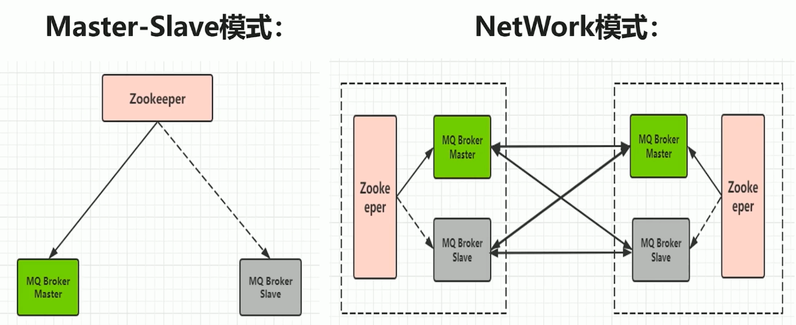
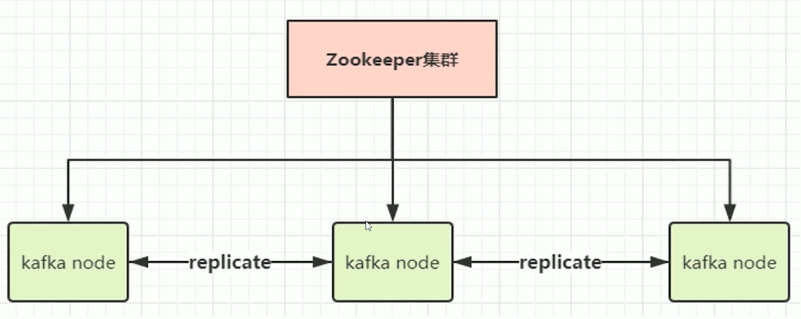
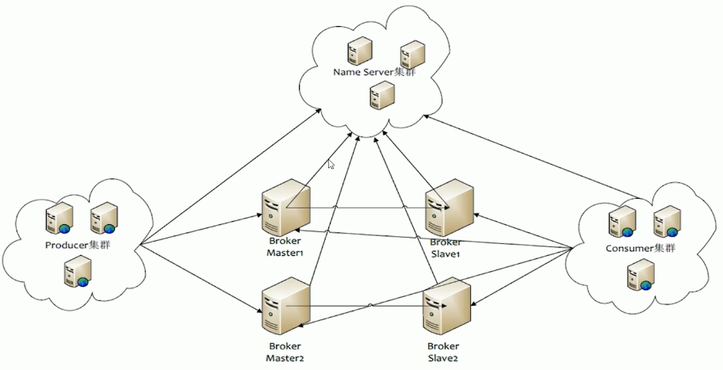
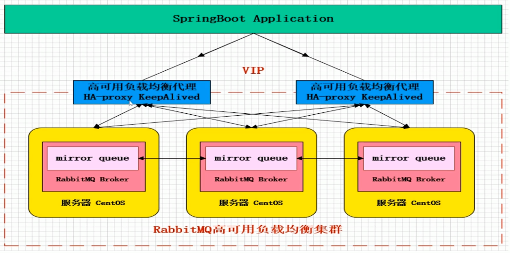

## 消息中间件介绍

### 什么是MQ

消息队列（Messages Queue），从字面意思是，本质是一个队列，先进先出规则，只不过队列中存放的是messages消息而已。

主要用途是不同进程/线程间通信，比如服务A调用服务B就可以通过MQ。

### 为什么会产生消息队列

有几个原因：

- 不同进程（process）之间传递消息时，两个进程之间耦合程度过高，改动一个进程，引发必须修改另一个进程，为了隔离这两个进程，在两进程间抽离出一层（一个模块），所有两进程之间传递的消息，都必须通过消息队列来传递，单独修改某一个进程，不会影响另一个；

- 不同进程（process）之间传递消息时，为了实现标准化，将消息的格式规范化了，并且，某一个进程接受的消息太多，一下子无法处理完，并且也有先后顺序，必须对收到的消息进行排队，因此诞生了事实上的消息队列
- [《Java帝国之消息队列》](https://mp.weixin.qq.com/s?__biz=MzAxOTc0NzExNg==&mid=2665513507&idx=1&sn=d6db79c1ae03ba9260fb0fb77727bb54&chksm=80d67a60b7a1f376e7ad1e2c3276e8b565f045b1c7e21ef90926f69d99f969557737eb5d8128&mpshare=1&scene=1&srcid=1019awkBx8kaLyFohcuW4Ee7)，[《一个故事告诉你什么是消息队列》](https://github.com/jasonGeng88/blog/blob/master/201705/MQ.md)

### 主流的MQ区别

#### ActiveMQ

ActiveMQ是一款非常老牌的MQ，由Apache出品，功能强大，支持JMS规范。

具有很多丰富的API，多种集群构建模式，在中小型企业应用广泛。

MQ衡量指标：

- 性能：ActiveMQ对于其他MQ来说，**性能比较一般**，所以在以前Active的使用率比较高，但是现在到处都是**高并发大数据的场景**，ActiveMQ的使用有些力不从心了，经常会出现**阻塞，消息延迟，堆积过多**等问题。
- 数据存储：
  - kahaDB：默认
  - LevelDB：高性能
  - 关系型数据库：消息100%可靠
- 集群架构：
  - 主备模式：使用Zookeeper来进行节点协调，如果主挂了，切换备用节点
  - 分布式主备模式，也叫NetWork模式：MQ集群，使用网关相互通信连接

#### kafka

kafka是Apache顶级项目，分布式发布-订阅消息系统，基于Pull模式来处理消费，追求**超高吞吐量**，也正因此，Kafka多用于大数据的服务。用来对日志进行采集传输

kafka0.8版本之后，支持复制，但是**不支持事物，对消息的丢失，重复，错误没有严格要求**，所以它主攻吞吐量这块，使用它的时候要考虑这些缺点是否影响业务。

kafka如此高性能也和对于操作系统底层的*PageCache*有关，因为大量使用内存，而非磁盘读写，所以性能高，这有点类似ElasticSearch，所以如果服务器的内存较大，cpu性能低也不会影响kafka的高性能高吞吐。

集群架构：

kafka也是依赖Zookeeper来调节各个节点的，每个节点会进行replicate副本复制，这样每个节点的数据都是同步的。

#### RocketMQ

RocketMQ是阿里开源的MQ中间件，也孵化成Apache顶级项目，纯Java开发，**具有高吞吐高性能**的特点，思路起源于kafka，但是对于**消息一致性以及可靠性传输**做了优化，被阿里在内部广泛使用与交易，充值，流计算，日志推送等场景。

但是RocketMQ缺点是**维护难度高**，需要非常专业的MQ运维人员去维护。还有一个重要缺点，商业版收费，很多功能不对外提供。

特点是，**保证消息顺序性，提供丰富的消息拉取的模式，高效订阅者的水平扩展，实时性以及上亿级别的消息**

集群架构：

在2.0及之前，都是使用的Zookeeper来协调主从节点

在3.x之后，使用自己编写的Name Server来进行协调工作。

可选的分布式集群架构方式有很多种，一主一从，双主双从或者多主多从，随便选。

#### RabbitMQ

RabbitMQ使用Erlang语言实现，基于AMQP协议实现。AMQP主要特征是面向消息，队列，路由，可靠，安全。AMQP更多用在企业内，**对数据一致性，稳定性，可靠性要求很高的场景**，而对于吞吐量性能肯定没用kafka那么高，但也不差，比ActiveMQ高了很多。

集群架构

多个组使用`mirror queue`镜像队列，来保证数据100%不丢失，前端使用`HA-proxy`实现负载均衡，使用`KeepAlived`实现高可用。

优点：**完善，高可用，性能也很好，稳定性超强（节点挂掉，磁盘损坏也可以修复）**

RabbitMQ高性能的原因就是因为底层的**Erlang语言**，Erlang语言一开始是做交换机领域的，所以他**有着和Socket一样的网络延迟**，也导致了RabbitMQ的Broker之间进行数据交互的性能优秀。