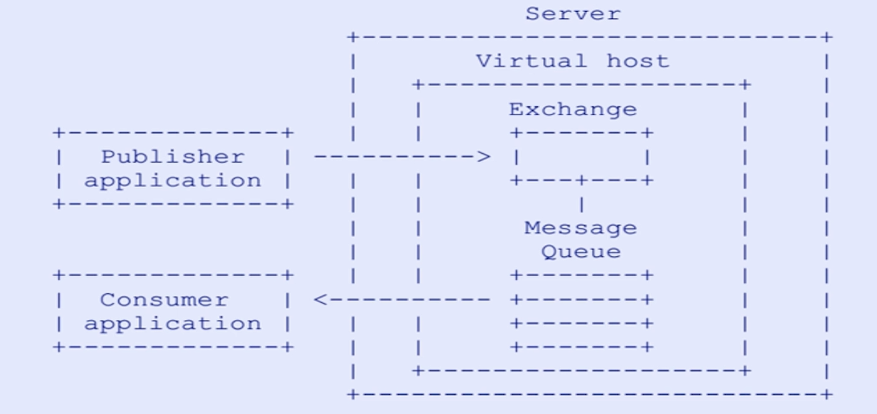
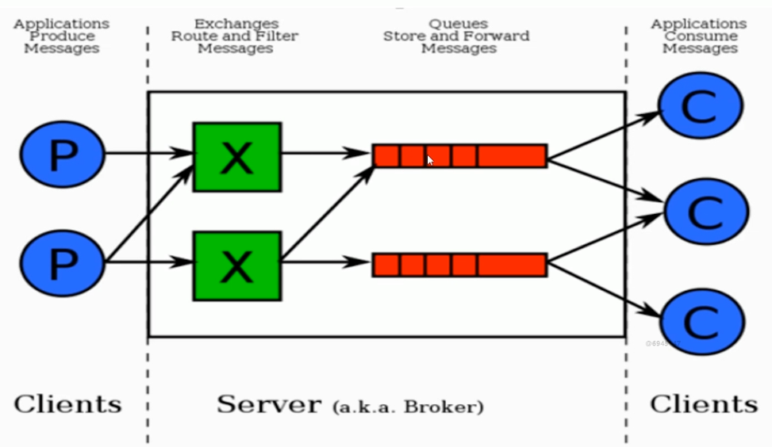
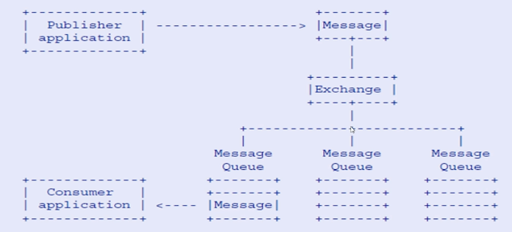
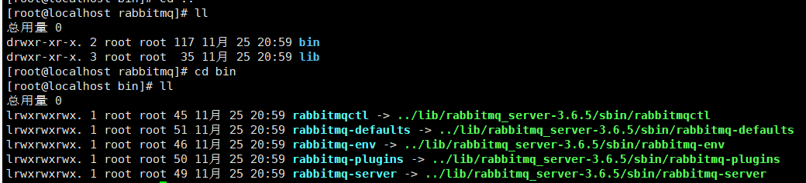
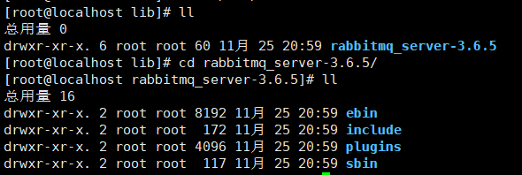
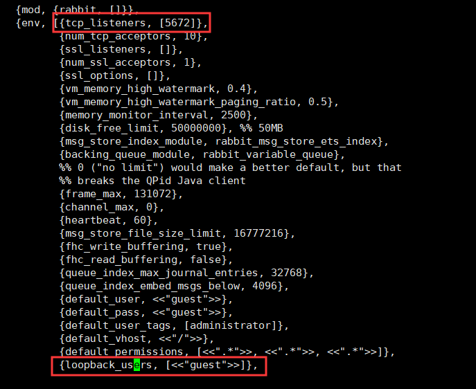
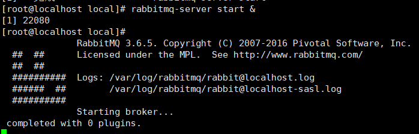
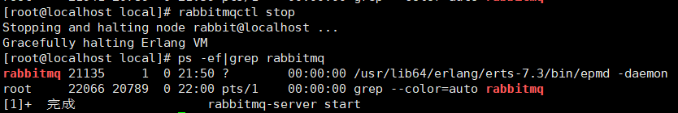
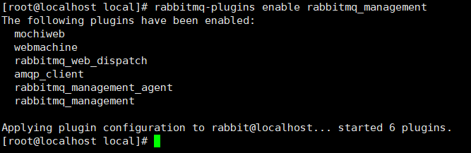
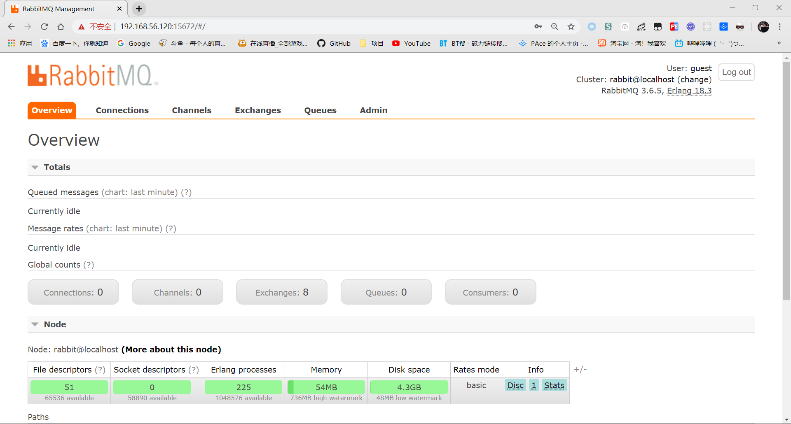

## 一、AMQP协议

### 简介

AMQP是一种高级消息队列的二进制协议，提供了统一的消息服务标准，是应用层协议的一种标准，为面向消息的中间件设计。

就是说，AMQP只是一种协议或是规范，它其中有着很多关于消息的概念，比如当我想开发一个消息中间件，PaceMQ时，就可以根据这些概念走。

### 协议模型



如图，显而易见的，具有几大组件

- publisher application：生产者
- consumer application：消费者
- Server/Broker：消息队列服务器
- Virtual host：虚拟主机
- Exchange：交换机，存储消息的地方
- Messages Queue：消息队列，与Exchange有绑定关系，消费者从队列取消息

一个正常的消息生成并消费的路径为：

1. publisher与Server建立连接，比如配置一些IP，端口
2. 选择一个Virtual host来进行投递
3. 最后投递到某个Exchange上，此时生产者的职责已经完毕
4. 消费者监听Messages Queue，如果有变动，就拿出来消费
5. 这时其实还有一步，就是Exchange和Messages Queue的绑定关系（后面详解）

### 核心概念

这里简单介绍一下核心概念，之后对我们实际操作有所帮助，并且加深印象

`Server`：又称`Broker`，消息中间件的服务器，接收客户端连接，实现AMQP的实体服务

`Connection`：连接，客户端与`Broker`建立网络连接

`Channel`：核心概念，网络信道，几乎所有关于消息的操作，都是在`Channel`中进行的，是进行**消息读写的通道**。客户端可以建立多个`Channel`，每个`Channel`代表一个会话任务。其实`Channel`就类似于`JDBC`的Session，通过`Session`可以对数据查询传输，只不过这里的对象从数据库变成了MQ服务器，数据变成了`Messages`。

`Messages`：消息，客户端与服务器之间传递的数据。在AMQP协议中，**消息由Properties和Body组成**。Properties用来对消息进行修饰，比如优先级，延迟等高级特性。Body中就存放消息内容。

`Virtual host`：虚拟地址，用于**逻辑隔离**，是最上层的消息路由。一个`Virtual host`有多个`Exchange`和`Queue`，但是名称不能相同。它就类似Redis的16个DB，一样是逻辑隔离，即有16G内存，对于16个DB来说内存不是等价划分的，可能DB0占用了15G，如果是等价划分就是物理隔离了。

`Exchange`：交换机，生产者投递消息的最终地址，根据路由键（`Routing key`）转发消息到绑定（`Binding`）的队列中。

`Queue`：消息队列，保存消息并转发给消费者

`Binding`：`ExChange`和`Queue`之间的绑定关系，包含`Routing key`

`Routing key`：路由规则，虚拟机可以用它来确定如何路由一个特定的消息

### RabbitMQ整体架构与消息流转

整体架构：



其实架构就和我们上面介绍协议模型差不多，消息提供方将消息投递到`Exchange`上，然后绑定`Queue`，最后由`Consumer`监听`Queue`来进行消息消费。

消息流转：



消息流转也大相径庭，这里唯一要注意的是：

`Exchange`对应了多个`Messages Queue`，其消息对应方式就是我们上面介绍的`Routing Key`路由规则

## 二、RabbitMQ

### RabbitMQ安装

这里我们使用原生的安装方式，在linux虚拟机上安装，**并没有使用Docker**

这里我们使用RabbitMQ 3.6.5的版本，下载的话到[rabbitMQ官网](<https://www.rabbitmq.com/)

需要注意的是，RabbitMQ需要对应安装Erlang，版本对照关系可以查看[RabbitMQ与Erlang版本对应](https://www.rabbitmq.com/which-erlang.html)


这里我们使用3.6.5，所以Erlang版本使用R16B03 - 19.3.x都可以，这里我们使用 18.3 版本

下载：

```
wget www.rabbitmq.com/releases/erlang/erlang-18.3-1.el7.centos.x86_64.rpm
wget http://repo.iotti.biz/CentOS/7/x86_64/socat-1.7.3.2-5.el7.lux.x86_64.rpm
wget www.rabbitmq.com/releases/rabbitmq-server/v3.6.5/rabbitmq-server-3.6.5-1.noarch.rpm
```


这里我们使用到这三个安装包，安装顺序为 `erlang - socat - rabbitmq`

```
rpm -ivh erlang-18.3-1.el7.centos.x86_64.rpm
yum install tcp_wrappers
rpm -ivh socat-1.7.3.2-1.1.el7.x86_64.rpm
rpm -ivh rabbitmq-server-3.6.5-1.noarch.rpm
```

这时rabbitMQ就安装成功了，注意，这里使用rpm安装方式，所以**一些环境变量以及配置信息帮你做好了**，如果使用绿色版解压缩，**需要自己去配**，这里就不赘述了。

安装位置：`usr/lib/rabbitmq`

其中`bin`文件夹是快捷启动`rabbitmq`的一些脚本，可以在全局使用



`lib`文件夹实际保存`rabbitmq`



对于`RabbitMQ`的配置都保存在`ebin`文件夹中，最重要的配置就是`ebin/rabbit.app`配置文件



配置文件中，找到env这个key，就可以看到很多配置，这里我们只介绍两个，剩下的在集群搭建及优化时再细细解析。

- `tcp_listeners`：服务端口，默认是5672，可以根据需求改成其他的
- `loopback_users`：这里是我们需要改的，将 `[<<"guest">>]` 改成` [guest]`，这里是用户的设置，需要修改之后才能访问。

到这里 RabbitMQ基本环境已经搭建完毕

### RabbitMQ的启动

这里先介绍一下Rabbitmq的脚本

- rabbitmqctl：控制相关的，对rabbitmq服务添加队列，交换机或者用户都可以使用它，包括集群搭建，集群管理等等
- rabbitmq-plugins：rabbitmq的插件的启停操作
- rabbitmq-server：服务的启停

#### 服务启动

```
$ rabbitmq-server start &
```



#### 服务停止

这里可以直接使用`ps -ef|grep rabbitmq`，kill关于rabbitmq的进程

当然也可以优雅的关闭，使用脚本关闭

```
$ rabbitmqctl stop
```



#### 可视化界面插件启动

```
$ rabbitmq-plugins enable rabbitmq_management
```



这时，就可以打开浏览器输入地址查看了：<http://192.168.56.120:15672/>（换成自己虚拟机或云服务器IP）


用户名密码就是刚刚修改的：guest / guest



#### 常用命令

`rabbitmq`的安装、启动和停止

```null
$ rabbitmq-service install
$ rabbitmq-service start
$ rabbitmq-service stop
```

关闭节点，停止`RabbitMQ`应用，启动`RabbitMQ`应用

```null
$ rabbitmqctl stop
$ rabbitmqctl stop_app
$ rabbitmqctl start_app

重置RabbitMQ节点
$ rabbitmqctl reset
$ rabbitmqctl force_reset
```

显示`RabbitMQ`中间件各种信息

```null
$ rabbitmqctl status
```

列出所有`queue`，`exchange`，`binding`

```null
$ rabbitmqctl list_queues
$ rabbitmqctl list_exchanges
$ rabbitmqctl list_bindings
```

