## 一、管理台

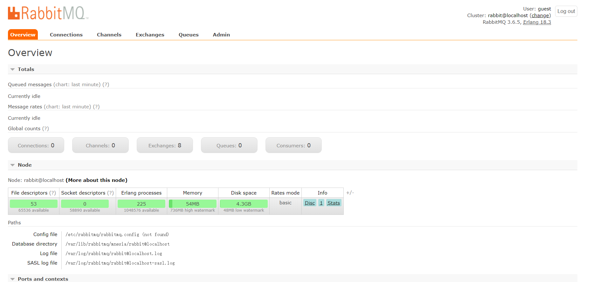

我们先介绍一下管理台

从这张图右上角可以看到用户信息，版本信息与登出。

紧接着有6个标签


### Connection

连接信息

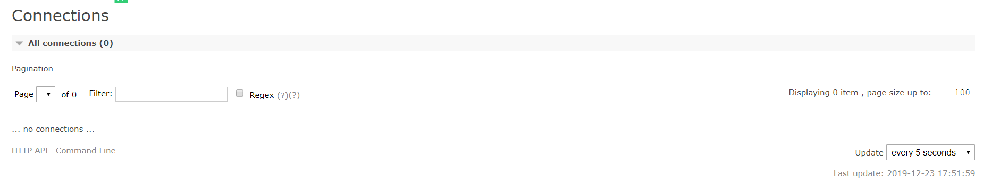

因为我们没有任何连接，所以是空的，后面连接生产者和消费者时再看

### Channels

信道信息


也没有任何信息，因为信道是基于连接的

### Exchanges

交换机，生产者投递消息到这里

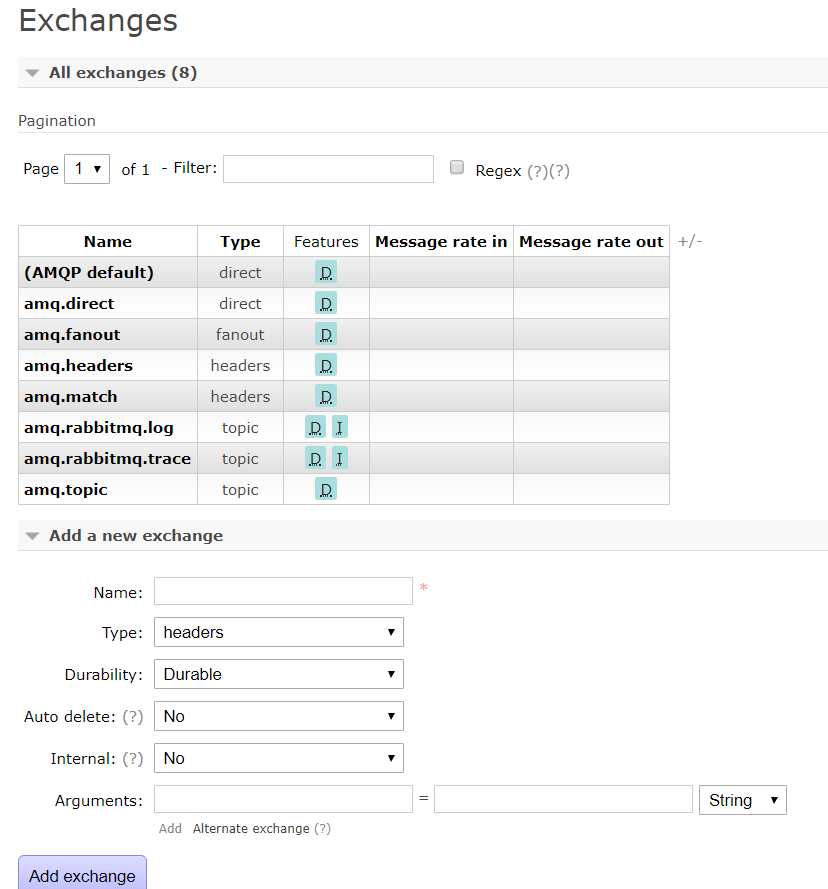

这里可以看到默认有多个交换机，并且有四种类型，对于其类型我们后面讲解

Features里有D和I的信息

- D：`durable=true`，即持久化，就是MQ如果停掉，这些交换机都不会被清除，一直保留
- I：`internal=true`，一个特征，后面详说

### Queue

MQ队列

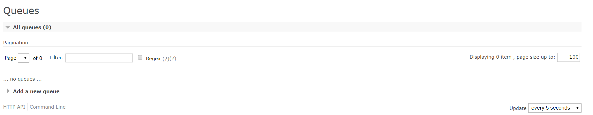

也是为空的

### Admin

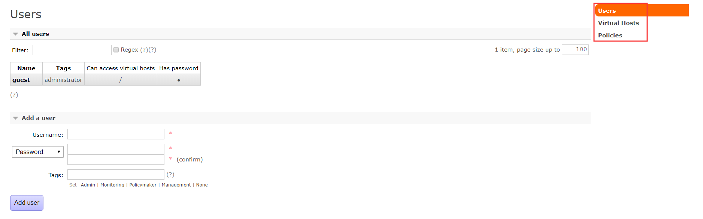

可以进行用户，虚拟机，以及权限的操作，比如添加用户，添加虚拟机，以及权限配置

### Overview

MQ概览，大体信息都在这里

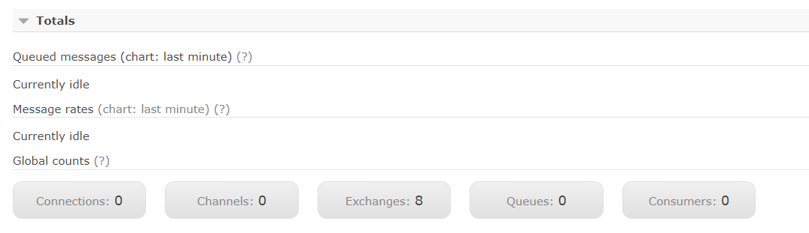

MQ中连接，信道等合计

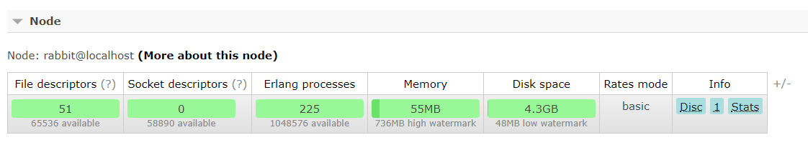

节点信息，内存占用，磁盘占用等等

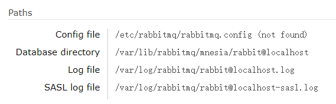

保存路径，比如配置文件路径，数据存储的路径，日志的保存

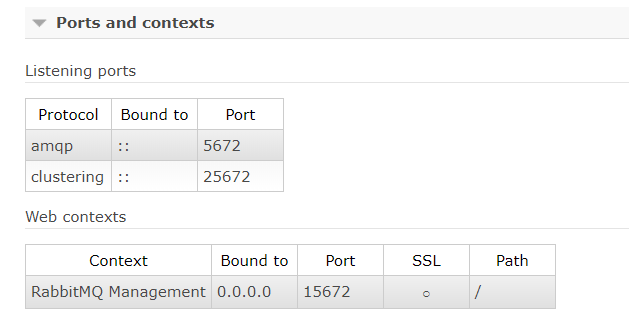

端口号信息

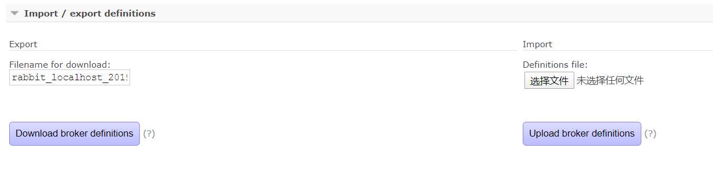

最后这个很重要，MQ信息的导入导出，当我们集群的服务器想升级，或者迁移时，比如centos6升centos7。

如果慢慢调整要耗费很长时间，使用MQ信息导入导出，可以节省大量时间，只需对某些升级所需改动的配置改造即可。

导出后是json文件信息，如下，保存了比如用户，虚拟主机，包括exchange，binding，queue，该有的都有

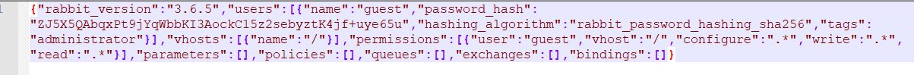

## 二、极速入门

这里我们使用SpringBoot快速搭建一个生产者与消费者，并配合Rabbitmq进行消费。

对于SpringBoot如何搭建就不介绍了，主要使用依赖：

```xml
<dependency>
    <groupId>com.rabbitmq</groupId>
    <artifactId>amqp-client</artifactId>
    <version>3.6.5</version>
</dependency>
```

### Provider

```java
public class Provider {

    /**
     * 需要将消息投递到MQ中
     * @param args
     */
    public static void main(String[] args) throws Exception{
        // 1.创建连接工程
        ConnectionFactory connectionFactory = new ConnectionFactory();
        connectionFactory.setHost("192.168.56.120");
        connectionFactory.setPort(5672);
        connectionFactory.setVirtualHost("/"); // 默认创建 "/" 为虚拟主机

        // 2.创建连接
        Connection connection = connectionFactory.newConnection();

        // 3.创建Channel通道
        Channel channel = connection.createChannel();
        
        for(int i = 0;i < 5;i ++){
            String msg = "hello rabbit";
            /**
             * 4.投递消息 四个参数
             * exchange，指定投递到哪个交换机
             * routingKey，路由键
             * props，之前说的Msg由props与body组成，props是描述消息的一些信息，比如优先级
             * body，消息中真正存放的信息
             */
            channel.basicPublish("","test01",null,msg.getBytes());
        }
        
        // 5.关闭连接
        channel.close();
        connection.close();

    }
}
```

消息生产者/提供方 代码比较简单，主要是建立连接，建立通道，然后进行消息的投递。

注意最后要关闭连接。

### Consumer

```java
public class Consumer {

    public static void main(String[] args) throws Exception{
        // 1.创建连接工程
        ConnectionFactory connectionFactory = new ConnectionFactory();
        connectionFactory.setHost("192.168.56.120");
        connectionFactory.setPort(5672);
        connectionFactory.setVirtualHost("/"); // 默认创建 "/" 为虚拟主机

        // 2.创建连接
        Connection connection = connectionFactory.newConnection();

        // 3.创建Channel通道
        Channel channel = connection.createChannel();

        // 4.创建队列
        String queueName = "test01";
        /**
         * 五个参数
         * queue，队列名称
         * durable，是否持久化
         * exclusive，是否独占，即只能这个连接使用的队列
         * autoDelete，是否自动删除，即如果该队列没有任何exchange进行绑定，会自动被删除
         * arguments，其他一些参数
         */
        channel.queueDeclare(queueName,true,false,false,null);


        // 5.创建消费者
        QueueingConsumer queueingConsumer = new QueueingConsumer(channel);

        // 6.设置信道的消费者
        /**
         * 三个参数
         * queue，获取消息的队列名
         * autoAck，自动返回Ack
         *      当消费端消费时，MQ会发送信息给消费者
         *      消费者成功获取后，会返回Ack，代表成功消费
         *      如果不设置自动，需要手动返回Ack
         *  callback，消费者
         */
        channel.basicConsume(queueName,true,queueingConsumer);

        // 7.消费
        while (true){
            // 这里可以添加long参数，即超时时间，不设置会一直阻塞
            // Delivery 是封装的类，封装了消息信息，配置信息，交换机信息，路由键等信息
            Delivery delivery = queueingConsumer.nextDelivery();
            byte[] body = delivery.getBody();
            System.out.println(new String(body));
        }

    }
}
```

Consumer的代码就比较多一点了，Rabbitmq在消息提供方不需要创建提供者，但在消费方需要创建消费者，通道设置并进行消费。

还有一点是队列的创建，因为现在MQ中队列是空的，所以在消费方创建一个队列，如果有相同名称的队列，便不会创建，没有会自动创建。

### 测试

这里先启动Consumer，因为先启动Provider的话，没有`test01`这个队列，就无法投递消息

启动Consumer后，会一直处在监听状态，查看一下MQ管理台

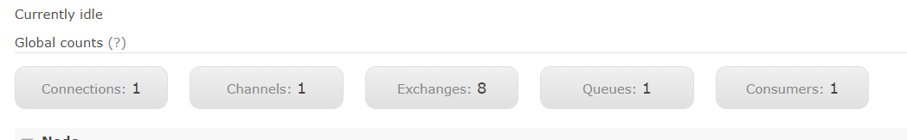

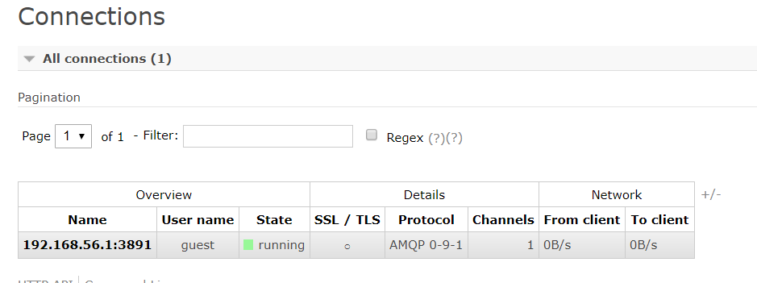

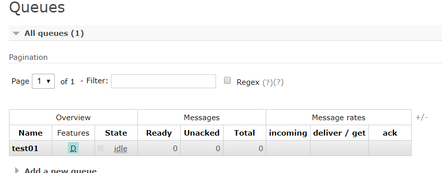

出现了连接，队列，信道等等信息，等待消息的产生并消费

这时开启Provider

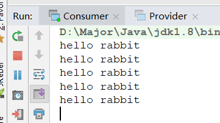

瞬间执行完毕，并且消费方获取5条消息并打印

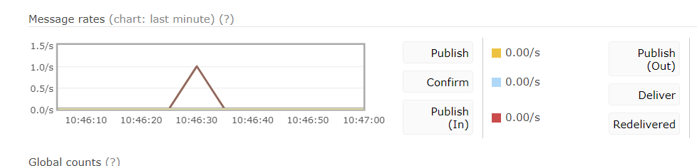

控制台也有消息消费的折线图

**这里有一个问题，我们没有`Exchange`，那么消息是如何投递并消费的呢？**

#### Default Exchange

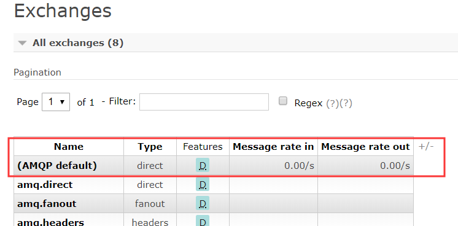

在控制台可以清楚看到一个`default`交换机，进去看看他的说明


意思就是，在提供方没有指明使用哪个`Exchange`时，默认投递到这个`Exchange`上，并且路由规则是，**路由键的名称和队列名称相同**，便可成功路由消费，这也是我们没有指定`Exchange`缺能消费成功的原因。

在上面的代码中也可以发现，`routingKey`和`queueName`是相同的，都为`test01`