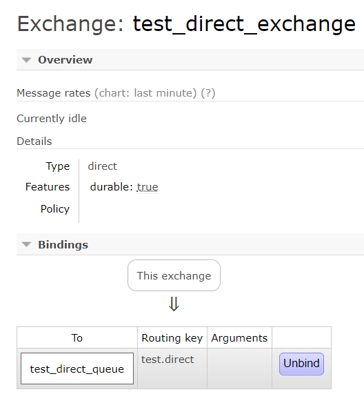
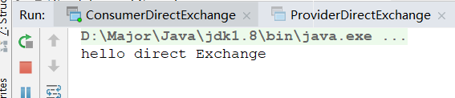
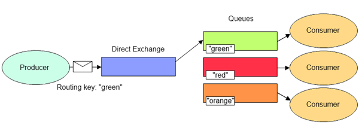
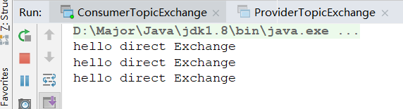
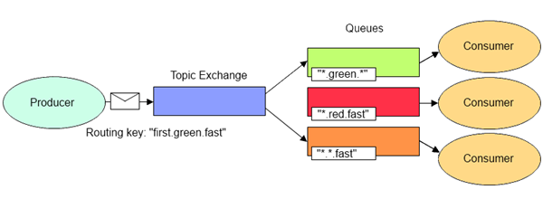
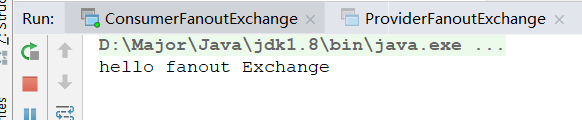
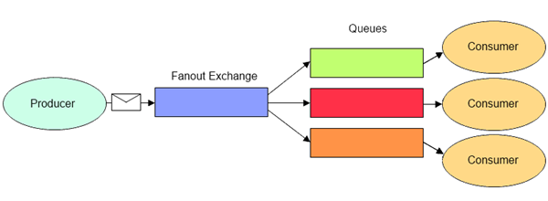
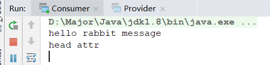

## 一、管理台


我们先介绍一下管理台

从这张图右上角可以看到用户信息，版本信息与登出。

紧接着有6个标签

### Connection

连接信息


因为我们没有任何连接，所以是空的，后面连接生产者和消费者时再看

### Channels

信道信息


也没有任何信息，因为信道是基于连接的

### Exchanges

交换机，生产者投递消息到这里


这里可以看到默认有多个交换机，并且有四种类型，对于其类型我们后面讲解

Features里有D和I的信息

- D：`durable=true`，即持久化，就是MQ如果停掉，这些交换机都不会被清除，一直保留
- I：`internal=true`，一个特征，后面详说

### Queue

MQ队列


也是为空的

### Admin


可以进行用户，虚拟机，以及权限的操作，比如添加用户，添加虚拟机，以及权限配置

### Overview

MQ概览，大体信息都在这里


MQ中连接，信道等合计


节点信息，内存占用，磁盘占用等等


保存路径，比如配置文件路径，数据存储的路径，日志的保存


端口号信息


最后这个很重要，MQ信息的导入导出，当我们集群的服务器想升级，或者迁移时，比如centos6升centos7。

如果慢慢调整要耗费很长时间，使用MQ信息导入导出，可以节省大量时间，只需对某些升级所需改动的配置改造即可。

导出后是json文件信息，如下，保存了比如用户，虚拟主机，包括exchange，binding，queue，该有的都有


## 二、极速入门

这里我们使用SpringBoot快速搭建一个生产者与消费者，并配合Rabbitmq进行消费。

对于SpringBoot如何搭建就不介绍了，主要使用依赖：

```xml
<dependency>
    <groupId>com.rabbitmq</groupId>
    <artifactId>amqp-client</artifactId>
    <version>3.6.5</version>
</dependency>
```

### Provider

```java
public class Provider {

    /**
     * 需要将消息投递到MQ中
     * @param args
     */
    public static void main(String[] args) throws Exception{
        // 1.创建连接工程
        ConnectionFactory connectionFactory = new ConnectionFactory();
        connectionFactory.setHost("192.168.56.120");
        connectionFactory.setPort(5672);
        connectionFactory.setVirtualHost("/"); // 默认创建 "/" 为虚拟主机

        // 2.创建连接
        Connection connection = connectionFactory.newConnection();

        // 3.创建Channel通道
        Channel channel = connection.createChannel();
        
        for(int i = 0;i < 5;i ++){
            String msg = "hello rabbit";
            /**
             * 4.投递消息 四个参数
             * exchange，指定投递到哪个交换机
             * routingKey，路由键
             * props，之前说的Msg由props与body组成，props是描述消息的一些信息，比如优先级
             * body，消息中真正存放的信息
             */
            channel.basicPublish("","test01",null,msg.getBytes());
        }
        
        // 5.关闭连接
        channel.close();
        connection.close();

    }
}
```

消息生产者/提供方 代码比较简单，主要是建立连接，建立通道，然后进行消息的投递。

注意最后要关闭连接。

### Consumer

```java
public class Consumer {

    public static void main(String[] args) throws Exception{
        // 1.创建连接工程
        ConnectionFactory connectionFactory = new ConnectionFactory();
        connectionFactory.setHost("192.168.56.120");
        connectionFactory.setPort(5672);
        connectionFactory.setVirtualHost("/"); // 默认创建 "/" 为虚拟主机

        // 2.创建连接
        Connection connection = connectionFactory.newConnection();

        // 3.创建Channel通道
        Channel channel = connection.createChannel();

        // 4.创建队列
        String queueName = "test01";
        /**
         * 五个参数
         * queue，队列名称
         * durable，是否持久化
         * exclusive，是否独占，即只能这个连接使用的队列
         * autoDelete，是否自动删除，即如果该队列没有任何exchange进行绑定，会自动被删除
         * arguments，其他一些参数
         */
        channel.queueDeclare(queueName,true,false,false,null);


        // 5.创建消费者
        QueueingConsumer queueingConsumer = new QueueingConsumer(channel);

        // 6.设置信道的消费者
        /**
         * 三个参数
         * queue，获取消息的队列名
         * autoAck，自动返回Ack
         *      当消费端消费时，MQ会发送信息给消费者
         *      消费者成功获取后，会返回Ack，代表成功消费
         *      如果不设置自动，需要手动返回Ack
         *  callback，消费者
         */
        channel.basicConsume(queueName,true,queueingConsumer);

        // 7.消费
        while (true){
            // 这里可以添加long参数，即超时时间，不设置会一直阻塞
            // Delivery 是封装的类，封装了消息信息，配置信息，交换机信息，路由键等信息
            Delivery delivery = queueingConsumer.nextDelivery();
            byte[] body = delivery.getBody();
            System.out.println(new String(body));
        }

    }
}
```

Consumer的代码就比较多一点了，Rabbitmq在消息提供方不需要创建提供者，但在消费方需要创建消费者，通道设置并进行消费。

还有一点是队列的创建，因为现在MQ中队列是空的，所以在消费方创建一个队列，如果有相同名称的队列，便不会创建，没有会自动创建。

### 测试

这里**先启动Consumer**，因为先启动Provider的话，**没有`test01`这个队列，就无法投递消息**

启动Consumer后，会一直处在监听状态，查看一下MQ管理台


出现了连接，队列，信道等等信息，等待消息的产生并消费

**这时开启Provider**


瞬间执行完毕，并且消费方获取5条消息并打印


控制台也有消息消费的折线图

**这里有一个问题，我们没有`Exchange`，那么消息是如何投递并消费的呢？**

#### Default Exchange


在控制台可以清楚看到一个`default`交换机，进去看看他的说明


意思就是，在提供方没有指明使用哪个`Exchange`时，默认投递到这个`Exchange`上，并且路由规则是，**路由键的名称和队列名称相同**，便可成功路由消费，这也是我们没有指定`Exchange`缺能消费成功的原因。

在上面的代码中也可以发现，`routingKey`和`queueName`是相同的，都为`test01`

## 三、Exchange

在上一节快速入门中，我们使用了默认的Exchange，路由规则是路由键名称和队列名相同。

这一节，我们会详细介绍三大Exchange类型

### Direct

英文翻译为直接，这个Exchange就和其名字一样，是直连的，也是RabbitMQ默认的Exchange类型，完全根据RoutingKey来路由消息。

消费者设置Exchange的Queue和Binding时要指定`RoutingKey`，生产者提供消息时要指定相同的`RoutingKey`，才能使消息正确被消费。

上一节使用的`Default Exchange`就是Direct类型，但他比较特殊，没有Binding操作，必须`RoutingKey`与`QueueName`完全匹配才可以。

#### 代码理解

**消费者Consumer**，这里对于信道连接的创建代码就不再重复了

```java
// 声明Exchange，QueueName，RoutingKey的设置
String exchangeName = "test_direct_exchange";
String exchangeType = "direct";
String queueName = "test_direct_queue";
String routingKey = "test.direct";

// 参数：交换机名称，类型，是否持久化，是否自动删除，Internal 用不到，其他参数 null
channel.exchangeDeclare(exchangeName,exchangeType,true,false,false,null);
channel.queueDeclare(queueName,true,false,false,null);
channel.queueBind(queueName,exchangeName,routingKey); // 设置绑定关系

// 创建消费者
QueueingConsumer consumer = new QueueingConsumer(channel);
// 绑定消费者
channel.basicConsume(queueName,true,consumer);
// 消费
while (true){
    QueueingConsumer.Delivery delivery = consumer.nextDelivery();
    System.out.println(new String(delivery.getBody()));
}
```

通过Channel创建了direct类型的交换机，queue和其中绑定关系，路由键为`test.direct`

**生产者Provider**

```java
// 声明Exchange，RoutingKey的设置
String exchangeName = "test_direct_exchange";
String routingKey = "test.direct";
String msg = "hello direct Exchange";
// 投递消息
channel.basicPublish(exchangeName,routingKey,null,msg.getBytes());
```

生产者比较简单，设置好Exchange名称与`RoutingKey`即可，注意这里名称要与Consumer的相同，才能成功投递路由消费。

**测试**



开启消费者后，会发现创建了`Direct`类型的Exchange，并且Binding关系就是根据`test.direct`这个路由键，去传递到`test_direct_queue`这个队列。

启动消息提供者



成功消费

#### 图解



如图，清晰明确的画出了Direct交换机，`Messages`根据`RoutingKey`一一对应到不同的Queue中。

#### 应用场景

在做日志收集时，想只把 `Error `级别的日志发送给负责记录写入磁盘文件的 Queue。这种场景下我们可以使用指定的 `RoutingKey`（例如 `error`）将写入磁盘文件的 Queue 绑定到 `Direct Exchange` 上。

### Topic

Topic类型的Exchange，其实也是根据RoutingKey路由的，它有些类似于Direct，但却不同，不同点就是它可以模糊匹配。

分别支持`*`和`#`通配符

- `*`表示匹配一个单词
- `#`则表示匹配没有或一个或多个单词

#### 代码理解

**Consumer**

```java
// 声明Exchange，QueueName，RoutingKey的设置
String exchangeName = "test_topic_exchange";
String exchangeType = "topic";
String queueName = "test_topic_queue";
String routingKey = "user.#";
```

对比Direct的代码，这里只修改了设置，需要注意的是Type类型改成了topic，并且routingKey为`user.#`

**Provider**

```java
// 声明Exchange，RoutingKey的设置
String exchangeName = "test_topic_exchange";
String routingKey1 = "user";
String routingKey2 = "user.pacee";
String routingKey3 = "user.pacee.info";

// 投递消息
String msg = "hello direct Exchange";
channel.basicPublish(exchangeName,routingKey1,null,msg.getBytes());
channel.basicPublish(exchangeName,routingKey2,null,msg.getBytes());
channel.basicPublish(exchangeName,routingKey3,null,msg.getBytes());
```

在生产者这边，我们投递三个消息，分别是`user`、`user.pacee`、`user.pacee.info`

**测试**



三个全部映射成功，**这里忘记修改打印的字符串了：)**

#### 图解



#### 应用场景

假设我们的消息路由规则除了需要根据日志级别来分发之外还需要根据消息来源分发，可以将 RoutingKey 定义为 `消息来源.级别` 如 `order.info`、`user.error`等。处理所有来源为 `user` 的 Queue 就可以通过 `user.*` 绑定到 Topic Exchange 上，而处理所有日志级别为 `info` 的 Queue 可以通过 `*.info` 绑定到 Exchange上。

### Fanout

Fanout类型的交换机，**与`RoutingKey`无关**，即会将消息分发到所有和他绑定的队列上，看重`Binding`关系

#### 代码理解

**Consumer**

```java
// 声明Exchange，QueueName，RoutingKey的设置
String exchangeName = "test_fanout_exchange";
String exchangeType = "fanout";
String queueName = "test_fanout_queue";
String routingKey = "test.fanout.01";
```

其他代码和之前一样，这里设置`type`为`fanout`，路由`key`为`test.fanout.01`

**Provider**

```java
// 声明Exchange，RoutingKey的设置
String exchangeName = "test_fanout_exchange";
String routingKey = "test.fanout.02"; // 故意设置的和Consumer不同的RoutingKey

// 投递消息
String msg = "hello fanout Exchange";
channel.basicPublish(exchangeName,routingKey,null,msg.getBytes());
```

这里故意设置与Consumer不同的`RoutingKey`，看看消息会不会被成功投递

**测试**



被成功投递，应证说法

#### 图解



#### 应用场景

假设我们定义了一个 Exchange 来接收日志消息，同时定义了两个 Queue 来存储消息：一个记录将被打印到控制台的日志消息；另一个记录将被写入磁盘文件的日志消息。我们希望 Exchange 接收到的每一条消息都会同时被转发到两个 Queue，这种场景下就可以使用 `Fanout Exchange` 来广播消息到所有绑定的 Queue。

### Headers 

Headers Exchange 会忽略 RoutingKey 而根据消息中的 Headers 和创建绑定关系时指定的 Arguments 来匹配决定路由到哪些 Queue。

Headers Exchange 的性能比较差，而且 Direct Exchange 完全可以代替它，所以不建议使用。这里也不过多介绍了。

## 四、核心概念再理解

### Binding

上一个笔记中了解，绑定是将Exchange和Queue连接起来，通过路由键。

在这一节，我们实际编写了绑定的代码，如下

```java
channel.queueBind(queueName,exchangeName,routingKey); // 设置绑定关系
```

主要就是三个关键信息，来组成一个绑定关系，**主要操作再消息消费方**

- 队列名
- 交换机名
- 路由键

### Queue

通过代码编写，我们知道了Queue也有几大属性

- `durable`：是否持久化 `true/false`
- `exclusive`：是否该连接独占，一般都为false
- `autoDelete`：是否自动删除，即如果没有Exchange与其连接（Binding），将会自动删除

### Message

Message比较重要，主要由`Properties`和`Body`组成，`Properties`中常用属性有：

- `deliveryMode`：是否持久化，默认1为不持久化，2为持久化
- `headers`：自定义一些属性，保存到`headers`中，之后代码有体现
- `contentType`
- `contentEncoding`：字符集
- `priority`：优先级
- `correlationId`：可以用作消息的唯一ID，作用挺多的
- `replyTo`：可以用作消息失败后返回的队列，后面再细说
- `expiration`：消息过期时间
- `messageId`：消息的ID
- ····：还有很多，这里就不赘述了

接着我们在代码中设置一些Message属性

**Provider**

```java
// 设置消息的Properties 使用链式编程
Map<String,Object> map = new HashMap<>();
map.put("myattr","head attr");
AMQP.BasicProperties properties = new AMQP.BasicProperties.Builder()
        .deliveryMode(2) // 设置是否持久化，1：false，2：true
        .contentEncoding("UTF-8") // 设置字符集
        .expiration("10000") // 设置10秒的过期时间
        .headers(map) // 设置headers，一些自定义的键值对
        .build();

String msg = "hello rabbit message";
channel.basicPublish("","test01",properties,msg.getBytes());
```

**Consumer**

```java
// 7.消费
while (true){
    // 这里可以添加long参数，即超时时间，不设置会一直阻塞
    // Delivery 是封装的类，封装了消息信息，配置信息，交换机信息，路由键等信息
    Delivery delivery = queueingConsumer.nextDelivery();
    byte[] body = delivery.getBody();
    AMQP.BasicProperties properties = delivery.getProperties();
    Map<String, Object> headers = properties.getHeaders();
    System.out.println(new String(body));
    System.out.println(headers.get("myattr"));
}
```

主要是消费时，打印出在`headers`中添加的自定义属性`myattr`



启动消费后，成功显示信息