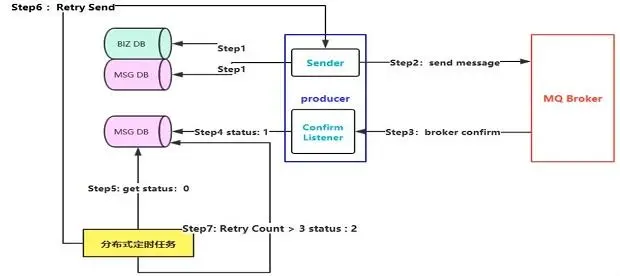
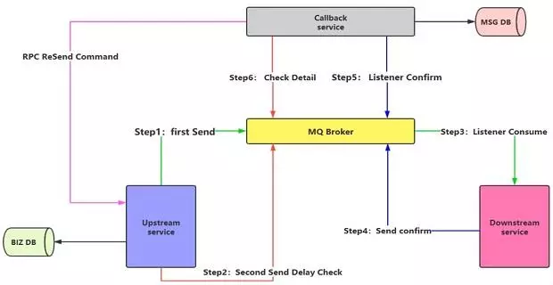

## 什么是生产端的可靠性投递？

- 保证消息成功发出
- 保障MQ节点成功接收
- 发送端收到MQ节点的确认应答
- **完善的消息补偿机制**

既然是百分百投递成功，那么只做前三点是肯定不够的。

有些时候，可能消息投递的时候就失败了，或者消息成功投递，在MQ节点应答时因为网络闪断，导致生产端没有接收到应答，等等一些特殊情况。

所以，我们的重点就在于第四点，消息补偿机制

## 互联网大厂的解决方案

具体的解决方案有两种

1. **消息落库，对消息状态进行打标**
2. **消息延迟投递，做二次确认，回调检查**

具体使用哪种，还需进一步跟进业务场景选择。

下面我们详细介绍一下这两种方案，并对其做出总结。

### 消息落库

消息落库顾名思义，将消息也保存到数据库中，**以状态字段来判断**是否成功投递，如果没有，再做出一些补偿机制。通过下图慢慢分析：

1.消息入库，比如订单场景，当我们创建一条订单，需要发送消息给优惠券模块，来减少用户使用的优惠券。这时就需要将消息保存到数据库中，并包含**消息状态**，比如初始化为0，代表消息成功创建正在投递。

2.如果消息在第一步成功入库。那么消息投递给MQ，如果没有成功入库，需要进行**快速失败机制**

3.MQ收到消息后返回结果响应（`confirm`）给生产者

4.生产端有一个`Confirm Listener`，去异步的监听`Broker`回送的响应，从而判断消息是否投递成功，如果成功，去数据库查询该消息，并将消息状态更新为1，表示消息投递成功。

**这时，比如MQ返回响应的时候网络波动，导致生产端的Listener就永远收不到这条消息的confirm应答了，也就是说这条消息的状态就一直为0了。**

5.此时我们需要**设置一个规则**，比如说消息在入库时候设置一个临界值`timeout`，5分钟之后如果还是0的状态那就需要把消息抽取出来。这里我们使用的是分布式定时任务，去定时抓取DB中距离消息创建时间超过5分钟的且状态为0的消息。

6.把抓取出来的消息进行重新投递`(Retry Send)`，也就是从第二步开始继续往下走

7.因为有的消息可能因为路由键配置错误等等问题，是永远不可能投递成功的。这时在分布式任务这里就要**设置重试次数的限制**，比如3次`Retry Send`都没有成功，那么将消息状态设为2，表示消息最终投递失败。

当消息状态为2时，应如何去补偿呢？这里可能需要一个补偿系统，查询这些最终状态为2的，并进行一些操作，当然这些可能都需要人工操作。

**缺点：**

对于这种消息落库的方法，虽说能保证100%投递，但是也有缺点的，比如第一步入库时的两次持久化操作，在高并发情景下可能会出现性能瓶颈。

### 消息延迟投递

消息的延迟投递，相比较消息落库，就是为了减少数据库持久化操作优化性能的一种方案，我们详细了解一下

先介绍几个服务组件，`Upstream Service`上游服务也就是生产端，`Downstream service`下游服务也就是消费端，`Callback service`就是回调服务，中间的就是MQ服务器。

1.第一步，先把业务入库，比如订单创建好后入库，然后发送消息投递给MQ

2.之后立马发送一个相同的消息`(Second Send Delay Check)`，这里就是重要的延迟消息，用作二次检查的。这里需要设置延迟时间，比如5分钟后投递。

3.消费端监听队列，消费消息

4.消费端消费完毕，需要创建一个confirm消息，注意这里是消息，而不是ACK，然后投递给MQ中

5.Callback Service首先监听这个confirm消息，如果队列中产生，会进行消费，并将消息进行持久化存储，保存到DB中。**（注意，这里的持久化并不会影响高并发下的性能，因为这是一个单独的服务，不影响比如生产端的订单服务）**

6.Callback Service还会监听延迟消息，5分钟过后，`Second Send Delay Check`投递到MQ中，并被Callback Service监听到，这时它可以去查询一下DB，如果没有这条消息，说明消费失败，或者消息没有正确投递，会使用RPC通信生产端，告诉他消息投递失败，让他再发一次消息；如果DB有这条消息，就不做任何操作。

这么做的目的是少做了一次DB的存储，在高并发场景下，最关心的不是消息100%投递成功，而是一定要保证性能，保证能抗得住这么大的并发量。所以能节省数据库的操作就尽量节省，可以异步的进行补偿。

**缺点**

消息并不能保证100%投递成功，比如RPC通信过程中，网络异常导致通信失败等，在这种极端情况下，消息投递成功率可能为99.9%。

### 总结

对于并发量不大的业务场景，使用消息落库是最好的选择

但对于并发量超高的业务场景，明显使用第二种方式更好，第二种也是大厂使用更多的一种方案