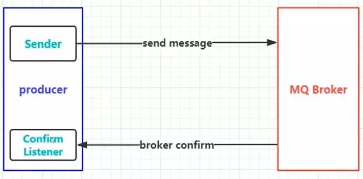
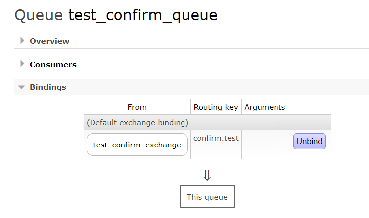
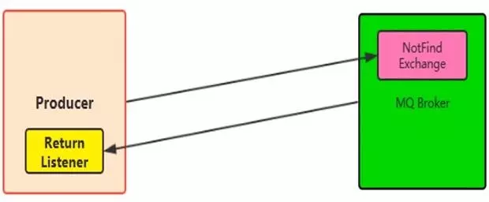
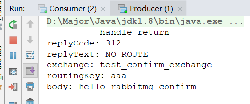

## 确认消息Confirm机制

消息确认，从前面的100%可靠性投递可以了解到，当生产者投递到Broker上时，如果开启了Confirm模式，会返回一个ACK给生产者，表示消息投递成功了。这也是消息可靠性投递的保障之一。

### 流程图



如图，消息生产者发送消息到MQ Broker上，Broker收到投递的消息并做出confirm响应。

生产者这里会配置一个`Confirm Listener`监听器，来监听confirm响应，因为操作是异步的，所以生产者将消息发送出去就可以做其他事情了，对于消息确认只需让内部监听器去监听即可。

### 代码实现Confirm

代码实现也很简单，主要在于Producer的代码修改，分为两步

- Channel信道开启confirm机制，`channel.confirmSelect()`
- 在Channel上添加监听器，`channel.addConfirmListener(ConfirmListener)`，并需实现`ConfirmListener`接口，重写成功和失败方法

#### 生产端实现

```java
public class Producer {

    public static void main(String[] args) throws Exception{
        // 创建工厂
        ConnectionFactory connectionFactory = new ConnectionFactory();
        connectionFactory.setHost("192.168.56.120");
        connectionFactory.setPort(5672);
        connectionFactory.setVirtualHost("/"); // 默认创建 "/" 为虚拟主机

        // 建立连接
        Connection connection = connectionFactory.newConnection();

        // 建立信道
        Channel channel = connection.createChannel();

        // 开启confirm模式
        channel.confirmSelect();

        // 投递消息
        String exchange = "test_confirm_exchange";
        String routingKey = "confirm.test";
        String msg = "hello rabbitmq confirm";
        channel.basicPublish(exchange,routingKey,null,msg.getBytes());

        // 设置confirm监听
        channel.addConfirmListener(new ConfirmListener() {

            /**
             * 成功后的操作
             * @param deliveryTag 消息唯一标识
             * @param multiple 是否批量执行
             * @throws IOException
             */
            @Override
            public void handleAck(long deliveryTag, boolean multiple) throws IOException {
                System.out.println("-------------- ACK SUCCESS ------------");
            }

            @Override // 失败后的操作
            public void handleNack(long deliveryTag, boolean multiple) throws IOException {
                System.out.println("-------------- NACK ERROR ------------");
            }
        });
    }
}
```

#### 消费端实现

```java
public class Consumer {
    public static void main(String[] args) throws Exception{
        // 创建工厂
        ConnectionFactory connectionFactory = new ConnectionFactory();
        connectionFactory.setHost("192.168.56.120");
        connectionFactory.setPort(5672);
        connectionFactory.setVirtualHost("/"); // 默认创建 "/" 为虚拟主机

        // 建立连接
        Connection connection = connectionFactory.newConnection();

        // 建立信道
        Channel channel = connection.createChannel();

        // 创建交换机与队列，和他们的绑定关系
        String exchange = "test_confirm_exchange";
        String queue = "test_confirm_queue";
        String routingKey = "confirm.test";
        channel.exchangeDeclare(exchange,"topic",true);
        channel.queueDeclare(queue,false,false,false,null);
        channel.queueBind(queue,exchange,routingKey);

        // 消费者
        QueueingConsumer consumer = new QueueingConsumer(channel);
        channel.basicConsume(queue, true, consumer);

        // 消费
        while (true){
            // Delivery 是封装的类，封装了消息信息，配置信息，交换机信息，路由键等信息
            QueueingConsumer.Delivery delivery = consumer.nextDelivery();
            byte[] body = delivery.getBody();
            System.out.println(new String(body));
        }
    }
}
```

#### 测试

先将Consumer启动后，查看15672可视化界面是否正确创建exchange，queue，以及binding



然后启动Producer，查看控制台

```
- 消费者
hello rabbitmq confirm
- 生产者
-------------- ACK SUCCESS ------------
```

正确打印结果

#### 问题的提出

- 什么时候会走`handleNack` 方法呢

比如磁盘满了，MQ出现异常了，Queue容量上限了，等等

- 也有可能两个方法都不走

就是我们之前说的确认消息响应途中发生了网络闪断。

这种情况就需要**定时任务去抓取中间状态的消息进行最大努力尝试次数的补偿重发**，从而保障消息投递的可靠性。也就是我们之前说到的消息100%投递方案。


## 消息Return机制

在我们之前的学习中，所有的生产者将消息投递到MQ上时，RoutingKey都正确的将消息路由到Queue上，那么，有没有一种可能，就是RoutingKey设置错误，导致消息没有路由到Queue上，那么它会保存在Exchange上吗？

这时就需要Return机制了

- Return Listener用于处理消息不可达的状况
- 消息不可达指：没有对应的Exchange 或 指定的RoutingKey路由不到



这两种情况下，就需要Return机制来处理不可达后的业务逻辑

### Return机制实现

在代码中实现主要分为两步，当然也是在Producer端进行的

- 添加Return监听：`channel.addReturnListener(ReturnListener)`，和Confirm一样，添加一个监听器，并创建一个接口对其方法进行重写，这里的方法为`handleReturn`

- 设置Mandatory属性：在发送消息的时候，有一个Mandatory参数

  - 设置为true：开启Return机制，消息如果不可达，在MQ端会做出返回，由Return监听器监听
  - 设置为false（默认）：当消息不可达时，会自动删除此消息

### Return代码实现

#### 生产端实现

```java
public class Producer {

    public static void main(String[] args) throws Exception{
        // 创建工厂
        ConnectionFactory connectionFactory = new ConnectionFactory();
        connectionFactory.setHost("192.168.56.120");
        connectionFactory.setPort(5672);
        connectionFactory.setVirtualHost("/"); // 默认创建 "/" 为虚拟主机

        // 建立连接
        Connection connection = connectionFactory.newConnection();

        // 建立信道
        Channel channel = connection.createChannel();

        // 设置Return监听
        channel.addReturnListener(new ReturnListener() {
            @Override
            // 主要有两个参数我们没有见过
            // replyCode 响应码
            // replyText 响应信息
            public void handleReturn(int replyCode, String replyText, String exchange, String routingKey,
                                     AMQP.BasicProperties properties, byte[] body) throws IOException {
                System.out.println("--------- handle return ----------");
                System.out.println("replyCode: " + replyCode);
                System.out.println("replyText: " + replyText);
                System.out.println("exchange: " + exchange);
                System.out.println("routingKey: " + routingKey);
                //System.out.println("properties: " + properties);
                System.out.println("body: " + new String(body));
            }
        });

        // 投递消息
        String exchange = "test_confirm_exchange";
        String routingKey = "aaa"; // 错误的路由键
        String msg = "hello rabbitmq confirm";
        channel.basicPublish(exchange,routingKey,true,null,msg.getBytes());

    }
}
```

#### 消费端实现

消费者和之前代码一样，可写可不写

```java
public class Consumer {
    public static void main(String[] args) throws Exception{
        // 创建工厂
        ConnectionFactory connectionFactory = new ConnectionFactory();
        connectionFactory.setHost("192.168.56.120");
        connectionFactory.setPort(5672);
        connectionFactory.setVirtualHost("/"); // 默认创建 "/" 为虚拟主机

        // 建立连接
        Connection connection = connectionFactory.newConnection();

        // 建立信道
        Channel channel = connection.createChannel();

        // 创建交换机与队列，和他们的绑定关系
        String exchange = "test_confirm_exchange";
        String queue = "test_confirm_queue";
        String routingKey = "confirm.#";
        channel.exchangeDeclare(exchange,"topic",true);
        channel.queueDeclare(queue,false,false,false,null);
        channel.queueBind(queue,exchange,routingKey);

        // 消费者
        QueueingConsumer consumer = new QueueingConsumer(channel);
        channel.basicConsume(queue, true, consumer);

        // 消费
        while (true){
            // Delivery 是封装的类，封装了消息信息，配置信息，交换机信息，路由键等信息
            QueueingConsumer.Delivery delivery = consumer.nextDelivery();
            byte[] body = delivery.getBody();
            System.out.println(new String(body));
        }
    }
}
```

#### 测试



这里我们发送了错误的路由键，所以打印出返回的信息，这里响应信息为没有此路由，也应证说法。

如果我们使用正确的路由键，便会被正确消费，Producer不会有任何打印