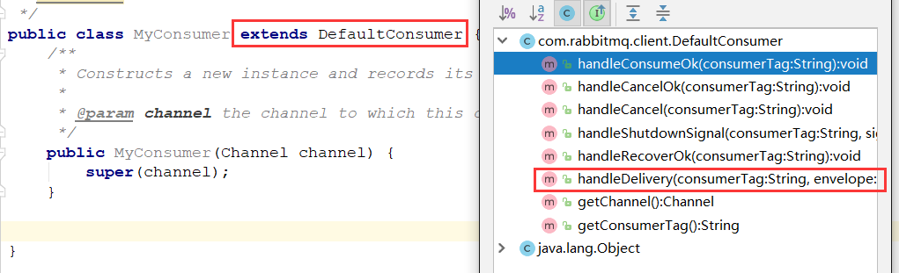
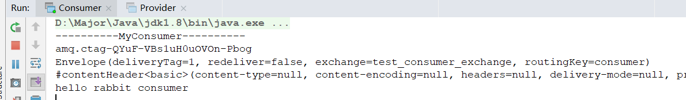

## 之前的消费者

在之前的消费端，我们是如何消费的呢？

```java
// 消费者
QueueingConsumer consumer = new QueueingConsumer(channel);
channel.basicConsume(queue, true, consumer);

// 消费
while (true){
    // Delivery 是封装的类，封装了消息信息，配置信息，交换机信息，路由键等信息
    QueueingConsumer.Delivery delivery = consumer.nextDelivery();
    byte[] body = delivery.getBody();
    System.out.println(new String(body));
}
```

创建一个`QueueingConsumer`，然后循环消费，将接收到的消息信息打印出来。

可以发现，这种方式耦合严重，并且不美观，那么有没有别的方式，更简单的进行消费呢？

就需要使用到接下来要说的自定义消费者

## 自定义消费者

为了改善之前while循环的情况，我们可以使用自定义的消费者，它更加方便，解耦性更强，实际工作中也更常用（当然不整合框架的话）。

### 使用方法

- 创建一个类实现`Consumer`接口，并重新一系列的方法，这种方式比较繁琐，需重写所有抽象方法。
- 创建一个类继承`DefaultConsumer`，这样只需要重写`handleDelivery` 方法即可，这种方式更简单，只需重新你所需要的方法即可。



### 代码实现

#### 自定义Consumer

```java
public class MyConsumer extends DefaultConsumer {
    /**
     * Constructs a new instance and records its association to the passed-in channel.
     *
     * @param channel the channel to which this consumer is attached
     */
    public MyConsumer(Channel channel) {
        super(channel);
    }

    @Override
    public void handleDelivery(String consumerTag, Envelope envelope,
                               AMQP.BasicProperties properties, byte[] body) throws IOException {
        System.out.println("----------MyConsumer----------");
        System.out.println(consumerTag);
        System.out.println(envelope);
        System.out.println(properties);
        System.out.println(new String(body));
    }
}
```

#### 生产端

```java
public class Provider {
    
    public static void main(String[] args) throws Exception{
        // 1.创建连接工程
        ConnectionFactory connectionFactory = new ConnectionFactory();
        connectionFactory.setHost("192.168.56.120");
        connectionFactory.setPort(5672);
        connectionFactory.setVirtualHost("/"); // 默认创建 "/" 为虚拟主机

        // 2.创建连接
        Connection connection = connectionFactory.newConnection();

        // 3.创建Channel通道
        Channel channel = connection.createChannel();

        String exchange = "test_consumer_exchange";
        String routingKey = "consumer";
        String msg = "hello rabbit consumer";
        channel.basicPublish(exchange,routingKey,null,msg.getBytes());

        // 5.关闭连接
        channel.close();
        connection.close();

    }
}
```

#### 消费端

```java
public class Consumer {

    public static void main(String[] args) throws Exception{
        // 1.创建连接工程
        ConnectionFactory connectionFactory = new ConnectionFactory();
        connectionFactory.setHost("192.168.56.120");
        connectionFactory.setPort(5672);
        connectionFactory.setVirtualHost("/"); // 默认创建 "/" 为虚拟主机

        // 2.创建连接
        Connection connection = connectionFactory.newConnection();

        // 3.创建Channel通道
        Channel channel = connection.createChannel();

        // 4.创建队列
        String exchange = "test_consumer_exchange";
        String queue = "test_consumer_queue";
        String routingKey = "consumer";
        channel.exchangeDeclare(exchange,"direct",true);
        channel.queueDeclare(queue,false,false,false,null);
        channel.queueBind(queue,exchange,routingKey);

        // 绑定消费者
        channel.basicConsume(queue,true,new MyConsumer(channel));

    }
}
```

#### 测试

先开启Consumer，然后查看`15672`可视化界面，是否创建对应的exchange，queue

再开启Provider，观察Consumer的控制台



正确展示出信息，并且还在运行，监听消息队列