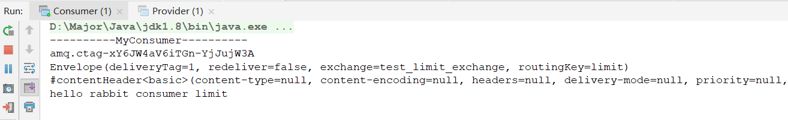
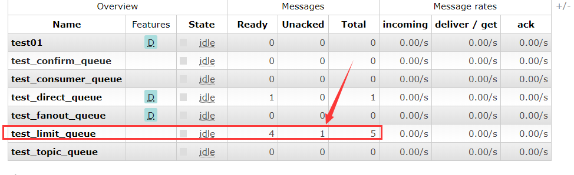
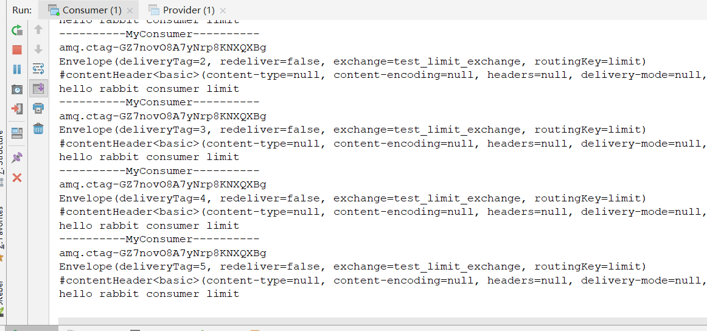
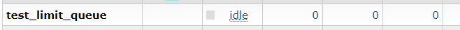

## 为什么要进行限流

假设一个情景：某个消费端挂掉了，因为不是很重要，所以程序员第二天才发现，这时在MQ Broker上已经囤积了可能上千上万条message，如果这时直接重启消费端，巨量消息冲击，如果单机客户端无法抵御冲击很可能导致服务器崩溃，引发线上故障。

除了这个情景，还有其他情况，生产端每分钟有几百条消息，但消费端每分钟只能处理几十条，这时生产与消费肯定是不平衡的，如果长此以往超出了最大负荷，消费端性能必定下降，导致服务器卡顿崩溃等问题。

这两个情景下都离不开限流，只要有了限流，这些问题都能迎刃而解。

## RabbitMQ限流机制

对于限流，肯定是在消费端的，与生产端无关。

RabbitMQ提供了一种`QOS`（服务质量保证）功能：即在未开启自动确认（`autoAck`）功能的前提下，如果一定数量的消息未确认，即未返回`ACK`，消费端不进行新消息的消费

**最重要一点：不能开启`autoAck`，即`autoAck=false`，否则无法做到限流**

### 限流相关API

#### 限流设置 - BasicQos()

```java
void basicQos(int prefetchSize, int prefetchCount, boolean global) throws IOException;
```

三个参数：

- `prefetchSize`：消息的大小限制，0为不限制，一般来说都设为0
- `prefetchCount`：每次最多能处理多少条消息，一般为1，每次消费1条
- `global`：是否对Channel限制，`false`即只对Consumer端限制，一般为`false`

#### 手动ACK - basicAck()

```java
void basicAck(long deliveryTag, boolean multiple) throws IOException;
```

两个参数：

- `deliveryTag`：消息的标志，标识，可从`Envelope`中获取
- `multiple`：是否批量返回，如果在限流设置中`prefetchCount`设置大于1，需要设为`true`，反之`false`

### 代码实现

#### 生产端

生产端循环发送5条消息到队列中

```java
public class Provider {

    public static void main(String[] args) throws Exception{
        // 1.创建连接工程
        ConnectionFactory connectionFactory = new ConnectionFactory();
        connectionFactory.setHost("192.168.56.120");
        connectionFactory.setPort(5672);
        connectionFactory.setVirtualHost("/"); // 默认创建 "/" 为虚拟主机
        // 2.创建连接
        Connection connection = connectionFactory.newConnection();
        // 3.创建Channel通道
        Channel channel = connection.createChannel();

        String exchange = "test_limit_exchange";
        String routingKey = "limit";
        String msg = "hello rabbit consumer limit";

        for (int i = 0; i < 5; i++) {
            channel.basicPublish(exchange,routingKey,null,msg.getBytes());
        }

        // 5.关闭连接
        channel.close();
        connection.close();
    }
}
```

#### 消费端

```java
public class Consumer {

    public static void main(String[] args) throws Exception{
        ConnectionFactory connectionFactory = new ConnectionFactory();
        connectionFactory.setHost("192.168.56.120");
        connectionFactory.setPort(5672);
        connectionFactory.setVirtualHost("/"); // 默认创建 "/" 为虚拟主机

        Connection connection = connectionFactory.newConnection();

        Channel channel = connection.createChannel();

        // 队列 交换机 绑定
        String exchange = "test_limit_exchange";
        String queue = "test_limit_queue";
        String routingKey = "limit";
        channel.exchangeDeclare(exchange,"direct",true);
        channel.queueDeclare(queue,false,false,false,null);
        channel.queueBind(queue,exchange,routingKey);

        // 限流
        channel.basicQos(0,1,false);
        // 最重要一点 autoAck = false
        channel.basicConsume(queue,false,new MyConsumer(channel));

    }
}
```

最重要的代码为下面两句

```java
// 限流
channel.basicQos(0,1,false);
// 最重要一点 autoAck = false
channel.basicConsume(queue,false,new MyConsumer(channel));
```

#### 自定义消费者

```java
public class MyConsumer extends DefaultConsumer {

    private Channel channel;

    public MyConsumer(Channel channel) {
        super(channel);
        this.channel = channel;
    }

    @Override
    public void handleDelivery(String consumerTag, Envelope envelope,
                               AMQP.BasicProperties properties, byte[] body) throws IOException {
        System.out.println("----------MyConsumer----------");
        System.out.println(consumerTag);
        System.out.println(envelope);
        System.out.println(properties);
        System.out.println(new String(body));

        // 手动ACK
        //channel.basicAck(envelope.getDeliveryTag(),false);
    }
}
```

需要注意，这里我把手动`ACK`注释掉了，为了更好的展示效果

#### 测试

先开启Consumer，然后查看`15672`可视化界面，是否创建对应的exchange，queue

开启Provider，投递五条消息到Exchange中，查看控制台



可以发现，这里只有一条消息被打印了出来，在看下可视化界面



我们的队列中，5条消息，4条在准备阶段，1条被消费但是没有返回ACK，因为我们把返回`ACK`的代码给注释掉了，这也可以说明我们限流成功。

当我们没有回送`ack`应答时，Broker端就认为消费端还没有处理完这条消息，基于这种限流机制就不会给消费端发送新的消息了，所以消费端只打印了一条消息。

这时我们把响应`ACK`的代码放开，并重启Consumer



成功消费五条消息



队列为空