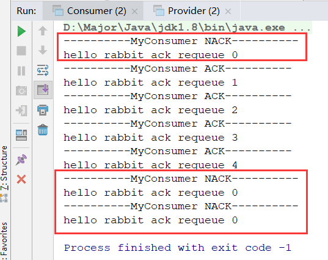

## ACK与NACK

在上一节中，我们研究了消费端的限流，了解到手动发送`ACK`的`API`，对于消费端来说，不止能发`ACK`还能发`NACK`，因为总会有消息接收出问题的情况。

当发送`ACK`后，告知Broker成功被消费，就结束了一条消息流程。

当发送`NACK`，消息未被成功消费，那么有两种情况，对于`requeue`的设置

- 如果为`true`，即重回队列，将未被成功消费的信息放到队列最末端，等等重新被消费
- 如果为`false`，即不做任何操作

### 使用方式

NACK：`void basicNack(long deliveryTag, boolean multiple, boolean requeue)`

ACK：`void basicAck(long deliveryTag, boolean multiple)`

## 重回队列

- 消费端重回队列是为了对没有处理成功的消息，把消息重新会递给Broker！
- 重回队列，会把消费失败的消息重新添加到队列的尾端，供消费者继续消费。
- 代码设置在`channel.basicNack`的最后一个参数
- 一般我们在实际应用中，都会关闭重回队列，也就是设置为`false`

## 代码实现

这里我们发送五条消息并设置`header`为`0-4`，在自定义消费者中，对于第0条消息进行`NACK`的返回，并设置为重回队列`requeue=true`，来看看效果

### 生产端

```java
public class Provider {

    public static void main(String[] args) throws Exception{
        // 1.创建连接工程
        ConnectionFactory connectionFactory = new ConnectionFactory();
        connectionFactory.setHost("192.168.56.120");
        connectionFactory.setPort(5672);
        connectionFactory.setVirtualHost("/"); // 默认创建 "/" 为虚拟主机
        // 2.创建连接
        Connection connection = connectionFactory.newConnection();
        // 3.创建Channel通道
        Channel channel = connection.createChannel();

        String exchange = "test_ack_exchange";
        String routingKey = "ack";

        for (int i = 0; i < 5; i++) {
            Map header = new HashMap();
            header.put("index",i);
            AMQP.BasicProperties properties = new AMQP.BasicProperties.Builder()
                    .headers(header)
                    .build();
            String msg = "hello rabbit ack requeue " + i;
            channel.basicPublish(exchange,routingKey,properties,msg.getBytes());
        }

        // 5.关闭连接
        channel.close();
        connection.close();
    }
}
```

### 消费端

```java
public class Consumer {

    public static void main(String[] args) throws Exception{
        ConnectionFactory connectionFactory = new ConnectionFactory();
        connectionFactory.setHost("192.168.56.120");
        connectionFactory.setPort(5672);
        connectionFactory.setVirtualHost("/"); // 默认创建 "/" 为虚拟主机

        Connection connection = connectionFactory.newConnection();

        Channel channel = connection.createChannel();

        // 队列 交换机 绑定
        String exchange = "test_ack_exchange";
        String queue = "test_ack_queue";
        String routingKey = "ack";
        channel.exchangeDeclare(exchange,"direct",true);
        channel.queueDeclare(queue,false,false,false,null);
        channel.queueBind(queue,exchange,routingKey);

        // 最重要一点 autoAck = false
        channel.basicConsume(queue,false,new MyConsumer(channel));

    }
}
```

### 自定义消费者

```java
public class MyConsumer extends DefaultConsumer {

    private Channel channel;

    public MyConsumer(Channel channel) {
        super(channel);
        this.channel = channel;
    }

    @Override
    public void handleDelivery(String consumerTag, Envelope envelope,
                               AMQP.BasicProperties properties, byte[] body) throws IOException {
        try {
            Thread.sleep(2000); // 睡两秒为了更好的观察控制台，不然刷新太快
        } catch (InterruptedException e) {
            e.printStackTrace();
        }

        Integer index = (Integer) properties.getHeaders().get("index");
        if(index == 0){
            System.out.println("----------MyConsumer NACK----------");
            channel.basicNack(envelope.getDeliveryTag(),false,true);
        }else {
            System.out.println("----------MyConsumer ACK----------");
            channel.basicAck(envelope.getDeliveryTag(),false);
        }
        System.out.println(new String(body));
    }
}
```

### 测试



通过测试结果可以清晰的看出，当响应NACK后，消息重回队列，又因为它的索引一直是0，所以会一直循环返回NACK，这里我就直接停掉了。

**注意**

一般工作中不会设置重回队列这个属性，我们都是自己去做补偿或者投递到延迟队列里的，然后指定时间去处理即可。