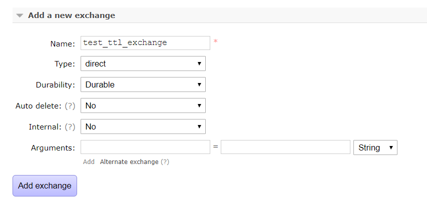
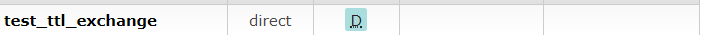
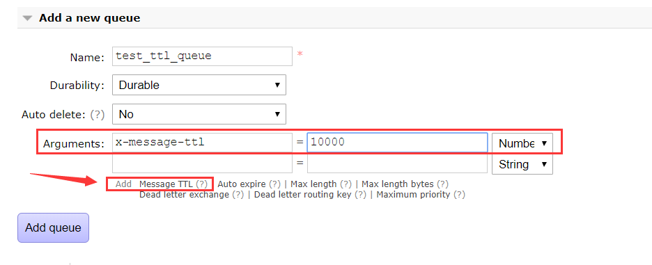
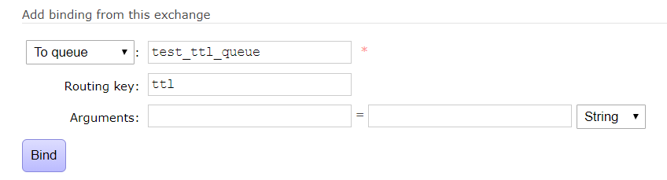
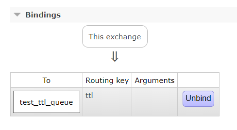
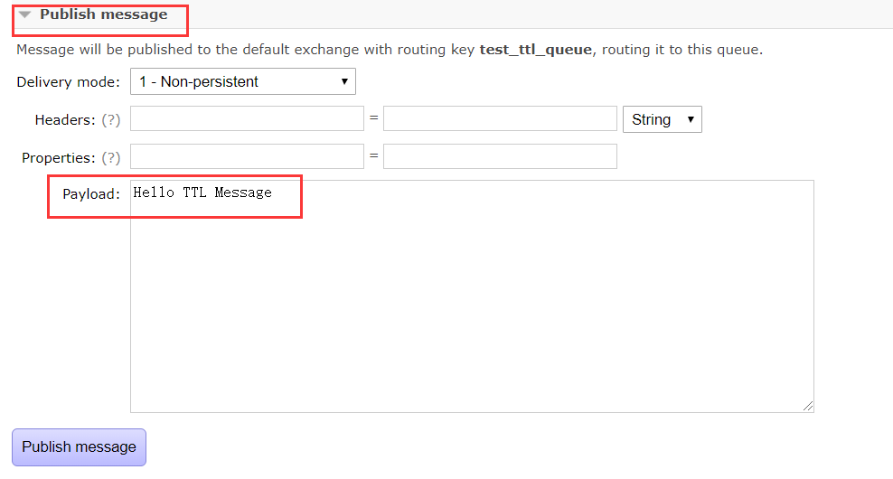
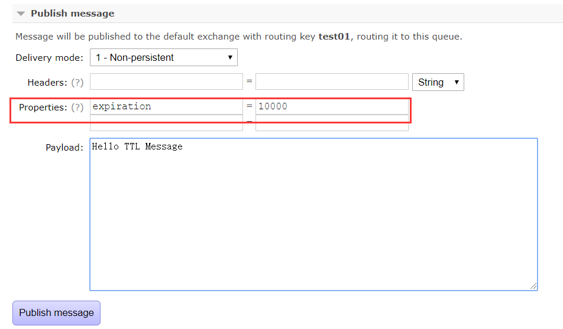
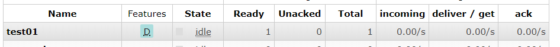

### 什么是TTL

- TTL意为`Time To Live`，即生存时间
- RabbitMQ中适用于队列和消息
  - 消息：即消息过期时间，比如设置10秒，10秒后如果没有被消费则删除
  - 队列：队列中消息的存活时间，从消息入队列开始计算，只要超过了队列的超时时间配置，那么消息会自动的清除

### TTL控制台操作

因为之前都是代码操作，还没有在15672控制台操作过，所以我们先使用控制台进行TTL测试

#### 创建Exchange

在`Exchange Tab`下，添加一个新的Exchange，`test_ttl_exchange`





成功添加


#### TTL队列

在`Queue Tab`下，添加一个新的Queue ，`test_ttl_queue`



点击下面的红框，就会弹出参数的添加，`x-message-ttl`就是设置TTL队列的配置


#### 设置绑定关系

在`Exchange Tab`中点击`test_ttl_exchange`






#### 投递普通消息

在`Queue Tab`中点击`test_ttl_queue`




投递成功后，会发现队列中有一条消息等待消费，这时我们等10秒钟


会发现消息消失了，即过期时间一过便被删除了


#### 投递TTL消息

我们接着测试TTL消息的投递，这时我们就不再TTL队列中测试了，随便找个其他的队列投递

这里我们使用到`test01`队列，其实对于TTL消息我们在之前讲消息的时候就使用过，通过链式编程，添加Properties信息的时候



主要参数就是`expiration`



投递完我们再等待10秒


消息成功被删除

### TTL代码操作

#### TTL消息

```java
AMQP.BasicProperties properties = new AMQP.BasicProperties.Builder()
                .expiration("10000") //10s过期
                .build();
//发送消息
channel.basicPublish(exchange, routingKey, true, properties, msg.getBytes());
```

#### TTL队列

```java
Map argument = new HashMap();
argument.put("x-message-ttl",10000);
channel.queueDeclare(queue,false,false,false,argument);
```

通过创建队列时的最后一个入参`arguments`添加`ttl`配置

