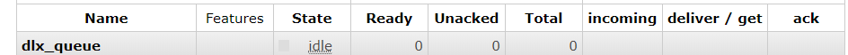
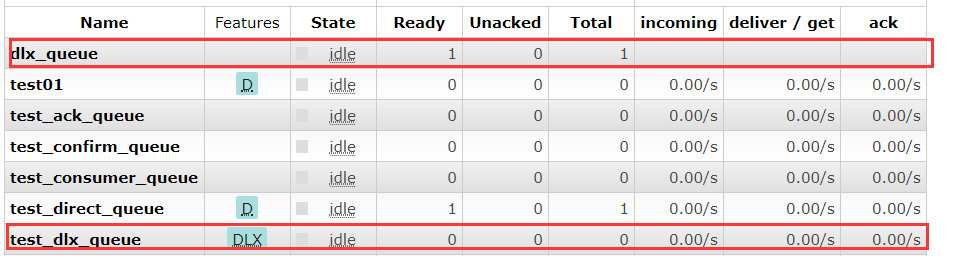

### 死信队列介绍

死信队列，DLX，`dead-letter-exchange`

死信队列其实就是一个队列，只不过里面存放的都是死信，所以才叫做死信队列

### 死信

那么什么是死信呢，即死亡的信息，这里死亡的定义有几种

- 被拒绝的消息(basic.reject / basic.nack)，并且requeue = false
- 消息的TTL过期
- 队列达到最大长度

### 死信的处理过程

创建一个DLX，ex01，这是一个正常的Exchange。

创建一个其他的Exchange，ex02，并且其队列设置其DLX参数为刚刚创建的死信队列。

这样如果这个ex02里有死信，就自动会投递到ex01中保存，可以根据业务场景，对ex01即DLX进行消费监听处理。

### 死信队列的设置

1.配置一个队列为死信队列

```
Exchange: dlx.exchange
Queue: dlx.queue
RoutingKey: #
```

#表示只要有消息到达了Exchange，那么都会路由到这个queue上

2.创建一个正常的队列，并对其队列的argument参数上添加

`arguments.put("x-dead-letter-exchange","dlx.exchange");`，这样消息在过期、requeue、 队列在达到最大长度时，消息就可以直接路由到死信队列！

3.创建一个死信Consumer，去监听消费DLX上的Message

### 代码演示

#### 创建一个DLX

因为我们现在没有死信队列，所以需要创建一个

```java
public class DLX {
    public static void main(String[] args) throws Exception {
        ConnectionFactory connectionFactory = new ConnectionFactory();
        connectionFactory.setHost("192.168.56.120");
        connectionFactory.setPort(5672);
        connectionFactory.setVirtualHost("/"); // 默认创建 "/" 为虚拟主机

        Connection connection = connectionFactory.newConnection();

        Channel channel = connection.createChannel();

        // 队列 交换机 绑定
        String exchange = "dlx_exchange";
        String queue = "dlx_queue";
        String routingKey = "#";
        channel.exchangeDeclare(exchange,"topic",true);
        channel.queueDeclare(queue,false,false,false,null);
        channel.queueBind(queue,exchange,routingKey);
        
        channel.close();
        connection.close();
    }
}
```



#### 生产端

主要是发送一个带有过期时间的消息

```java
public class Provider {
    public static void main(String[] args) throws Exception{
        // 1.创建连接工程
        ConnectionFactory connectionFactory = new ConnectionFactory();
        connectionFactory.setHost("192.168.56.120");
        connectionFactory.setPort(5672);
        connectionFactory.setVirtualHost("/"); // 默认创建 "/" 为虚拟主机
        // 2.创建连接
        Connection connection = connectionFactory.newConnection();
        // 3.创建Channel通道
        Channel channel = connection.createChannel();

        String exchange = "test_dlx_exchange";
        String routingKey = "dlx";

        AMQP.BasicProperties properties = new AMQP.BasicProperties.Builder()
                .expiration("5000") // 设置5秒的过期时间
                .build();
        String msg = "hello rabbit DLX" ;
        channel.basicPublish(exchange,routingKey,properties,msg.getBytes());

        // 5.关闭连接
        channel.close();
        connection.close();
    }
}
```

#### 消费端

```java
public class Consumer {
    public static void main(String[] args) throws Exception{
        ConnectionFactory connectionFactory = new ConnectionFactory();
        connectionFactory.setHost("192.168.56.120");
        connectionFactory.setPort(5672);
        connectionFactory.setVirtualHost("/"); // 默认创建 "/" 为虚拟主机

        Connection connection = connectionFactory.newConnection();

        Channel channel = connection.createChannel();

        // 队列 交换机 绑定
        String exchange = "test_dlx_exchange";
        String queue = "test_dlx_queue";
        String routingKey = "dlx";
        channel.exchangeDeclare(exchange,"direct",true);

        // 重点，设置死信队列的配置
        Map argument = new HashMap();
        argument.put("x-dead-letter-exchange","dlx_exchange");
        channel.queueDeclare(queue,false,false,false,argument);
        channel.queueBind(queue,exchange,routingKey);

        // 最重要一点 autoAck = false
        channel.basicConsume(queue,false,new MyConsumer(channel));

    }
}
```

主要是绑定死信队列

这里自定义消费者就不放出来了，简单的ack返回

#### 测试

先开启Consumer，创建Exchange与Queue绑定，然后再关闭，不然就被它消费了

然后开启Provider发送消息



因为消息10秒过期，所以进入了死信队列