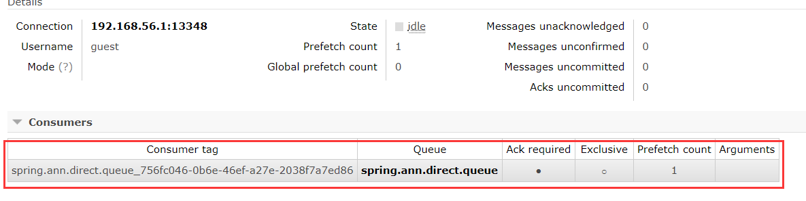
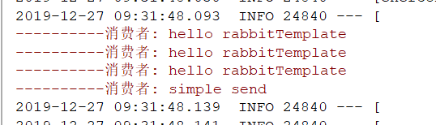
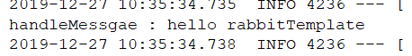
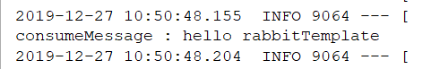
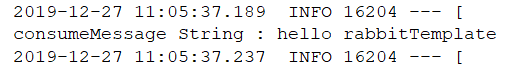
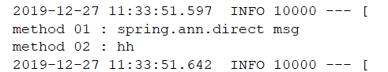
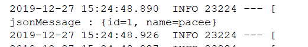
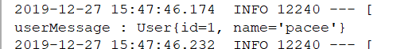
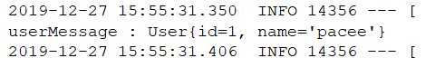

接着上一节，我们研究剩下的核心内容

## SimpleMessageListenerContainer

消息监听容器，其作用和消费者差不多，可以根据一系列的配置，进行消息的消费，主要作用有：

- 监听队列（多个），自启动，自动声明
- 设置事物相关
- 设置消费者数量，最大数量，批量消费
- 设置消息确认模式，是否自动签收（`ACK`），是否重回队列
- 设置消费者`Tag`标签的生成策略（`UUID`），是否独占以及其他属性
- 设置具体的监听、消息转换器，适配器

### 特性说明

-  `SimpleMessageListenerContainer`可以进行动态设置， 比如在运行中的应用可以动态的修改其消费者数量的大小、接收消息的模式等
- 很多基于RabbitMQ的自制定化后端管控台在进行动态设置的时候，也是根据这一特去实现的。所以可以看出SpringAMQP非常的强大

### SimpleMessageListenerContainer使用

和之前一样，也需要向容器中添加，简单设置一些常用属性，还有一些比如适配器，转换器后面再使用

```java
@Bean
public SimpleMessageListenerContainer simpleMessageListenerContainer(ConnectionFactory connectionFactory){
    SimpleMessageListenerContainer container = new SimpleMessageListenerContainer(connectionFactory);
    //监控队列，可以同时监控多个
    container.setQueueNames("spring.ann.direct.queue","spring.ann.direct.queue2"); // 通过名字设置队列
    // container.setQueues(); // 通过队列对象设置
    //设置当前消费者数量
    container.setConcurrentConsumers(1);
    //设置消费者并发数量的上限，不能小于ConcurrentConsumers，默认为ConcurrentConsumers，消费者会按需添加
    //指的是消费者的最大并行度是多少
    container.setMaxConcurrentConsumers(5);
    //设置是否重回队列
    container.setDefaultRequeueRejected(false);
    //设置签收模式：AUTO(自动签收)、MANUAL(手工签收)、NONE(不签收，没有任何操作)
    container.setAcknowledgeMode(AcknowledgeMode.AUTO);
    //设置消费端标签策略：就是在消费端生成自己的标签时可以指定一个生成策略
    container.setConsumerTagStrategy(new ConsumerTagStrategy() {
        @Override
        public String createConsumerTag(String queue) {
            return queue + "_" + UUID.randomUUID().toString();
        }
    });

    //设置消息监听器
    container.setMessageListener(new ChannelAwareMessageListener() {
        @Override
        public void onMessage(Message message, Channel channel) throws Exception {
            String msg = new String(message.getBody());
            System.err.println("----------消费者: " + msg);
        }
    });
    return container;
}
```

这里当设置消息监听器后，启动程序便不会自动关闭了，而是一直处于监听状态



启动后会发现信道中有一个`Consumer`，就是我们刚刚设置的`Consumer`，并且`tag`标签是`UUID`生成的

这时我们向次队列发送消息，看看是否会被消费，关闭`Application`，并启动Test测试类发送



成功消费四条，这里为何要启动测试类发送呢？因为我们是使用`@Bean`直接将监听容器添加到上下文了，所以启动Test类会自动加载并监听消费。

## MessageListenerAdapter

消息监听适配器，使用了适配器模式，需要我们自己创建一个类，使用我们创建的来进行实际的消息消费。

消息监听适配器也是基于`SimpleMessageListenerContainer`添加的，需要在`Container`中设置，使用消息监听适配器，就不需要添加`ChannelAwareMessageListener`了，这种方式进行消息消费，更加灵活

### 快速使用

1.首先创建一个我们的Adapter类

```java
public class MyAdapter {
    public void handleMessage(byte[] body){
        System.out.println("handleMesage : " + new String(body));
    }
}
```

这里只添加了一个`handleMessage(byte[])`方法，为何叫这名字，为何使用`byte`数组参数，我们后面在说

2.然后再`Container`中创建适配器，并添加此适配器监听

```java
// 创建消息监听适配器
MessageListenerAdapter adapter = new MessageListenerAdapter(new MyAdapter());
// 添加消息监听适配器
container.setMessageListener(adapter);
```

3.最后在测试类发送一条消息

```java
@Test
public void sendMessage2(){
    // Message的Properties配置
    MessageProperties messageProperties = new MessageProperties();
    messageProperties.setHeader("desc","一些信息"); // 添加Header
    String msg = "hello rabbitTemplate";
    // 创建消息
    Message message = new Message(msg.getBytes(),messageProperties);
    // 发送一条消息 投递到spring.ann.direct Exchange上，路由键为ann.direct
    rabbitTemplate.convertAndSend("spring.ann.direct","ann.direct",message);
}
```

查看控制台



发现正确把消息消费了

### 源码查看

接着我们进入源码，看看他为何使用这种方法名与参数

```java
public class MessageListenerAdapter extends AbstractAdaptableMessageListener {

   private final Map<String, String> queueOrTagToMethodName = new HashMap<String, String>();

   /**
    * Out-of-the-box value for the default listener method: "handleMessage".
    */
   public static final String ORIGINAL_DEFAULT_LISTENER_METHOD = "handleMessage";


   private Object delegate;

   private String defaultListenerMethod = ORIGINAL_DEFAULT_LISTENER_METHOD;
```

重要的成员变量就这四个

- `queueOrTagToMethodName`：队列与方法名对应，后面再讲
- `defaultListenerMethod`配合`ORIGINAL_DEFAULT_LISTENER_METHOD`：默认方法名为`handleMessage`
- `delegate`：传入的适配器，即我们的`MyAdapter`类对象

通过几个成员变量就可以发现，底层**使用反射机制对传入的适配对象的默认方法名进行调用**，而这里默认方法名就是`handleMessage`

### 常用配置

#### 方法名修改

1.首先是默认方法名修改，这里需要使用setDefaultListenerMethod()方法

```java
adapter.setDefaultListenerMethod("consumerMessage");
```

2.在MyAdapter中添加方法

```java
public void consumerMessage(byte[] body){
    System.out.println("consumeMessage : " + new String(body));
}
```

3.发送消息



成功执行调用

#### 方法参数类型修改

因为我们的消息是默认由`byte[]`数组保存，所以方法参数上要使用`byte`数组，那么如何修改它呢，比如改成String，就需要用到之后要讲的消息转换器`MessageConverter`，将`Message`转换成String类型的，使用`Adapter`的`setMessageConverter(MessageConverter)`方法配置转换器

1.创建一个自定义消息转换器并实现`MessageConverter`

```java
public class MyConverter implements MessageConverter {
    @Override // 将Object对象转成Message对象
    public Message toMessage(Object object, MessageProperties messageProperties) throws MessageConversionException {
        return new Message(object.toString().getBytes(),messageProperties);
    }

    @Override // 将Message对象转成String 这里我们主要使用这个方法
    public Object fromMessage(Message message) throws MessageConversionException {
        byte[] body = message.getBody();
        return new String(body);
    }
}
```

2.在`MyAdapter`创建一个`String`参数的方法

```java
public void consumerMessage(String msg){
    System.out.println("consumeMessage String : " + msg);
}
```

3.配置消息转换器

```java
adapter.setMessageConverter(new MyConverter());
```

4.发送消息，查看控制台



正确请求String类型入参的消费方法

#### 队列与方法对应

这时我们就会发现，在刚刚所有的消费看了，不管发送消息到哪个队列（`container.setQueueNames("spring.ann.direct.queue","spring.ann.direct.queue2"); `中配置的队列），都会被默认方法消费，那么我们想对应消费的方法应该怎么做呢，就要用到之前源码分析看到的`queueOrTagToMethodName`参数。

1.适配器进行修改

```java
// 创建消息监听适配器
MessageListenerAdapter adapter = new MessageListenerAdapter(new MyAdapter());
//adapter.setDefaultListenerMethod("consumerMessage");
//adapter.setMessageConverter(new MyConverter());
Map<String,String> queueToMethod = new HashMap<>();
queueToMethod.put("spring.ann.direct.queue","method01");
queueToMethod.put("spring.ann.direct.queue2","method02");
adapter.setQueueOrTagToMethodName(queueToMethod);
// 添加消息监听适配器
container.setMessageListener(adapter);
```

2.在MyAdapter中添加对应方法

```java
public void method01(byte[] body){
    System.out.println("method 01 : " + new String(body));
}

public void method02(String body){
    System.out.println("method 02 : " + body);
}
```

3.发送消息到队列上

```java
@Test
    public void sendMessage2(){
        MessageProperties messageProperties = new MessageProperties();
        String msg = "spring.ann.direct msg";
        // 创建消息
        Message message = new Message(msg.getBytes(),messageProperties);
        // 发送一条消息 投递到spring.ann.direct Exchange上，路由键为ann.direct
        rabbitTemplate.convertAndSend("spring.ann.direct","ann.direct",message);
        // 简单的发送一条字符串信息
        rabbitTemplate.convertAndSend("spring.ann.direct2","ann.direct","hh");
    }
```

这里我们第一条发送`Message`对象，方法中使用`byte`数组接收，第二条消息发送`String`对象，使用`String`接收



正确消费

## MessageConverter

消息转换器，在消息传输中，默认都是使用二进制字节流的方式进行传输，就是`byte[]`数组的方式，在上面消息适配器的学习中，我们使用了自定义的消息转换器，使消息使用字符串形式进行投递并消费，这里我们再了解下其他一些常用的消息转换器。

对于自定义转换器，实现方法为：

- 实现`MessageConverter`接口，重写下面两个方法
  - `toMessage:` java对象转换为Message
  - `fromMessage:` Message对象转换为java对象

常用的转换器：

- `Jackson2JsonMessageConverter`：对Json进行转换，配合`DefaultJackson2JavaTypeMapper`可以对`JavaBean`进行转换
- `ContentTypeDelegatingMessageConverter`：全局转换器，可以设置多种转换器组合

### Jackson2JsonMessageConverter

#### Message转Json

**1.创建一个`User `Bean，这里我就不放代码了，简单的`id`与`name`字段**

**2.添加Bean转Json依赖，这里我添加了阿里的fastjson**

```xml
<!-- alibaba json -->
<dependency>
    <groupId>com.alibaba</groupId>
    <artifactId>fastjson</artifactId>
    <version>1.2.41</version>
</dependency>
```

**3.修改监听容器代码，将Json转换器绑定到适配器上**

```java
@Bean
public SimpleMessageListenerContainer simpleMessageListenerContainer2(ConnectionFactory connectionFactory){
    SimpleMessageListenerContainer container = new SimpleMessageListenerContainer(connectionFactory);
    container.setQueueNames("spring.ann.direct.queue"); // 通过名字设置队列
    container.setConcurrentConsumers(1);

    // 创建消息监听适配器
    MessageListenerAdapter adapter = new MessageListenerAdapter(new MyAdapter());
    adapter.setDefaultListenerMethod("consumerMessage");

    // Json转换
    Jackson2JsonMessageConverter converter = new Jackson2JsonMessageConverter();
    // 设置转换器
    adapter.setMessageConverter(converter);

    container.setMessageListener(adapter);
    return container;
}
```

特别注意，在适配器上添加转换器，而不是`container`容器中`set`转换器

**4.修改委派类`MyAdapter**`

```java
// 接收Json格式的
public void consumerMessage(Map jsonMap){
    System.out.println("jsonMessage : " + jsonMap);
}
```

这里添加一个接受Json格式的重载方法，Json格式消费时会以Map形式接收

**5.发送消息**

```java
@Test
// Json Message Send
public void sendJsonMessage(){
    User user = new User(1,"pacee");
    String userJson = JSONObject.toJSONString(user);
    // 创建消息
    // 配置json格式请求
    MessageProperties messageProperties = new MessageProperties();
    messageProperties.setContentType("application/json");
    Message message = new Message(userJson.getBytes(),messageProperties);
    // 发送一条消息 投递到spring.ann.direct Exchange上，路由键为ann.direct
    rabbitTemplate.send("spring.ann.direct","ann.direct",message);
}
```

发送消息时特别注意，要加上`setContentType("application/json")`，不然还是以`byte`二进制字节流形式传输的

**6.查看结果**



成功以Json形式接收

#### Message转ObjecBean

这里是直接使用ObjectBean进行传输，即我们刚刚创建的User对象

**1.修改委派类MyAdapter**

```java
// 接收User格式的
public void consumerMessage(User user){
    System.out.println("userMessage : " + user);
}
```

添加User类型的重载方法用来接收消息

**2.修改发送消息测试类**

```java
@Test
public void sendUserMessage(){
    User user = new User(1,"pacee");
    String userJson = JSONObject.toJSONString(user);

    // 创建消息
    // 配置json格式请求
    MessageProperties messageProperties = new MessageProperties();
    messageProperties.setContentType("application/json");
    // 必须指定__TypeId__，值为全类名
    messageProperties.getHeaders().put("__TypeId__","com.enbuys.spring.bean.User");
    Message message = new Message(userJson.getBytes(),messageProperties);

    rabbitTemplate.send("spring.ann.direct","ann.direct",message);
}
```

这里最重要一点，添加Header，`put("__TypeId__","com.enbuys.spring.bean.User")`，其中键是固定的，值为全限定类名

**3.测试**



成功消费

**4.注意事项**

- 实体类必须添加有参构造方法喝无参构造

#### 转ObjecBean优化

在上一节，我们使用在Message Header添加特殊信息的方式进行消息转换，可以发现每次都需要写全限定类名，耦合度高还不方便，这里我们进行改造

**1.ListenerContainer改造**

```java
// 创建消息监听适配器
MessageListenerAdapter adapter = new MessageListenerAdapter(new MyAdapter());
adapter.setDefaultListenerMethod("consumerMessage");

// Json转换
Jackson2JsonMessageConverter converter = new Jackson2JsonMessageConverter();
DefaultJackson2JavaTypeMapper mapper = new DefaultJackson2JavaTypeMapper();

Map<String,Class<?>> idClassMapping = new HashMap<>();
idClassMapping.put("user",User.class);

mapper.setIdClassMapping(idClassMapping);
converter.setJavaTypeMapper(mapper);
// 设置转换器
adapter.setMessageConverter(converter);

container.setMessageListener(adapter);
```

这里添加了DefaultJackson2JavaTypeMapper，用来配置id与Bean的关系，然后再发送消息时，就只需发现id即可，消息传输时就会根据映射关系转换。

DefaultJackson2JavaTypeMapper -> Jackson2JsonMessageConverter -> MessageListenerAdapter -> SimpleMessageListenerContainer

Java类型映射器 -> 消息转换器 -> 消息监听映射器 -> 消息监听容器

**2.改造发送消息的测试类**

```java
@Test
public void sendUserMessage2(){
    User user = new User(1,"pacee");
    String userJson = JSONObject.toJSONString(user);

    // 创建消息
    // 配置json格式请求
    MessageProperties messageProperties = new MessageProperties();
    messageProperties.setContentType("application/json");
    // 必须指定__TypeId__，值为全类名
    messageProperties.getHeaders().put("__TypeId__","user");
    Message message = new Message(userJson.getBytes(),messageProperties);

    rabbitTemplate.send("spring.ann.direct","ann.direct",message);
}
```

可以看到，这里put的值就为刚刚设置的id

**3.测试**



成功消费


### ContentTypeDelegatingMessageConverter

经过上面转换器的学习，可以发现每次都只设置了一个转换器，要么是自定义的转换器，要么是Json转换器，那么能不能同时都用呢，这里`ContentTypeDelegatingMessageConverter`，就登场了，他是一个非常强大的转换器，可以根据请求头，进行不同场景使用不同的转换器，接下来我们通过代码进行探究

**1.修改Container**

```java
@Bean
public SimpleMessageListenerContainer simpleMessageListenerContainer3(ConnectionFactory connectionFactory){
    SimpleMessageListenerContainer container = new SimpleMessageListenerContainer(connectionFactory);
    container.setQueueNames("spring.ann.direct.queue"); // 通过名字设置队列
    container.setConcurrentConsumers(1);

    // 创建消息监听适配器
    MessageListenerAdapter adapter = new MessageListenerAdapter(new MyAdapter());
    adapter.setDefaultListenerMethod("consumerMessage");

    // 使用全局转换器
    ContentTypeDelegatingMessageConverter convert = new ContentTypeDelegatingMessageConverter();
    //根据不同的contentType添加相应的消息转换器
    //addDelegate(String contentType, MessageConverter messageConverter)
    MyConverter textConvert = new MyConverter();
    convert.addDelegate("text", textConvert);
    convert.addDelegate("html/text", textConvert);
    convert.addDelegate("xml/text", textConvert);
    convert.addDelegate("text/plain", textConvert);

    Jackson2JsonMessageConverter jsonConvert = new Jackson2JsonMessageConverter();
    convert.addDelegate("json", jsonConvert);
    convert.addDelegate("application/json", jsonConvert);

    ImageMessageConverter imageConverter = new ImageMessageConverter();
    convert.addDelegate("image/jpg", imageConverter);
    convert.addDelegate("image", imageConverter);

    adapter.setMessageConverter(convert);
    container.setMessageListener(adapter);

    // 设置转换器
    adapter.setMessageConverter(convert);

    container.setMessageListener(adapter);
    return container;
}
```

可以根据代码看到，通过不同的请求头，配置了不同的转换器，这里我们对新添加的ImageMessageConverter进行测试

**2.创建ImageMessageConverter**

```java
public class ImageMessageConverter implements MessageConverter {
    @Override
    public Message toMessage(Object object, MessageProperties messageProperties) throws MessageConversionException {
        return null;
    }

    @Override
    public Object fromMessage(Message message) throws MessageConversionException {
        System.out.println("-----------Image MessageConverter----------");
        // 使用File传输，所以要将Message转成File
        String fileName = "imageMessageConverter.jpg";
        String path = "d:/" + fileName;
        File file = new File(path);

        // 将字节流数据拷贝
        try {
            Files.copy(new ByteArrayInputStream(message.getBody()),file.toPath());
        } catch (IOException e) {
            e.printStackTrace();
        }
        return file;
    }
}
```

这里主要是对传输的文件进行了拷贝，并返回File

**3.修改委派类MyAdapter**

```java
// 接收File格式的
public void consumerMessage(File file){
    System.out.println("fileMessage : " + file.getPath());
}
```

添加File形式的入参

**4.发送消息**

```java
@Test
public void sendFileMessage() throws IOException {
    byte[] body = Files.readAllBytes(Paths.get("E:\\pic", "photo.jpg"));

    // 创建消息
    // 配置json格式请求
    MessageProperties messageProperties = new MessageProperties();
    messageProperties.setContentType("image/jpg");
    Message message = new Message(body,messageProperties);

    rabbitTemplate.send("spring.ann.direct","ann.direct",message);
}
```

这里从本地取一张图片，并设置请求头尾`image/jpg`

**5.测试**

```java
ImageMessageConverter imageConverter = new ImageMessageConverter();
convert.addDelegate("image/jpg", imageConverter);
convert.addDelegate("image", imageConverter);
```

按照我们的配置，对于image格式的请求头，会走我们自定义的Image转换器，然后拷贝文件，输出文件路径


控制台成功输出文件路径


文件成功拷贝

### 源码查看

这时我们可以看一看这两个`MessageConverter`的实现类

`Jackson2JsonMessageConverter`的话其实很简单，我们直接看`toMessage()`方法

```java
@Override
public Object fromMessage(Message message)
      throws MessageConversionException {
   Object content = null;
   MessageProperties properties = message.getMessageProperties();
   if (properties != null) {
      String contentType = properties.getContentType();
      if (contentType != null && contentType.contains("json")) {
         String encoding = properties.getContentEncoding();
         if (encoding == null) {
            encoding = getDefaultCharset();
         }
         try {

            if (getClassMapper() == null) {
               JavaType targetJavaType = getJavaTypeMapper()
                     .toJavaType(message.getMessageProperties());
               content = convertBytesToObject(message.getBody(),
                     encoding, targetJavaType);
            }
            else {
               Class<?> targetClass = getClassMapper().toClass(
                     message.getMessageProperties());
               content = convertBytesToObject(message.getBody(),
                     encoding, targetClass);
            }
         }
         catch (IOException e) {
            throw new MessageConversionException(
                  "Failed to convert Message content", e);
         }
      }
      else {
         if (log.isWarnEnabled()) {
            log.warn("Could not convert incoming message with content-type ["
                  + contentType + "], 'json' keyword missing.");
         }
      }
   }
   if (content == null) {
      content = message.getBody();
   }
   return content;
}
```

- 判断请求头是否带有`json`，如果没有直接使用`byte`二进制形式返回，即原形式
- 如果有，进行类型转换

更详细的转换逻辑这里就不看了


**接着看一下`ContentTypeDelegatingMessageConverter`的源码**

还是先看`toMessage()`方法

```java
@Override
public Message toMessage(Object object, MessageProperties messageProperties) {
   String contentType = messageProperties.getContentType();
   return getConverterForContentType(contentType).toMessage(object, messageProperties);
}
```

可以发现，他本身并没有实现方法，而是将消息委派给具体的`MessageConverter`进行消息转换

```java
protected MessageConverter getConverterForContentType(String contentType) {
   MessageConverter delegate = getDelegates().get(contentType);
   if (delegate == null) {
      delegate = this.defaultConverter;
   }

   if (delegate == null) {
      throw new MessageConversionException("No delegate converter is specified for content type " + contentType);
   }
   else {
      return delegate;
   }
}
```

获取具体`MessageConverter`的方法也很简单，根据`Delegates`中设置的请求头进行获取

这里如果没有具体的实现，会使用默认的`MessageConverter`，`this.defaultConverter`

```java
private final MessageConverter defaultConverter;

public ContentTypeDelegatingMessageConverter(MessageConverter defaultConverter) {
    this.defaultConverter = defaultConverter;
}
public ContentTypeDelegatingMessageConverter() {
    this(new SimpleMessageConverter());
}
```

通过上面的关系，可以发现默认`MessageConverter`是`SimpleMessageConverter`

其实最后还是使用`byte[]`二进制的方式