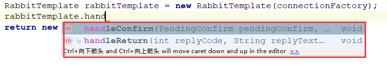
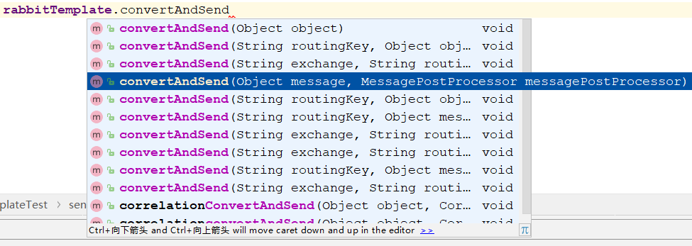
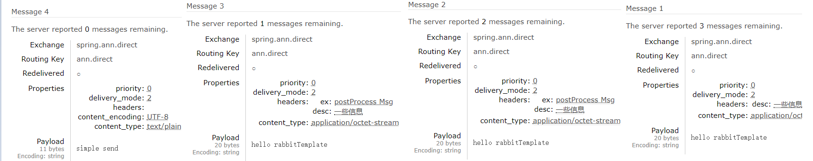

接着上一节，我们研究剩下的核心内容

## RabbitTemplate

`RabbitTemplate`是一个非常好用的消息模板组件，它是非常重要的消息发送类，有大量不同的`send API`，可以非常灵活的进行消息发送。

他还提供了可靠性投递，回调监听`ConfirmCallBack`，返回确认`ReturnCallBack`等方法，来实现`Confirm`与`Return`

### 注入到容器中

RabbitTemplate和RabbitAdmin一样，都需要注入到上下文里

```java
@Bean
public RabbitTemplate rabbitTemplate(ConnectionFactory connectionFactory){
    return new RabbitTemplate(connectionFactory);
}
```

这里可以进行confirm已经return方法的编写，如下



这里我就不做添加了。

### 发送消息

首先可以看到RabbitTemplate有重载了大量的发送消息方法，进行灵活多样的操作



接下来我们通过RabbitTemplate进行发消息

```java
@RunWith(SpringRunner.class)
@SpringBootTest
public class RabbitTemplateTest {

    @Autowired
    private RabbitTemplate rabbitTemplate;

    @Test
    public void sendMessage(){
        // Message的Properties配置
        MessageProperties messageProperties = new MessageProperties();
        messageProperties.setHeader("desc","一些信息"); // 添加Header
        String msg = "hello rabbitTemplate";
        // 创建消息
        Message message = new Message(msg.getBytes(),messageProperties);
        // 发送一条消息 投递到spring.ann.direct Exchange上，路由键为ann.direct
        rabbitTemplate.convertAndSend("spring.ann.direct","ann.direct",message);

        // 发送一条消息，并添加后置处理，添加一些额外的信息
        rabbitTemplate.convertAndSend("spring.ann.direct", "ann.direct", message,
                new MessagePostProcessor() {
            @Override
            public Message postProcessMessage(Message message) throws AmqpException {
                message.getMessageProperties().setHeader("ex","postProcess Msg");
                return message;
            }
        });

        // 这里也可以使用send进行发送
        rabbitTemplate.send("spring.ann.direct","ann.direct",message);

        // 简单的发送一条字符串信息
        rabbitTemplate.convertAndSend("spring.ann.direct","ann.direct","simple send");
    }
}
```

这里我们使用了几种常用发送方式，但其实它还有更多更灵活的发送方式

- `convertAndSend(String exchange, String routingKey, final Object object)`：简单的发送方式，exchange，routingkey进行对应，最后消息的类型可以是多种多样的，底层进行转换，字符串或者`Message`类封装
- `convertAndSend(String exchange, String routingKey, final Object message,final MessagePostProcessor messagePostProcessor)`：添加一个后置处理器，根据需求处理

- `send(final String exchange, final String routingKey, final Message message)`：`send`方法的不同是必须是`Message`类型的参数，而`convertAndSend`是`Object`


发送完可以看到有4条消息，点进去详细查看



这里可以看到，第二第三条消息都添加了后置处理的`header`头，是因为在第二条消息发送的时候，那个`MessagePostProcessor`方法中，就已经在`Message`对象添加`header`头了，所以在第三条消息发送时，并不是他也进行了后置方法，只是`Message`对象还是用的原来的，导致也出现`postProcess Msg`（如果图片看不清，可以右键在新建标签页打开查看）