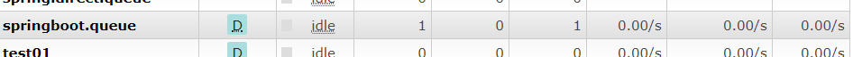
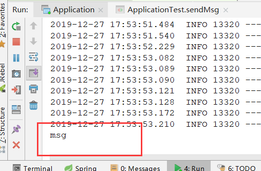
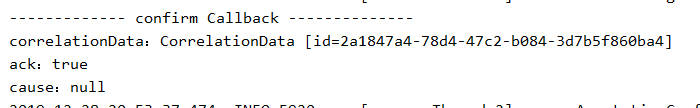
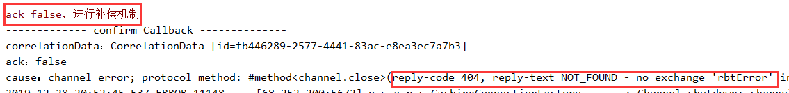
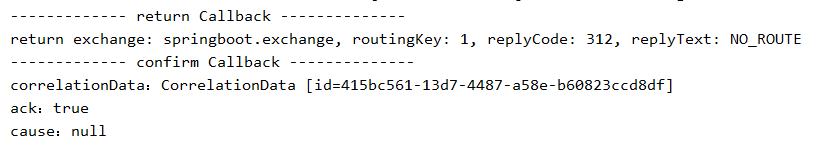
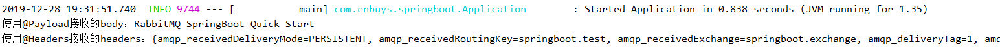

## 快速入门

### 相同配置

这里我们把生产端和消费端分离，为两个不同的模块

但是具有相同的一些配置

#### Maven依赖

添加SpringBoot依赖

```xml
<parent>
    <groupId>org.springframework.boot</groupId>
    <artifactId>spring-boot-starter-parent</artifactId>
    <version>1.5.14.RELEASE</version>
    <relativePath/> <!-- lookup parent from repository -->
</parent>

<properties>
    <project.build.sourceEncoding>UTF-8</project.build.sourceEncoding>
    <project.reporting.outputEncoding>UTF-8</project.reporting.outputEncoding>
    <java.version>1.8</java.version>
</properties>

<dependencies>
    <dependency>
        <groupId>org.springframework.boot</groupId>
        <artifactId>spring-boot-starter</artifactId>
    </dependency>
    <dependency>
        <groupId>org.springframework.boot</groupId>
        <artifactId>spring-boot-starter-test</artifactId>
        <scope>test</scope>
    </dependency>
    <dependency>
        <groupId>org.springframework.boot</groupId>
        <artifactId>spring-boot-starter-amqp</artifactId>
    </dependency>
</dependencies>
```

#### 配置文件

修改application.properties配置文件

```properties
# rabbitmq 连接配置
spring.rabbitmq.addresses=192.168.56.120:5672
spring.rabbitmq.username=guest
spring.rabbitmq.password=guest
spring.rabbitmq.virtual-host=/
```

这里使用配置的方式，也是和Spring一大不同，不用再去配置ConnectionFactory去获取连接了，因为SpringBoot有大量的自动配置类，自动进行初始化并添加到ApplicationContext中

### 生产端快速入门

想要快速的使用RabbitMQ在SpringBoot中非常简单

**1.创建启动器类**

```java
@SpringBootApplication
public class Application {
    public static void main(String[] args) {
        SpringApplication.run(Application.class,args);
    }
}
```

**2.创建一个测试类发送消息**

```java
@RunWith(SpringRunner.class)
@SpringBootTest
public class ApplicationTest {

    @Autowired
    private RabbitTemplate rabbitTemplate;

    @Test
    public void sendMsg(){
        MessageProperties properties = new MessageProperties();
        String str = new String("msg");
        Message msg = new Message(str.getBytes(),properties);

        rabbitTemplate.send("springboot.exchange","springboot.test",msg);
    }
}
```

注：这里的exchange需要自己去创建一个，我这个是直接在控制台创建的

**3.运行测试类**



运行后，可以看到队列中有一条消息等待消费了

### 消费端快速入门

消费端的使用就更简单了，主要就是`@RabbitListener`这个注解

**1.创建启动器类和配置（同生产端）**

**2.创建一个Consumer类**

```java
@Component
public class Consumer {

    @RabbitListener(queues = "springboot.queue")
    public void onMessage(Message message){
        System.out.println(new String(message.getBody()));
    }
}
```

分为两步走：

- 添加@Component注解，将消费者注入到容器中
- 在方法上添加`@RabbitListener`注解，指定队列名，便可以持续监听消费

**3.启动Application测试**



正确消费


**对于SpringBoot使用RabbitMQ就是这么简单**，接下来说一些其他重要使用方式


## 生产端高级使用

### 消息的confirm和return机制

使用springboot时，在application.properties中进行一些配置，可以简单方便的开启一些高级特性，比如：

```properties
# 开启confirm机制
spring.rabbitmq.publisher-confirms=true
# 开启return模式
spring.rabbitmq.publisher-returns=true
# 配合return机制使用，表示接收路由不可达的消息
spring.rabbitmq.template.mandatory=true
```

- `publisher-confirms`：开启Confirm，对应需要创建Confirm监听器，进行confirm处理，使用 `RabbitTemplate.ConfirmCallback `，然后为RabbitTemplate进行设置`setConfirmCallback()`
- `publisher-returns`：开启Return机制，对应需要创建Confirm监听器，进行confirm处理，使用 `RabbitTemplate.ReturnCallback `，然后为RabbitTemplate进行设置`setReturnCallback()`

#### 代码演示

```java
@RunWith(SpringRunner.class)
@SpringBootTest
public class SendTest {

    @Autowired
    private RabbitTemplate rabbitTemplate;

    final RabbitTemplate.ConfirmCallback confirmCallback = new RabbitTemplate.ConfirmCallback() {
        @Override
        public void confirm(CorrelationData correlationData, boolean ack, String cause) {
            System.out.println("------------- confirm Callback --------------");
            System.out.println("correlationData：" + correlationData);
            System.out.println("ack：" + ack);
            System.out.println("cause：" + cause);
            if(!ack){
                System.err.println("ack false，进行补偿机制");
            }
        }
    };

    final RabbitTemplate.ReturnCallback returnCallback = new RabbitTemplate.ReturnCallback() {
        @Override
        public void returnedMessage(Message message, int replyCode, String replyText, String exchange, String routingKey) {
            System.out.println("------------- return Callback --------------");
            System.out.println("return exchange: " + exchange + ", routingKey: "
                    + routingKey + ", replyCode: " + replyCode + ", replyText: " + replyText);
        }
    };

    @Test
    public void sendMsg(){
        MessageProperties properties = new MessageProperties();
        String str = new String("RabbitMQ SpringBoot Quick Start");
        Message msg = new Message(str.getBytes(),properties);
        // 为RabbitTemplate添加Confirm Return
        rabbitTemplate.setConfirmCallback(confirmCallback);
        rabbitTemplate.setReturnCallback(returnCallback);

        //需保证全局唯一 ，这个是实际消息的ID
        //在做补偿性机制的时候通过ID来获取到这条消息进行重发
        String id = UUID.randomUUID().toString();
        CorrelationData correlationData = new CorrelationData(id);

        //rabbitTemplate.send("springboot.exchange","springboot.test",msg,correlationData);
        // 不存在的exchange，测试confirm中 ack为false的情况
        //rabbitTemplate.send("rbtError","1",msg,correlationData);
        // 不存在的routingKey，测试return机制
        rabbitTemplate.send("springboot.exchange","1",msg,correlationData);
    }
}
```

代码非常简单，首先创建两个Callback类，进行方法实现，然后再发消息时进行设置，这里我发送三次消息

**第一次，正确的消息投递**

```java
rabbitTemplate.send("springboot.exchange","springboot.test",msg,correlationData);
```

控制台打印：



**第二次，不存在的exchange，错误投递，走confirm，但是ack为false**

```java
rabbitTemplate.send("springboot.exchange","1",msg,correlationData);
```

控制台打印：



**第三次，不存在的routingkey，即路由不可达，走return机制**

```java
rabbitTemplate.send("springboot.exchange","1",msg,correlationData);
```

控制台打印：



## 消费端高级使用

对于消费端来说，最重要的就是两个注解 

- `@RabbitListener` ：使用这个注解标记方法，用来监听配置的队列，也可以声明绑定关系在RabbitMQ中创建
- `@RabbitHandler`：表示这个方法是一个RabbitMQ的消费方法，一般配合`@RabbitListener`使用

### @RabbitListener 使用方式

使用方式主要有两种

- 一种是直接配置监听的队列，如果有消息就进行消费
- 第二种是可以声明绑定关系，这样如果MQ中没有这些`Exchange`，`Queue`会自动创建，有的话就不创建

**第一种使用方式**

就是我们快速入门中的使用方式：

```java
@RabbitListener(queues = {"springboot.queue","springboot.queue2"})
public void onMessage(Message message){
    System.out.println(new String(message.getBody()));
}  
```

这里可以声明多个

**第二种使用方式**

```java
@RabbitListener(bindings = @QueueBinding(
    value = @Queue(value = "springboot.queue",durable = "true"),
    exchange = @Exchange(value = "springboot.exchange",type = "topic"),
    key = "springboot.#"
))
public void onMessage(Message message){
    System.out.println(new String(message.getBody()));
}
```

如上代码，可以配置`Binding`（多个），如果没有这样的绑定关系，会根据是否存在`Queue`，`Exchange`进行创建

### @RabbitHandler 使用方式

这个注解一般配置`@RabbitListener`使用，并且**当`@RabbitListener`绑定在类上时**

- `@RabbitListener` 可以标注在类上面，需配合 `@RabbitHandler` 注解一起使用
- `@RabbitListener` 标注在类上面表示当有收到消息的时候，就交给 `@RabbitHandler` 的方法处理，具体使用哪个方法处理，根据 `MessageConverter `转换后的参数类型

```java
@Component
@RabbitListener(queues = "springboot.exchange")
public class Receiver {

    @RabbitHandler
    public void processMessage1(String message) {
        System.out.println(message);
    }

    @RabbitHandler
    public void processMessage2(byte[] message) {
        System.out.println(new String(message));
    }
    
}
```

### @Payload与@Headers

这也是RabbitMQ对于SpringBoot来说，常用的一种注解方式，主要**用作方法的入参上**，类似`@RequestParam`

- `@Payload`：绑定入参，表示此参数为消息的`body`
- `@Headers`：绑定入参，表示此参数为消息的`Properties`

```java
@RabbitListener(queues = {"springboot.queue","springboot.queue2"})
public void onMessage(@Payload byte[] body, @Headers Map<String,Object> headers){
    System.out.println("使用@Payload接收的body：" + new String(body));
    System.out.println("使用@Headers接收的headers：" + headers);
}
```



打印出消息体以及消息的`Properties`信息

也可以使用`@Header`， 获取单个 `Header `属性 

```java
@RabbitListener(queues = "debug")
public void processMessage1(@Payload String body, @Header String contentType) {
    System.out.println("body："+ body);
    System.out.println("contentType："+ contentType);
}
```

### 高级配置

使用springboot时，在application.properties中进行一些配置，可以简单方便的开启一些高级特性，比如：

```properties
# 设置签收模式：AUTO(自动签收)、MANUAL(手工签收)、NONE(不签收，没有任何操作)
spring.rabbitmq.listener.simple.acknowledge-mode=MANUAL
# 设置当前消费者数量(线程数)
spring.rabbitmq.listener.simple.concurrency=1
# 设置消费者最大并发数量
spring.rabbitmq.listener.simple.max-concurrency=5
```

在设置手工签收后，对于消息的消费需要进行ACK返回

```java
 @RabbitListener(queues = "springboot.queue")
public void onMessage(Message message, Channel channel) throws IOException {
    System.out.println(new String(message.getBody()));
    long deliveryTag = message.getMessageProperties().getDeliveryTag();
    channel.basicAck(deliveryTag,false);
}
```

