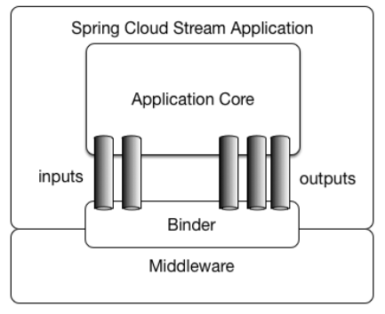

## SpringCloud Stream介绍

在SpringCloud中使用消息中间件，一般使用Stream进行整合，Stream提供了一种上层接口，可以适用于Kafka和RabbitMQ，对其中间件切换也非常简单。

### 为什么要用Steam

比方说我们用到了RabbitMQ和Kafka，由于这两个消息中间件的架构上的不同，像RabbitMQ有exchange，kafka有Topic，partitions分区，这些中间件的差异性导致我们实际项目开发给我们造成了一定的困扰，我们如果用了两个消息队列的其中一种，

后面的业务需求，我想往另外一种消息队列进行迁移，这时候无疑就是一个灾难性的，一大堆东西都要重新推倒重新做，因为它跟我们的系统耦合了，这时候springcloud Stream给我们提供了一种解耦合的方式。



Spring Cloud Stream由一个中间件中立的核组成。应用通过Spring Cloud Stream插入的input(相当于消费者consumer，它是从队列中接收消息的)和output(相当于生产者producer，它是从队列中发送消息的。)通道与外界交流。

通道通过指定中间件的Binder实现与外部代理连接。业务开发者不再关注具体消息中间件，只需关注Binder对应用程序提供的抽象概念来使用消息中间件实现业务即可。

### 核心概念

Barista接口：这个接口定义通道类型和名称，通道名称作为配置在配置文件中使用，通道类型决定发送消息的生产端 还是接收消息的消费端，他需要配合三个重要注解使用：

- @Output：输出注解，定义发送消息接口
- @Input：输入注解，定义接收消息接口
- @StreamListener：监听方法的注解

SpringCloud Stream使用非常简单，只要使用好上面的三个注解以及配置文件配置，但是也会有问题，因为它是实现了高性能的消息生产消费，所以避免不来消息可靠性问题，会存在少量消息丢失的情况，需要根据需求自行完善补偿机制。

## 快速入门

接着我们进行SpringCloud Stream配合RabbitMQ的使用

### 生产端实现

#### 依赖添加

```xml
<parent>
    <groupId>org.springframework.boot</groupId>
    <artifactId>spring-boot-starter-parent</artifactId>
    <version>1.5.8.RELEASE</version>
    <relativePath/> <!-- lookup parent from repository -->
</parent>

<properties>
    <project.build.sourceEncoding>UTF-8</project.build.sourceEncoding>
    <project.reporting.outputEncoding>UTF-8</project.reporting.outputEncoding>
    <java.version>1.8</java.version>
</properties>

<dependencies>
    <dependency>
        <groupId>org.springframework.boot</groupId>
        <artifactId>spring-boot-starter-web</artifactId>
    </dependency>	
    <dependency>
        <groupId>org.springframework.boot</groupId>
        <artifactId>spring-boot-starter</artifactId>
    </dependency>		
    <dependency>
        <groupId>org.springframework.boot</groupId>
        <artifactId>spring-boot-starter-test</artifactId>
        <scope>test</scope>
    </dependency>
    <dependency>
        <groupId>org.springframework.cloud</groupId>
        <artifactId>spring-cloud-starter-stream-rabbit</artifactId>
        <version>1.3.4.RELEASE</version>
    </dependency>
    <dependency>
        <groupId>org.springframework.boot</groupId>
        <artifactId>spring-boot-starter-actuator</artifactId>
    </dependency>
</dependencies>
```

最重要的是倒数第二个依赖，`spring-cloud-starter-stream-rabbit`

#### 添加启动器类与配置

```java
@SpringBootApplication
public class Application {
    public static void main(String[] args) {
        SpringApplication.run(Application.class,args);
    }
}
```

配置：

```properties
server.port=8080
spring.application.name=consumer

spring.cloud.stream.bindings.outputChannel.destination=springcloud.exchange
spring.cloud.stream.bindings.outputChannel.group=springcloud.queue
spring.cloud.stream.bindings.outputChannel.binder=rabbitCluster

spring.cloud.stream.binders.rabbitCluster.type=rabbit
spring.cloud.stream.binders.rabbitCluster.environment.spring.rabbitmq.address=192.168.252.200:5672
spring.cloud.stream.binders.rabbitCluster.environment.spring.rabbitmq.username=guest
spring.cloud.stream.binders.rabbitCluster.environment.spring.rabbitmq.password=guest
spring.cloud.stream.binders.rabbitCluster.environment.spring.rabbitmq.virtual-host=/
```


#### 实现Barista生产接口

```java
public interface Barista {

    @Output("outputChannel")
    MessageChannel output();

}
```


#### 发送消息测试类实现

```java
@EnableBinding(Barista.class)
@RunWith(SpringRunner.class)
@SpringBootTest
public class RabbitTest {

    @Autowired
    private Barista barista;

    @Test
    public void send(){
        MessageHeaders messageHeaders = new MessageHeaders(null);
        String msg = "hello springcloud stream";
        Message message = MessageBuilder.createMessage(msg.getBytes(), messageHeaders);
        boolean sendStatus = barista.output().send(message);
        System.out.println("发送数据：" + message + ",sendStatus: " + sendStatus);
    }

}
```


#### 测试

### 消费端实现

首先是添加依赖，因为依赖和生产端一样，就不再重写一遍了

#### 添加启动器类与配置

配置：

```properties
server.port=8081
spring.application.name=consumer

# 绑定消费的exchange，queue
spring.cloud.stream.bindings.input_channel.destination=springcloud.exchange
spring.cloud.stream.bindings.input_channel.group=springcloud.queue

# 消费端设置
# 当前消费者数量
spring.cloud.stream.bindings.input_channel.consumer.concurrency=1
# 重回队列，false
spring.cloud.stream.rrabbit.bindings.input_channel.consumer.requeue-rejected=false
# 签收模式 手工签收
spring.cloud.stream.rrabbit.bindings.input_channel.consumer.acknowledge-mode=MANUAL
# 超时重连时间 3s一次
spring.cloud.stream.rabbit.bindings.input_channel.consumer.recovery-interval=3000
# 持久化设置
spring.cloud.stream.rabbit.bindings.input_channel.consumer.durable-subscription=true
# 最大连接数
spring.cloud.stream.rabbit.bindings.input_channel.consumer.max-concurrency=5

# rabbit 连接配置
spring.cloud.stream.bindings.input_channel.binder=rabbitCluster
spring.cloud.stream.binders.rabbitCluster.type=rabbit
spring.cloud.stream.binders.rabbitCluster.environment.spring.rabbitmq.address=192.168.252.200:5672
spring.cloud.stream.binders.rabbitCluster.environment.spring.rabbitmq.username=guest
spring.cloud.stream.binders.rabbitCluster.environment.spring.rabbitmq.password=guest
spring.cloud.stream.binders.rabbitCluster.environment.spring.rabbitmq.virtual-host=/
```


#### 实现Barista消费接口

```java
public interface Barista {

    @Output("outputChannel")
    MessageChannel output();

}
```


#### 接收消息测试类实现

```java
@EnableBinding(Barista.class)
@Service
public class Consumer {

    @StreamListener(Barista.INPUT_NAME)
    public void consume(Message message) throws Exception{
        Channel channel = (Channel) message.getMessageProperties().getHeaders().get(AmqpHeaders.CHANNEL);
        long deliveryTag = message.getMessageProperties().getDeliveryTag();
        System.out.println("SpringCloud Stream 消费：" + new String(message.getBody()));
        channel.basicAck(deliveryTag,false);
    }
}
```


#### 测试