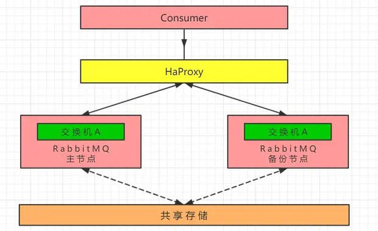
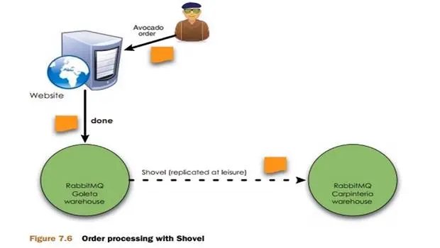
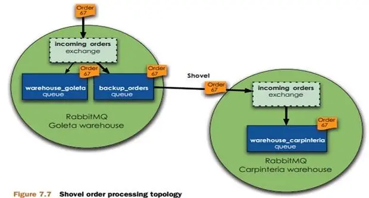
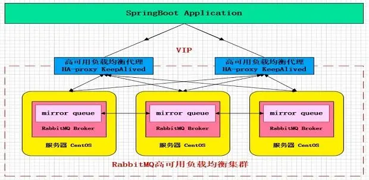
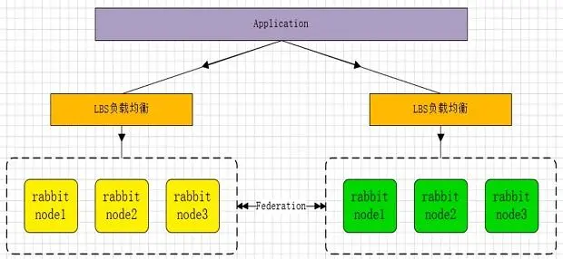
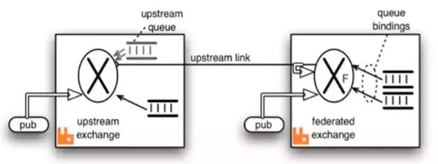

## 集群架构模式

在RabbitMQ中，搭建一个高可用高性能的集群有很多种架构方案，我们一一来进行研究

### 主备模式

- 主备模式，也成warren模式，即当主节点挂掉时，使用备用节点来充当主节点的角色
- 主备模式可以一主多备，但不能多主
- 主备和主从的区别
  - 主备：主节点和备用节点都可以实现读写
  - 主从：主节点大多用作写，从节点用作读
- 主备模式优点：在中小型公司，并发量不多的情况下，使用主备模式搭建RabbitMQ集群方便简单，维护也不是很难。

#### 架构模型



主备模式使用简单，只需在各节点上添加`HaProxy`代理软件即可，他就像activeMQ使用`zookeeper`进行主备协调一样，RabbitMQ的主备模式使用`HaProxy`

#### HaProxy配置

这里简单了解下使用`HaProxy`搭建主备模式时，其配置

```
listen rabbit_cluster  #监听集群
bind 0.0.0.0:5672  #绑定端口
mode tcp  #设置tcp模式
balance roundrobin #使用轮询模式

# 设置主备节点，区别为备用节点添加backup
# 后面的意思是，每5秒对mq节点做检查，如果成功2次则可用，如果失败3次则不可用，切换节点
server rb1 192.168.56.120:5672 check inter 5000 rise 2 fall 3
server rb2 192.168.56.121:5672 backup check inter 5000 rise 2 fall 3
```

### 远程模式

- 远程模式又叫Shovel模式，是一种双活模式，实现远距离的通信与复制，将两个不同地域的mq集群互联

#### 架构模型



如图，用户创建订单，客户端投递消息给RabbitMQ，在防止流量过大的情况下，左边的MQ设置了一个阈值，当流量超过阈值，会将消息移交给右边的MQ处理，分摊服务压力，并且实现了多中心消息同步

好处：在使用了`shovel`插件后，模型变成了近端同步确认，远端异步确认的方式，大大提高了订单确认速度，并且还能保证可靠性

#### 如何实现



通过Shovel集群拓扑图可以看出，当`warehouse`队列承担不住压力时，会移交给`backup`队列进行处理，`backup`队列与右边的exchange建立连接关系（通过`shovel`），就会把消息给右边的队列进行处理。

#### 远程模式的使用

- Shovel集群的配置，首先启动rabbitmq插件，命令如下：
   `rabbitmq-plugins enable amqp_client`
   `rabbitmq-plugins enable rabbitmq_shovel` 
- 创建rabbitmq.config文件：`touch /etc/rabbitmq/rabbitmq.config` 
- 在config文件中添加相关的配置
- 最后我们需要源服务器和目的地服务器都使用相同的配置文件(rabbitmq.config)

事实上这个配置会相对复杂一些，实现双活已经有更好的方式，所以远程模式了解即可。

### 镜像模式

- 镜像模式顾名思义，就是集群中几个节点数据是一样的，可以保证数据100%不丢失，也是工作中最常用的一种集群架构模式
- 镜像模式实现简单，也有着高可用性，数据100%不丢失，可以说是非常好的一种模式
- 镜像模式使用镜像队列来实现数据同步，一般来说是3个节点进行数据同步，保证100%不丢失

#### 架构模型



图中，黄色的就是一个个服务器，每个服务器中运行一个RabbitMQ的Broker，在每个RabbitMQ中具有`mirror queue`，这三台服务器的`mirror queue`进行同步。

除此之外，因为要实现负载均衡，所以添加了`HaProxy`插件进行服务器之间负载均衡，又因为要实现`HaProxy`的高可用，所以加上了`KeepAlived`插件，如果`HaProxy`节点挂掉，切换另一个节点。

镜像模式很重要，我们之后也会动手从头搭建一个高可用的镜像模式集群

### 多活模式

- 多活模式也是实现异地数据同步的主流模式，他是`Shovel`模式的升级版。
- 这种模式需要依赖插件`federation`，可以实现可靠的AMQP数据通信，并进行节点间，集群间数据同步
- 多活模式可以是集群与集群间的同步，这样一个集群都挂掉的话，还有另一个集群来服务
- RabbitMQ部署架构采用双中心模式(多中心) , 那么在两套(或多套)数据中心中各部署一套RabbitMQ集群，各中心的RabbitMQ服务除了需要为业务提供正常的消息服务外，中心之间还需要实现部分队列消息共享。

#### 架构模型



如图，应用层通过`LBS`负载均衡，请求某个集群中的某个节点，两个集群通过`federation`插件，实现数据再集群间的流转。

当然`federation`插件不是建立在集群上的，而是建立到单个节点上，比如左边`node3`可以和右边任意一台建立这种多活机制，然后，自己这边的集群如果是采用镜像队列那么也会去进行同步，所以这种性能也是非常好的。

#### Federation说明

- `Federation`插件是一个不需要构建Cluster，而在Brokers之间传输消息的高性能插件，`Federation `插件可以在Brokers或者Cluster之间传输消息，连接的双方可以使用不同的`users`和`virtual hosts`，双方也可以使用版本不同的RabbitMQ和Erlang
- `Federation `插件使用AMQP协议通讯，可以接受不连续的传输
- `Federation Exchanges`，可以看成`Downstream`从`Upstream`主动拉取消息，但并不是拉取所有消息，必须是在`Downstream`上已经明确定义`Bindings`关系的`Exchange`，也就是有实际的物理`Queue`来接收消息，才会从`Upstream`拉取消息到`Downstream`。使用`AMQP`协议实施代理间通信，`Downstream`会将绑定关系组合在一起，绑定/解除绑定命令将发送到`Upstream`交换机。因此，`FederationExchange`只接收**具有订阅的消息**。

#### 流转过程



- 如图，有上下游服务各一个，中间`Link`连接通过`federation`实现，`X`代表`Exchange`
- 上游的数据投递到`Exchange`后，下游会根据`Binding`关系主动拉取上游`Exchange`中的消息
- 下游消息拉取后，具有一个实际的`Queue`进行保存