## RabbitMQ高可用集群搭建	

我们接着上一章介绍的架构模式，开始在虚拟机上搭建高可用的RabbitMQ集群，这里使用的是最常用的镜像模式

**这里我使用的CentOS7**

### 集群节点说明

| 服务器IP       | hostname | 节点说明           | 端口 | 管控台地址                                |
| -------------- | -------- | ------------------ | ---- | ----------------------------------------- |
| 192.168.56.120 | cent120  | RabbitMQ master    | 5672 | http://192.168.56.120:15672               |
| 192.168.56.121 | cent121  | rabbitmq slave     | 5672 | http://192.168.56.121:15672               |
| 192.168.56.122 | cent122  | rabbitmq slave     | 5672 | http://192.168.56.122:15672               |
| 192.168.56.123 | cent123  | HaProxy+KeepAlived | 8100 | http://192.168.56.123:8100/rabbitmq-stats |
| 192.168.56.124 | cent124  | HaProxy+KeepAlived | 8100 | http://192.168.56.124:8100/rabbitmq-stats |

### 环境准备

准备5台虚拟机，这里可以先创建一个，然后根据第二章RabbitMQ的安装与启动，配置好后，进行虚拟机的复制，复制出多个后

- 修改其网络设置
- 修改hostname，`hostnamectl set-hostname xxx`，然后重启
- 设置hosts文件，`vi /etc/hosts`，这一步非常关键，如果不加，后面从节点加入机器是就要报错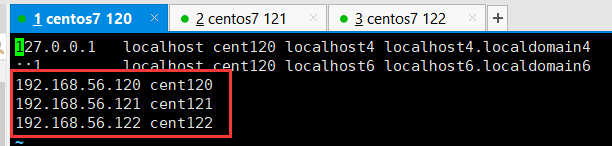

创建好5个后，将120,121,122的RabbitMQ启动，并访问控制台，看看是否都启动成功


### 文件同步

需要将主节点的cookie文件同步到其他节点上，这里就是将120的同步到121和122上

**同步之前需要将RabbitMQ关闭**

```
$ scp .erlang.cookie 192.168.56.121:/var/lib/rabbitmq
$ scp .erlang.cookie 192.168.56.122:/var/lib/rabbitmq
```

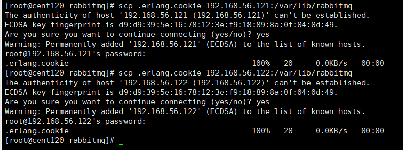

### 组成集群

接着就要搭建集群了

**1.停止MQ服务**

PS:我们首先停止3个节点的服务

```
$ rabbitmqctl stop
```

**2.组成集群操作**

使用以下命令对120,121,122执行，以集群状态启动

```
$ rabbitmq-server -detached
```

启动后可以使用`lsof -i:5672`命令，查看是否启动成功

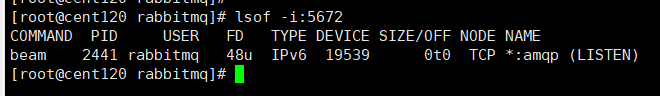

**3.slave加入集群操作**

对121和122重复以下操作，注意！hosts中需要配置了ip与hostname的映射

```
$ rabbitmqctl stop_app
$ rabbitmqctl join_cluster rabbit@cent120
$ rabbitmqctl start_app

# 移除节点操作
$ rabbitmqctl forget_cluster_node rabbit@cent121
```

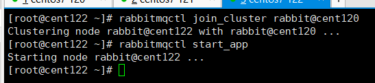

出现以下日志，说明启动成功，

**4.修改集群名称**

```
$ rabbitmqctl set_cluster_name rabbitmq_cluster1
```

**5.然后可以看一下集群状态**

```
$ rabbitmqctl cluster_status
```


节点信息，包括集群名称，都有显示，说明集群构建成功

**6.控制台访问**


在Nodes模块，具有三个节点，可以看到，这些节点都有一个`Disc`标识，表示以磁盘形式存储，如果想要使用内存存储，可以在加入集群时添加参数，如下：

```
$ rabbitmqctl join_cluster --ram rabbit@cent120
```

### 配置镜像队列

设置镜像队列策略（在任意一个节点上执行）

```
$ rabbitmqctl set_policy ha-all "^"   '{"ha-mode":"all"}'
```

**将所有队列设置为镜像队列**，即队列会被复制到各个节点，各个节点状态一致，如果有消息发送到某个队列，会自动同步到其他节点的队列中

RabbitMQ高可用集群就已经搭建好了,我们可以重启服务，查看其队列是否在从节点同步。


## 整合HaProxy实现负载均衡

### HaProxy简介

HAProxy是一款提供高可用性、负载均衡以及基于TCP和HTTP应用的代理软件，HAProxy是完全免费的、借助HAProxy可以快速并且可靠的提供基于TCP和HTTP应用的代理解决方案。

HAProxy适用于那些负载较大的web站点，这些站点通常又需要会话保持或七层处理。 

HAProxy可以支持数以万计的并发连接,并且HAProxy的运行模式使得它可以很简单安全的整合进架构中，同时可以保护web服务器不被暴露到网络上。

### HaProxy安装

因为我们之后要实现高可用，所以这里也使用两个节点部署，即123和124，步骤：

```java
//下载依赖包
yum install gcc vim wget

//下载haproxy
wget http://www.haproxy.org/download/1.6/src/haproxy-1.6.5.tar.gz

//解压
tar -zxvf haproxy-1.6.5.tar.gz -C /usr/local

//进入目录、进行编译、安装
cd /usr/local/haproxy-1.6.5
make TARGET=linux31 PREFIX=/usr/local/haproxy
make install PREFIX=/usr/local/haproxy
mkdir /etc/haproxy

//赋权
groupadd -r -g 149 haproxy
useradd -g haproxy -r -s /sbin/nologin -u 149 haproxy

//创建haproxy配置文件
touch /etc/haproxy/haproxy.cfg
```

问题：下载HaProxy时可能下载不了，可以直接浏览器访问下载下来后扔到服务器上进行解压

### Haproxy配置

haproxy 配置文件haproxy.cfg详解，首先进入文件

```
$ vi /etc/haproxy/haproxy.cfg
```

配置：

```properties
#logging options
global
    log 127.0.0.1 local0 info
    maxconn 5120
    #安装地址
    chroot /usr/local/haproxy 
    uid 99
    gid 99
    daemon
    quiet
    nbproc 20
    pidfile /var/run/haproxy.pid

defaults
    log global
    #使用4层代理模式，"mode http"为7层代理模式
    mode tcp
    #if you set mode to tcp,then you nust change tcplog into httplog
    option tcplog
    option dontlognull
    retries 3
    option redispatch
    maxconn 2000
    contimeout 5s
    ##客户端空闲超时时间为 60秒 则HA 发起重连机制
    clitimeout 60s
    ##服务器端链接超时时间为 15秒 则HA 发起重连机制
    srvtimeout 15s	

# 监听rabbitmq集群
listen rabbitmq_cluster
	bind 0.0.0.0:5672
	#配置TCP模式
	mode tcp
	#balance url_param userid
	#balance url_param session_id check_post 64
	#balance hdr(User-Agent)
	#balance hdr(host)
	#balance hdr(Host) use_domain_only
	#balance rdp-cookie
	#balance leastconn
	#balance source //ip
	#简单的轮询
	balance roundrobin
	#rabbitmq集群节点配置 #inter 每隔五秒对mq集群做健康检查， 2次正确证明服务器可用，2次失败证明服务器不可用，并且配置主备机制
        server cent120 192.168.56.120:5672 check inter 5000 rise 2 fall 2
        server cent121 192.168.56.121:5672 check inter 5000 rise 2 fall 2
        server cent122 192.168.56.122:5672 check inter 5000 rise 2 fall 2
        
#配置haproxy web监控，查看统计信息
listen stats
	bind 192.168.56.123:8100
	# http模式，因为要浏览器访问
	mode http
	option httplog
	stats enable
	#设置haproxy监控地址为http://localhost:8100/rabbitmq-stats
	stats uri /rabbitmq-stats
	stats refresh 5s
```

### HaProxy启动

```
$ /usr/local/haproxy/sbin/haproxy -f /etc/haproxy/haproxy.cfg

//查看haproxy进程状态
$ ps -ef | grep haproxy
```

启动后，可以访问<http://192.168.56.123:8100/rabbitmq-stats>，查看是否启动成功

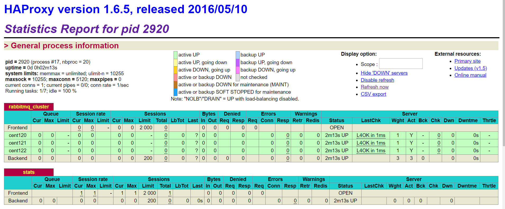

正确启动，并且有我们的三个节点

## 整合KeepAlived实现HaProxy的高可用

### KeepAlived简介

Keepalived，它是一个高性能的服务器高可用或热备解决方案，Keepalived主要来**防止服务器单点故障的发生问题**，可以通过其与Nginx、Haproxy等反向代理的负载均衡服务器配合实现web服务端的高可用。Keepalived以VRRP协议为实现基础，用VRRP协议来实现高可用性（HA）.VRRP（Virtual Router Redundancy Protocol）协议是用于实现路由器冗余的协议，VRRP协议将两台或多台路由器设备虚拟成一个设备，对外提供虚拟路由器IP（一个或多个）。

### KeepAlived重要特性

- 管理LVS负载均衡软件，比如Nginx，HaProxy
- 实现LVS集群中节点健康检查
- 系统网络的高可用，失败转移
  - KeepAlived维护了一个心跳，主节点回向备用节点发送心跳，表示自己还活在，如果心跳停止，备用节点会自动接管程序，成为主节点；当主节点恢复心跳，备用节点会释放资源，恢复备胎身份

### KeepAlived安装

安装在123和124节点上

```
//安装所需软件包
yum install -y openssl openssl-devel

//下载
wget http://www.keepalived.org/software/keepalived-1.2.18.tar.gz

//解压、编译、安装
tar -zxvf keepalived-1.2.18.tar.gz -C /usr/local/
cd keepalived-1.2.18/ && ./configure --prefix=/usr/local/keepalived
make && make install

//将keepalived安装成Linux系统服务，因为没有使用keepalived的默认安装路径（默认路径：/usr/local）,安装完成之后，需要做一些修改工作
//首先创建文件夹，将keepalived配置文件进行复制：

mkdir /etc/keepalived
cp /usr/local/keepalived/etc/keepalived/keepalived.conf /etc/keepalived/

//然后复制keepalived脚本文件：
cp /usr/local/keepalived/etc/rc.d/init.d/keepalived /etc/init.d/
cp /usr/local/keepalived/etc/sysconfig/keepalived /etc/sysconfig/
ln -s /usr/local/sbin/keepalived /usr/sbin/
ln -s /usr/local/keepalived/sbin/keepalived /sbin/
# 这里如果创建软连接失败，提示已经存在，则需要删除
rm -f /usr/sbin/keepalived 或 rm -f /sbin/keepalived

//可以设置开机启动：chkconfig keepalived on，到此我们安装完毕!
chkconfig keepalived on
```

问题：下载HaProxy时可能下载不了，可以直接浏览器访问下载下来后扔到服务器上进行解压

### KeepAlived配置

修改keepalived.conf配置文件

```
$ vi /etc/keepalived/keepalived.conf  
```

这里我们把123节点当做主节点，配置为：

```
! Configuration File for keepalived

global_defs {
   router_id cent123  ##标识节点的字符串，通常为hostname

}

## 设置脚本，这里脚本是为了判断HaProxy是否正常运行，需要自己编写
vrrp_script chk_haproxy {
    script "/etc/keepalived/haproxy_check.sh"  ##执行脚本位置
    interval 2  ##检测时间间隔
    weight -20  ##如果条件成立则权重减20
}

vrrp_instance VI_1 {
    state MASTER  ## 主节点为MASTER，备份节点为BACKUP
    interface enp0s8 ## 绑定虚拟IP的网络接口（网卡），与本机IP地址所在的网络接口相同（我这里是eth0）
    virtual_router_id 79  ## 虚拟路由ID号（主备节点一定要相同）
    mcast_src_ip 192.168.56.123 ## 本机ip地址
    priority 100  ##优先级配置（0-254的值）
    nopreempt
    advert_int 1  ## 组播信息发送间隔，俩个节点必须配置一致，默认1s
authentication {  ## 认证匹配
        auth_type PASS
        auth_pass zyj
    }

    track_script {
        chk_haproxy
    }

    virtual_ipaddress {
        192.168.56.130  ## 虚拟ip，可以指定多个
    }
}
```

124节点（备用节点）配置为：

```
! Configuration File for keepalived

global_defs {
   router_id cent124  ##标识节点的字符串，通常为hostname

}

## 设置脚本，这里脚本是为了判断HaProxy是否正常运行，需要自己编写
vrrp_script chk_haproxy {
    script "/etc/keepalived/haproxy_check.sh"  ##执行脚本位置
    interval 2  ##检测时间间隔
    weight -20  ##如果条件成立则权重减20
}

vrrp_instance VI_1 {
    state BACKUP  ## 主节点为MASTER，备份节点为BACKUP
    interface enp0s8 ## 绑定虚拟IP的网络接口（网卡），与本机IP地址所在的网络接口相同（我这里是eth0）
    virtual_router_id 79  ## 虚拟路由ID号（主备节点一定要相同）
    mcast_src_ip 192.168.56.124 ## 本机ip地址
    priority 80  ##优先级配置（0-254的值）
    nopreempt
    advert_int 1  ## 组播信息发送间隔，俩个节点必须配置一致，默认1s
authentication {  ## 认证匹配
        auth_type PASS
        auth_pass zyj
    }

    track_script {
        chk_haproxy
    }

    virtual_ipaddress {
        192.168.56.130  ## 虚拟ip，可以指定多个
    }
}
```

**编写脚本**

添加文件位置为`vi /etc/keepalived/haproxy_check.sh`（79、80两个节点文件内容一致即可）

```shell
#!/bin/bash
COUNT=`ps -C haproxy --no-header |wc -l`
if [ $COUNT -eq 0 ];then
    /usr/local/haproxy/sbin/haproxy -f /etc/haproxy/haproxy.cfg
    sleep 2
    if [ `ps -C haproxy --no-header |wc -l` -eq 0 ];then
        killall keepalived
    fi
fi
```

**执行脚本赋权**

```
 $ chmod +x /etc/keepalived/haproxy_check.sh 
```

### keepalived启动

```
service keepalived start | stop | status | restart
# 查看状态
ps -ef|grep keepalived
```

启动后，输入`ip addr`命令查看网络

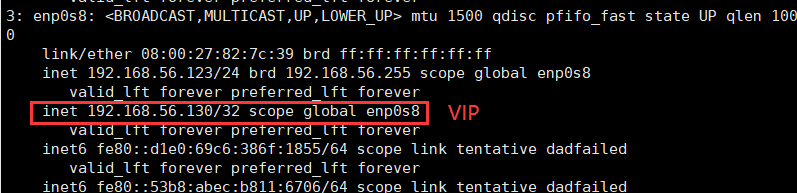

看到我们配置的130ip，即成功实现KeepAlived，**这里130虚拟IP就是别人访问的IP先通过KeepAlived定位到123节点，然后通过HaProxy进行负载均衡，最后访问某个节点的RabbitMQ**

这时我们可以测试一下，把123的KeepAlived关闭，看看备用节点会不会将130路由到它身上。


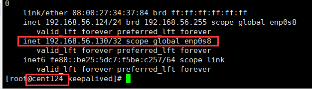

成功路由到130节点上，说明我们已经成功搭建一个高可用高性能的RabbitMQ集群

##  RabbitMQ配置文件

这里有两种配置：

- 环境变量配置文件：rabbitmq-env.conf
- 配置信息配置文件：rabbit.app

### 环境变量配置

```properties
RABBITMQ_NODENAME=FZTEC-240088 节点名称
RABBITMQ_NODE_IP_ADDRESS=127.0.0.1 监听IP
RABBITMQ_NODE_PORT=5672 监听端口
RABBITMQ_LOG_BASE=/data/rabbitmq/log 日志目录
RABBITMQ_PLUGINS_DIR=/data/rabbitmq/plugins 插件目录
RABBITMQ_MNESIA_BASE=/data/rabbitmq/mnesia 后端存储目录
```

更详细的配置参见： <http://www.rabbitmq.com/configure.html#configuration-file>

### 配置信息配置

这里说几个关键配置

```json
#设置rabbimq的监听端口，默认为[5672]。
tcp_listerners: 5672 
# 磁盘低水位线，若磁盘容量低于指定值则停止接收数据，默认值为{mem_relative, 1.0},即与内存相关联1：1，也可定制为多少byte.
disk_free_limit: {mem_relative, 1.0}
# 设置内存低水位线，若低于该水位线，则开启流控机制，默认值是0.4，即内存总量的40%。
vm_memory_high_watermark: 0.4
# 将部分rabbimq代码用High Performance Erlang compiler编译，可提升性能，该参数是实验性，若出现erlang vm segfaults，应关掉。
hipe_compile: true
# 该参数属于rabbimq_management，若为true则进行精细化的统计，但会影响性能
force_fine_statistics: true
```

更详细的配置参见：http://www.rabbitmq.com/configure.html


## 集群恢复与故障转移

这里通过情景与解决方案进行研究

这里有两个节点，A和B，A为Master，AB为镜像队列

情景1：B先停，A后停

方案：先启动A后启动B，这是正常的情景


情景2：AB同时停

方案：可能是因为断电导致，一样先启动A再启动B


情景3：B先停，A后停，并且B无法恢复

方案：情景1的加强版，因为A是主节点，所以只需将B剔除，换一个新的备用节点即可，`rabbitmqctl forget_cluster_node B`，新节点会自动恢复镜像队列


情景4：B先停，A后停，并且A无法恢复

方案：情景3的加强版，这次是主节点无法恢复，这样从节点因为主节点没有启动，也无法启动，便无法使用上一次的命令剔除A节点。这时需要使用`--ofline`参数，即`rabbitmqctl forget_cluster_node --ofline A`，RabbitMQ会mock一个B节点，将A节点剔除，这样就可以启动了


情景5：B先停，A后停，并且A，B都无法恢复，能获得A或B的磁盘文件

方案：这种更复杂了，只能通过恢复数据的方式去恢复，将A或B的磁盘文件，数据库文件（存放在`$RABBIT_HOME/var/lib/`目录），拷贝到新的节点上，再将新节点hostname改为A或B的，然后如果是A（Master）文件，则使用情景4进行处理，如果是B（Slave）文件，则使用情景5处理


情景6：AB都无法恢复，且没有磁盘文件

方案：GG，没有任何办法

## 延迟队列

使用延迟队列，需要在RabbitMQ中安装一个延迟队列插件。

延迟队列的作用我们之前已经学习过，在100%可靠性投递的时候，最后一种方法，使用延迟队列保证100%投递，就是同时发两条消息，第一条先去投递消费处理，第二条五分钟后延迟投递，用来判断是否成功投递，如果没有再进行一次投递。

### 延迟队列的安装

**1.到官网下载插件**

>  rabbitmq_delayed_message_exchange-0.0.1.ez

<https://github.com/rabbitmq/rabbitmq-delayed-message-exchange>

<http://www.rabbitmq.com/community-plugins.html>

<https://bintray.com/rabbitmq/community-plugins/rabbitmq_delayed_message_exchange/v3.6.x#files/>

**2.将插件存放到RabbitMQ安装目录的plugins目录中**

```
$ cd /usr/lib/rabbitmq/lib/rabbitmq_server-3.6.5/plugins
```

**3.启动延迟插件**

```
$ rabbitmq-plugins enable rabbitmq_delayed_message_exchange
```

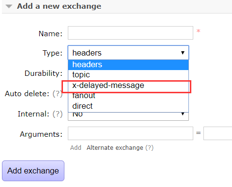

在控制台可以看到`x-delayed-message`即启用成功

### 延迟队列演示

**1.创建队列**


需要添加参数，设置为哪种类型的Exchange


**2.创建队列**

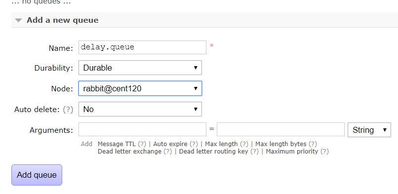

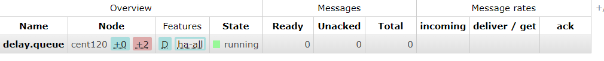

**3.创建绑定关系**

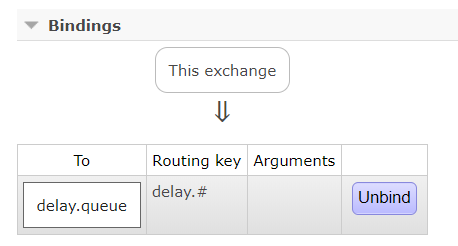

**4.发送延迟消息**

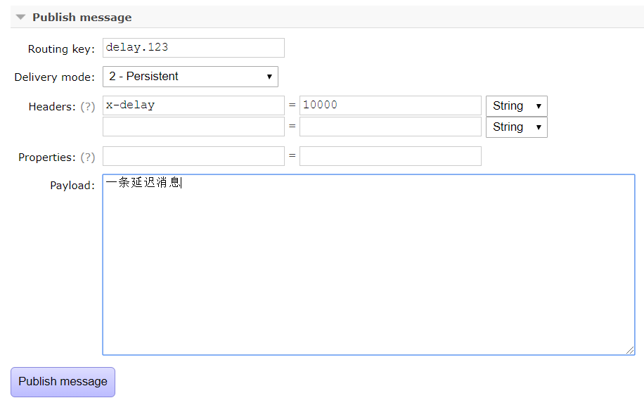

设置了10秒延迟时间，发送完立刻查看队列，没有消息


十秒后刷新，有一条消息，即延迟队列成功安装并使用

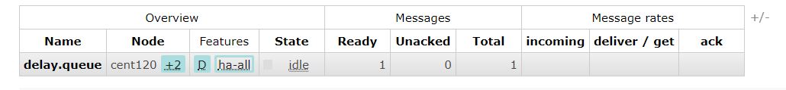