## SET化集群衍化

随着大型互联网公司业务的多元化发展，就拿滴滴、美团等大厂来讲，如滴滴打车、单车、外卖、酒店、旅行、金融等业务持续高速增长，单个大型分布式体系的集群，通过加机器+集群内部拆分（kv、mq、Mysql等），虽然具备了一定的可扩展性。但是，随着业务量的进一步增长，这个集群规模琢渐变的巨大，从而一定会在某个点达到瓶颈，无法满足扩展性需要，并且大集群内核服务出现问题，会影响全网所有用户。

以滴滴打车、美团外卖举例来说：
打车业务体量巨大，尤其在早晚高峰期。全年订单量已越10亿。
外卖业务体量庞大，目前单量突破1700w/天，对应如此庞大的单个大型分布式集群，会面临一下问题：

- 容灾问题：核心服务（比如订单服务）挂掉，会影影响全网所有的用户，导致整个业务不可用；数据库主库集中在一个IDC，主机房挂掉，会影响全网所有用户，整个业务无法快速切换和恢复
- 资源扩展问题：单IDC的资源（机器、网络带宽等）已经没法满足，扩展IDC时，存在跨机房访问延时问题（增加异地机房，时延问题严重）；数据库主库单点，连接数有限，不能支持应用程序的持续发展
- 大集群拆分问题：分布式集群规模扩大后，会响应的带来资源扩展、大集群拆分以及容灾问题
  所有处于对业务扩展性以及容灾需求的考虑，我们需要一套从底层架构彻底解决问题的方案，业界主流解决方案

### 架构方案衍变

#### 同城 "双活" 架构

 目前很多大型互联网公司的业务架构可以理解为同城"双活"架构，注意这里的“双活"是加引号的，具体可以这样理解：

1. 业务层面上已经做到的真正的双活（或者多活），分别承担部分流量；
2. 存储层面比如定时任务、缓存、持久层、数据分析等都是主从架构，会有跨机房写的问题；
3. 一个数据中心故障，可以手动切换流量，部分组件可以自动切换；

#### 两地三中心架构介绍

使用灾备的思想，在同城“双活”的基础上，在异地部署一套灾备数据中心，每个中心都具有完备的数据处理能力，只有当主节点故障需要容灾时才会紧急启动备用数据中心；

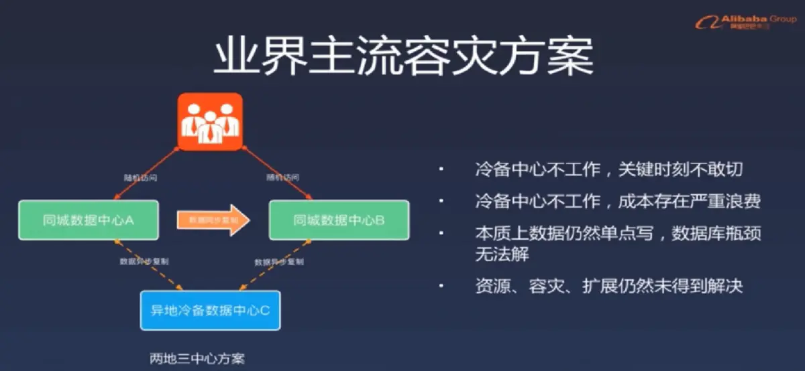

问题：

- 冷备中心因为一直没有真实数据压测，当真正出现问题时，不敢切过去发生承压失败崩溃问题
- 因为不敢切导致大量资源浪费
- 因为数据是全量保存，所以数据中心有的瓶颈问题，冷备中心也有


**SET化方案目标:**

- 业务：解决业务遇到的扩展性和容灾等需求，支撑业务的高速方案
- 通用性：架构侧形成统一通用的解决方案，方面各业务线接入使用

## SET化架构设计

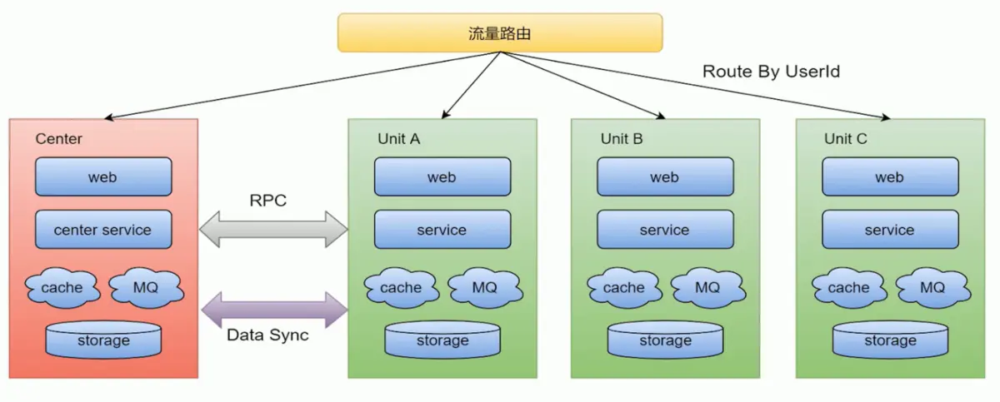

这里大概说一下，就好比电商，电商中最核心的业务就是用户下单，创建订单，支付，完成订单这一条链路了。

所谓SET化架构，就是将这样一条核心链路放在一个机房里，这个机房就好比Unit A，有着web，Service，缓存，MQ，存储的一个集群，如果当性能遇到瓶颈时，只需将此机房的集群做个复制，将复制的放到其他机房里，这样根据负载均衡路由算法，可以直接提高一倍的并发量以及性能。而对于不那么重要的业务，比如首页展示，用户信息等等，可以集中放在一个集群中，就是上图中的Center。

这样就实现了单元化，也就是SET化，当某个集群挂掉了，可以设置路由不去请求那个集群就可以了。

### 架构策略

- 流量路由：按照特殊的key（通常为userid）进行路由，判断某次请求该路由到中心集群还是单元化集群
- 中心集群：为进行单元化改造的服务（通常不在核心交易链路，比如供应链系统）称为中心集群，跟当前架构保持一致
- 单元化集群（重要）
  - 每个单元化集群只负责本单元内的流量处理，以实现流量拆分以及故障隔离
  - 每个单元化集群前期只存储本单元产生的交易数据，后续会做双向数据同步，实现容灾切换需求
- 中间件
  - RPC：对于SET服务，调用封闭在SET内；对于非SET服务，沿用现有的路由逻辑
  - KV：支持SET的数据生产和查询
  - MQ：支持分SET的消息生产和消费
- 数据同步
  - 全局数据（数据量小且变化不大，比如商家的菜品数据）部署在中心集群，其他单元化集群同步全局数据到本单元化内
  - 未来演变为异地多活架构时，各单元化集群数据需要进行双向同步来实现容灾需要
- 异地容灾：通过SET化架构的流量调度能力，将SET分别部署在不同地区的数据中心，实现跨地区容灾支持
- 高效的本地化服务
  - 利用前端位置信息采集和域名解析策略，将流量路由到最近的SET，提供最高效的本地化服务
  - 比如O2O场景天然具有本地生产，本地消费的特点，更加需要SET化支持
- 集装箱扩展：SET的封装性支持更灵活的部署扩展性，比如SET一键创建/下线，SET一键发布等

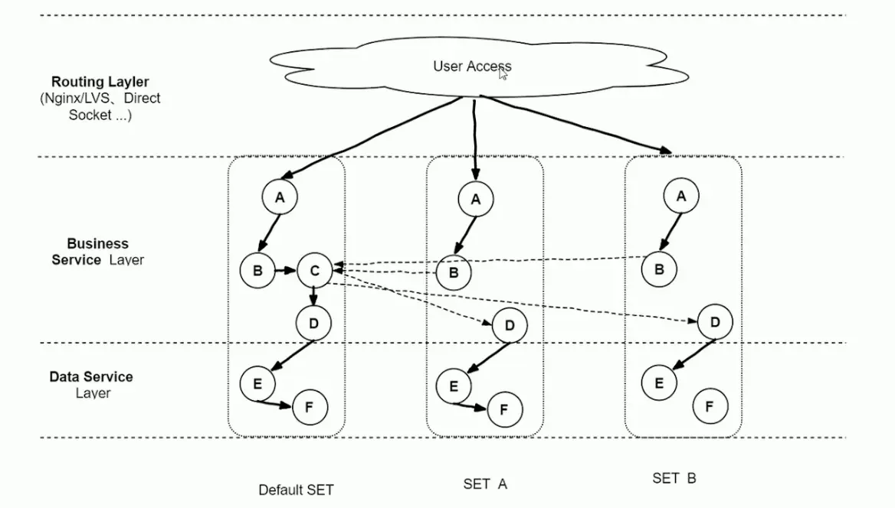

如图，Default是中心服务，SET A，SETB是核心服务，对于C业务可有可无，这里就放在中心服务，异步调用即可

### SET化架构落地原则

- 对业务透明原则：SET化架构的实现对业务代码透明，业务代码层面不需要关系SET化规则，SET的部署等问题
- SET化切分的规则：
  - 理论上，切分规则有业务层面按需定制；
  - 实际上，建议优先选最大的业务维度进行切分；
  - 比如海量用户的O2O业务，按用户位置信息进行切分。此外接入层、逻辑层和数据层可以由独立的SET切分规则，有利于实现部署和运维成本的最优化
- 部署规范原则： 一个SET并不一定只限制在一个机房，也可以跨机房或者跨地区部署；为保证灵活性，单个SET内机器数不宜过多（如不超过1000台物理机）

## RabbitMQ的SET化

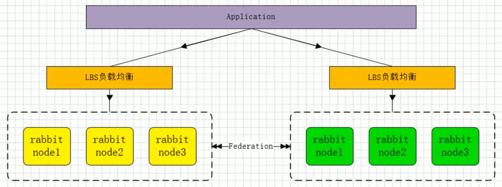

RabbitMQ实现SET化主要依靠Federation插件，对于这个插件的介绍在第16节介绍集群模式时有说过，这里简单说下：

- Federation是在Broker直接传输，而不是Cluster直接
- 传输时双方可以是不同的用户，不同的虚拟主机，不同的RabbitMQ或Erlang版本
- 使用AMQP传输协议通信

### Federation流转过程


- 如图，有上下游服务各一个，中间`Link`连接通过`federation`实现，`X`代表`Exchange`
- 上游的数据投递到`Exchange`后，下游会根据`Binding`关系主动拉取上游`Exchange`中的消息
- 下游消息拉取后，具有一个实际的`Queue`进行保存

### Federation安装与使用

#### 环境准备

这里我们创建两个节点，即两个虚拟机，81和82，并且安装上RabbitMQ。

这里我们在节点中使用Federation，而不是集群间，是因为Federation本身就是节点间连接的，然后通过集群的镜像队列进行同步。

**主要注意的是！在每个节点都需要安装Federation插件才行**

#### Federation安装

```
$ rabbitmq-plugins enable rabbitmq_federation
$ rabbitmq-plugins enable rabbitmq_federation_management
```

安装方式非常简单，只需开启这两个插件即可，安装后可以打开控制台查看，在Admin中可以看到下面两个即成功。

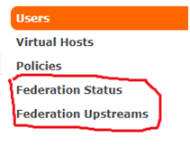

#### Federation使用

**这里我们使用81节点当上游，82节点当下游，消息发送到81节点中，消息自动流转到82节点上**

##### 1.下游创建Exchange，Queue，Binding

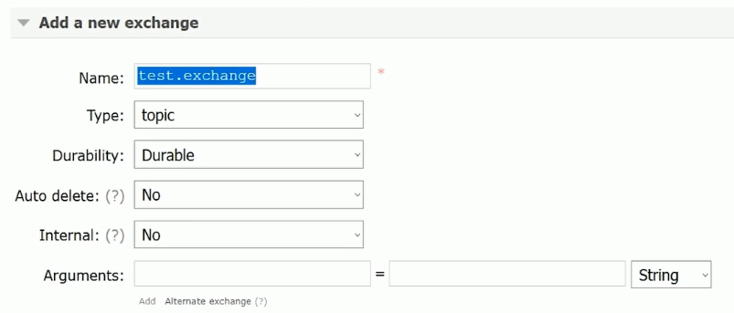

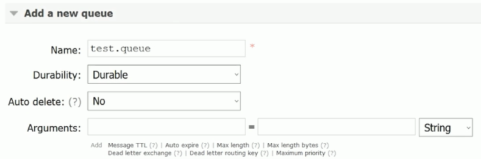

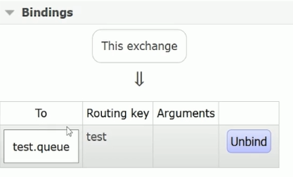

##### 2.在下游中设置上游节点

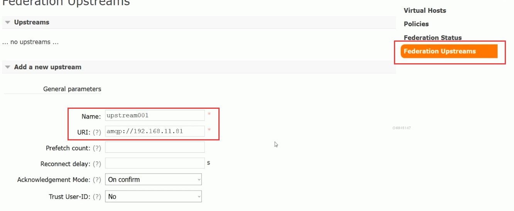

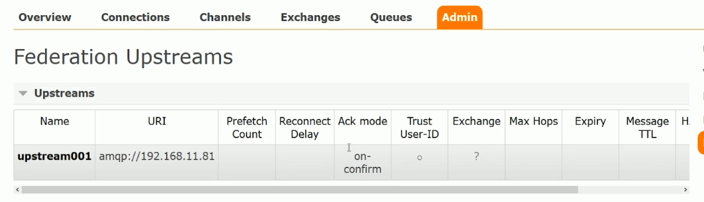

添加成功后可以看到upstream

##### 3.下游配置策略

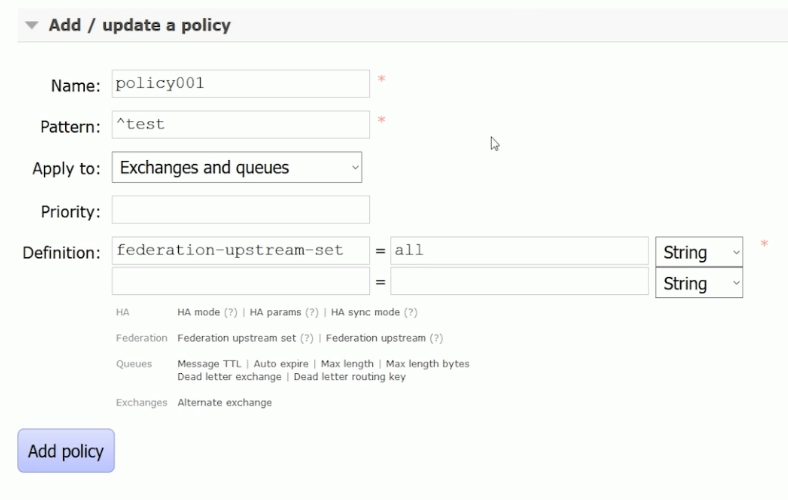

- `pattern`：正则表达式，这里是以test开头的
- `definition`：为`federation-upstream-set`，设置为all，全部匹配

添加完策略后，可以查看Exchange


可以看到Exchange已经使用此策略，然后查看Federation Status

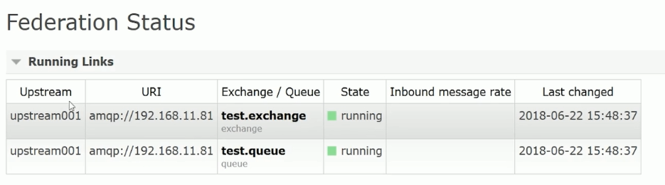

有两个链接，即上游的exchange和queue链接

这时回到上游，首先可以看到多了两个Connection和Channel

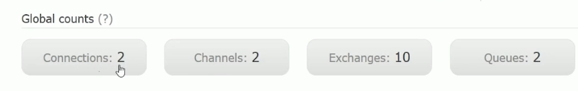


就是下游的连接

在查看Exchange

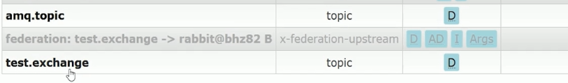

**自动构建**了两个Exchange，一个是用来路由的，一个是和下游同步的，Queue也一样

##### 4.上游发送消息测试

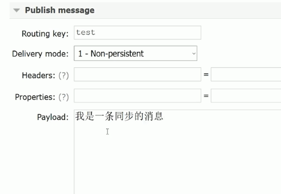

接着先查看上游的队列

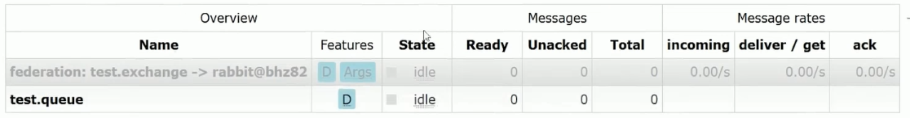

会发现没有消息，然后看下游

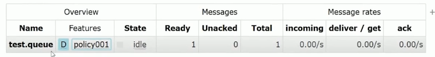

有一条消息，就是我们发的消息 

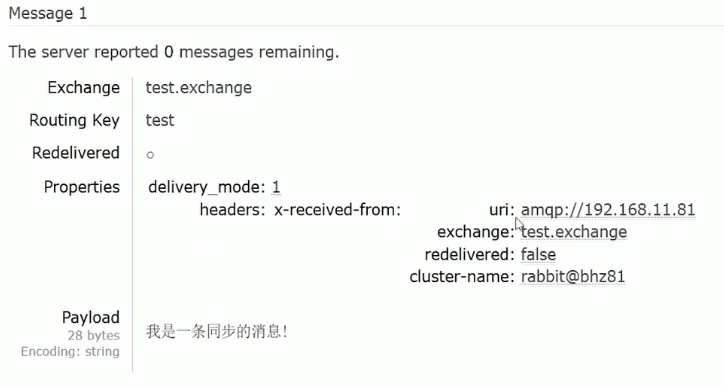

那么，如何让我们的上游也保存这个消息呢？很简单，**只需再创建一个队列，使之与`test.exchange`绑定并且路由键一样即可**

### SET化配置规则

- Federation Exchanges，可以看出Downstream（82节点）从Upstream（81 节点）主动拉取消息，但并不是拉取所有消息，必须是在Downstream上已经明确定义Bindings关系的Exchange，也就是有实际的物理Queue来接收消息，才会从Upstream拉取消息到Downstream。使用AMQP协议实施代理间通信，Downstream会将绑定关系组合在一起
- 经过配置后，Upstream节点已经把消息直接通过Federation Exchanges路由给我们的Downstream节点，然后进行消费，也就是说，可以实现路由转发，接下来可以在Upstream添加具体的队列去进行消费Federation Exchanges里的消息，我们一条消息分别发到2个RabbitMQ集群并消费，这样我们可以实现SET化的关键要素，就是集群间的消息同步了
- 可以根据自己的业务规则去规划不同的集群去监听不同的消息队列，从而达到SET化的手段，保障了性能、可靠性、数据一致性