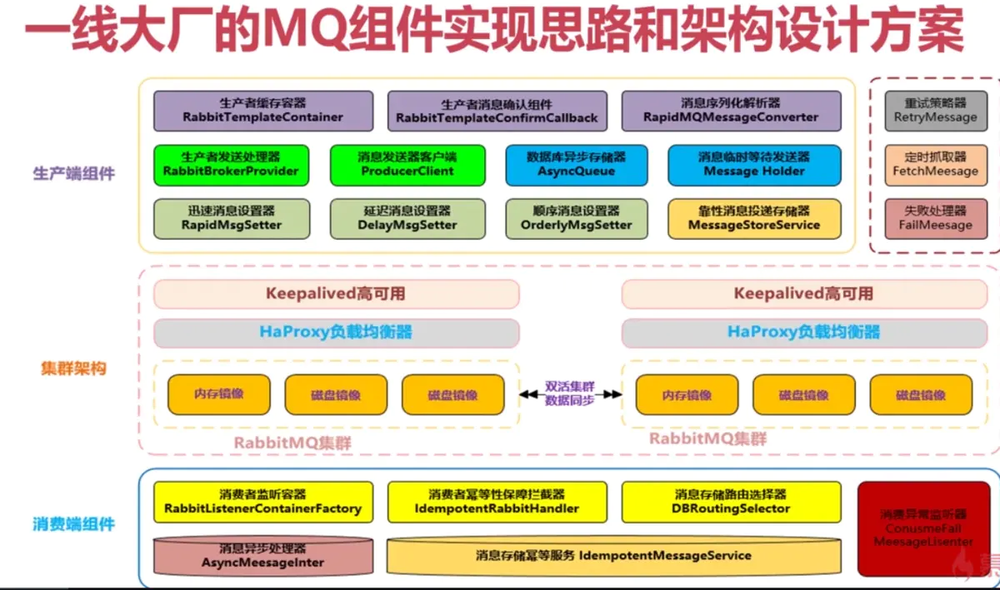
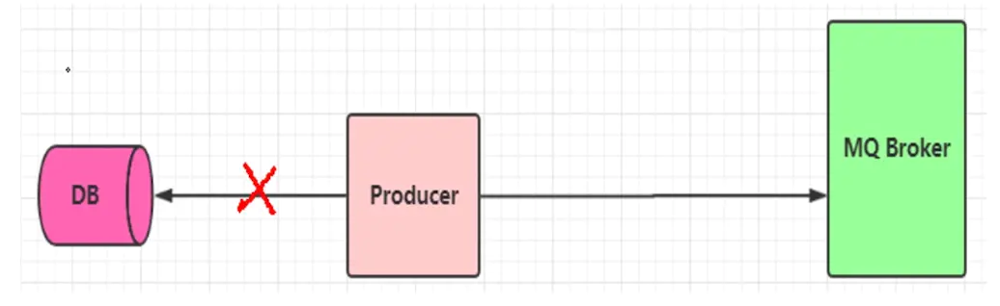
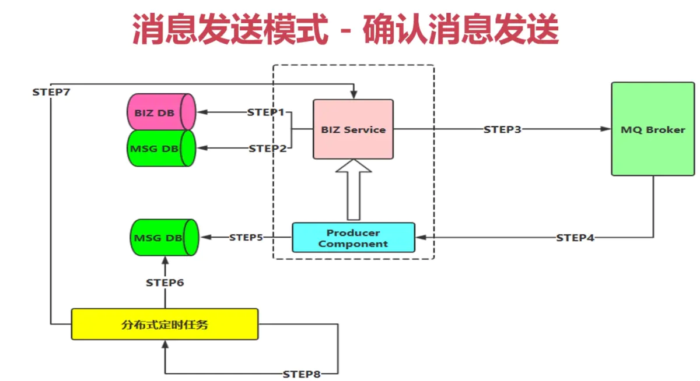
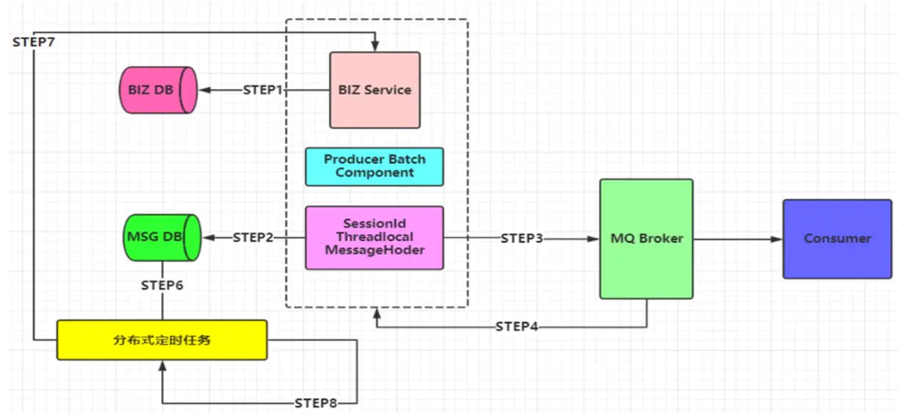
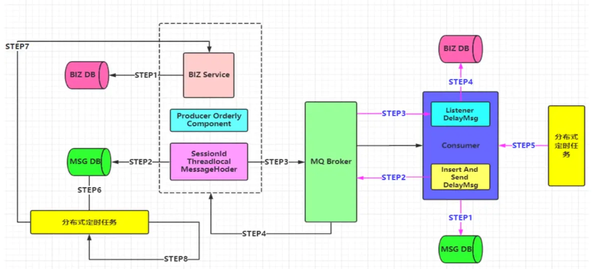
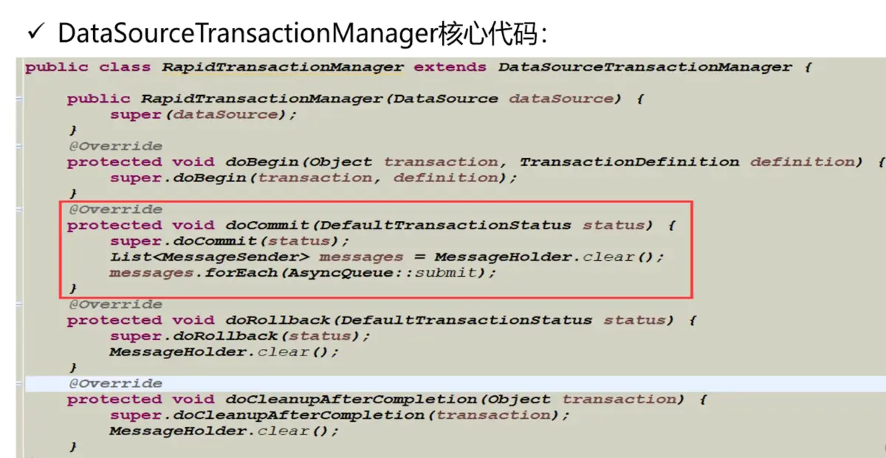
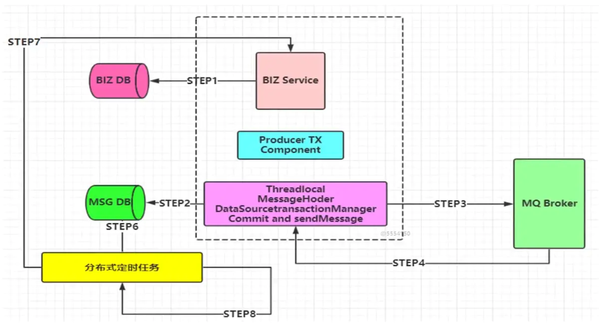
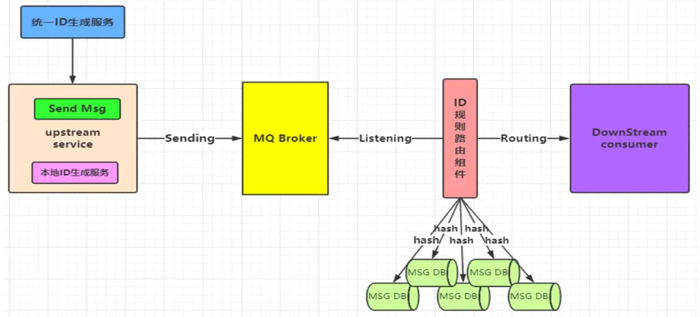

## 一线大厂MQ架构图

### 集群架构层

中间是我们的 MQ 集群架构， 在上层利用 keepalived 和 HA-Proxy， 最下面是 两个大的 MQ 集群 做一个高可用。当然了，在实际大厂里面 可能就不止 两个集群了，可以是很多个集群，然后集群之间利用 federration 插件进行数据同步 。

### 生产端组件

这里面可能就有很多的架构设计，比如生产端怎么对一个容器进行缓存，举个例子，我们生产端发送消息，都是利用 `RabbitTemplate `进行，在高并发场景下，你每次发消息都创建一个 `RabbitTemplate `， 这是影响性能的，那你的 `RabbitTemplate  `是不是要进行一个池化的操作，也就是 `RabbitTemplateContainer`， 创建一个 `RabbitTemplate  `后就进行缓存起来，后面再发这一 topic 主题的消息时就从 缓存里面拿。

还有生产消息确认组件 `RabbitTemplateConfirmCallback`、 消息序列化解析器 `RapidMQMessageConverter `封装我们常用的 Json 序列化方法、生产端发送处理器 `RabbitBrokerProvider`、消息发送客户端 `ProducerClient `等等 ，还有 重试策略器、定时抓取器、失败处理器 等等，都是架构组要去封装好的，然后打成一个 jar 包提供给业务线去使用。这里面涉及到的落地技术、设计思想，都是很有必要自己去学习学习的。

### 消费端组件

首先就是消费者监听容器 `RabbitListenerContainerFactory`，用于处理和缓存一些消息监听容器。

接着就是消费者 幂等性保障拦截器 `IdempotentRabbitHandler `，用于做消息的幂等性处理。接着就引出了我们的 消息存储路由选择器 `DBRoutingSelector`，因为我们数据库是分库分表的，所以在做幂等性的时候具体落库到哪就是这里要做的。

然后就是 消息异步处理器 `AsyncMessageInter`，意思就是消费端接收到消息了，但是我并不是马上就去处理，而是根据优先级别，这个消息可能稍后才会去处理。

再接着就是 消息存储幂等服务 `IdempotentMessageService `，这个就是做幂等服务的具体实现类。

最后就是消费异常监听器 `ConsumerFailMessageListener`， 在我们消费处理时发生了异常，这时候该怎么去处理， 跟死信队列也会有一些关系，也会有一些对应的配置。这些都是一个整体打成一个 jar，然后提供给到业务线去使用

通过上面的架构图，我们就引出了 MQ 组件**必须实现功能点**

- 支持消息高性能的序列化转换、异步化发送消息
- 支持消息生产实例 与 消费实例的连接池化缓存化，提升性能
- 支持可靠性投递消息，保障消息的 100% 不丢失
- 支持消费端的幂等操作，避免消费端重复消费的问题

**可扩展功能点：**

- 支持迅速消息发送模式,有些场景下不需要保证100%成功投递,在一些日志收集、统计分析等需求下可以保证高性能、超高吞吐量

- 支持延迟消息模式,消息可以延迟发送,指定延迟时间,用于某些延迟检查、服务限流场景

- 支持事务消息,且100%保障可靠性投递,在金融行业单笔大金额操作时会有此类需求

-  支持顺序消息,保证消息送达消费端的前后顺序,例如下订单等复合型操作

- 支持消息补偿、重试,快速定位异常

## 消息发送模式

### 迅速消息发送

迅速消息是指消息不进行落库存储，不做可靠性的保障。在一些非核心消息、日志数据、或者统计分析等场景下比较合适。

迅速消息的优点就是性能最高，吞吐量最大

迅速消息简化流程图

### 确认消息发送

即可靠性投递的一种方式，在业务落库后，再针对消息进行落库，最后发送消息，最后有一个响应给到生产端，确认已收到这条消息，针对超时还未响应的，利用分布式定时任务进行重发消息。

### 批量消息发送

批量消息是指 我们把消息放到一个集合里统一进行提交，这种方案设计思路是 期望消息在一个会话里，比如投掷到 `threadLocal `里的集合，然后拥有相同的会话 id`（`即消息都是有一个共同的 父级 `Id`），并且带有这次提交消息的 `size `等相关属性，最重要的一点是 要把这一批消息进行合并。对于 `Channel `而言，就是发送一次消息。

这种方式也是希望消费端在消费的时候，可以进行批量化的消费，针对于某一原子业务的操作去处理，但是不保障可靠性，需要进行补偿机制！

如下图所示，我们第一步肯定是要对业务进行入库，之后才是利用 批量发送的接口 `ProducerBatchComponent `，`ProducerBatchComponent  `里面包含了 会话`Id SessionId` ，这一批消息里面的 `sessionId `都是相同的，然后就是 Threadlocal ，我们把这一批的消息放到 `Threadlocal  `里面，再里面就是 `MessageHoder`， 它可能是一个 List 集合 用于承装这一批消息，装满之后就进行消息落库，但是并不是对这一批次里面的每一条消息都落库，而是记录这个 `sessionId `，记 1 条 记录就可以了。然后再投递出去，`confirm `确认啊 等等操作，后续操作都和之前可靠性性投递过程类似。消费端就是接收到这条消息，然后就把它拆开，根据 `size `去获取有几条消息记录，组成一个完整的原子性操作。

### 延迟消息发送

 延迟消息相对简单，就是我们在 Message 封装的时候添加 `delayTime `属性即可，使得我们的消息可以进行延迟发送，在实际具体的业务场景里面很实用。

场景举例：

- 比如在电商平台买到的商品签收后，不点击确认支付，那么系统自动会在 7 天（一定时间）后去进行支付操作。
- 超时自动作废的场景，优惠券、红包 等有使用时间限制的场景也是可以利用延迟消息机制。

## 顺序消息

顺序消息比较类似于 批量消息的实现机制，但是也有些不同。

我们要保障以下几点：

- 发送的顺序消息，必须保障消息投递到同一个队列里面，且 消费者只能有一个 （独占模式）
- 然后需要统一提交（可能是合并成一个大消息（不建议这样），也可能是拆分为多个消息），并且所有消息的会话 id 一致。这里要和之前的批量消息做区别，之前的批量消息是不需要保证顺序消费的，消费端接收到批量消息后拆开，然后可以多线程去执行，这样就能提升性能。但是我们现在是顺序消息，如果你把它合成一个整体，消费端需要把它拆开，然后一个个按顺序去执行，这样是非常耗时的，建议拆成一条条的小消息，消费端获取到消息，可能并不是马上去执行的，而是说做一些等待策略。
- 添加消息属性： 既然要按顺序消费，那就必须 顺序标记的序号 和 本次顺序消息的 size 属性，接收到消息后马上进行落库操作，并不是收到消息后马上就去执行业务
- 因为收到消息后并不是马上就去执行业务逻辑，而是延迟后进行处理，所以要 并行进行发送给 自身的延迟消息 （注意带上关键属性：会话 id、size）进行后续业务处理
- 当收到延迟消息后，根据会话 id、size 抽取数据库数据进行处理即可
- 对应异常情况，用定时轮询补偿机制，比如 生产端消息没有完全投递成功、消费端落库异常 导致 消费端落库后 缺少消息条目的情况。

如下流程图，我们在做完业务入库后，利用 `ProducerOrderlyComponent `去组成一批带有顺序的消息，消息里面带上 相同的 `sessionId`，放到 `threadlocal `里面， 然后就是 `MessageHoder `这个 `List`，里面就是一个个的小消息了 ，里面带有消息的 `size`， 然后需要可靠性投递的就可以进行消息的入库，注意这是对每条小消息进行入库，接着收到 `confirm `确认就更新消息状态，可靠性投递的其他步骤和之前的一样。

需要注意我们的消费端，我们是对这个小消息直接入库，不是马上去执行业务逻辑。当我收到这一批次的第一条消息，那么我就同步的发送一个延迟消息给自己，告诉我过去多久，这一批次的消息都入库成功了，我就要把这一批次的消息取出来，然后按顺序去执行业务处理。最后就是处理业务的时候，如果同一批次 最后一个操作失败了，那么该怎么处理，要根据你实际的业务规则来设计的，所以就是需要这个补偿机制。

## 事务消息

事务消息，相对使用比较少。

在互联网金融行业，面对单笔大额的现金流交易时，比如单笔转账超过一个上限的时候，我们就希望这个消息优先级最高，并且可靠性要求达到 100% 。当然 我们的系统 和 银行端系统都需要兼顾才行，在我们自己的系统里面可能一分钟不到就处理完了，但是银行的系统可能会迟迟不给响应，所以也会有一些补偿机制，主动发起银行端查询指令机制等，如果超过某个时间就需要运维的人工介入，人工的帮助去找银行查询转账结果。

为了保障性能的同时，也支持事务。我们并没有选择传统的 Rabbitmq 事务 和Spring 集成的机制，因为在性能测试的过程中，效果并不理想，非常消耗系统资源，且会出现堵塞 等情况，在高峰期也是一定程度上影响 MQ 集群的性能。

解决方案：

采用类似可靠性投递的机制，也就是补偿机制。但是 数据源必须是同一个，也就是业务操作 DB1 数据库 和 消息记录 DB2 数据库使用同一个数据源。然后利用重写 Spring DataSourceTransactionManager，在本地事务提交的时候进行发送消息，但是也有可能事务提交成功，但是消息发送失败，这个时候就需要进行补偿了。

这个时候只能出现一种意外情况，数据库层面的都提交成功了，但是消息发送失败，这时就需要重试机制。核心代码里面就是 doCommit 的时候 调用 super.doCommit ,真正的把数据库的事务给提交了，保障同源的那两个数据库操作是成功的，或者同时失败，再把对应的消息发出去。发消息是保障不了的，需要重试机制，但是我两个入库操作是成功的，核心就在这里。

## 消息幂等性

保障消息的幂等性，这也是我们在使用 MQ 中至关重要的环节！！！

可能导致消息出现非幂等性的原因

- 可靠性消息投递机制，比如 生产端发送消息到 broker 了，broker 也给响应了，但是 confirm 的时候出现网络闪断，生产端就没收到这个 ACk 了，这个时候定时任务肯定就会再把这个消息再发送出去
- MQ Broker 服务 与消费端传输消息的过程中发生了网络抖动影响到了
- 消费端故障或异常

所以，幂等性 很重要！！

接着来看看 幂等性的设计图，我们需要一个 统一Id 生成服务，因为我们要保障这个 id 是全局唯一的，对于我生产端来说，这个全局 Id 是一个统一的外部服务，有可能生产端获取半天都获取失败，这时候就需要有 本地 Id 生成服务（兜底的策略，或者降级解决方案）。broker 发给到 下游的消费服务，这中间就需要有幂等性，幂等性就涉及到 Id 规则路由，通过拿到的统一的 Id， 然后通过算法路由，然后进行落库，利用数据库主键进行幂等的操作，数据库的主键是很好的一种方案。redis 也可以做到，只是复杂一些，可以看我之前的文章。

