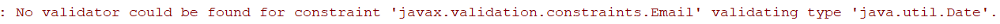
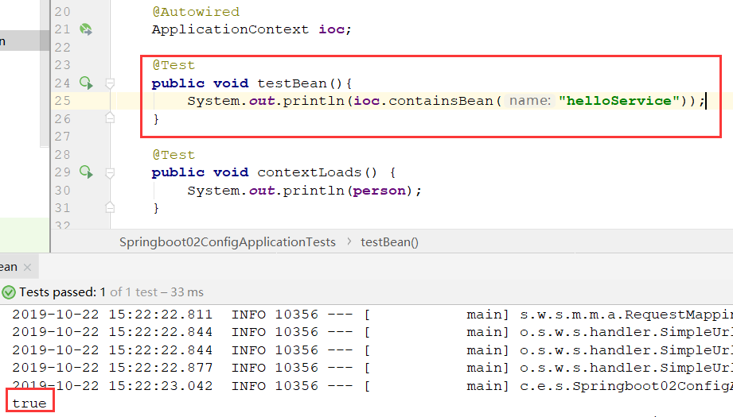
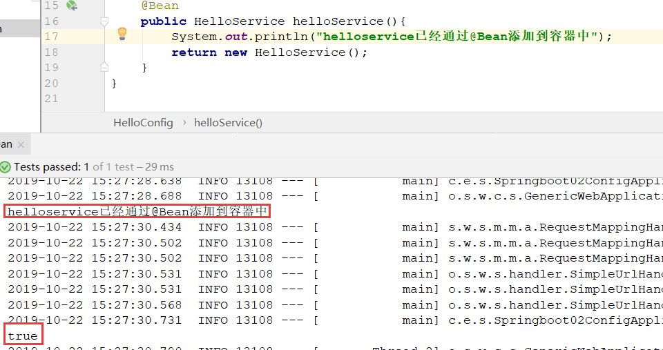
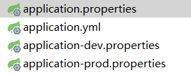
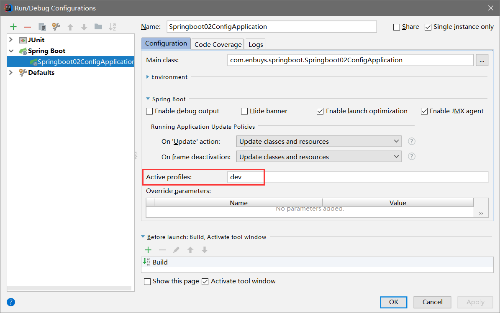
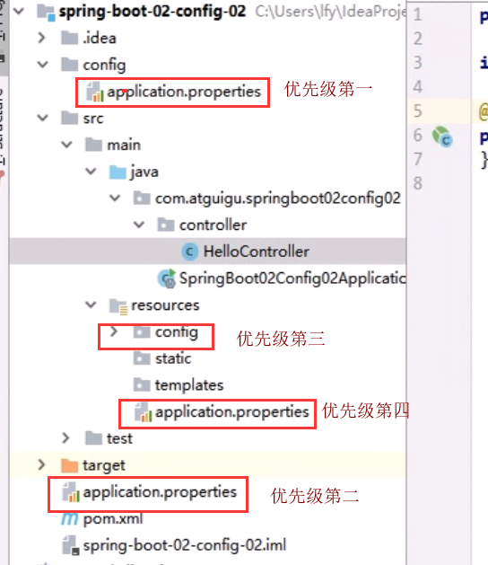
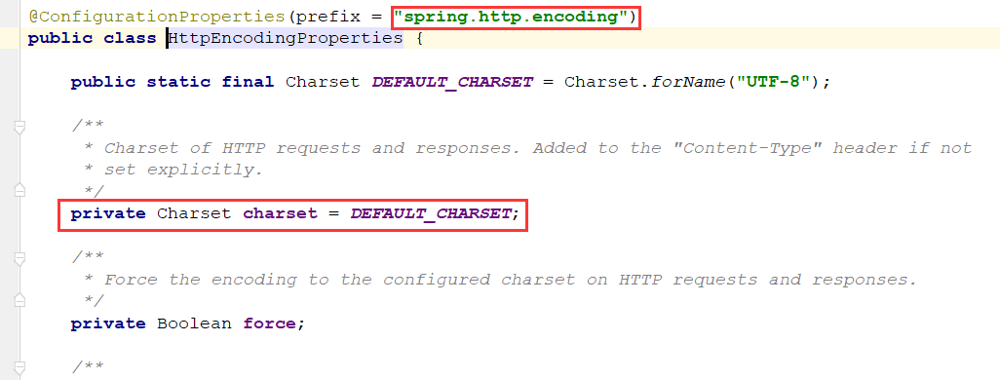
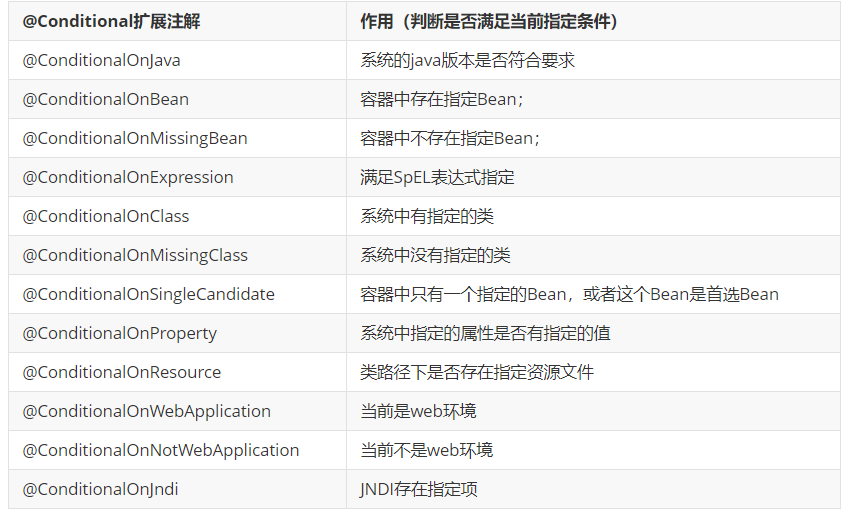
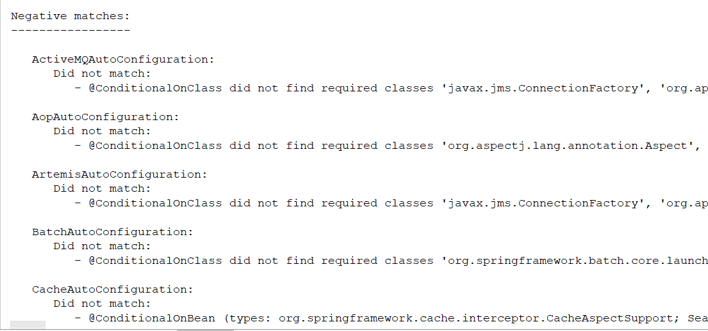
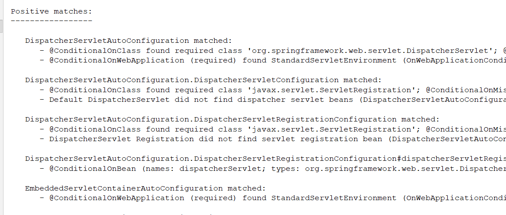

## 一、配置文件

Springboot不同于Spring，其配置文件有严格要求：

- application.properties
- application.yml(yaml)

只能是这两种才可以，名称固定。

一般来说Springboot在底层已经配置好，如果需要自己进行配置，便可以通过这个配置文件修改

例如：

```yaml
server:
  port: 8081
```

## 二、YAML语法

### 2.1.基本语法

yaml由键值对组成，k: v（注意冒号后要跟一个空格）

yaml对空格敏感，对于层级的控制也是由空格来判断的，空格对齐的数据是在一个层级

```yaml
server:
    port: 8081
    	test: 123
    path: /hello
    	name: haha
```

上面的例子，即port与path在一个层级，test与name在第三层级。

并且大小写敏感

### 2.2.值的写法

#### 键值对

由k: v组成，一般来说v不需要加引号

如果加双引号，特殊字符会被转义，如"\n"就会换行

如果加单引号，特殊字符不会被转义

#### 对象、Map

k: v：在下一行来写对象的属性和值的关系；注意缩进

​		对象还是k: v的方式

```yaml
friends:
		lastName: zhangsan
		age: 20
```

行内写法：

```yaml
friends: {lastName: zhangsan,age: 18}
```

#### 数组

用- 值表示数组中的一个元素

```yaml
pets:
 - cat
 - dog
 - pig
```

行内写法

```yaml
pets: [cat,dog,pig]
```

## 三、配置文件注入

比如我们写一个实体类Person与Dog

```java
/**
 * @Component 需要将实体放到容器中
 * @ConfigurationProperties：将配置文件中的属性映射到实体中，初始化绑定
 *      prefix ： 配置文件中哪个属性进行绑定
 */
@Component
@ConfigurationProperties(prefix = "person")
public class Person {
    private String pName;
    private int pAge;
    private Date birth;
    private Map<String,Object> map;
    private List<Object> list;

    private Dog dog;
}

public class Dog {

    private String dName;
    private int dAge;
}
```

application.yml：

```yml
person:
    pName: zhangsan
    pAge: 18
    birth: 1997/05/20
    map: {k1: v1,k2: v2}
    list:
        - lisi
        - zhaoliu
    dog:
        dName: 狗
        dAge: 4
```

### 3.1.@ConfigurationProperties注入

由上面代码可以看出来，注入非常简单

1）在pom中添加springboot文件处理器

```xml
<!-- 导入配置文件处理器 -->
<dependency>
    <groupId>org.springframework.boot</groupId>
    <artifactId>spring-boot-configuration-processor</artifactId>
    <optional>true</optional>
</dependency>
```

2）在需要注入的类中添加两个注解，并设置属性

```java
@Component
@ConfigurationProperties(prefix = "person")
```

注意配置文件使用的是application.yaml

### 3.2.@Value注入

properties之前经常用到，比较熟悉，比如配置数据库信息等等，因为上面我们使用了yml注入，所以这次我们注入properties，两者都是一样使用的

```properties
person.p-name=zhangsan
person.p-age=18
person.birth=1997/05/20
person.map.k1=v1
person.map.k2=v2
```

在需要注入的字段上加@Value注解

```java
public class Person {

    @Value("${person.p-name}")
    private String pName;
    @Value("#{11*2}")
    private int pAge;
    @Value("${person.birth}")
    private Date birth;
    private Map<String,Object> map;
    private List<Object> list;

    private Dog dog;
}
```

### 3.3.两者区别

|                        | @ConfigurationProperties | @Value     |
| ---------------------- | ------------------------ | ---------- |
| 功能                   | 批量注入配置文件中的属性 | 一个个指定 |
| 松散绑定（松散语法）   | 支持                     | 不支持     |
| SpEL（如#{11*2}）      | 不支持                   | 支持       |
| 数据校验（@Validated） | 支持                     | 不支持     |
| 复杂类型封装           | 支持                     | 不支持     |

配置文件yml还是properties他们都能获取到值；两者使用场景：

**我们只是在某个业务逻辑中需要获取一下配置文件中的某项值，使用@Value；**

**我们专门编写了一个javaBean来和配置文件进行映射，使用@ConfigurationProperties。**

### 3.4.数据校验

对于配置文件注入时，只有@ConfigurationProperties注解可以配合使用数据校验@Validated，@Value不可用使用。

```java
@Component
@ConfigurationProperties(prefix = "person")
@Validated
public class Person {

    @NotBlank
    private String pName;
    @NotNull
    private int pAge;
    @Email
    private Date birth;
}
```

因为birth给定的是日期类型，所以启动会报错，即数据校验成功



一些常用的数据校验注解：

| 限制                      | 说明                                                         |
| ------------------------- | ------------------------------------------------------------ |
| @Null                     | 限制只能为null                                               |
| @NotNull                  | 限制必须不为null                                             |
| @AssertFalse              | 限制必须为false                                              |
| @AssertTrue               | 限制必须为true                                               |
| @DecimalMax(value)        | 限制必须为一个不大于指定值的数字                             |
| @DecimalMin(value)        | 限制必须为一个不小于指定值的数字                             |
| @Digits(integer,fraction) | 限制必须为一个小数，且整数部分的位数不能超过integer，小数部分的位数不能超过fraction |
| @Future                   | 限制必须是一个将来的日期                                     |
| @Max(value)               | 限制必须为一个不大于指定值的数字                             |
| @Min(value)               | 限制必须为一个不小于指定值的数字                             |
| @Past                     | 限制必须是一个过去的日期                                     |
| @Pattern(value)           | 限制必须符合指定的正则表达式                                 |
| @Size(max,min)            | 限制字符长度必须在min到max之间                               |
| @Past                     | 验证注解的元素值（日期类型）比当前时间早                     |
| @NotEmpty                 | 验证注解的元素值不为null且不为空（字符串长度不为0、集合大小不为0） |
| @NotBlank                 | 验证注解的元素值不为空（不为null、去除首位空格后长度为0），不同于@NotEmpty，@NotBlank只应用于字符串且在比较时会去除字符串的空格 |
| @Email                    | 验证注解的元素值是Email，也可以通过正则表达式和flag指定自定义的email格式 |

### 3.5.指定配置文件

#### 3.5.1.@PropertySource

一般情况下，配置文件使用默认的application.yml或者application.properties，如果想要修改，就需要使用注解**@PropertySource**，加载指定配置文件

```java
@PropertySource(value = {"classpath:person.properties"})
@Component
@ConfigurationProperties(prefix = "person")
public class Person {

    private String pName;
    private int pAge;
    private Date birth;
    private Map<String,Object> map;
    private List<Object> list;

    private Dog dog;
```

注意！！！

**使用指定配置文件时，需要把application中的相同配置注释掉，不然还是使用的application中的**

#### 3.5.2.@ImportResource

使用这个注解一般用来加载xml配置文件，比如Spring的配置文件

```xml
<?xml version="1.0" encoding="UTF-8"?>
<beans xmlns="http://www.springframework.org/schema/beans"
       xmlns:xsi="http://www.w3.org/2001/XMLSchema-instance"
       xsi:schemaLocation="http://www.springframework.org/schema/beans http://www.springframework.org/schema/beans/spring-beans.xsd">

    <bean id="helloService" class="com.atguigu.springboot.service.HelloService"></bean>
</beans>
```

导入Spring的配置文件让其生效

```
@SpringBootApplication
@ImportResource(locations = "classpath:bean.xml")
public class Springboot02ConfigApplication {
    public static void main(String[] args) {
        SpringApplication.run(Springboot02ConfigApplication.class, args);
    }
}
```

测试查看：



正确加载到容器中。

#### 3.5.4.注解添加组件

注意，这是使用配置文件xml来进行对容器添加组件，Springboot提倡全注解开发，所以不建议使用xml来添加，他推荐了一种方法来配置：

1）创建一个配置类，相当于配置文件

2）使用@Bean注解进行添加

```java
@Configuration
public class HelloConfig {

    @Bean
    public HelloService helloService(){
        System.out.println("helloservice已经通过@Bean添加到容器中");
        return new HelloService();
    }
}
```



#### 3.5.4.总结

对于Springboot加载指定配置文件，有以下总结

- 使用@PropertySource来加载properties或yaml文件
- 使用@ImportResource加载xml文件（不推荐使用）
- 使用@Configuration配合@Bean来添加组件，而不是使用spring的xml文件注入bean

## 四、占位符

配置文件中也可以有占位符，使用`${}`的格式

可以是自带的随机函数，也可以是上面定义的参数，也可以是没定义的参数使用`:`来指定

```properties
#使用随机函数random
person.p-name=zhangsan${random.uuid}
person.p-age=18
person.birth=1997/05/20
person.map.k1=v1
person.map.k2=v2
#没有的参数，使用冒号给值hello
person.dog.dName=${person.hello:hello}_dog
#使用上面有的p-age
person.dog.dAge=${person.p-age} 
```

## 五、Profile

当应用需要部署开发环境或生产环境时，便需要不同的配置文件，有两种方式

### 5.1.多properties

编写多个application文件，命名为application-xxx.properties

然后再主文件中配置使用哪个环境的配置文件，例如：



```properties
spring.profiles.active=dev
```

即使用application-dev.properties

### 5.2.yml配置

在使用yaml配置多环境时，便不需要写多个yml文件了，他有文件块机制

```yml
server:
  port: 8080
spring:
  profiles:
    active: prod
---

server:
  port: 8081
spring:
  profiles: dev

---
server:
  port: 8082
spring:
  profiles: prod
```

### 5.3.激活指定profile

1）在配置文件中激活

properties：

```properties
spring.profiles.active=dev
```

yml:

```yml
spring:
  profiles:
    active: prod
```

2）在启动时添加参数



运行jar时：

` java -jar spring-boot-02-config-0.0.1-SNAPSHOT.jar --spring.profiles.active=dev； `

3）虚拟机参数

`-Dspring.profiles.active=dev`

## 六、配置文件加载位置

SpringBoot如果有重复的配置文件在不同的位置，其优先级也会不同



对于不同位置的配置文件，有一个**互补原则，没有的配置会聚合，相同的配置被覆盖**

我们还可以通过spring.config.location来改变默认的配置文件位置

**项目打包好以后，我们可以使用命令行参数的形式，启动项目的时候来指定配置文件的新位置；指定配置文件和默认加载的这些配置文件共同起作用形成互补配置；**

`java -jar spring-boot-02-config.jar --spring.config.location=G:/application.properties`

## 七、Springboot的自动配置原理

当我们在`application.yml`配置时，是这样配的

```yml
server:
  port: 8080
  
spring:
  http:
    encoding:
      charset: utf-8
```

可以发现，我们在配置文件中配置`spring.http.encoding.charset`，其应用便会自动的帮我们设置好骑编码为utf-8,那么他的原理是什么呢？我们探究一下

在上一篇笔记中，我们讲到Springboot的最重要注解**@SpringBootApplication**

1. **@SpringBootApplication**中具有一个**@EnableAutoConfiguration**注解
2. 在里面Import了一个`EnableAutoConfigurationImportSelector`类
3. 其中有一个`getCandidateConfigurations`方法，调用了`Loader`的`loadFactoryNames`方法
4. 这个方法是根据`META-INF/spring.factories`中配置的`AutoConfiguration`类进行装载到容器中

**而我们在配置文件中的配置，全部都来自于这些AutoConfiguration类！**

------

**我们拿HttpEncodingAutoConfiguration来举例：**

```java
@Configuration
@EnableConfigurationProperties(HttpEncodingProperties.class)
@ConditionalOnWebApplication
@ConditionalOnClass(CharacterEncodingFilter.class)
@ConditionalOnProperty(prefix = "spring.http.encoding", value = "enabled", matchIfMissing = true)
public class HttpEncodingAutoConfiguration {

   private final HttpEncodingProperties properties;

    //即参数的值从配置文件获取
   public HttpEncodingAutoConfiguration(HttpEncodingProperties properties) {
      this.properties = properties;
   }

   @Bean // 向容器添加Filter组件，里面的配置就是根据配置文件的值来生成
   @ConditionalOnMissingBean(CharacterEncodingFilter.class)
   public CharacterEncodingFilter characterEncodingFilter() {
      CharacterEncodingFilter filter = new OrderedCharacterEncodingFilter();
      filter.setEncoding(this.properties.getCharset().name());
      filter.setForceRequestEncoding(this.properties.shouldForce(Type.REQUEST));
      filter.setForceResponseEncoding(this.properties.shouldForce(Type.RESPONSE));
      return filter;
   }
```

- **@Configuration**：代表他是一个配置类
- **@EnableConfigurationProperties(HttpEncodingProperties.class)**：启动指定类的`ConfigurationProperties`功能，即将配置文件中的值与`HttpEncodingProperties`这个类绑定起来
- **@ConditionalOnWebApplication**：判断是否是web项目，如果不是便配置不生效
- **@ConditionalOnClass(CharacterEncodingFilter.class)**：判断是否编写了`CharacterEncodingFilter`这个过滤器，如果已经编写了，便不会生效了，使用用户自己编写的过滤器
- **@ConditionalOnProperty(prefix = "spring.http.encoding", value = "enabled", matchIfMissing = true)**：判断`application.yml`配置文件里是否写了`spring.http.encoding`这个值，如果为`enabled`或者没有写，即生效，如果为`disable`便不生效

------

**再进入HttpEncodingProperties看一下**



可以发现，获取的便是我们配置文件中的`spring.http.encoding`的属性，而字段`charset`就是对应的值

------

### 总结

1. **SpringBoot启动时会加载大量自动配置类**
2. **我们根据需要在配置文件中配置**
3. **自动配置类会根据一些@Conditional判断是否生效这些配置，如果生效**
4. **Springboot会自动将我们配置的值装载到类中，生成一些所需的组件，比如HttpEncodingAutoConfiguration就会生成一个CharacterEncodingFilter过滤器，来帮我们处理编码问题**
5. **主要的文件是：**
   1. **xxxxAutoConfigurartion：自动配置类，给容器添加组件**
   2. **xxxxProperties：封装配置文件中的值，**

### @Conditional

可以发现，我们每个自动配置类中都有很多的conditional，这个是Spring底层的一个注解，用来判断条件是否成立，如果成立了，才会向容器中添加组件



SpringBoot自带了很多自动配置类，但不是全部生效的，就是因为@Conditional的作用

我们可以在配置文件中通过启用`debug: true`属性来让控制台打印哪些自动配置类生效了：

生效的类：



未生效的类：



