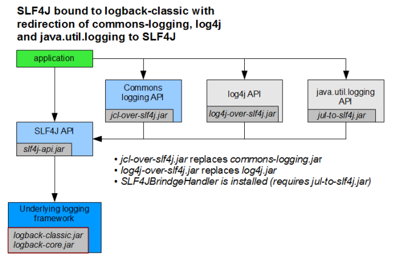
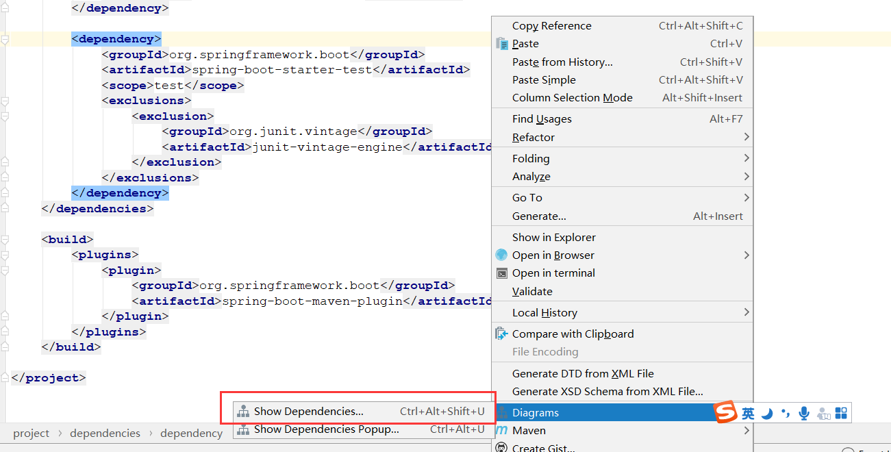
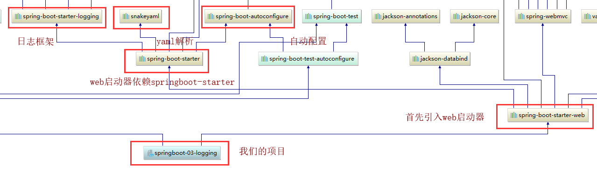
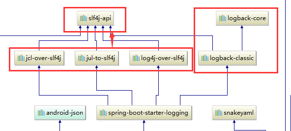
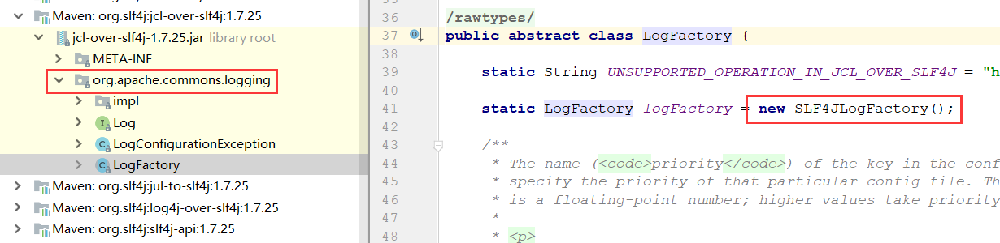
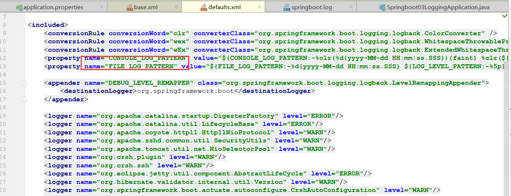
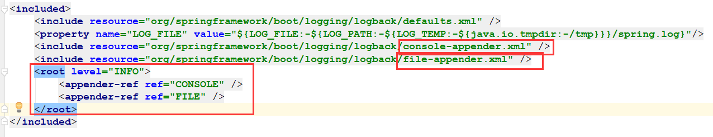
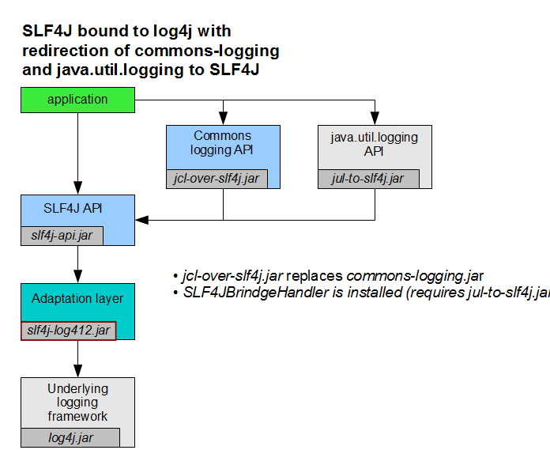
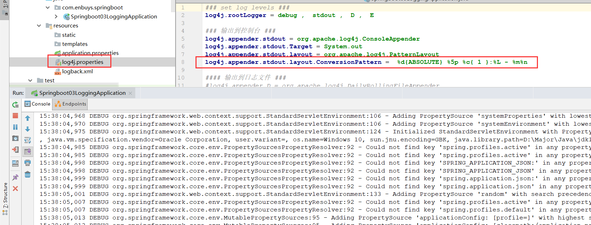
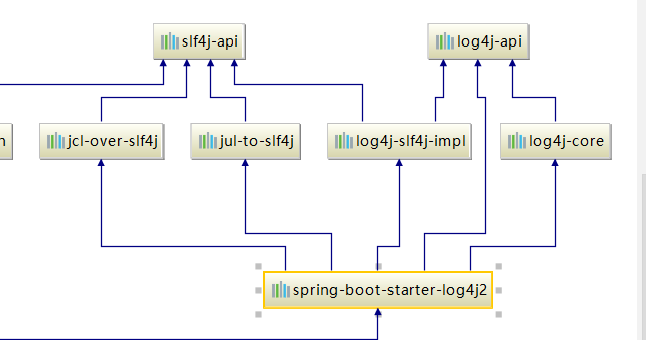

## 一、日志框架

**市面上的日志框架；**

JUL、JCL、Jboss-logging、logback、log4j、log4j2、slf4j....

| 日志门面  （日志的抽象层）                                   | 日志实现                                             |
| ------------------------------------------------------------ | ---------------------------------------------------- |
| ~~JCL（Jakarta  Commons Logging）~~    SLF4j（Simple  Logging Facade for Java）    **~~jboss-logging~~** | Log4j  JUL（java.util.logging）  Log4j2  **Logback** |

左边选一个门面（抽象层）、右边来选一个实现；如：

日志门面：  SLF4J；

日志实现：Logback；

对于不同的框架，其选择的日志框架也是不同的

Spring：默认使用JCL日志门面

SpringBoot：使用SLF4j+Logback

## 二、SLF4j

### 1.如何在系统中使用SLF4j  

 https://www.slf4j.org

以后开发的时候，日志记录方法的调用，不应该来直接调用日志的实现类，而是调用日志抽象层里面的方法；

给系统里面导入slf4j的jar和 logback的实现jar

```java
import org.slf4j.Logger;
import org.slf4j.LoggerFactory;

public class HelloWorld {
  public static void main(String[] args) {
    Logger logger = LoggerFactory.getLogger(HelloWorld.class);
    logger.info("Hello World");
  }
}
```

图示；


### 2.统一日志记录

因为不同的框架有不同的日志使用，比如Spring使用commons-logging，Mybatis使用JUL，xxx使用Jboss-logging，那么如何整合统一由SLF4j输出呢？

SLF4j使用了一种偷梁换柱的方法，对于调用其他日志框架，需要导如JUL或者JCL的包，SLF4j提供了一种jcl-over-slf4j.jar、log4j-over-slf4j.jar，即对于需要JUL或JCL的包，直接使用SLF4j封装好的包，让他们以为自己在那些平台打印日志，其实全部都由SLF4j控制，统一输出。

1. 将系统中其他日志框架先排除出去；
2. 用中间包来替换原有的日志框架；
3. 我们导入slf4j其他的实现



## 三、SpringBoot底层日志

上面介绍了SLF4j是如何做到对其他日志框架整合的，我们来看一下SpringBoot是否也是这样做的，从pom文件中点开关系图谱：





可以清晰的看到一层层关系，我们要研究的便是**spring-boot-starter-logging**：



可以看到Springboot使用logback记录日志，而对于其他的抽象层日志框架JCL，JUL，log4j都会转换成slf4j来使用。



可以看到jcl-over-slf4j包，里面虽说引入的是org.apache.commons.logging，但是实际使用的还是SLF4J的日志框架，这便是SLF4j的偷梁换柱大法。

当我们整合框架时，**需要把其自带的默认日志依赖去除**，比如Springboot对Spring默认JCL进行了日志剔除：


### 总结

1. Springboot使用的是SLF4j+logback进行日志记录
2. 对于整合其他框架有不同的日志门面会进行转换，转成slf4j
3. 但是必须把默认日志依赖给去除

## 四、Springboot日志使用

Java代码使用：

```java
// SLF4j的日志工厂，获取日志对象
Logger logger = LoggerFactory.getLogger(getClass());

@Test
public void contextLoads() {
    // 日志级别由低到高，trace《debug《info《warn《error
    // 如果使用Springboot默认的日志级别root，只会打印info以上的日志
    logger.trace("这是trace日志。。。");
    logger.debug("这是debug日志。。。");
    logger.info("这是info日志。。。");
    logger.warn("这是warn日志。。。");
    logger.error("这是error日志。。。");
}
```

修改日志相关配置：

```properties
#修改日志级别
logging.level.com.enbuys=trace

#修改日志存放位置
#logging.file=springboot.log
logging.path=/spring/log

#修改日志输出格式
logging.pattern.console=%clr%d{yyyy-MM-dd} [%thread] %-5level %logger{50} - %msg%n
logging.pattern.file=%d{yyyy-MM-dd} === [%thread] === %-5level === %logger{50} ==== %msg%n
```

```
  日志输出格式：
  		%clr:清屏
		%d表示日期时间，
		%thread表示线程名，
		%-5level：级别从左显示5个字符宽度
		%logger{50} 表示logger名字最长50个字符，否则按照句点分割。 
		%msg：日志消息，
		%n是换行符
  %clr%d{yyyy-MM-dd HH:mm:ss.SSS} [%thread] %-5level %logger{50} - %msg%n
```


### 4.1.默认配置

默认配置文件在`org\springframework\boot\spring-boot\1.5.10.RELEASE\spring-boot-1.5.10.RELEASE.jar!\org\springframework\boot\logging\logback`中，比如：

`defaults.xml`:配置一些输出格式，以及集成框架的一些日志级别



`base.xml`:控制台输出用什么配置，文件输出用什么配置，以及之前说到的root默认打印info级别日志等等



### 4.2.指定配置

给类路径下放上每个日志框架自己的配置文件即可；SpringBoot就不使用他默认配置的了

| Logging System          | Customization                                                |
| ----------------------- | ------------------------------------------------------------ |
| Logback                 | `logback-spring.xml`, `logback-spring.groovy`, `logback.xml` or `logback.groovy` |
| Log4j2                  | `log4j2-spring.xml` or `log4j2.xml`                          |
| JDK (Java Util Logging) | `logging.properties`                                         |

logback.xml：直接就被日志框架识别了；

**logback-spring.xml**：日志框架就不直接加载日志的配置项，由SpringBoot解析日志配置，可以使用SpringBoot的高级Profile功能

```xml
<springProfile name="staging">
    <!-- configuration to be enabled when the "staging" profile is active -->
  	可以指定某段配置只在某个环境下生效
</springProfile>

```

如：在dev环境输出格式与不是开发环境的输出格式

```xml
<appender name="stdout" class="ch.qos.logback.core.ConsoleAppender">
        <layout class="ch.qos.logback.classic.PatternLayout">
            <springProfile name="dev">
                <pattern>%d{yyyy-MM-dd HH:mm:ss.SSS} ----> [%thread] ---> %-5level %logger{50} - %msg%n</pattern>
            </springProfile>
            <springProfile name="!dev">
                <pattern>%d{yyyy-MM-dd HH:mm:ss.SSS} ==== [%thread] ==== %-5level %logger{50} - %msg%n</pattern>
            </springProfile>
        </layout>
    </appender>
```

如果使用logback.xml作为日志配置文件，还要使用profile功能，会有以下错误

 `no applicable action for [springProfile]`

## 五、切换日志框架

我们默认使用SLF4j+logback，如果想用log4j，应该怎么做呢？

### 5.1.根据关系图谱



1）去除logback与log4j依赖

```xml
<dependency>
    <groupId>org.springframework.boot</groupId>
    <artifactId>spring-boot-starter-web</artifactId>
    <exclusions>
        <exclusion>
            <groupId>ch.qos.logback</groupId>
            <artifactId>logback-classic</artifactId>
        </exclusion>
        <exclusion>
            <groupId>org.slf4j</groupId>
            <artifactId>log4j-over-slf4j</artifactId>
        </exclusion>
    </exclusions>
</dependency>
```

2）添加slf4j-log4j12.jar

```xml
<dependency>
    <groupId>org.slf4j</groupId>
    <artifactId>slf4j-log4j12</artifactId>
</dependency>
```

3）启动测试



可以看到正确使用log4j的配置文件打印日志

这种方式不推荐使用，Spring官方有推荐的使用log4j的方式，如下：

### 5.2.使用log4j2启动器

1）将原来的logging启动器排除

```xml
<dependency>
    <groupId>org.springframework.boot</groupId>
    <artifactId>spring-boot-starter-web</artifactId>
    <exclusions>
        <exclusion>
            <artifactId>spring-boot-starter-logging</artifactId>
            <groupId>org.springframework.boot</groupId>
        </exclusion>
    </exclusions>
</dependency>
```

2）使用log4j2启动器

```xml
<dependency>
    <groupId>org.springframework.boot</groupId>
    <artifactId>spring-boot-starter-log4j2</artifactId>
</dependency>
```



可以看到底层对slf4j与log4j做了适配实现类