## 一、Spring缓存抽象接口

Spring3.1之后定义了**两个缓存接口**，**CacheManager**和**Cache**来统一不同的缓存，并支持JCache注解简化开发。

- Cache接口为缓存组件的规范定义，包含了对缓存的各种操作集合，并提供了一系列的实现类，比如我们常用的RedisCache，EhCache。

- CacheManager接口是用来管理Cache组件的，一个CacheManager可以包含多个Cache，如包含RedisCache，EhCache，并对其进行管理

一些重要的注解：

- @Cacheable：针对方法配置，即根据请求参数对结果进行缓存。比如：查id为1的用户，结果便会被缓存，如果下次还查询1号用户，便不会调用方法，直接从缓存中返回数据
- @CacheEvict：清空缓存，比如：删除1号用户，便清空1号用户的缓存
- @CachePut：更新缓存，比如：修改了1号用户的手机号，便会更新1号用户的缓存。它与Cacheable的不同是这个方法总会被调用，Cacheable是如果缓存有就不调用方法了。
- @EnableCaching：开启缓存注解

一些重要的配置：

- keyGenerator：key缓存策略
- serialize：value序列化缓存策略

接下来我们就围绕这些概念进行展开，实际使用与底层原理

## 二、@Cacheable

我们在学习SpringBoot缓存前，先搭建好一套crud项目，这里就不过多介绍了

### 2.1.@Cacheable属性

`@Cacheable`这个注解，有很多属性：

- value/cacheName：指定缓存组件名称，支持多个缓存，{"emp","temp"}

- key：缓存数据使用的key，因为数据再缓存里也是键值对保存的，默认使用入参的值，比如id为1，其key就是1。这个key还支持spEL表达式，具体不介绍了，也可以使用#id，即id的值，#a0，#p0，也是参数的值
- keyGenerator：key生成器，和key属性选择一个使用
- cacheManager/cacheResolver：指定缓存管理器，如Redis等等
- condition：符合条件下才缓存，condition = "#id>0"
- unless：否定缓存，如果条件为true，便不会缓存，如：unless = ”#result = null“
- sync：异步

### 2.2.开发步骤

需要在主程序类上开启缓存注解`@EnableCaching`

```java
@MapperScan("com.enbuys.springboot.dao")
@SpringBootApplication
@EnableCaching
public class MainApplication {

    public static void main(String[] args) {
        SpringApplication.run(MainApplication.class,args);
    }
}
```

我们在getById上添加缓存开启注解，并指定缓存组件名为emp

```java
@Service
public class EmpService {

    @Autowired
    private EmployeeDao employeeDao;

    @Cacheable(value = "emp")
    public Employee getById(Integer id){
        return employeeDao.getById(id);
    }
}
```

第一次请求有SQL打印，说明正确请求数据库

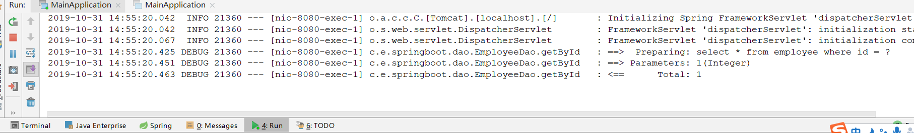

第二次请求，便没有SQL打印了，说明走缓存了，没有请求数据库

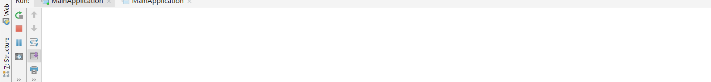

### 2.3.注解原理

经过前面的学习，我们知道，想要看组件原理，首先找到他的自动配置类，即`CacheAutoConfiguration`

```java
@Import(CacheConfigurationImportSelector.class)
public class CacheAutoConfiguration {
```

在这个类上，重要的是导入了一个`CacheConfigurationImportSelector`，通过他我们可以找到使用了哪个配置类。

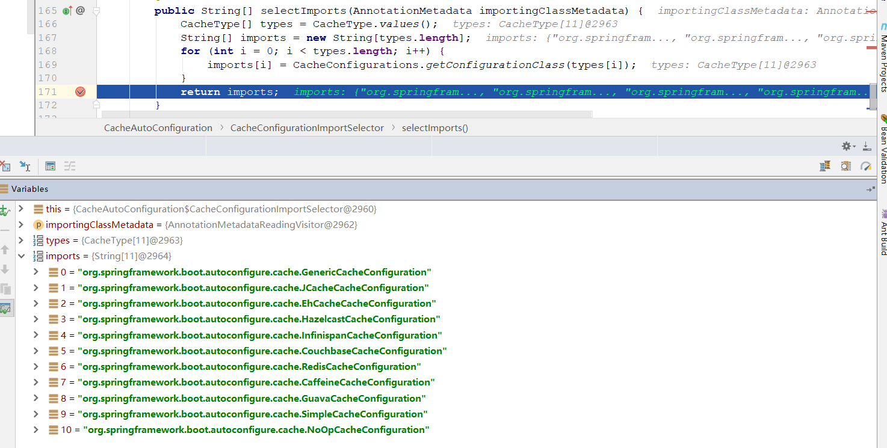

通过断点可以看到配置了11个配置类，默认使用的是`SimpleCacheConfiguration`

```java
@Bean
public ConcurrentMapCacheManager cacheManager() {
   ConcurrentMapCacheManager cacheManager = new ConcurrentMapCacheManager();
   List<String> cacheNames = this.cacheProperties.getCacheNames();
   if (!cacheNames.isEmpty()) {
      cacheManager.setCacheNames(cacheNames);
   }
   return this.customizerInvoker.customize(cacheManager);
}
```

在SimpleCacheConfiguration源码中可以看到，注册了一个CacheManager，来进行缓存管理，使用的是`ConcurrentMapCacheManager`

```java
private final ConcurrentMap<String, Cache> cacheMap = new ConcurrentHashMap<String, Cache>(16);

// 创建ConcurrentMapCache的Cache组件
protected Cache createConcurrentMapCache(String name) {
   SerializationDelegate actualSerialization = (isStoreByValue() ? this.serialization : null);
   return new ConcurrentMapCache(name, new ConcurrentHashMap<Object, Object>(256),
         isAllowNullValues(), actualSerialization);

}

// 获取Cache
@Override
public Cache getCache(String name) {
    Cache cache = this.cacheMap.get(name);
    if (cache == null && this.dynamic) {
        synchronized (this.cacheMap) {
            cache = this.cacheMap.get(name);
            if (cache == null) {
                cache = createConcurrentMapCache(name);
                this.cacheMap.put(name, cache);
            }
        }
    }
    return cache;
}
```

在其源码中，可以看到这个缓存管理使用**ConcurrentMap**进行存储Cache组件，并具有创建和获取`ConcurrentMapCache`功能。

通过Debug发现，**在执行我们上面写的getById()方法前**，会先执行`getCache`方法，判断是否存在`emp`名称的Cache，如果没有，进行创建，如果有，则返回这个Cache进行使用。

再进一步研究`ConcurrentMapCache`：

```java
private final ConcurrentMap<Object, Object> store;

@Override
protected Object lookup(Object key) {
    return this.store.get(key);
}

@Override
public void put(Object key, Object value) {
   this.store.put(key, toStoreValue(value));
}
```

1. 从CacheManager返回Cache后，会从map里get查找key是否存在
   - 这个key是通过keygenerator生成的
   - 如果没有参数，key = new SimpleGenerator()
   - 如果有一个参数，key = 参数值
   - 如果有多个参数，key = new SimpleGenerator(params)

2. 没有找到便执行目标方法
3. 然后将返回值保持到缓存map中

#### 核心

1. 使用缓存时，会根据判断使用哪个缓存配置类，默认`SimpleCacheConfiguration`
2. `cacheManager[ConcurrentMapCacheManager]`组件加载到容器中
3. 方法如果开启`@Cacheable`注解，执行前会根据`cacheName`获取`Cache[ConcurrentMapCache]`，如果没有创建
4. 根据key寻找缓存数据，key由`keyGenerator`来生成
5. 如果没有缓存数据，执行目标方法，并将返回值缓存
6. 如果有缓存数据，直接将数据返回，不再执行目标方法

## 三、@CachePut

这个注解我们前面说过，修改数据时使用，既调用方法又缓存数据。

1. 先向数据库保存更新的数据
2. 将返回的结果进行缓存

==需要注意的是，默认的key是方法入参，因为查询时使用的key是id，所以应该设置key为入参的id==

测试：

```java
@Cacheable(cacheNames = "emp")
public Employee getById(Integer id){
    return employeeDao.getById(id);
}


@CachePut(cacheNames = "emp")
public Employee update(Employee employee){
    employeeDao.update(employee);
    return employee;
}
```

1）先获取员工1的数据，将数据缓存

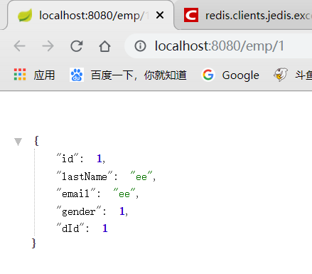

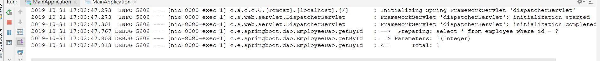

2）在执行修改方法，修改员工数据

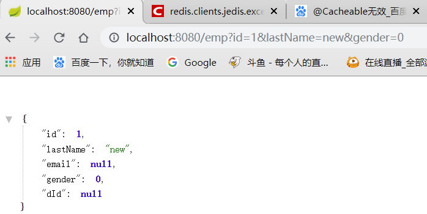

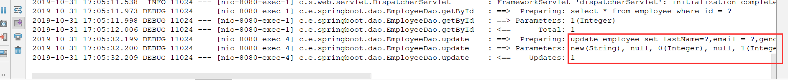

成功执行update sql，修改了数据库中的数据

3）再获取员工1数据

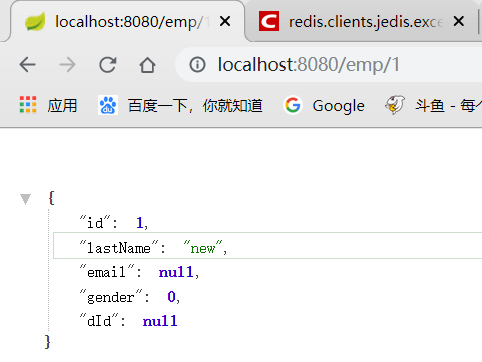

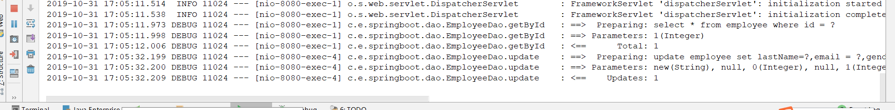

再次请求1号员工，发现数据是修改后的数据，并且控制台没有请求数据库，说明成功缓存

## 四、@CacheEvict

删除缓存，也比较简单，将Cache中根据key删除

一些属性：

- allEntries：true or false，代表是否清除全部数据，如果选择，则清除emp中的全部数据
- beforeInvocation：默认false，即在方法执行之后进行缓存清除，这样可以避免异常导致删除操作没有执行成功，但缓存清除了。

```java
@CacheEvict(cacheNames = "emp")
public void deleteById(Integer id){
    System.out.println("delete emp id="+id);
    //employeeDao.delete(id);
}
```

测试：

1）请求获取员工1

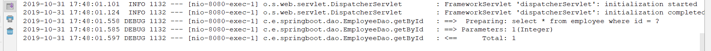

2）删除员工1

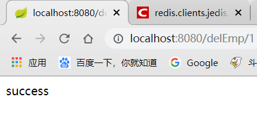

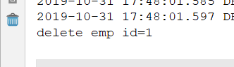

成功执行

3）再次请求员工1，看看是否请求数据库

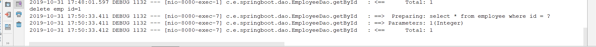

再次请求数据库，说明缓存被成功清除

## 五、其他一些注解

SpringBoot提供的缓存注解还有一些其他的

### @Caching

对于复杂的缓存机制，可以使用这个注解来组合缓存机制，如：

```java
@Caching(
        cacheable = {
                @Cacheable(cacheNames = "emp",key = "#lastName")
        },
        put = {
                @CachePut(cacheNames = "emp",key = "#result.id")
        }
)
public Employee getBylastName(String lastName){
    return employeeDao.getBylastName(lastName);
}
```

可以看到，我们在`getBylastName()`方法上组合了@Cacheable和@CachePut，这样在执行方法时，即会添加key为lastName的缓存，还会添加key为id的缓存，并且每次都会执行该方法，因为有@CachePut的存在。

### @CacheConfig

这个注解加在类名上，可以指定这个类的缓存一些配置，就不用再每个方法上都写cacheName配置了

```java
public @interface CacheConfig {

    // 配置缓存Map名称
   String[] cacheNames() default {};

    // 配置使用的key生成器
   String keyGenerator() default "";

    // 配置缓存管理器
   String cacheManager() default "";

   String cacheResolver() default "";

}
```

```java
@CacheConfig(cacheNames = "emp") // 设置名称为emp后，此类中所有方法的缓存名称设置都可以去掉
@Service
public class EmpService {

    @Autowired
    private EmployeeDao employeeDao;

    @Cacheable(/*cacheNames = "emp"*/)
    public Employee getById(Integer id){
        return employeeDao.getById(id);
    }

    @CachePut(/*cacheNames = "emp",*/key = "#employee.id")
    public Employee update(Employee employee){
        employeeDao.update(employee);
        return employee;
    }

    @CacheEvict(/*cacheNames = "emp"*/)
    public void deleteById(Integer id){
        System.out.println("delete emp id="+id);
        //employeeDao.delete(id);
    }

    @Caching(
            cacheable = {
                    @Cacheable(/*cacheNames = "emp",*/key = "#lastName")
            },
            put = {
                    @CachePut(/*cacheNames = "emp",*/key = "#result.id")
            }
    )
    public Employee getBylastName(String lastName){
        return employeeDao.getBylastName(lastName);
    }
}
```

## 六、集成Redis

SpringBoot集成使用Redis做缓存也非常简单，当然需要一个redis服务器才行，开启redis后

添加pom依赖：

```xml
<dependency>
    <groupId>org.springframework.boot</groupId>
    <artifactId>spring-boot-starter-data-redis</artifactId>
</dependency>
```

修改配置文件：

```yaml
spring:
  redis:
    host: 192.168.252.250
```

测试：

重启服务，再次访问`getById(Integer id)`方法，看看我们的redis中有没有存入数据

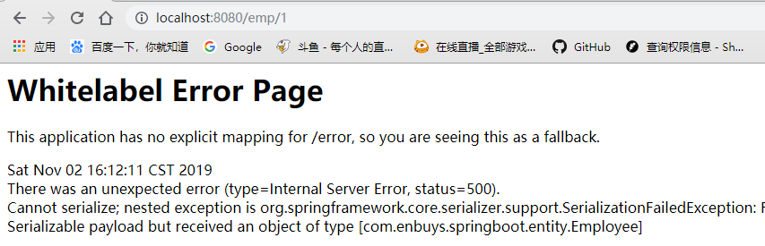

发现抛出序列号异常，我们需要将Employee类加上序列化接口，再次请求

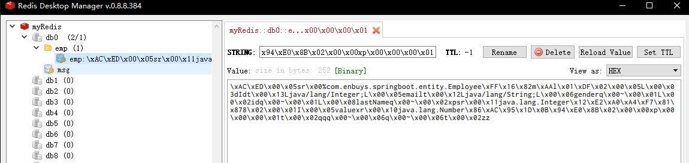

发现保存成功，但是发现和我们预想的不一样，存的数据都是序列化后的。

### 序列化问题

一般遇到这种情况，都是在redis中存储json格式的实体类，即先转成json再进行保存。这里我们去RedisAutoConfiguration中看看默认的序列化是什么？

1）进入到RedisAutoConfiguration中查看RedisConfiguration

```java
@Configuration
protected static class RedisConfiguration {

   @Bean
   @ConditionalOnMissingBean(name = "redisTemplate")
   public RedisTemplate<Object, Object> redisTemplate(
         RedisConnectionFactory redisConnectionFactory)
         throws UnknownHostException {
      RedisTemplate<Object, Object> template = new RedisTemplate<Object, Object>();
      template.setConnectionFactory(redisConnectionFactory);
      return template;
   }

   @Bean
   @ConditionalOnMissingBean(StringRedisTemplate.class)
   public StringRedisTemplate stringRedisTemplate(
         RedisConnectionFactory redisConnectionFactory)
         throws UnknownHostException {
      StringRedisTemplate template = new StringRedisTemplate();
      template.setConnectionFactory(redisConnectionFactory);
      return template;
   }

}
```

会发现这里注入了两个组件，RedisTemplate和StringRedisTemplate，这是Spring为了帮助我们开发，写的两个对redis操作的类，以前使用Jedis进行操作非常繁琐，使用这两个非常简单

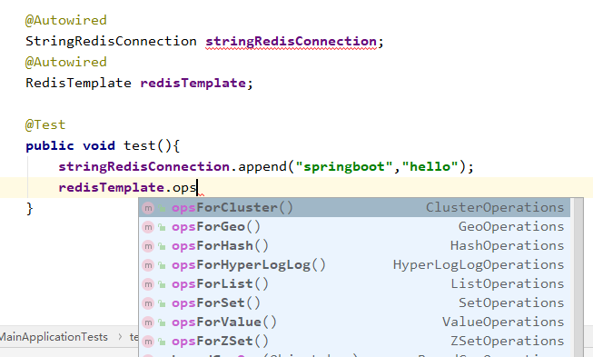

- StringRedisTemplate：主要对k-v都是字符串的进行操作，一般用来对key进行操作
- RedisTemplate：k-v都是对象的进行操作，一般用来对value进行操作

因为这两个是实际对数据进行保存查找的类，所以我们想看Redis的序列化规则，就要进他们源码看

2）在进入到RedisTemplate中看

```java
public class RedisTemplate<K, V> extends RedisAccessor implements RedisOperations<K, V>, BeanClassLoaderAware {

   ·····
   private RedisSerializer<?> defaultSerializer;
   public void afterPropertiesSet() {
		·····
		if (defaultSerializer == null) {
			defaultSerializer = new JdkSerializationRedisSerializer(
					classLoader != null ? classLoader : this.getClass().getClassLoader());
		}
```

可以发现，默认使用JdkSerializationRedisSerializer来进行序列化操作，所以会出现上面显示的乱码问题，我们想要解决，就必须自己写一个RedisConfig配置类，

3）创建MyRedisConfig

这里我们需要先看下有哪些序列化器供我们使用，进入RedisSerializer中，`ctrl+h`查看

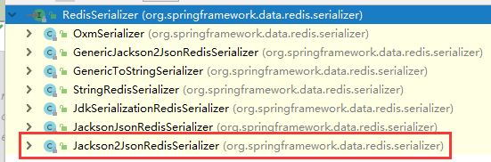

进入源码可以看到有这么多序列化器，我们需要json的便使用Jacson2JsonRedis序列化器

```java
@Configuration
public class MyRedisConfig {

    @Bean
    public RedisTemplate<Object, Object> redisTemplate(
            RedisConnectionFactory redisConnectionFactory){
        RedisTemplate<Object, Object> redisTemplate = new RedisTemplate<>();
        redisTemplate.setConnectionFactory(redisConnectionFactory);

        //开启默认类型
        ObjectMapper objectMapper = new ObjectMapper();
        objectMapper.setVisibility(PropertyAccessor.ALL, JsonAutoDetect.Visibility.ANY);
        // 转json时带类信息，这样反序列化就可以知道哪个类而不会报类型转换异常了
        objectMapper.enableDefaultTyping(ObjectMapper.DefaultTyping.NON_FINAL);
        objectMapper.setDateFormat(new SimpleDateFormat("yyyy/MM/dd HH:mm:ss"));
        
        Jackson2JsonRedisSerializer jackson2JsonRedisSerializer = new Jackson2JsonRedisSerializer(Object.class);
        jackson2JsonRedisSerializer.setObjectMapper(objectMapper);
        redisTemplate.setKeySerializer(new StringRedisSerializer());
        redisTemplate.setValueSerializer(jackson2JsonRedisSerializer);
        redisTemplate.setHashKeySerializer(new StringRedisSerializer());
        redisTemplate.setHashValueSerializer(jackson2JsonRedisSerializer);
        redisTemplate.afterPropertiesSet();
        return redisTemplate;
    }
    
}
```

这样我们的配置就写好了，对于key来说使用StringRedsiSerializer，对于value，Object类型需要json转在保存的使用jackson序列化器。

==我们可以发现，我们只配置了一个RedisTemplate，而没有配置RedisCacheManager，这样SpringBoot会自动使用我们的吗？==

我们在刚刚RedisAutoConfiguration源码可以得知：

```java
@ConditionalOnMissingBean(name = "redisTemplate")
```

当容器中具有这个名称的组件时，便不生效，使用用户自定义的。

所以，因为我们的组件名正好为redisTemplate，所以会自动使用我们的，但如果名字叫MyRedisTemplate，便需要配置RedisCacheManager

```java
@Configuration
public class MyRedisConfig {

    @Bean
    public RedisTemplate<Object, Object> myRedisTemplate(
            RedisConnectionFactory redisConnectionFactory) {
       ······
    }

    /**
     * 在Redis自动配置类中@ConditionalOnMissingBean(name = "redisTemplate") 如果没有名字叫RedisTemplate的才生效
     * 因为我们向容器中注入的组件就为redisTemplate，所以不需要配置RedisCacheManager便可自动使用
     * 如果名字叫其他的，便需要配置我们的myRedisCacheManager，这样在使用时才会使用我们配置的RedisTemplate
     *
     */
    //@Primary // 如果有多个cacheManager，可以使用这个注解标志默认使用这个类为缓存管理器
    @Bean
    public RedisCacheManager myRedisCacheManager(RedisTemplate<Object, Object> myRedisTemplate){
        RedisCacheManager cacheManager = new RedisCacheManager(myRedisTemplate);
        cacheManager.setUsePrefix(true);
        return cacheManager;
    }
}
```

4）测试

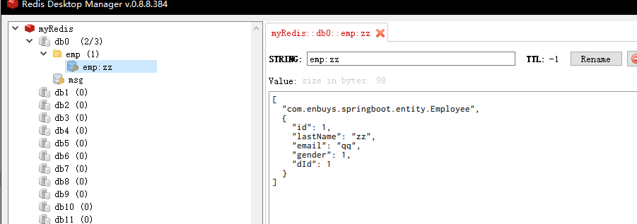

可以看到成功保存为我们想要的数据，

但是如果调用下面这个方法，就会报错

```java
@Cacheable(/*cacheNames = "emp"*/)
public Employee getById(Integer id)
```

因为我们设置的RedisTemplate无法将Integer转为String，便需要将`redisTemplate.setKeySerializer(new StringRedisSerializer());`这段代码改为``redisTemplate.setKeySerializer(jackson2JsonRedisSerializer);``但是没必要，因为按照规定，不能使用数字来做键，一般都是使用String字符串的，如果真有这么特殊的要求，那就只能修改了！

### 编码使用缓存

我们刚刚全部使用的注解的方式进行缓存处理，其实使用编码也很简单

```java
public class EmpService {   
    @Autowired    
    private EmployeeDao employeeDao;  
    
    @Autowired    
    private RedisCacheManager redisCacheManager;
    
    public Employee getBylastName(String lastName){
        Employee employee = employeeDao.getBylastName(lastName);
        // 使用缓存管理器获取缓存
        Cache cache = redisCacheManager.getCache("emp");
        // 使用Cache进行缓存操作
        cache.put("emp:test",employee);
        return employee;
    }
}
```

测试：

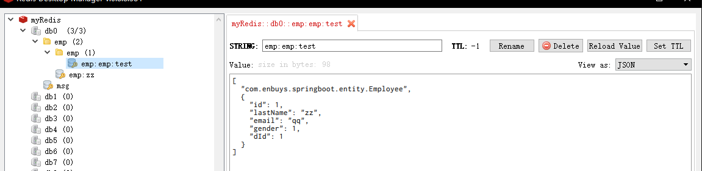

正确保存到redis中

