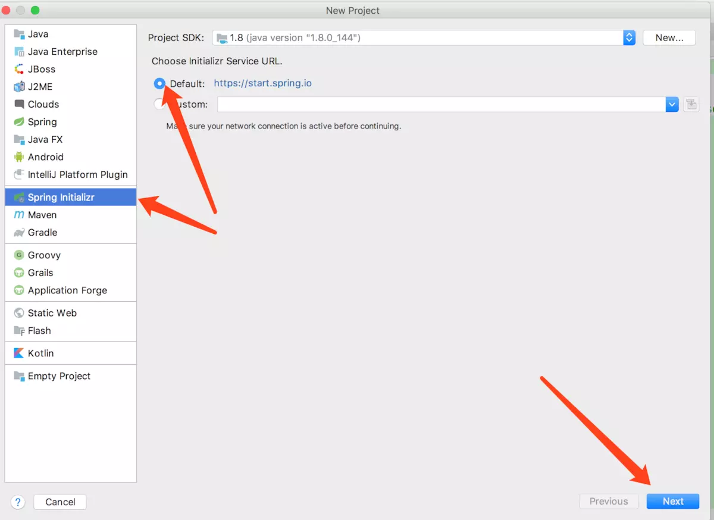
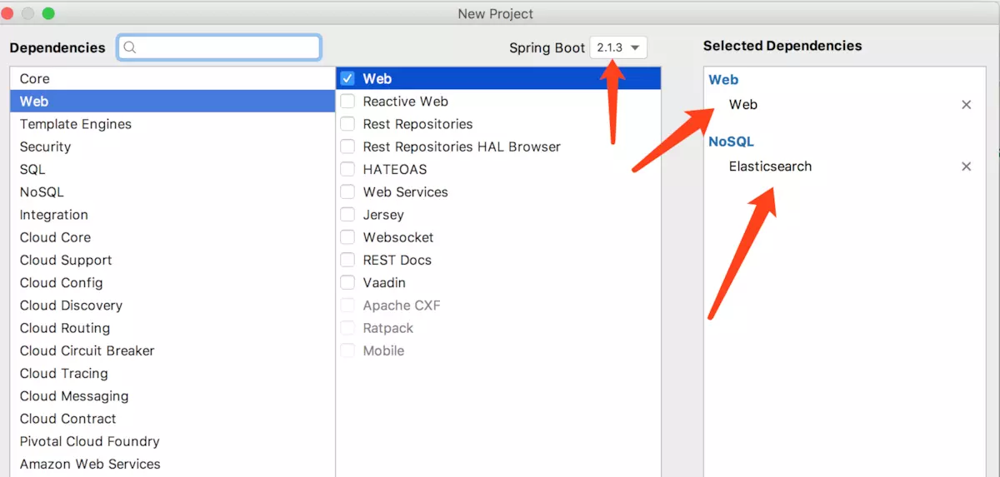
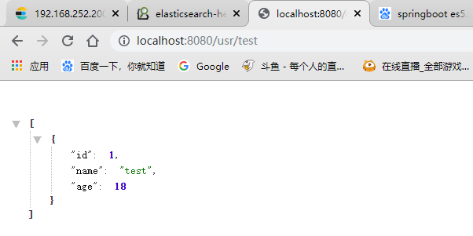
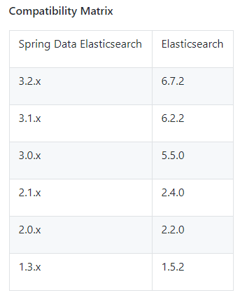
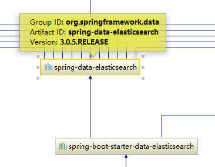

## 一、SpringBoot整合ElasticSearch

springboot整合elasticsearch常用的方式有以下三种

- **TransportClient**
   这种方式基于TCP和ES通信，官方已经明确表示在ES 7.0版本中将弃用TransportClient客户端，且在8.0版本中完全移除它,所以不提倡。
- **REST Client**
   上面的方式1是基于TCP和ES通信的(而且TransPort将来会被抛弃……)，官方也给出了基于HTTP的客户端REST Client(推荐使用)，官方给出来的REST Client有Java Low Level REST Client和Java Hight Level REST Client两个，前者兼容所有版本的ES，后者是基于前者开发出来的，只暴露了部分API，待完善
- **spring-data-elasticsearch**
   除了上述方式，Spring也提供了本身基于SpringData实现的一套方案spring-data-elasticsearch

我们今天就来为大家讲解spring-data-elasticsearch这种方式来集成es。为什们推荐这种呢，因为这种方式spring为我们封装了常见的es操作。和使用jpa操作数据库一样方便。用过jpa的同学一定知道。

jpa只需要简单继承JpaRepository就可以实现对数据库表的crud操作

```java
public interface UserRepository extends JpaRepository<UserBean, Long> {}
```

spring-data-elasticsearch同样，只要继承ElasticsearchRepository就可以实现常见的es操作了。

```java
public interface UserESRepository extends ElasticsearchRepository<UserBean, Long> {}
```


环境：SpringBoot2.0.0，ElasticSearch5.5

==注意！springBoot版本与ES版本需要对应，不然会出现连接错误问题==

### 1.创建一个SpringBoot项目

 

使用idea自动创建一个springBoot项目，并添加上web与ElasticSearch的组件

 

### 2.修改配置文件

```properties
spring.data.elasticsearch.cluster-name=elasticsearch
spring.data.elasticsearch.cluster-nodes=192.168.252.200:9300
```

需要注意的是springboot2.2以后就弃用这个配置了

### 3.创建Bean对象

```java
@Document(indexName = "springboot",type = "doc")
public class User {

    private Integer id;
    private String name;
    private Integer age;
```

### 4.创建Repository

```java
public interface UserRepository extends ElasticsearchRepository<User,Integer> {

    public List<User> getUserByName(String name);
}
```

### 5.创建Controller测试

```java
@RestController
public class UserController {

    @Autowired
    private UserRepository userRepository;

    @GetMapping("usr/{name}")
    public List<User> findUserByName(@PathVariable("name") String name){
        List<User> users = userRepository.getUserByName("test");
        return users;
    }
}
```

### 6.访问



成功访问

## 遇到的坑

一开始使用springboot2.2.0时，启动控制台显示连接es错误

```
NoNodeAvailableException[None of the configured nodes are available]
```

即没有可用的节点，我寻思我直接访问可用啊？为啥没节点呢？

我把es的name修改后重启，再次抛出问题，说明不是es的问题。

然后想是不是版本问题，我又把SpringBoot降到2.1.3，还是出错

百度了一手



发现springBoot2.1.x使用的spring data es是3.1.x适配es6.x，而2.0.x使用3.0.x适配ES5.x，SpringBoot1.5.x就只能使用ES2.4.x的版本了



然后我把SpringBoot版本改为2.0.0之后成功启动没报错，并成功访问

